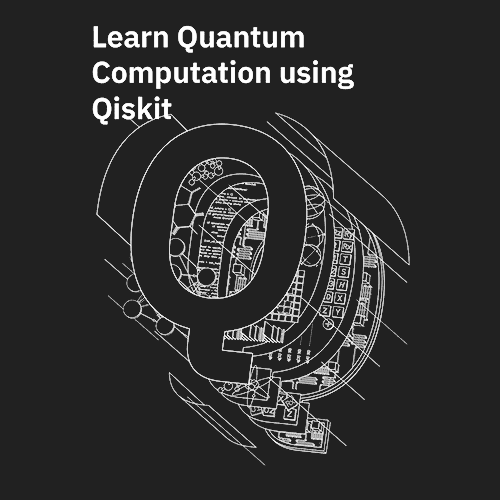

# Learn Quantum Computing using Qiskit

Greetings from the Qiskit Community team! We initiated this open-source textbook in collaboration with IBM Research as a university quantum algorithms/computation course supplement based on Qiskit.

The goal of the textbook is to develop skills in the following areas.

1. The mathematics behind quantum algorithms
2. Details about today's non-fault-tolerant quantum devices
3. Writing code in Qiskit to implement quantum algorithms on IBM's cloud quantum systems

While this textbook does not attempt to be an expansive survey of the field, it does attempt to be as self-contained as possible.

If you have any questions or suggestions about the textbook or would like to incorporate it into your curriculum, please contact Abraham Asfaw ([abraham.asfaw@ibm.com](mailto:abraham.asfaw@ibm.com)). In the true spirit of open-source, any chapter contributions are welcome in [this GitHub repository](https://github.com/Qiskit/qiskit-textbook).

## Contributors in Alphabetical Order

**Learn Quantum Computation using Qiskit** is the work of several individuals. If you use it in your work, cite it using this [bib file](qiskit-textbook.bib) or directly as:

> Abraham Asfaw, Luciano Bello, Yael Ben-Haim, Sergey Bravyi, Lauren Capelluto, Almudena Carrera Vazquez, Jack Ceroni, Jay Gambetta, Shelly Garion, Leron Gil, Salvador De La Puente Gonzalez, David McKay, Zlatko Minev, Paul Nation, Anna Phan, Arthur Rattew, Javad Shabani, John Smolin, Kristan Temme, Madeleine Tod, James Wootton.