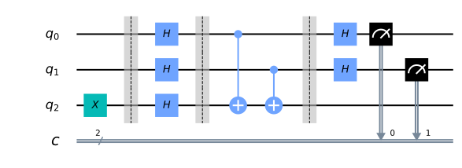
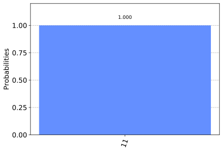
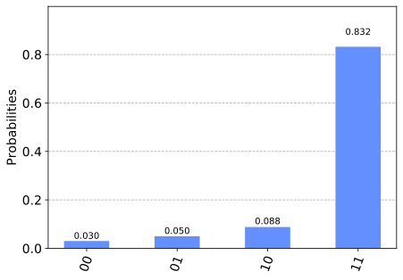

Deutsch-Josza Algorithm
=======================

In this section, we first introduce the Deutsch-Josza problem, and
classical and quantum algorithms to solve it. We then implement the
quantum algorithm using Qiskit, and run on a simulator and device.

Contents
--------

1. `Introduction <#introduction>`__

   -  `Deutsch-Josza Problem <#djproblem>`__
   -  `Deutsch-Josza Algorithm <#djalgorithm>`__

2. `Example <#example>`__

3. `Qiskit Implementation <#implementation>`__

   -  `Simulation <#simulation>`__
   -  `Device <#device>`__

4. `Problems <#problems>`__

5. `References <#references>`__

1. Introduction 
---------------

The Deutsch-Josza algorithm, first introduced in Reference [1], was the
first example of a quantum algorithm that performs better than the best
classical algorithm. It showed that there can be advantages in using a
quantum computer as a computational tool for a specific problem.

1a. Deutsch-Josza Problem  
~~~~~~~~~~~~~~~~~~~~~~~~~

We are given a hidden Boolean function :math:`f`, which takes as input a
string of bits, and returns either :math:`0` or :math:`1`, that is

.. raw:: html

   

:math:`f(\{x_0,x_1,x_2,...\}) \rightarrow 0 \textrm{ or } 1 \textrm{ , where } x_n \textrm{ is } 0 \textrm{ or } 1`.

The property of the given Boolean function is that it is guaranteed to
either be balanced or constant. A constant function returns all
:math:`0`\ ’s or all :math:`1`\ ’s for any input, while a balanced
function returns :math:`0`\ ’s for exactly half of all inputs and
:math:`1`\ ’s for the other half. Our task is to determine whether the
given function is balanced or constant.

Note that the Deutsch-Josza problem is an :math:`n`-bit extension of the
single bit Deutsch problem.

1b. Deutsch-Josza Algorithm  
~~~~~~~~~~~~~~~~~~~~~~~~~~~

Classical Solution
^^^^^^^^^^^^^^^^^^

Classically, in the best case, two queries to the oracle can determine
if the hidden Boolean function, :math:`f(x)`, is balanced: e.g. if we
get both :math:`f(0,0,0,...)\rightarrow 0` and
:math:`f(1,0,0,...) \rightarrow 1`, then we know the function is
balanced as we have obtained the two different outputs.

In the worst case, if we continue to see the same output for each input
we try, we will have to check exactly half of all possible inputs plus
one in order to be certain that :math:`f(x)` is constant. Since the
total number of possible inputs is :math:`2^n`, this implies that we
need :math:`2^{n-1}+1` trial inputs to be certain that :math:`f(x)` is
constant in the worst case. For example, for a :math:`4`-bit string, if
we checked :math:`8` out of the :math:`16` possible combinations,
getting all :math:`0`\ ’s, it is still possible that the
:math:`9^\textrm{th}` input returns a :math:`1` and :math:`f(x)` is
balanced. Probabilistically, this is a very unlikely event. In fact, if
we get the same result continually in succession, we can express the
probability that the function is constant as a function of :math:`k`
inputs as:

.. math::  P_\textrm{constant}(k) = 1 - \frac{1}{2^{k-1}} \qquad \textrm{for } k \leq 2^{n-1}

Realistically, we could opt to truncate our classical algorithm early,
say if we were over x% confident. But if we want to be 100% confident,
we would need to check :math:`2^{n-1}+1` inputs.

Quantum Solution
^^^^^^^^^^^^^^^^

Using a quantum computer, we can solve this problem with 100% confidence
after only one call to the function :math:`f(x)`, provided we have the
function :math:`f` implemented as a quantum oracle, which maps the state
$:raw-latex:`\vert `x:raw-latex:`\rangle `:raw-latex:`\vert `y:raw-latex:`\rangle `$
to $ :raw-latex:`\vert `x:raw-latex:`\rangle `:raw-latex:`\vert `y
:raw-latex:`\oplus `f(x):raw-latex:`\rangle`$, where :math:`\oplus` is
addition modulo :math:`2`. Below is the generic circuit for the
Deutsh-Josza algorithm.

Now, let’s go through the steps of the algorithm:

.. raw:: html

   <ol>

.. raw:: html

   <li>

Prepare two quantum registers. The first is an :math:`n`-qubit register
initialised to :math:`\vert 0 \rangle`, and the second is a one-qubit
register initialised to :math:`\vert 1\rangle`:

.. math:: \vert \psi_0 \rangle = \vert0\rangle^{\otimes n} \vert 1\rangle

.. raw:: html

   </li>

.. raw:: html

   <li>

Apply a Hadamard gate to each qubit:

.. math:: \vert \psi_1 \rangle = \frac{1}{\sqrt{2^{n+1}}}\sum_{x=0}^{2^n-1} \vert x\rangle \left( \vert 0\rangle - \vert 1 \rangle \right)

.. raw:: html

   </li>

.. raw:: html

   <li>

Apply the quantum oracle
$:raw-latex:`\vert `x:raw-latex:`\rangle `:raw-latex:`\vert `y:raw-latex:`\rangle `$
to $ :raw-latex:`\vert `x:raw-latex:`\rangle `:raw-latex:`\vert `y
:raw-latex:`\oplus `f(x):raw-latex:`\rangle`$: \\begin{aligned}
:raw-latex:`\lvert `:raw-latex:`\psi`\ *2 :raw-latex:`\rangle  ` & =
:raw-latex:`\frac{1}{\sqrt{2^{n+1}}}`:raw-latex:`\sum`*\ {x=0}\ :sup:`{2`\ n-1}
:raw-latex:`\vert `x:raw-latex:`\rangle `(:raw-latex:`\vert `f(x):raw-latex:`\rangle `-
:raw-latex:`\vert 1` :raw-latex:`\oplus `f(x):raw-latex:`\rangle`) \\
& =
:raw-latex:`\frac{1}{\sqrt{2^{n+1}}}`:raw-latex:`\sum`\_{x=0}\ :sup:`{2`\ n-1}(-1)^{f(x)}|x:raw-latex:`\rangle `(
\|0:raw-latex:`\rangle `- \|1:raw-latex:`\rangle `) \\end{aligned} since
for each :math:`x,f(x)` is either :math:`0` or :math:`1`.

.. raw:: html

   </li>

.. raw:: html

   <li>

At this point the second single qubit register may be ignored. Apply a
Hadamard gate to each qubit in the first register: \\begin{aligned}
:raw-latex:`\lvert `:raw-latex:`\psi`\ *3 :raw-latex:`\rangle ` & =
:raw-latex:`\frac{1}{2^n}`:raw-latex:`\sum`*\ {x=0}\ :sup:`{2`\ n-1}(-1)^{f(x)}
:raw-latex:`\left[ \sum_{y=0}^{2^n-1}(-1)^{x \cdot y} 
                    \vert y \rangle \right] `\\ & =
:raw-latex:`\frac{1}{2^n}`:raw-latex:`\sum`\_{y=0}\ :sup:`{2`\ n-1}
:raw-latex:`\left[ \sum_{x=0}^{2^n-1}(-1)^{f(x)}(-1)^{x \cdot y} \right]`
:raw-latex:`\vert `y :raw-latex:`\rangle` \\end{aligned} where
:math:`x \cdot y = x_0y_0 \oplus x_1y_1 \oplus \ldots \oplus x_{n-1}y_{n-1}`
is the sum of the bitwise product.

.. raw:: html

   </li>

.. raw:: html

   <li>

Measure the first register. Notice that the probability of measuring
:math:`\vert 0 \rangle ^{\otimes n} = \lvert \frac{1}{2^n}\sum_{x=0}^{2^n-1}(-1)^{f(x)} \rvert^2`,
which evaluates to :math:`1` if :math:`f(x)` is constant and :math:`0`
if :math:`f(x)` is balanced.

.. raw:: html

   </li>

.. raw:: html

   </ol>

**Why does this work?**

:math:`\qquad` When the hidden Boolean function is *constant*, the
quantum states before and after querying the oracle are the same. The
inverse of the Hadamard gate is the Hadamard gate itself. Thus, by Step
4, we essentially reverse Step 2 to obtain the initial quantum state of
all-zero at the first register.

:math:`\qquad` When the hidden Boolean function is *balanced*, the
quantum state after querying the oracle is orthogonal to the quantum
state before querying the oracle. Thus, by Step 4, when reverting the
operation, we must end up with a quantum state that is orthogonal to the
initial quantum state of all-zero at the first register. This means we
should never obtain the all-zero state.

Quantum Oracle
''''''''''''''

The key to the Deutsch-Josza Algorithm is the implementation of the
quantum oracle.

For a constant function, it is simple:

| :math:`\qquad` 1. if f(x) = 0, then apply the :math:`I` gate to the
  qubit in register 2.
| :math:`\qquad` 2. if f(x) = 1, then apply the :math:`X` gate to the
  qubit in register 2.

For a balanced function, there are many different circuits we can
create, one is shown below:

2. Example 
----------

Let’s go through a specfic example for a two bit balanced function with
hidden bitstring :math:`a = 3`.

.. raw:: html

   <ol>

.. raw:: html

   <li>

The first register of two qubits is initialized to :math:`\vert0\rangle`
and the second register qubit to :math:`\vert1\rangle`

.. math:: \lvert \psi_0 \rangle = \lvert 0 0 \rangle_1 \lvert 1 \rangle_2 

.. raw:: html

   </li>

.. raw:: html

   <li>

Apply Hadamard on all qubits

.. math:: \lvert \psi_1 \rangle = \frac{1}{2} \left( \lvert 0 0 \rangle_1 + \lvert 0 1 \rangle_1 + \lvert 1 0 \rangle_1 + \lvert 1 1 \rangle_1 \right) \frac{1}{\sqrt{2}} \left( \lvert 0 \rangle_2 - \lvert 1 \rangle_2 \right)  

.. raw:: html

   </li>

.. raw:: html

   <li>

For :math:`a=3`, (11 in binary) the oracle function can be implemented
as :math:`\text{Q}_f = CX_{1a}CX_{2a}`, :raw-latex:`\begin{align*}
            \lvert \psi_2 \rangle =  \frac{1}{2\sqrt{2}} \left[ \lvert 0 0 \rangle_1 \left( \lvert 0 \oplus 0 \oplus 0 \rangle_2 - \lvert 1 \oplus 0 \oplus 0 \rangle_2 \right) \\
                  + \lvert 0 1 \rangle_1 \left( \lvert 0 \oplus 0 \oplus 1 \rangle_2 - \lvert 1 \oplus 0 \oplus 1 \rangle_2 \right) \\
                  + \lvert 1 0 \rangle_1 \left( \lvert 0 \oplus 1 \oplus 0 \rangle_2 - \lvert 1 \oplus 1 \oplus 0 \rangle_2 \right) \\
                  + \lvert 1 1 \rangle_1 \left( \lvert 0 \oplus 1 \oplus 1 \rangle_2 - \lvert 1 \oplus 1 \oplus 1 \rangle_2 \right) \right]
        \end{align*}`

.. raw:: html

   </li>

Thus \\begin{aligned} :raw-latex:`\lvert `:raw-latex:`\psi`\_2
:raw-latex:`\rangle `& = :raw-latex:`\frac{1}{2\sqrt{2}}`
:raw-latex:`\left[ \lvert 0 0 \rangle_1 \left( \lvert 0 \rangle_2 - \lvert 1 \rangle_2 \right) - \lvert 0 1 \rangle_1  \left( \lvert 0 \rangle_2 - \lvert  1 \rangle_2 \right) - \lvert 1 0 \rangle_1  \left( \lvert 0  \rangle_2 - \lvert 1 \rangle_2 \right) + \lvert 1 1 \rangle_1  \left( \lvert 0 \rangle_2 - \lvert 1 \rangle_2 \right)  \right] `\\
& = :raw-latex:`\frac{1}{2}` :raw-latex:`\left`( :raw-latex:`\lvert 0` 0
:raw-latex:`\rangle`\_1 - :raw-latex:`\lvert 0` 1
:raw-latex:`\rangle`\_1 - :raw-latex:`\lvert 1` 0
:raw-latex:`\rangle`\ *1 + :raw-latex:`\lvert 1` 1
:raw-latex:`\rangle`\ 1 :raw-latex:`\right`)
:raw-latex:`\frac{1}{\sqrt{2}}` :raw-latex:`\left`(
:raw-latex:`\lvert 0` :raw-latex:`\rangle`\ 2 - :raw-latex:`\lvert 1`
:raw-latex:`\rangle`\ 2 :raw-latex:`\right`) \\ & =
:raw-latex:`\frac{1}{\sqrt{2}}` :raw-latex:`\left`(
:raw-latex:`\lvert 0` :raw-latex:`\rangle`\ {10} - :raw-latex:`\lvert 1`
:raw-latex:`\rangle`\ {10}
:raw-latex:`\right`):raw-latex:`\frac{1}{\sqrt{2}}` :raw-latex:`\left`(
:raw-latex:`\lvert 0` :raw-latex:`\rangle`\ {11} - :raw-latex:`\lvert 1`
:raw-latex:`\rangle`*\ {11}
:raw-latex:`\right`):raw-latex:`\frac{1}{\sqrt{2}}` :raw-latex:`\left`(
:raw-latex:`\lvert 0` :raw-latex:`\rangle`\_2 - :raw-latex:`\lvert 1`
:raw-latex:`\rangle`\_2 :raw-latex:`\right`) \\end{aligned}

.. raw:: html

   </li>

.. raw:: html

   <li>

Apply Hadamard on the first register

.. math::  \lvert \psi_3\rangle = \lvert 1 \rangle_{10} \lvert 1 \rangle_{11}  \left( \lvert 0 \rangle_2 - \lvert 1 \rangle_2 \right) 

.. raw:: html

   </li>

.. raw:: html

   <li>

Measuring the first two qubits will give the non-zero :math:`11`,
indicating a balanced function.

.. raw:: html

   </li>

.. raw:: html

   </ol>

3. Qiskit Implementation 
------------------------

We now implement the Deutsch-Josza algorithm for the example of a two
bit balanced function with hidden bitstring :math:`a = 3`.

.. code:: ipython3

    # initialization
    %matplotlib inline
    %config InlineBackend.figure_format = 'svg' # Makes the images look nice
    import numpy as np
    
    # importing Qiskit
    from qiskit import IBMQ, BasicAer
    from qiskit.providers.ibmq import least_busy
    from qiskit import QuantumCircuit, execute
    
    # import basic plot tools
    from qiskit.visualization import plot_histogram

.. code:: ipython3

    # set the length of the $n$-bit string. 
    n = 2
    
    # set the oracle, b for balanced, c for constant
    oracle = "b"
    
    # if the oracle is balanced, set the hidden bitstring, b
    if oracle == "b":
        b = 3 # np.random.randint(1,2**n) uncomment for a random value
    
    # if the oracle is constant, set c = 0 or 1 randomly.
    if oracle == "c":
        c = np.random.randint(2)

.. code:: ipython3

    # Creating registers
    # n qubits for querying the oracle and one qubit for storing the answer
    djCircuit = QuantumCircuit(n+1, n)
    barriers = True
    
    # Since all qubits are initialized to |0>, we need to flip the second register qubit to the the |1> state
    djCircuit.x(n)
    
    # Apply barrier
    if barriers:
        djCircuit.barrier()
    
    # Apply Hadamard gates to all qubits
    djCircuit.h(range(n+1))
        
    # Apply barrier 
    if barriers:
        djCircuit.barrier()
    
    # Query the oracle
    if oracle == "c": # if the oracle is constant, return c
        if c == 1:
            djCircuit.x(n)
        else:
            djCircuit.iden(n)
    else: # otherwise, the oracle is balanced and it returns the inner product of the input with b (non-zero bitstring) 
        for i in range(n):
            if (b & (1 << i)):
                djCircuit.cx(i, n)
    
    # Apply barrier 
    if barriers:
        djCircuit.barrier()
    
    # Apply Hadamard gates to the first register after querying the oracle
    djCircuit.h(range(n))
    
    # Measure the first register
    djCircuit.measure(range(n), range(n))

.. parsed-literal::

    <qiskit.circuit.instructionset.InstructionSet at 0x7fc5b891de50>

.. code:: ipython3

    djCircuit.draw(output='mpl')

3a. Experiment with Simulators 
~~~~~~~~~~~~~~~~~~~~~~~~~~~~~~

We can run the above circuit on the simulator.

.. code:: ipython3

    # use local simulator
    backend = BasicAer.get_backend('qasm_simulator')
    shots = 1024
    results = execute(djCircuit, backend=backend, shots=shots).result()
    answer = results.get_counts()
    
    plot_histogram(answer)

We can see that the result of the measurement is :math:`11` as expected.

3b. Experiment with Real Devices 
~~~~~~~~~~~~~~~~~~~~~~~~~~~~~~~~

We can run the circuit on the real device as shown below. We first look
for the least-busy device that can handle our circuit.

.. code:: ipython3

    # Load our saved IBMQ accounts and get the least busy backend device with less than or equal to (n+1) qubits
    IBMQ.load_account()
    provider = IBMQ.get_provider(hub='ibm-q')
    backend = least_busy(provider.backends(filters=lambda x: x.configuration().n_qubits >= (n+1) and
                                       not x.configuration().simulator and x.status().operational==True))
    print("least busy backend: ", backend)

.. parsed-literal::

    least busy backend:  ibmq_vigo

.. code:: ipython3

    # Run our circuit on the least busy backend. Monitor the execution of the job in the queue
    from qiskit.tools.monitor import job_monitor
    
    shots = 1024
    job = execute(djCircuit, backend=backend, shots=shots)
    
    job_monitor(job, interval = 2)

.. parsed-literal::

    Job Status: job has successfully run

.. code:: ipython3

    # Get the results of the computation
    results = job.result()
    answer = results.get_counts()
    
    plot_histogram(answer)

As we can see, most of the results are :math:`11`. The other results are
due to errors in the quantum computation.

4. Problems 
-----------

1. The above `implementation <#implementation>`__ of Deutsch-Josza is
   for a balanced function with a two bit input of :math:`a = 3`. Modify
   the implementation for a constant function. Are the results what you
   expect? Explain.
2. Modify the `implementation <#implementation>`__ above for a balanced
   function with a 4-bit input of :math:`a = 13`. Are the results what
   you expect? Explain.

5. References 
-------------

1. David Deutsch and Richard Jozsa (1992). “Rapid solutions of problems
   by quantum computation”. Proceedings of the Royal Society of London
   A. 439: 553–558.
   `doi:10.1098/rspa.1992.0167 <https://doi.org/10.1098%2Frspa.1992.0167>`__.
2. R. Cleve; A. Ekert; C. Macchiavello; M. Mosca (1998). “Quantum
   algorithms revisited”. Proceedings of the Royal Society of London A.
   454: 339–354.
   `doi:10.1098/rspa.1998.0164 <https://doi.org/10.1098%2Frspa.1998.0164>`__.

.. code:: ipython3

    import qiskit
    qiskit.__qiskit_version__

.. parsed-literal::

    {'qiskit-terra': '0.11.1',
     'qiskit-aer': '0.3.4',
     'qiskit-ignis': '0.2.0',
     'qiskit-ibmq-provider': '0.4.5',
     'qiskit-aqua': '0.6.2',
     'qiskit': '0.14.1'}

