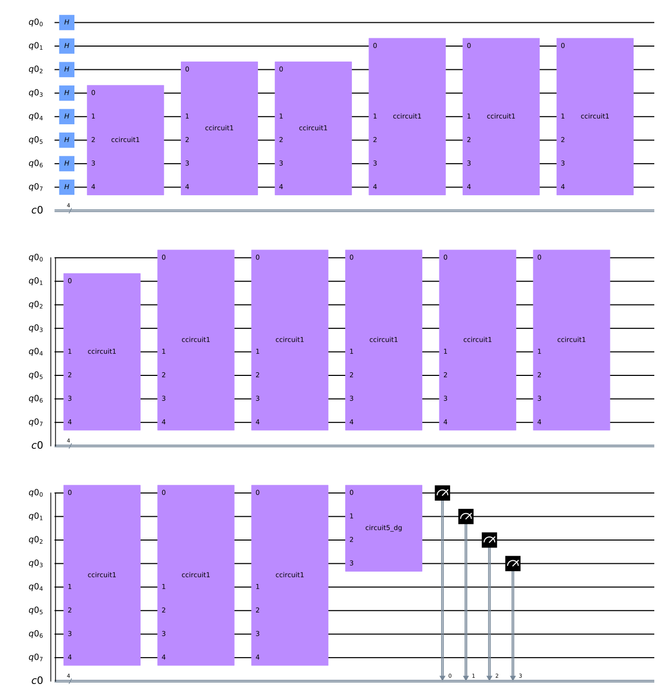
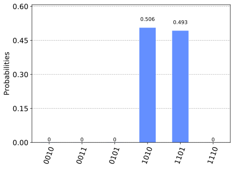

Quantum Counting
================

To understand this algorithm, it is important that you first understand
both Grover’s algorithm and the quantum phase estimation algorithm.
Whereas Grover’s algorithm attempts to find a solution to the Oracle,
the quantum counting algorithm tells us how many of these solutions
there are. This algorithm is interesting as it combines both quantum
search and quantum phase estimation.

1. `Overview <#overview>`__
   1.1 `Intuition <#intuition>`__
   1.2 `A Closer Look <#closer_look>`__
2. `The Code <#code>`__
   2.1 `Initialising our Code <#init_code>`__
   2.2 `The Controlled-Grover Iteration <#cont_grover>`__
   2.3 `The Inverse QFT <#inv_qft>`__
   2.4 `Putting it Together <#putting_together>`__
3. `Simulating <#simulating>`__
4. `Finding the Number of Solutions <#finding_m>`__
5. `Exercises <#exercises>`__
6. `References <#references>`__

1. Overview 
------------

1.1 Intuition 
~~~~~~~~~~~~~~

In quantum counting, we simply use the quantum phase estimation
algorithm to find an eigenvalue of a Grover search iteration. You will
remember that an iteration of Grover’s algorithm, :math:`G`, rotates the
state vector by :math:`\theta` in the :math:`|\omega\rangle`,
:math:`|s’\rangle` basis: |quantum_counting1|

.. |quantum_counting1| image:: images/quantum_counting1.svg

The percentage number of solutions in our search space affects the
difference between :math:`|s\rangle` and :math:`|s’\rangle`. For
example, if there are not many solutions, :math:`|s\rangle` will be very
close to :math:`|s’\rangle` and :math:`\theta` will be very small. It
turns out that the eigenvalues of the Grover iterator are
:math:`e^{\pm i\theta}`, and we can extract this using quantum phase
estimation (QPE) to estimate the number of solutions (:math:`M`).

1.2 A Closer Look 
~~~~~~~~~~~~~~~~~~

In the :math:`|\omega\rangle`,\ :math:`|s’\rangle` basis we can write
the Grover iterator as the matrix:

.. math::

   G =
   \begin{pmatrix}
   \cos{\theta} && -\sin{\theta}\\
   \sin{\theta} && \cos{\theta}
   \end{pmatrix}

The matrix :math:`G` has eigenvectors:

.. math::

   \begin{pmatrix}
   -i\\
   1
   \end{pmatrix}
   ,
   \begin{pmatrix}
   i\\
   1
   \end{pmatrix}

With the aforementioned eigenvalues :math:`e^{\pm i\theta}`.
Fortunately, we do not need to prepare our register in either of these
states, the state :math:`|s\rangle` is in the space spanned by
:math:`|\omega\rangle`, :math:`|s’\rangle`, and thus is a superposition
of the two vectors.

.. math::

   |s\rangle = \alpha |\omega\rangle + \beta|s'\rangle

As a result, the output of the QPE algorithm will be a superposition of
the two phases, and when we measure the register we will obtain one of
these two values! We can then use some simple maths to get our estimate
of :math:`M`.

.. figure:: images/quantum_counting2.svg
   :alt: quantum_counting2

2. The Code 
------------

2.1 Initialising our Code 
~~~~~~~~~~~~~~~~~~~~~~~~~~

First, let’s import everything we’re going to need:

.. code:: ipython3

    import matplotlib.pyplot as plt
    import numpy as np
    import math
    
    # importing Qiskit
    import qiskit
    from qiskit import IBMQ, Aer
    from qiskit import QuantumCircuit, ClassicalRegister, QuantumRegister, execute
    
    # import basic plot tools
    from qiskit.visualization import plot_histogram
    %config InlineBackend.figure_format = 'svg' # Makes the images look nice

Next let’s initialise our registers and circuit objects:

.. code:: ipython3

    qreg = QuantumRegister(8)   # First 4 are for counting, last 4 for 'searching'
    t = 4   # no. of counting qubits
    n = 4   # no. of searching qubits
    creg = ClassicalRegister(4)
    circ = QuantumCircuit(qreg, creg)

In this guide we choose to ‘count’ on the first 4 qubits (we call the
number of counting qubits :math:`t`, so :math:`t = 4`), and to ‘search’
through the last 4 qubits (:math:`n = 4`). Since we only care about the
measurement of the counting qubits, we have initialised 4 classical bits
to measure to. With that done, we can start creating the building blocks
of our circuit.

2.2 The Controlled-Grover Iteration 
~~~~~~~~~~~~~~~~~~~~~~~~~~~~~~~~~~~~

We have already covered Grover iterations in the Grover’s algorithm
section. Here is an example with an Oracle we know has 5 solutions
(:math:`M = 5`) of 16 states (:math:`N = 2^n = 16`):

.. code:: ipython3

    from qiskit.aqua.circuits.gates.multi_control_toffoli_gate import _cccx
    
    def example_grover_iteration():
        """Small circuit with 5/16 solutions"""
        # Do circuit
        q = QuantumRegister(4)
        circ = QuantumCircuit(q)
        # Oracle
        circ.h(3)
        _cccx(circ,q)
        circ.x(0)
        _cccx(circ,q)
        circ.x(0)
        circ.x(1)
        _cccx(circ,q)
        circ.x(1)
        circ.x(2)
        _cccx(circ,q)
        circ.x(2)
        circ.x(1)
        circ.x(2)
        _cccx(circ,q)
        circ.x(2)
        circ.x(1)
        circ.h(3)
        # Diffusion Operator
        circ.z(3)
        for qubit in q[:3]:
            circ.h(qubit)
            circ.x(qubit)
        _cccx(circ,q)
        for qubit in q[:3]:
            circ.x(qubit)
            circ.h(qubit)
        circ.z(3)
        return circ

Notice the python function takes no input and returns a
``QuantumCircuit`` object with 4 qubits. In the past the functions you
created might have modified an existing circuit, but a function like
this allows us to turn the ``QuantmCircuit`` object into a single gate
we can then control.

We can use ``.to_gate()`` and ``.control()`` to create a controlled gate
from a circuit. We will call our Grover iterator ``grit`` and the
controlled Grover iterator ``cgrit``:

.. code:: ipython3

    # Create controlled-Grover
    grit = example_grover_iteration().to_gate()
    cgrit = grit.control()

2.3 The Inverse QFT 
~~~~~~~~~~~~~~~~~~~~

We now need to create an inverse QFT. This code implements the QFT on n
qubits:

.. code:: ipython3

    def qft(n):
        """n-qubit QFT on q in circ."""
        q = QuantumRegister(n)
        circ = QuantumCircuit(q)
        for j in range(n):
            circ.h(q[j])
            for k in range(j+1,n):
                circ.cu1(math.pi/float(2**(k-j)), q[k], q[j])
        # Don't Forget the Swaps!
        for i in range(int(n/2)):
            circ.swap(q[i], q[n-i-1])
        return circ

Again, note we have chosen to return another ``QuantumCircuit`` object,
this is so we can easily invert the gate. We create the gate with t = 4
qubits as this is the number of counting qubits we have chosen in this
guide:

.. code:: ipython3

    qft_dagger = qft(4).to_gate().inverse()

2.4 Putting it Together 
~~~~~~~~~~~~~~~~~~~~~~~~

We now have everything we need to complete our circuit! Let’s put it
together.

First we need to put all qubits in the :math:`|+\rangle` state:

.. code:: ipython3

    # Initialise all qubits to |+>
    for qubit in qreg:
        circ.h(qubit)

Easy enough! Next we need to do controlled Grover iterations for each
qubit in the counting register, doubling the number of iterations each
time. Note that we must ``.append()`` our custom gate to ``circ``:

.. code:: ipython3

    # Begin controlled Grover iterations
    iterations = 1
    for qubit in reversed(qreg[:4]):
        for i in range(iterations):
            circ.append(cgrit, qargs=[qubit] + qreg[4:])
        iterations *= 2

Next we apply our inverse QFT to the counting qubits:

.. code:: ipython3

    # Do inverse QFT on counting qubits
    circ.append(qft_dagger, qargs=qreg[:4])

.. parsed-literal::

    <qiskit.circuit.instructionset.InstructionSet at 0x7fd4307771d0>

And finally we measure the counting qubits and store the results in the
classical register:

.. code:: ipython3

    # Measure Qubits
    circ.measure(qreg[:4],creg)

.. parsed-literal::

    <qiskit.circuit.instructionset.InstructionSet at 0x7fd43078ac50>

Let’s check our circuit looks correct:

.. code:: ipython3

    circ.draw(output='mpl')

Great! Now let’s see some results.

3. Simulating 
--------------

.. code:: ipython3

    # Execute and see results
    emulator = Aer.get_backend('qasm_simulator')
    job = execute(circ, emulator, shots=8192 )
    hist = job.result().get_counts()
    plot_histogram(hist)

We can see two values stand out, having a much higher probability of
measurement than the rest. These two values correspond to
:math:`e^{i\theta}` and :math:`e^{-i\theta}`, but we can’t see the
number of solutions yet. We need to little more processing to get this
information, so first let us get our output into something we can work
with (an ``int``).

We will get the string of the most probable result from our output data:

.. code:: ipython3

    measured_str = max(hist, key=hist.get)

These bits are currently the wrong way round, so we’ll reverse them:

.. code:: ipython3

    measured_str = max(hist, key=hist.get)[::-1] # Need to reverse the order of bits

Let us now store this as an integer:

.. code:: ipython3

    measured_int = int(measured_str,2)
    print("Register Output = %i" % measured_int)

.. parsed-literal::

    Register Output = 5

4. Finding the Number of Solutions (M) 
---------------------------------------

We will create a function, ``calculate_M()`` that takes as input the
decimal integer output of our register, the number of counting qubits
(:math:`t`) and the number of searching qubits (:math:`n`).

First we want to get :math:`\theta` from ``measured_int``. You will
remember that QPE gives us a measured :math:`\text{value} = 2^n \phi`
from the eigenvalue :math:`e^{2\pi i\phi}`, so to get :math:`\theta` we
need to do:

.. math::

   \theta = \text{value}\times\frac{2\pi}{2^t}

Or, in code:

.. code:: ipython3

    theta = (measured_int/(2**t))*math.pi*2
    print("Theta = %.5f" % theta)

.. parsed-literal::

    Theta = 1.96350

You may remember that we can get the angle :math:`\theta/2` can from the
inner product of :math:`|s\rangle` and :math:`|s’\rangle`:

.. math::

   \langle s'|s\rangle = \cos{\tfrac{\theta}{2}}

And that the inner product of these vectors is:

.. math::

   \langle s'|s\rangle = \sqrt{\frac{N-M}{N}}

We can combine these equations, then use some trigonometry and algebra
to show:

.. math::

   N\sin^2{\frac{\theta}{2}} = M

And in code:

.. code:: ipython3

    N = 2**n
    M = N * (math.sin(theta/2)**2)
    print("No. of Solutions = %.1f" % (N-M))

.. parsed-literal::

    No. of Solutions = 4.9

And we can see we have (approximately) the correct answer! This is not
*that* precise as we are only using 4 qubits. You might think that 4
qubits would be enough to give us an exact answer, but remember this
space is split between two eigenvalues (:math:`e^{\pm i\theta}`) and we
lose some precision to the squared sine function. We can approximately
calculate the error using:

.. code:: ipython3

    m = t - 1 # Upper bound: Will be less than this 
    err = (math.sqrt(2*M*N) + N/(2**(m-1)))*(2**(-m))
    print("Error < %.2f" % err)

.. parsed-literal::

    Error < 2.85

Explaining the error calculation is outside the scope of this article,
but an explanation can be found in [1].

Finally, here is the finished function ``calculate_M()``:

.. code:: ipython3

    def calculate_M(measured_int, t, n):
        """For Processing Output of Quantum Counting"""
        # Calculate Theta
        theta = (measured_int/(2**t))*math.pi*2
        print("Theta = %.5f" % theta)
        # Calculate No. of Solutions
        N = 2**n
        M = N * (math.sin(theta/2)**2)
        print("No. of Solutions = %.1f" % (N-M))
        # Calculate Upper Error Bound
        m = t - 1 #Will be less than this (out of scope) 
        err = (math.sqrt(2*M*N) + N/(2**(m-1)))*(2**(-m))
        print("Error < %.2f" % err)

5. Exercises 
-------------

1. Can you create an oracle with a different number of solutions? How
   does the accuracy of the quantum counting algorithm change?
2. Can you adapt the circuit to use more or less counting qubits to get
   a different precision in your result?

6. References 
--------------

[1] Michael A. Nielsen and Isaac L. Chuang. 2011. Quantum Computation
and Quantum Information: 10th Anniversary Edition (10th ed.). Cambridge
University Press, New York, NY, USA.

.. code:: ipython3

    import qiskit
    qiskit.__qiskit_version__

.. parsed-literal::

    {'qiskit-terra': '0.11.1',
     'qiskit-aer': '0.3.4',
     'qiskit-ignis': '0.2.0',
     'qiskit-ibmq-provider': '0.4.5',
     'qiskit-aqua': '0.6.2',
     'qiskit': '0.14.1'}

