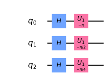
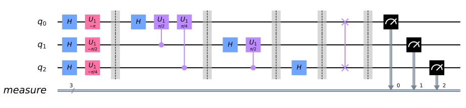
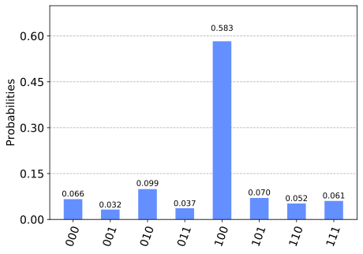

Quantum Fourier Transform
=========================

In this tutorial, we introduce the quantum fourier transform (QFT),
derive the circuit, and implement it using Qiskit. We show how to run
QFT on a simulator and a five qubit device.

Contents
--------

.. contents:: Quick links throoughout the document:

   -  `Running QFT on a simulator <#implementationsim>`__
   -  `Running QFT on a real quantum device <#implementationdev>`__

8. `Problems <#problems>`__
9. `References <#references>`__

1. Introduction 
----------------

The Fourier transform occurs in many different versions throughout
classical computing, in areas ranging from signal processing to data
compression to complexity theory. The quantum Fourier transform (QFT) is
the quantum implementation of the discrete Fourier transform over the
amplitudes of a wavefunction. It is part of many quantum algorithms,
most notably Shor’s factoring algorithm and quantum phase estimation.

The discrete Fourier transform acts on a vector
:math:`(x_0, ..., x_{N-1})` and maps it to the vector
:math:`(y_0, ..., y_{N-1})` according to the formula

.. math:: y_k = \frac{1}{\sqrt{N}}\sum_{j=0}^{N-1}x_j\omega_N^{jk}

 where :math:`\omega_N^{jk} = e^{2\pi i \frac{jk}{N}}`.

Similarly, the quantum Fourier transform acts on a quantum state
:math:`\sum_{i=0}^{N-1} x_i \vert i \rangle` and maps it to the quantum
state :math:`\sum_{i=0}^{N-1} y_i \vert i \rangle` according to the
formula

.. math:: y_k = \frac{1}{\sqrt{N}}\sum_{j=0}^{N-1}x_j\omega_N^{jk}

 with :math:`\omega_N^{jk}` defined as above. Note that only the
amplitudes of the state were affected by this transformation.

This can also be expressed as the map:

.. math:: \vert x \rangle \mapsto \frac{1}{\sqrt{N}}\sum_{y=0}^{N-1}\omega_N^{xy} \vert y \rangle

Or the unitary matrix:

.. math::  U_{QFT} = \frac{1}{\sqrt{N}} \sum_{x=0}^{N-1} \sum_{y=0}^{N-1} \omega_N^{xy} \vert y \rangle \langle x \vert

2. Example 1: 1-qubit QFT 
--------------------------

Consider how the QFT operator as defined above acts on a single qubit
state
:math:`\vert\psi\rangle = \alpha \vert 0 \rangle + \beta \vert 1 \rangle`.
In this case, :math:`x_0 = \alpha`, :math:`x_1 = \beta`, and
:math:`N = 2`. Then,

.. math:: y_0 = \frac{1}{\sqrt{2}}\left(    \alpha \exp\left(2\pi i\frac{0\times0}{2}\right) + \beta \exp\left(2\pi i\frac{1\times0}{2}\right)      \right) = \frac{1}{\sqrt{2}}\left(\alpha + \beta\right)

and

.. math:: y_1 = \frac{1}{\sqrt{2}}\left(    \alpha \exp\left(2\pi i\frac{0\times1}{2}\right) + \beta \exp\left(2\pi i\frac{1\times1}{2}\right)      \right) = \frac{1}{\sqrt{2}}\left(\alpha - \beta\right)

such that the final result is the state

.. math:: U_{QFT}\vert\psi\rangle = \frac{1}{\sqrt{2}}(\alpha + \beta) \vert 0 \rangle + \frac{1}{\sqrt{2}}(\alpha - \beta)  \vert 1 \rangle

This operation is exactly the result of applying the Hadamard operator
(:math:`H`) on the qubit:

.. math:: H = \frac{1}{\sqrt{2}}\begin{bmatrix} 1 & 1 \\ 1 & -1 \end{bmatrix}

If we apply the :math:`H` operator to the state
:math:`\vert\psi\rangle = \alpha \vert 0 \rangle + \beta \vert 1 \rangle`,
we obtain the new state:

.. math::

   \frac{1}{\sqrt{2}}(\alpha + \beta) \vert 0 \rangle + \frac{1}{\sqrt{2}}(\alpha - \beta)  \vert 1 \rangle 
   \equiv \tilde{\alpha}\vert 0 \rangle + \tilde{\beta}\vert 1 \rangle

Notice how the Hadamard gate performs the discrete Fourier transform for
:math:`N = 2` on the amplitudes of the state.

3. The Quantum Fourier transform
--------------------------------

So what does the quantum Fourier transform look like for larger
:math:`N`? Let’s derive a circuit for :math:`N=2^n`, :math:`QFT_N`
acting on the state
:math:`\vert x \rangle = \vert x_1\ldots x_n \rangle` where :math:`x_1`
is the most significant bit.

\\begin{aligned} QFT_N:raw-latex:`\vert `x :raw-latex:`\rangle `& =
:raw-latex:`\frac{1}{\sqrt{N}}`
:raw-latex:`\sum`\ *{y=0}{N-1}:raw-latex:`\omega`\ N^{xy}
:raw-latex:`\vert `y :raw-latex:`\rangle ` \\ & =
:raw-latex:`\frac{1}{\sqrt{N}}` :raw-latex:`\sum`\ {y=0}\ {N-1} e^{2
:raw-latex:`\pi `i xy / 2^n} :raw-latex:`\vert `y
:raw-latex:`\rangle `~:raw-latex:`\text{since}`:
:raw-latex:`\omega`\ N^{xy} = e^{2:raw-latex:`\pi `i
:raw-latex:`\frac{xy}{N}`} ::raw-latex:`\text{and}`: N = 2^n \\ & =
:raw-latex:`\frac{1}{\sqrt{N}}` :raw-latex:`\sum`\ {y=0}^{N-1} e^{2
:raw-latex:`\pi `i :raw-latex:`\left`(:raw-latex:`\sum`*\ {k=1}^n
y_k/2^k:raw-latex:`\right`) x} :raw-latex:`\vert `y_1
:raw-latex:`\ldots `y_n
:raw-latex:`\rangle `::raw-latex:`\text{rewriting in fractional binary notation}`:
y = y_1:raw-latex:`\ldots `y_n, y/2^n = :raw-latex:`\sum`\ *{k=1}^n
y_k/2^k \\ & = :raw-latex:`\frac{1}{\sqrt{N}}`
:raw-latex:`\sum`*\ {y=0}^{N-1} :raw-latex:`\prod`\ *{k=1}^n e^{2
:raw-latex:`\pi `i x y_k/2^k } :raw-latex:`\vert `y_1
:raw-latex:`\ldots `y_n
:raw-latex:`\rangle `::raw-latex:`\text{after expanding the exponential of a sum to a product of exponentials}`
\\ & = :raw-latex:`\frac{1}{\sqrt{N}}` :raw-latex:`\bigotimes`*\ {k=1}^n
:raw-latex:`\left`(:raw-latex:`\vert`0:raw-latex:`\rangle `+ e^{2
:raw-latex:`\pi `i x /2^k }
:raw-latex:`\vert`1:raw-latex:`\rangle `:raw-latex:`\right`)
::raw-latex:`\text{after rearranging the sum and products, and expanding}`
:raw-latex:`\sum`\ *{y=0}^{N-1} =
:raw-latex:`\sum`*\ {y_1=0}:sup:`{1}:raw-latex:`\sum`\ {y_2=0}^{1}:raw-latex:`\ldots`:raw-latex:`\sum`\ {y_n=0}`\ {1}
\\ & = :raw-latex:`\frac{1}{\sqrt{N}}`
:raw-latex:`\left`(:raw-latex:`\vert`0:raw-latex:`\rangle `+
e^{:raw-latex:`\frac{2\pi i}{2}`x}
:raw-latex:`\vert`1:raw-latex:`\rangle`:raw-latex:`\right`)
:raw-latex:`\otimes`
:raw-latex:`\left`(:raw-latex:`\vert`0:raw-latex:`\rangle `+
e^{:raw-latex:`\frac{2\pi i}{2^2}`x}
:raw-latex:`\vert`1:raw-latex:`\rangle`:raw-latex:`\right`)
:raw-latex:`\otimes  ` :raw-latex:`\ldots` :raw-latex:`\otimes`
:raw-latex:`\left`(:raw-latex:`\vert`0:raw-latex:`\rangle `+
e^{:raw-latex:`\frac{2\pi i}{2^{n-1}}`x}
:raw-latex:`\vert`1:raw-latex:`\rangle`:raw-latex:`\right`)
:raw-latex:`\otimes`
:raw-latex:`\left`(:raw-latex:`\vert`0:raw-latex:`\rangle `+
e^{:raw-latex:`\frac{2\pi i}{2^n}`x}
:raw-latex:`\vert`1:raw-latex:`\rangle`:raw-latex:`\right`)
\\end{aligned}

4. The circuit that implements QFT 
-----------------------------------

The circuit that implements QFT makes use of two gates. The first one is
a single-qubit Hadamard gate, :math:`H`, that you already know. From the
discussion in `Example 1 <#example1>`__ above, you have already seen
that the action of :math:`H` on the single-qubit state
:math:`\vert x_k\rangle` is

.. math:: H\vert x_k \rangle = \vert0\rangle + \exp\left(\frac{2\pi i}{2}x_k\right)\vert1\rangle

The second is a two-qubit controlled rotation :math:`CROT_k` given in
block-diagonal form as

.. math::

   CROT_k = \left[\begin{matrix}
   I&0\\
   0&UROT_k\\
   \end{matrix}\right]

 where

.. math::

   UROT_k = \left[\begin{matrix}
   1&0\\
   0&\exp\left(\frac{2\pi i}{2^k}\right)\\
   \end{matrix}\right]

The action of :math:`CROT_k` on the two-qubit state
:math:`\vert x_jx_k\rangle` where the first qubit is the control and the
second is the target is given by

.. math:: CROT_k\vert 0x_j\rangle = \vert 0x_j\rangle

 and

.. math:: CROT_k\vert 1x_j\rangle = \exp\left( \frac{2\pi i}{2^k}x_j \right)\vert 1x_j\rangle

Given these two gates, a circuit that implements `an n-qubit
QFT <#qfteqn>`__ is shown below.

The circuit operates as follows. We start with an n-qubit input state
:math:`\vert x_1x_2\ldots x_n\rangle`.

.. raw:: html

   <ol>

.. raw:: html

   <li>

After the first Hadamard gate on qubit 1, the state is transformed from
the input state to

.. math::

   H_1\vert x_1x_2\ldots x_n\rangle = 
   \frac{1}{\sqrt{2}}
   \left[\vert0\rangle + \exp\left(\frac{2\pi i}{2}x_1\right)\vert1\rangle\right]
   \otimes
   \vert x_2x_3\ldots x_n\rangle

.. raw:: html

   <li>

After the :math:`CROT_2` gate on qubit 1 controlled by qubit 2, the
state is transformed to

.. math::

   \frac{1}{\sqrt{2}}
   \left[\vert0\rangle + \exp\left(\frac{2\pi i}{2^2}x_2 + \frac{2\pi i}{2}x_1\right)\vert1\rangle\right]
   \otimes
   \vert x_2x_3\ldots x_n\rangle

.. raw:: html

   <li>

After the application of the last :math:`CROT_n` gate on qubit 1
controlled by qubit :math:`n`, the state becomes

.. math::

   \frac{1}{\sqrt{2}}
   \left[\vert0\rangle + 
   \exp\left(
   \frac{2\pi i}{2^n}x_n + 
   \frac{2\pi i}{2^{n-1}}x_{n-1} + 
   \ldots + 
   \frac{2\pi i}{2^2}x_2 + 
   \frac{2\pi i}{2}x_1
   \right)
   \vert1\rangle\right]
   \otimes
   \vert x_2x_3\ldots x_n\rangle

Noting that

.. math::

   x = 2^{n-1}x_1 + 2^{n-2}x_2 + \ldots + 2^1x_{n-1} + 2^0x_n

we can write the above state as

.. math::

   \frac{1}{\sqrt{2}}
   \left[\vert0\rangle + 
   \exp\left(
   \frac{2\pi i}{2^n}x 
   \right)
   \vert1\rangle\right]
   \otimes
   \vert x_2x_3\ldots x_n\rangle

.. raw:: html

   <li>

After the application of a similar sequence of gates for qubits
:math:`2\ldots n`, we find the final state to be

.. math::

   \frac{1}{\sqrt{2}}
   \left[\vert0\rangle + 
   \exp\left(
   \frac{2\pi i}{2^n}x 
   \right)
   \vert1\rangle\right]
   \otimes
   \frac{1}{\sqrt{2}}
   \left[\vert0\rangle + 
   \exp\left(
   \frac{2\pi i}{2^{n-1}}x 
   \right)
   \vert1\rangle\right]
   \otimes
   \ldots
   \otimes
   \frac{1}{\sqrt{2}}
   \left[\vert0\rangle + 
   \exp\left(
   \frac{2\pi i}{2^{2}}x 
   \right)
   \vert1\rangle\right]
   \otimes
   \frac{1}{\sqrt{2}}
   \left[\vert0\rangle + 
   \exp\left(
   \frac{2\pi i}{2^{1}}x 
   \right)
   \vert1\rangle\right]

 which is exactly the QFT of the input state as derived above with the
caveat that the order of the qubits is reversed in the output state.

.. raw:: html

   </ol>

5. Example 2: 3-qubit QFT 
--------------------------

The steps to creating the circuit for
:math:`\vert y_1y_2y_3\rangle = QFT_8\vert x_1x_2x_3\rangle` would be:

.. raw:: html

   <ol>

.. raw:: html

   <li>

Apply a Hadamard gate to :math:`\vert x_3 \rangle`

.. math::

   \psi_1 = 
   \vert x_1\rangle
   \otimes
   \vert x_2\rangle
   \otimes
   \frac{1}{\sqrt{2}}
   \left[
   \vert0\rangle + 
   \exp\left(\frac{2\pi i}{2}x_3\right) 
   \vert1\rangle\right]

.. raw:: html

   <li>

Apply a :math:`CROT_2` gate to :math:`\vert x_3\rangle` depending on
:math:`\vert x_2\rangle`

.. math::

   \psi_2 = 
   \vert x_1\rangle
   \otimes
   \vert x_2\rangle
   \otimes
   \frac{1}{\sqrt{2}}
   \left[
   \vert0\rangle + 
   \exp\left(
   \frac{2\pi i}{2^2}x_2 + \frac{2\pi i}{2}x_3
   \right) 
   \vert1\rangle\right]

.. raw:: html

   <li>

Apply a :math:`CROT_3` gate to :math:`\vert x_3\rangle` depending on
:math:`\vert x_1\rangle`

.. math::

   \psi_3 = 
   \vert x_1\rangle
   \otimes
   \vert x_2\rangle
   \otimes
   \frac{1}{\sqrt{2}}
   \left[
   \vert0\rangle + 
   \exp\left(
   \frac{2\pi i}{2^3}x_1 + \frac{2\pi i}{2^2}x_2 + \frac{2\pi i}{2}x_3
   \right) 
   \vert1\rangle\right]

.. raw:: html

   <li>

Apply a Hadamard gate to :math:`\vert x_2 \rangle`

.. math::

   \psi_4 = 
   \vert x_1\rangle
   \otimes
   \frac{1}{\sqrt{2}}
   \left[
   \vert0\rangle + 
   \exp\left(
   \frac{2\pi i}{2}x_2
   \right) 
   \vert1\rangle\right]
   \otimes
   \frac{1}{\sqrt{2}}
   \left[
   \vert0\rangle + 
   \exp\left(
   \frac{2\pi i}{2^3}x_1 + \frac{2\pi i}{2^2}x_2 + \frac{2\pi i}{2}x_3
   \right) 
   \vert1\rangle\right]

.. raw:: html

   <li>

Apply a :math:`CROT_2` gate to :math:`\vert x_2\rangle` depending on
:math:`\vert x_1\rangle`

.. math::

   \psi_5 = 
   \vert x_1\rangle
   \otimes
   \frac{1}{\sqrt{2}}
   \left[
   \vert0\rangle + 
   \exp\left(
   \frac{2\pi i}{2^2}x_1 + \frac{2\pi i}{2}x_2
   \right) 
   \vert1\rangle\right]
   \otimes
   \frac{1}{\sqrt{2}}
   \left[
   \vert0\rangle + 
   \exp\left(
   \frac{2\pi i}{2^3}x_1 + \frac{2\pi i}{2^2}x_2 + \frac{2\pi i}{2}x_3
   \right) 
   \vert1\rangle\right]

.. raw:: html

   <li>

Apply a Hadamard gate to :math:`\vert x_1\rangle`

.. math::

   \psi_6 = 
   \frac{1}{\sqrt{2}}
   \left[
   \vert0\rangle + 
   \exp\left(
   \frac{2\pi i}{2}x_1
   \right) 
   \vert1\rangle\right]
   \otimes
   \frac{1}{\sqrt{2}}
   \left[
   \vert0\rangle + 
   \exp\left(
   \frac{2\pi i}{2^2}x_1 + \frac{2\pi i}{2}x_2
   \right) 
   \vert1\rangle\right]
   \otimes
   \frac{1}{\sqrt{2}}
   \left[
   \vert0\rangle + 
   \exp\left(
   \frac{2\pi i}{2^3}x_1 + \frac{2\pi i}{2^2}x_2 + \frac{2\pi i}{2}x_3
   \right) 
   \vert1\rangle\right]

.. raw:: html

   <li>

Keep in mind the reverse order of the output state relative to the
desired QFT. Therefore, measure the bits in reverse order, that is
:math:`y_3 = x_1, y_2 = x_2, y_1 = x_3`.

6. A note about the form of the QFT circuit 
--------------------------------------------

The example above demonstrates a very useful form of the QFT for
:math:`N=2^n`. Note that only the last qubit depends on the values of
all the other input qubits and each further bit depends less and less on
the input qubits. This becomes important in physical implementations of
the QFT, where nearest-neighbor couplings are easier to achieve than
distant couplings between qubits.

7. Qiskit Implementation
------------------------

In Qiskit, the implementation of the :math:`CROT` gate used in the
discussion above is a controlled phase rotation gate. This gate is
defined in `OpenQASM <https://github.com/QISKit/openqasm>`__ as

.. math::

   CU_1(\theta) =
   \begin{bmatrix} 1 & 0 & 0 & 0 \\ 0 & 1 & 0 & 0 \\ 0 & 0 & 1 & 0 \\ 0 & 0 & 0 & e^{i\theta}\end{bmatrix}

Hence, the mapping from the :math:`CROT_k` gate in the discussion above
into the :math:`CU_1` gate is found from the equation

.. math::

   \theta = 2\pi/2^k = \pi/2^{k-1}

It is instructive to write out the relevant code for the 3-qubit case
before generalizing to the :math:`n`-qubit case. In Qiskit, it is:

::

   qft3 = QuantumCircuit(3, 3)
   qft3.h(0)
   qft3.cu1(math.pi/2.0, 1, 0) # CROT_2 from qubit 1 to qubit 0
   qft3.cu1(math.pi/4.0, 2, 0) # CROT_3 from qubit 2 to qubit 0
   qft3.h(q[1])
   qft3.cu1(math.pi/2.0, 2, 1) # CROT_2 from qubit 2 to qubit 1
   qft3.h(2)

Following the above example, the case for :math:`n` qubits can be
generalized as:

::

   def qft(circ, n):
       """n-qubit QFT on the qubits in circ."""
       for j in range(n):
           circ.h(j)
           for k in range(j+1,n):
               circ.cu1(math.pi/float(2**(k-j)), k, j)

We will now implement the three-qubit QFT as discussed above. We first
create a state whose QFT is known. The output after a QFT is applied to
this special state is :math:`\vert001\rangle`.

.. code:: ipython3

    import numpy as np
    pi = np.pi
    
    # importing Qiskit
    from qiskit import BasicAer, IBMQ
    from qiskit import QuantumCircuit, execute
    %config InlineBackend.figure_format = 'svg' # Makes the images look nice
    
    from qiskit.providers.ibmq import least_busy
    from qiskit.tools.monitor import job_monitor
    from qiskit.visualization import plot_histogram

First let’s define the QFT function, as well as a function that creates
a state from which a QFT will return 001:

.. code:: ipython3

    def input_state(circ, n):
        """special n-qubit input state for QFT that produces output 1."""
        for j in range(n):
            circ.h(j)
            circ.u1(-pi/float(2**(j)), j)
            
    def qft(circ, n):
        """n-qubit QFT on the qubits in circ."""
        for j in range(n):
            circ.h(j)
            for k in range(j+1,n):
                circ.cu1(pi/float(2**(k-j)), k, j)
            circ.barrier()
        swap_registers(circ, n)
        
    def swap_registers(circ, n):
        for j in range(int(np.floor(n/2.))):
            circ.swap(j, n-j-1)
        return circ

Let’s now implement a QFT on a prepared three qubit input state that
should return :math:`001`:

.. code:: ipython3

    n = 3
    qft_circuit = QuantumCircuit(n)
    
    # first, prepare the state that should return 001 and draw that circuit
    input_state(qft_circuit, n)
    
    qft_circuit.draw(output='mpl')

.. code:: ipython3

    # next, do a qft on the prepared state and draw the entire circuit
    qft_circuit.barrier()
    qft(qft_circuit, n)
    qft_circuit.measure_all()
        
    qft_circuit.draw(output='mpl')

7a. Running QFT on a simulator
------------------------------

.. code:: ipython3

    # run on local simulator
    backend = BasicAer.get_backend("qasm_simulator")
    
    simulate = execute(qft_circuit, backend=backend, shots=1024).result()
    simulate.get_counts()

.. parsed-literal::

    {'100': 1024}

We indeed see that the outcome is always :math:`001` when we execute the
code on the simulator. Note the reversed order of the output value
:math:`100` compared to the expected value :math:`001`. We expected this
as well, since the output register contains the reversed QFT values.

7b. Running QFT on a real quantum device
----------------------------------------

We then see how the same circuit can be executed on real-device
backends.

.. code:: ipython3

    # Load our saved IBMQ accounts and get the least busy backend device with less than or equal to n qubits
    IBMQ.load_account()
    provider = IBMQ.get_provider(hub='ibm-q')
    backend = least_busy(provider.backends(filters=lambda x: x.configuration().n_qubits >= n and
                                       not x.configuration().simulator and x.status().operational==True))
    print("least busy backend: ", backend)

.. parsed-literal::

    least busy backend:  ibmq_vigo

.. code:: ipython3

    shots = 2048
    job_exp = execute(qft_circuit, backend=backend, shots=shots)
    job_monitor(job_exp)

.. parsed-literal::

    Job Status: job has successfully run

.. code:: ipython3

    results = job_exp.result()
    plot_histogram(results.get_counts())

We see that the highest probability outcome is still :math:`100` on a
real device. Recall again that the output of the QFT circuit has the
qubits in reverse order.

8. Problems
-----------

1. The `above implementation <#implementation>`__ of QFT was tested by
   using a special input state for which QFT(input state) = 001.
   Implement an input state for which QFT(input state) = 100.
2. The `above implementation <#implementation>`__ of QFT was tested by
   using a special input state for which QFT(input state) = 001.
   Implement an input state for which QFT(input state) = 101.

9. References
-------------

1. M. Nielsen and I. Chuang, Quantum Computation and Quantum
   Information, Cambridge Series on Information and the Natural Sciences
   (Cambridge University Press, Cambridge, 2000).

.. code:: ipython3

    import qiskit
    qiskit.__qiskit_version__

.. parsed-literal::

    {'qiskit-terra': '0.11.1',
     'qiskit-aer': '0.3.4',
     'qiskit-ignis': '0.2.0',
     'qiskit-ibmq-provider': '0.4.5',
     'qiskit-aqua': '0.6.2',
     'qiskit': '0.14.1'}

