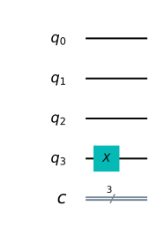
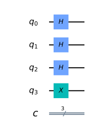
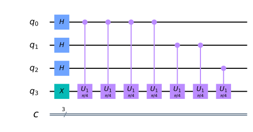
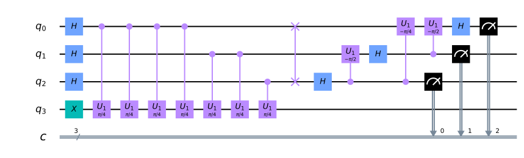
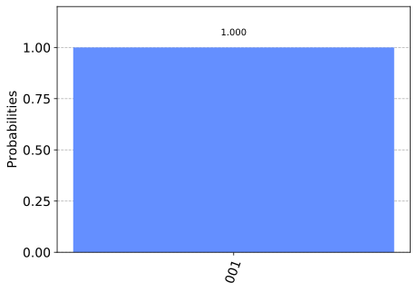
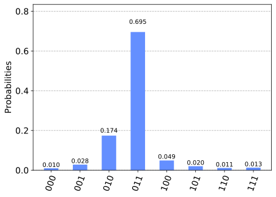
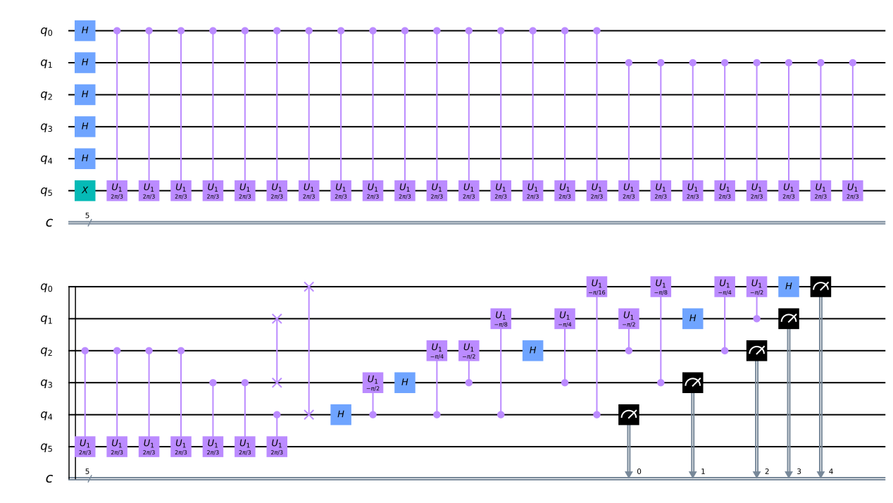
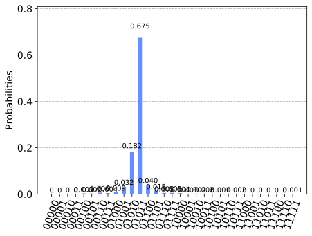
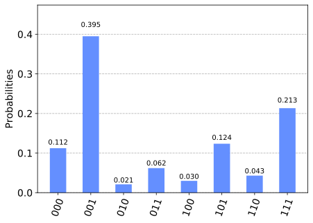

Quantum Phase Estimation
========================

1. `Overview <#overview>`__
   1.1 `Intuition <#intuition>`__
   1.2 `Mathematical Basis <#maths>`__
2. `Example: T-gate <#example_t_gate>`__
   2.1 `Creating the Circuit <#creating_the_circuit>`__
   2.2 `Results <#results>`__
3. `Getting More Precision <#getting_more_precision>`__
   3.1 `The Problem <#the_problem>`__
   3.2 `The Solution <#the_solution>`__
4. `Experimenting on Real Devices <#real_devices>`__
   4.1 `With the Circuit from 2.1 <#circuit_2.1>`__
5. `Exercises <#exercises>`__
6. `Looking Forward <#looking_forward>`__
7. `References <#references>`__

Quantum phase estimation is one of the most important subroutines in
quantum computation. It serves as a central building block for many
quantum algorithms. The objective of the algorithm is the following:

Given a unitary operator :math:`U`, the algorithm estimates
:math:`\theta` in
:math:`U\vert\psi \rangle =e^{\boldsymbol{2\pi i} \theta }|\psi \rangle`.
Here :math:`|\psi\rangle` is an eigenvector and
:math:`e^{\boldsymbol{2\pi i}\theta}` is the corresponding eigenvalue.
Since :math:`U` is unitary, all of its eigenvalues have a norm of 1.

1. Overview 
------------

The general quantum circuit for phase estimation is shown below. The top
register contains :math:`t` ‘counting’ qubits, and the bottom contains
qubits in the state :math:`|\psi\rangle`:

1.1 Intuition 
~~~~~~~~~~~~~~

The quantum phase estimation algorithm uses phase kickback to write the
phase of :math:`U` (in the Fourier basis) to the :math:`t` qubits in the
counting register. We then use the inverse QFT to translate this from
the Fourier basis into the computational basis, which we can measure.

We remember (from the QFT chapter) that in the Fourier basis the topmost
qubit completes one full rotation when counting between :math:`0` and
:math:`2^t`. To count to a number, :math:`x` between :math:`0` and
:math:`2^t`, we rotate this qubit by :math:`\tfrac{x}{2^t}` around the
z-axis. For the next qubit we rotate by :math:`\tfrac{2x}{2^t}`, then
:math:`\tfrac{4x}{2^t}` for the third qubit.

When we use a qubit to control the :math:`U`-gate, the qubit will turn
(due to kickback) proportionally to the phase :math:`e^{2i\pi\theta}`.
We can use successive :math:`CU`-gates to repeat this rotation an
appropriate number of times until we have encoded the phase theta as a
number between :math:`0` and :math:`2^t` in the Fourier basis.

Then we simply use :math:`QFT^\dagger` to convert this into the
computational basis.

1.2 Mathematical Basis 
~~~~~~~~~~~~~~~~~~~~~~~

As mentioned above, this circuit estimates the phase of a unitary
operator :math:`U`. It estimates :math:`\theta` in
:math:`U\vert\psi \rangle =e^{\boldsymbol{2\pi i} \theta }|\psi \rangle`,
where :math:`|\psi\rangle` is an eigenvector and
:math:`e^{\boldsymbol{2\pi i}\theta}` is the corresponding eigenvalue.
The circuit operates in the following steps:

0. **Setup**: :math:`\vert\psi\rangle` is in one set of qubit registers.
   An additional set of :math:`n` qubits form the counting register on
   which we will store the value :math:`2^n\theta`:

.. math::  \psi_0 = \lvert 0 \rangle^{\otimes n} \lvert \psi \rangle

1. **Superposition**: Apply a :math:`n`-bit Hadamard gate operation
   :math:`H^{\otimes n}` on the counting register:

.. math::  \psi_1 = {\frac {1}{2^{\frac {n}{2}}}}\left(|0\rangle +|1\rangle \right)^{\otimes n} \lvert \psi \rangle

2. **Controlled Unitary Operations**: We need to introduce the
   controlled unitary :math:`C-U` that applies the unitary operator
   :math:`U` on the target register only if its corresponding control
   bit is :math:`|1\rangle`. Since :math:`U` is a unitary operatory with
   eigenvector :math:`|\psi\rangle` such that
   :math:`U|\psi \rangle =e^{\boldsymbol{2\pi i} \theta }|\psi \rangle`,
   this means:

.. math:: U^{2^{j}}|\psi \rangle =U^{2^{j}-1}U|\psi \rangle =U^{2^{j}-1}e^{2\pi i\theta }|\psi \rangle =\cdots =e^{2\pi i2^{j}\theta }|\psi \rangle

Applying all the :math:`n` controlled operations :math:`C − U^{2^j}`
with :math:`0\leq j\leq n-1`, and using the relation
:math:`|0\rangle \otimes |\psi \rangle +|1\rangle \otimes e^{2\pi i\theta }|\psi \rangle =\left(|0\rangle +e^{2\pi i\theta }|1\rangle \right)\otimes |\psi \rangle`:

\\begin{aligned} :raw-latex:`\psi`\ *{2} &
=:raw-latex:`\frac {1}{2^{\frac {n}{2}}}`
:raw-latex:`\left`(|0:raw-latex:`\rangle`+{e^{:raw-latex:`\boldsymbol{2\pi i}`
:raw-latex:`\theta `2^{n-1}}}|1:raw-latex:`\rangle `:raw-latex:`\right`)
:raw-latex:`\otimes `:raw-latex:`\cdots `:raw-latex:`\otimes `:raw-latex:`\left`(|0:raw-latex:`\rangle`+{e^{:raw-latex:`\boldsymbol{2\pi i}`
:raw-latex:`\theta `2^{1}}}:raw-latex:`\vert`1:raw-latex:`\rangle `:raw-latex:`\right`)
:raw-latex:`\otimes `:raw-latex:`\left`(|0:raw-latex:`\rangle`+{e^{:raw-latex:`\boldsymbol{2\pi i}`
:raw-latex:`\theta `2^{0}}}:raw-latex:`\vert`1:raw-latex:`\rangle `:raw-latex:`\right`)
:raw-latex:`\otimes `\|:raw-latex:`\psi`:raw-latex:`\rangle`\\\\ & =
:raw-latex:`\frac{1}{2^{\frac {n}{2}}}`:raw-latex:`\sum `*\ {k=0}:sup:`{2`\ {n}-1}e^{:raw-latex:`\boldsymbol{2\pi i}`
:raw-latex:`\theta `k}|k:raw-latex:`\rangle `:raw-latex:`\otimes `:raw-latex:`\vert`:raw-latex:`\psi`:raw-latex:`\rangle`
\\end{aligned} where :math:`k` denotes the integer representation of
n-bit binary numbers.

3. **Inverse Fourier Transform**: Notice that the above expression is
   exactly the result of applying a quantum Fourier transform as we
   derived in the notebook on `Quantum Fourier Transform and its Qiskit
   Implementation <qft.ipynb>`__. Recall that QFT maps an n-qubit input
   state :math:`\vert x\rangle` into an output as

.. math::

   QFT\vert x \rangle = \frac{1}{2^\frac{n}{2}}
   \left(\vert0\rangle + e^{\frac{2\pi i}{2}x} \vert1\rangle\right) 
   \otimes
   \left(\vert0\rangle + e^{\frac{2\pi i}{2^2}x} \vert1\rangle\right) 
   \otimes  
   \ldots
   \otimes
   \left(\vert0\rangle + e^{\frac{2\pi i}{2^{n-1}}x} \vert1\rangle\right) 
   \otimes
   \left(\vert0\rangle + e^{\frac{2\pi i}{2^n}x} \vert1\rangle\right) 

Replacing :math:`x` by :math:`2^n\theta` in the above expression gives
exactly the expression derived in step 2 above. Therefore, to recover
the state :math:`\vert2^n\theta\rangle`, apply an inverse Fourier
transform on the ancilla register. Doing so, we find

.. math::

   \vert\psi_3\rangle = \frac {1}{2^{\frac {n}{2}}}\sum _{k=0}^{2^{n}-1}e^{\boldsymbol{2\pi i} \theta k}|k\rangle \otimes | \psi \rangle \xrightarrow{\mathcal{QFT}_n^{-1}} \frac {1}{2^n}\sum _{x=0}^{2^{n}-1}\sum _{k=0}^{2^{n}-1} e^{-\frac{2\pi i k}{2^n}(x - 2^n \theta)} |x\rangle \otimes |\psi\rangle

4. **Measurement**: The above expression peaks near
   :math:`x = 2^n\theta`. For the case when :math:`2^n\theta` is an
   integer, measuring in the computational basis gives the phase in the
   ancilla register with high probability:

.. math::  |\psi_4\rangle = | 2^n \theta \rangle \otimes | \psi \rangle

For the case when :math:`2^n\theta` is not an integer, it can be shown
that the above expression still peaks near :math:`x = 2^n\theta` with
probability better than :math:`4/\pi^2 \approx 40\%` [1].

2. Example: T-gate 
-------------------

Let’s take a gate we know well, the :math:`T`-gate, and use Quantum
Phase Estimation to estimate its phase. You will remember that the
:math:`T`-gate adds a phase of :math:`e^\frac{i\pi}{4}` to the state
:math:`|1\rangle`:

.. math::

    T|1\rangle = 
   \begin{bmatrix}
   1 & 0\\\\
   0 & e^\frac{i\pi}{4}\\ 
   \end{bmatrix}
   \begin{bmatrix}
   0\\\\
   1\\ 
   \end{bmatrix}
   = e^\frac{i\pi}{4}|1\rangle 

Since QPE will give us :math:`\theta` where:

.. math::  T|1\rangle = e^{2i\pi\theta}|1\rangle 

We expect to find:

.. math:: \theta = \frac{1}{8}

In this example we will use three qubits and obtain an *exact* result
(not an estimation!)

2.1 Creating the Circuit 
~~~~~~~~~~~~~~~~~~~~~~~~~

Let’s first prepare our environment:

.. code:: ipython3

    #initialization
    import matplotlib.pyplot as plt
    %matplotlib inline
    %config InlineBackend.figure_format = 'svg' # Makes the images look nice
    import numpy as np
    import math
    
    # importing Qiskit
    from qiskit import IBMQ, Aer
    from qiskit import QuantumCircuit, ClassicalRegister, QuantumRegister, execute
    
    # import basic plot tools
    from qiskit.visualization import plot_histogram

Now, set up the quantum circuit. We will use four qubits – qubits 0 to 2
as counting qubits, and qubit 3 as the eigenstate of the unitary
operator (:math:`T`).

We initialize :math:`\vert\psi\rangle = \vert1\rangle` by applying an
:math:`X` gate:

.. code:: ipython3

    qpe = QuantumCircuit(4, 3)
    qpe.x(3)
    qpe.draw(output='mpl')

Next, we apply Hadamard gates to the counting qubits:

.. code:: ipython3

    for qubit in range(3):
        qpe.h(qubit)
    qpe.draw(output='mpl')

Next we perform the controlled unitary operations:

.. code:: ipython3

    repetitions = 2**2
    for counting_qubit in range(3):
        for i in range(repetitions):
            qpe.cu1(math.pi/4, counting_qubit, 3); # This is C-U
        repetitions //= 2
    qpe.draw(output='mpl')

We apply the inverse quantum Fourier transformation to convert the state
of the counting register. Here we provide the code for
:math:`QFT^\dagger`:

.. code:: ipython3

    def qft_dagger(circ, n):
        """n-qubit QFTdagger the first n qubits in circ"""
        # Don't forget the Swaps!
        for qubit in range(int(n/2)):
            circ.swap(qubit, n-qubit-1)
        for j in range(n,0,-1):
            k = n - j
            for m in range(k):
                circ.cu1(-math.pi/float(2**(k-m)), n-m-1, n-k-1)
            circ.h(n-k-1)

We then measure the counting register. At the moment our qubits are in
reverse order (a common problem in quantum computing!) We measure to the
classical bits in reverse order to fix this:

.. code:: ipython3

    # Apply inverse QFT
    qft_dagger(qpe, 3)
    
    # We measure in reverse order to correct issues later
    qpe.measure(0,2)
    qpe.measure(1,1)
    qpe.measure(2,0)

.. parsed-literal::

    <qiskit.circuit.instructionset.InstructionSet at 0x7fa8008e2ad0>

.. code:: ipython3

    qpe.draw(output="mpl")

2.2 Results 
~~~~~~~~~~~~

.. code:: ipython3

    backend = Aer.get_backend('qasm_simulator')
    shots = 2048
    results = execute(qpe, backend=backend, shots=shots).result()
    answer = results.get_counts()
    plot_histogram(answer)

We see we get one result (``001``) with certainty, which translates to
the decimal: ``1``. We now need to divide our result (``1``) by
:math:`2^n` to get :math:`\theta`:

.. math::  \theta = \frac{1}{2^3} = \frac{1}{8} 

This is exactly the result we expected!

3. Example: Getting More Precision 
-----------------------------------

3.1 The Problem 
~~~~~~~~~~~~~~~~

Instead of a :math:`T`-gate, let’s use a gate with
:math:`\theta = \frac{1}{3}`. We set up our circuit as with the last
example:

.. code:: ipython3

    # Create and set up circuit
    qpe2 = QuantumCircuit(4, 3)
    
    # Apply H-Gates to counting qubits:
    for qubit in range(3):
        qpe2.h(qubit)
    
    # Prepare our eigenstate |psi>:
    qpe2.x(3)
    
    # Do the controlled-U operations:
    angle = 2*math.pi/3
    repetitions = 2**2
    for counting_qubit in range(3):
        for i in range(repetitions):
            qpe2.cu1(angle, counting_qubit, 3);
        repetitions //= 2
    
    # Do the inverse QFT:
    qft_dagger(qpe2, 3)
    
    # Measure of course!
    qpe2.measure(0,2)
    qpe2.measure(1,1)
    qpe2.measure(2,0)
    
    qpe2.draw(output='mpl')

.. code:: ipython3

    # Let's see the results!
    backend = Aer.get_backend('qasm_simulator')
    shots = 4096
    results = execute(qpe2, backend=backend, shots=shots).result()
    answer = results.get_counts()
    plot_histogram(answer)

We are expecting the result :math:`\theta = 0.3333\dots`, and we see our
most likely results are ``010(bin) = 2(dec)`` and ``011(bin) = 3(dec)``.
These two results would tell us that :math:`\theta = 0.25` (off by 25%)
and :math:`\theta = 0.375` (off by 13%) respectively. The true value of
:math:`\theta` lies between the values we can get from our counting
bits, and this gives us uncertainty and imprecision.

3.2 The Solution 
~~~~~~~~~~~~~~~~~

To get more precision we simply add more counting qubits. We are going
to add two more counting qubits:

.. code:: ipython3

    # Create and set up circuit
    qpe3 = QuantumCircuit(6, 5)
    
    # Apply H-Gates to counting qubits:
    for qubit in range(5):
        qpe3.h(qubit)
    
    # Prepare our eigenstate |psi>:
    qpe3.x(5)
    
    # Do the controlled-U operations:
    angle = 2*math.pi/3
    repetitions = 2**4
    for counting_qubit in range(5):
        for i in range(repetitions):
            qpe3.cu1(angle, counting_qubit, 5);
        repetitions //= 2
    
    # Do the inverse QFT:
    qft_dagger(qpe3, 5)
    
    # Measure of course!
    qpe3.measure(0,4)
    qpe3.measure(1,3)
    qpe3.measure(2,2)
    qpe3.measure(3,1)
    qpe3.measure(4,0)
    
    qpe3.draw(output='mpl')

.. code:: ipython3

    # Let's see the results!
    backend = Aer.get_backend('qasm_simulator')
    shots = 4096
    results = execute(qpe3, backend=backend, shots=shots).result()
    answer = results.get_counts()
    plot_histogram(answer)

The two most likely measurements are now ``01011`` (decimal 11) and
``01010`` (decimal 10). Measuring these results would tell us
:math:`\theta` is:

.. math::

   \theta = \frac{11}{2^5} = 0.344,\;\text{  or  }\;\; \theta = \frac{10}{2^5} = 0.313

 These two results differ from :math:`\frac{1}{3}` by 3% and 6%
respectively. A much better precision!

4. Experiment with Real Devices 
--------------------------------

4.1 Circuit from 2.1 
~~~~~~~~~~~~~~~~~~~~~

We can run the circuit in section 2.1 on a real device, let’s remind
ourselves of the circuit:

.. code:: ipython3

    qpe.draw(output='mpl')

.. code:: ipython3

    # Load our saved IBMQ accounts and get the least busy backend device with less than or equal to n qubits
    IBMQ.load_account()
    from qiskit.providers.ibmq import least_busy
    from qiskit.tools.monitor import job_monitor
    provider = IBMQ.get_provider(hub='ibm-q')
    backend = least_busy(provider.backends(filters=lambda x: x.configuration().n_qubits >= 4 and not x.configuration().simulator and x.status().operational==True))
    print("least busy backend: ", backend)
    
    # Run with 2048 shots
    shots = 2048
    job_exp = execute(qpe, backend=backend, shots=shots, optimization_level=3)
    job_monitor(job_exp)

.. parsed-literal::

    least busy backend:  ibmq_ourense
    Job Status: job has successfully run

.. code:: ipython3

    # get the results from the computation
    results = job_exp.result()
    answer = results.get_counts(qpe)
    plot_histogram(answer)

We can hopefully see that the most likely result is ``001`` which is the
result we would expect from the simulator. Unlike the simulator, there
is a probability of measuring something other than ``001``, this is due
to noise and gate errors in the quantum computer.

5. Exercises 
-------------

1. Try the experiments above with different gates (:math:`\text{CNOT}`,
   :math:`S`, :math:`T^\dagger`), what results do you expect? What
   results do you get?

2. Try the experiment with a :math:`Y`-gate, do you get the correct
   result? (Hint: Remember to make sure :math:`|\psi\rangle` is an
   eigenstate of :math:`Y`!)

6. Looking Forward 
-------------------

The quantum phase estimation algorithm may seem pointless, since we have
to know :math:`\theta` to perform the controlled-\ :math:`U` operations
on our quantum computer. We will see in later chapters that it is
possible to create circuits for which we don’t know :math:`\theta`, and
for which learning theta can tell us something very useful (most
famously how to factor a number!)

7. References 
--------------

[1] Michael A. Nielsen and Isaac L. Chuang. 2011. Quantum Computation
and Quantum Information: 10th Anniversary Edition (10th ed.). Cambridge
University Press, New York, NY, USA.

.. code:: ipython3

    import qiskit
    qiskit.__qiskit_version__

.. parsed-literal::

    {'qiskit-terra': '0.11.1',
     'qiskit-aer': '0.3.4',
     'qiskit-ignis': '0.2.0',
     'qiskit-ibmq-provider': '0.4.5',
     'qiskit-aqua': '0.6.2',
     'qiskit': '0.14.1'}

