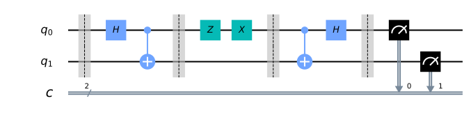

Superdense Coding
=================

This notebook demonstrates Superdense Coding (SDC) in quantum computing.
We first use Qiskit’s simulator to test our quantum circuit, and then
try it out on a real quantum computer.

1. The Difference between Superdense Coding and Quantum Teleportation
---------------------------------------------------------------------

Quantum teleportation and superdense coding are closely related and
might cause confusion if not properly explained or differentiate.

Quantum teleportation is a process by which the state of qubit
(:math:`|\psi\rangle`) can be transmitted from one location to another,
with the help of classical communication and a Bell pair. In other
words, we can say it is a protocol that destroys the quantum state of a
qubit in one location and recreates it on a qubit at a distant location,
with the help of shared entanglement. Superdense coding is a procedure
that allows someone to send two classical bits to another party using
just a single qubit of communication.

The teleportation protocol is actually a flipped version of the
superdense coding protocol, in the sense that Alice and Bob merely “swap
their equipment.”

2. The Process
--------------

2.1 Step 1
~~~~~~~~~~

The process starts with a third party, who we’ll call (Eve). Two qubits
are prepared by Eve in an entangled state. She initially starts the 2
qubits in the basis state :math:`|0\rangle`. She applies Hadamard gate
(:math:`H`) to the first qubit to create superposition. She then applies
CNOT gate (:math:`CX`) using the first qubit as a control and the second
as the target. This is the entangled state (Bell pair) we mention
earlier.

Outcome States
^^^^^^^^^^^^^^

Eve first applied Hadamard gate.

When H gate is applied to first qubit, it enters into superposition and
we get the state:

.. math:: |0+\rangle  =  \tfrac{1}{\sqrt{2}}(|00\rangle + |01\rangle)

Then Eve applies the CNOT gate. The CNOT gate entangles both qubits,
that is, it flips the target if the control is :math:`|1\rangle`. Note
that the control is on our first qubit.

.. math:: \text{CNOT} \tfrac{1}{\sqrt{2}}(|00\rangle + |01\rangle) = \tfrac{1}{\sqrt{2}}(|00\rangle + |11\rangle)

2.2 Step 2
~~~~~~~~~~

Eve sent the first qubit to Alice and second qubit to Bob. The goal of
the protocol is for Alice to send 2 classical bits of information to Bob
using her qubit. But before she does, she needs to apply a set of
quantum gates to her qubit depending on the 2 bits of information she
wants to send

Encoding Rules for Superdense Coding (Alice protocol) Quantum
gates/rules

.. raw:: html

   <!--- Table does not render properly when built to html. This is a problem with nbconvert. Replaced with image
   | Intended Message | Applied Gate | Resulting State ($\cdot\sqrt{2}$)|
   |:----------------:|:------------:|:--------------------------------:|
   |00                |$I$           | $|00\rangle + |11\rangle$        |
   |01                |$X$           | $|01\rangle + |10\rangle$        |
   |10                |$Z$           | $|00\rangle - |11\rangle$        |
   |11                |$ZX$          | $|10\rangle - |01\rangle$        |
   --->

Thus if she wants to send a 00, she does nothing to her qubit (apply the
identity (:math:`I`) gate). If she sends a 01, then she applies the
:math:`X` gate. Depending on what she wants to send, she applies the
appropriate gate. Alice then sends her qubit to Bob for the final step
in the process

2.3 Step 3
~~~~~~~~~~

Bob receives Alice’s qubit (first qubit) and uses his qubit to decode
Eve’s message. Notice that he does not need to have knowledge of the
state in order to decode it — he only needs knowledge of the restoration
operation.

Bob applies a CNOT gate using the first qubit as control and the second
as target. Then he applies a Hadamard gate and finally performs a
measurement in both qubits to extract the classical bits encoded in
Alice’s qubit.

.. raw:: html

   <!--- Table does not render properly when built to html. This is a problem with nbconvert. Replaced with image
   | Bob Recieves:             | After CNOT-gate:          | After H-gate:  |
   |:-------------------------:|:-------------------------:|:--------------:|
   | $|00\rangle + |11\rangle$ | $|00\rangle + |01\rangle$ | $|00\rangle$   |
   | $|01\rangle + |10\rangle$ | $|01\rangle + |11\rangle$ | $|01\rangle$   |
   | $|00\rangle - |11\rangle$ | $|00\rangle - |10\rangle$ | $|10\rangle$   |
   | $|10\rangle - |01\rangle$ | $|11\rangle - |01\rangle$ | $|11\rangle$   |
   --->

When Bob performs the measurements, he ends up with four possible
outcomes with probability of 1 each. Note that the last outcome has a
negative sign :math:`-|11\rangle`, writing it as :math:`|11\rangle` is
also correct because the probability is calculated as the amplitude of
squared.

3. Simulating the Superdense Coding Protocol
--------------------------------------------

.. code:: ipython3

    # Importing all necessary libraries for work.
    
    from qiskit import *
    from qiskit.visualization import plot_histogram
    %config InlineBackend.figure_format = 'svg' # Makes the images look nice

.. code:: ipython3

    # Create the quantum circuit with 2 qubits and 2 classical bits
    qc = QuantumCircuit(2, 2)
    
    qc.barrier()
    
    
    # First generate the entangled pair between Alice and Bob (Remember: Hadamard followed by CX generates a Bell pair)
    # At this point, qubit 1 goes to Bob and qubit 2 goes to Alice
    qc.h(0)
    qc.cx(0, 1)
    qc.barrier()
    
    # Next, Alice encodes her message. First, we need to prepare the state Alice will like to send,
    # In this tutorial, Alice is sending 11:
    
    qc.z(0)
    qc.x(0)
    qc.barrier()
    
    # Alice then sends her qubit to Bob.
    # After recieving qubit 0, Bob applies the recovery protocol:
    qc.cx(0, 1)
    qc.h(0)
    
    # Let's take a measurement to see which classical bit of information Bob receives:
    qc.barrier()
    qc.measure(0, 0)
    qc.measure(1, 1)
    
    # Draw our output
    qc.draw(output = "mpl")

3.1 Visualizing our measurements
~~~~~~~~~~~~~~~~~~~~~~~~~~~~~~~~

.. code:: ipython3

    backend = Aer.get_backend('qasm_simulator')
    job_sim = execute(qc, backend, shots=1024)
    sim_result = job_sim.result()
    
    measurement_result = sim_result.get_counts(qc)
    print(measurement_result)
    plot_histogram(measurement_result)

.. parsed-literal::

    {'11': 1024}

4. Superdense Coding on a Real Quantum Computer
-----------------------------------------------

Let’s see how superdense coding works on real quantum computer.

First, we want to load our account to get the least busy quantum system

.. code:: ipython3

    from qiskit import IBMQ
    from qiskit.providers.ibmq import least_busy
    shots = 256
    
    # Load local account information
    IBMQ.load_account()
    provider = IBMQ.get_provider(hub='ibm-q')
    backend = least_busy(provider.backends(filters=lambda x: x.configuration().n_qubits >= 2 and not x.configuration().simulator and x.status().operational==True))
    print("least busy backend: ", backend)
    job = execute(qc, backend=backend, shots=shots)

.. parsed-literal::

    least busy backend:  ibmqx2

.. code:: ipython3

    # Monitoring our job
    from qiskit.tools.monitor import job_monitor
    job_monitor(job)

.. parsed-literal::

    Job Status: job has successfully run

.. code:: ipython3

    # Plotting our result
    result = job.result()
    plot_histogram(result.get_counts(qc))

.. image:: superdense-coding_files/superdense-coding_9_0.svg

As we see that there are a few results from the other three states when
run in a real quantum computer. These are due to errors in the gates
that were applied and qubit decoherence.

.. code:: ipython3

    correct_results = result.get_counts(qc)['11']
    accuracy = (correct_results/float(shots))*100
    print("Accuracy = %.2f%%" % accuracy)

.. parsed-literal::

    Accuracy = 93.75%

.. code:: ipython3

    import qiskit
    qiskit.__qiskit_version__

.. parsed-literal::

    {'qiskit-terra': '0.11.1',
     'qiskit-aer': '0.3.4',
     'qiskit-ignis': '0.2.0',
     'qiskit-ibmq-provider': '0.4.5',
     'qiskit-aqua': '0.6.2',
     'qiskit': '0.14.1'}

