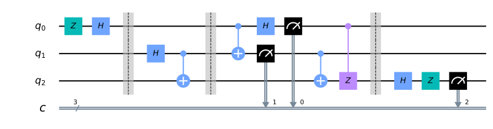
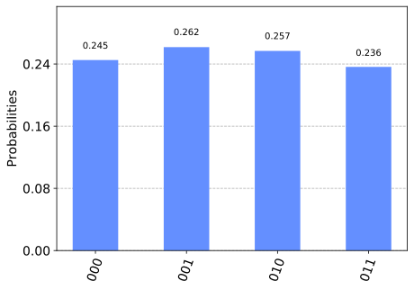
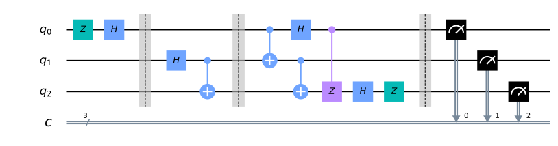
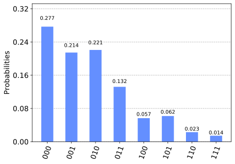

Quantum Teleportation
=====================

This notebook demonstrates quantum teleportation. We first use Qiskit’s
built-in simulator to test our quantum circuit, and then try it out on a
real quantum computer.

The concept
-----------

Alice wants to send quantum information to Bob. Specifically, suppose
she wants to send the state
:math:`\vert\psi\rangle = \alpha\vert0\rangle + \beta\vert1\rangle` to
Bob. This entails passing on information about :math:`\alpha` and
:math:`\beta` to Bob.

There exists a theorem in quantum mechanics which states that you cannot
simply make an exact copy of an unknown quantum state. This is known as
the no-cloning theorem. As a result of this we can see that Alice can’t
simply generate a copy of :math:`\vert\psi\rangle` and give the copy to
Bob. Copying a state is only possible with a classical computation.

However, by taking advantage of two classical bits and entanglement,
Alice can transfer the state :math:`\vert\psi\rangle` to Bob. We call
this teleportation as at the end Bob will have :math:`\vert\psi\rangle`
and Alice won’t anymore. Let’s see how this works in some detail.

How does quantum teleportation work?
------------------------------------

**Step 1**: Alice and Bob create an entangled pair of qubits and each
one of them holds on to one of the two qubits in the pair.

The pair they create is a special pair called a Bell pair. In quantum
circuit language, the way to create a Bell pair between two qubits is to
first transfer one of them to the Bell basis (:math:`|+\rangle` and
:math:`|-\rangle`) by using a Hadamard gate, and then to apply a CNOT
gate onto the other qubit controlled by the one in the Bell basis.

Let’s say Alice owns :math:`q_1` and Bob owns :math:`q_2` after they
part ways.

**Step 2**: Alice applies a CNOT gate on :math:`q_1`, controlled by
:math:`\vert\psi\rangle` (the qubit she is trying to send Bob).

**Step 3**: Next, Alice applies a Hadamard gate to :math:`|\psi\rangle`,
and applies a measurement to both qubits that she owns - :math:`q_1` and
:math:`\vert\psi\rangle`.

**Step 4**: Then, it’s time for a phone call to Bob. She tells Bob the
outcome of her two qubit measurement. Depending on what she says, Bob
applies some gates to his qubit, :math:`q_2`. The gates to be applied,
based on what Alice says, are as follows :

00 :math:`\rightarrow` Do nothing

01 :math:`\rightarrow` Apply :math:`X` gate

10 :math:`\rightarrow` Apply :math:`Z` gate

11 :math:`\rightarrow` Apply :math:`ZX` gate

*Note that this transfer of information is classical.*

And voila! At the end of this protocol, Alice’s qubit has now teleported
to Bob.

How will we test this result on a real quantum computer?
--------------------------------------------------------

In this notebook, we will give Alice a secret state
:math:`\vert\psi\rangle`. This state will be generated by applying a
series of unitary gates on a qubit that is initialized to the ground
state, :math:`\vert0\rangle`. Go ahead and fill in the secret unitary
that will be applied to :math:`\vert0\rangle` before passing on the
qubit to Alice.

.. code:: ipython3

    secret_unitary = 'hz'

If the quantum teleportation circuit works, then at the output of the
protocol discussed above will be the same state passed on to Alice.
Then, we can undo the applied secret_unitary (by applying its conjugate
transpose), to yield the :math:`\vert0\rangle` that we started with.

We will then do repeated measurements of Bob’s qubit to see how many
times it gives 0 and how many times it gives 1.

What do we expect?
~~~~~~~~~~~~~~~~~~

In the ideal case, and assuming our teleportation protocol works, we
will always measure 0 from Bob’s qubit because we started off with
:math:`|0\rangle`.

In a real quantum computer, errors in the gates will cause a small
fraction of the results to be 1. We’ll see how it looks.

1. Simulating the teleportation protocol
----------------------------------------

.. code:: ipython3

    # make the imports that are necessary for our work
    import qiskit as qk
    from qiskit import ClassicalRegister, QuantumRegister, QuantumCircuit
    from qiskit import execute, Aer
    from qiskit import IBMQ
    from qiskit.visualization import plot_histogram
    %config InlineBackend.figure_format = 'svg' # Makes the images look nice

.. code:: ipython3

    # simple function that applies a series of unitary gates from a given string
    def apply_secret_unitary(secret_unitary, qubit, quantum_circuit, dagger):
        functionmap = {
                        'x':quantum_circuit.x,
                        'y':quantum_circuit.y,
                        'z':quantum_circuit.z,
                        'h':quantum_circuit.h,                    
                        't':quantum_circuit.t,                    
        }
        if dagger: functionmap['t'] = quantum_circuit.tdg
        
        if dagger:
            [functionmap[unitary](qubit) for unitary in secret_unitary]
        else:
            [functionmap[unitary](qubit) for unitary in secret_unitary[::-1]]

.. code:: ipython3

    # Create the quantum circuit with 3 qubits and 3 classical bits
    qc = QuantumCircuit(3, 3)
    
    ''' Qubit ordering as follows (classical registers will just contain measured values of the corresponding qubits):
    q[0]: qubit to be teleported (Alice's first qubit. It was given to her after the application of a secret unitary 
          which she doesn't know)
    q[1]: Alice's second qubit
    q[2]: Bob's qubit, which will be the destination for the teleportation
    '''
    
    # Apply the secret unitary that we are using to generate the state to teleport. You can change it to any unitary
    apply_secret_unitary(secret_unitary, qc.qubits[0], qc, dagger = 0)
    qc.barrier()
    # Next, generate the entangled pair between Alice and Bob (Remember: Hadamard followed by CX generates a Bell pair)
    qc.h(1)
    qc.cx(1, 2)
    qc.barrier()
    # Next, apply the teleportation protocol. 
    qc.cx(0, 1)
    qc.h(0)
    qc.measure(0, 0)
    qc.measure(1, 1)
    qc.cx(1, 2)
    qc.cz(0, 2)
    qc.barrier()
    
    '''
    In principle, if the teleportation protocol worked, we have q[2] = secret_unitary|0>
    As a result, we should be able to recover q[2] = |0> by applying the reverse of secret_unitary
    since for a unitary u, u^dagger u = I.
    '''
    apply_secret_unitary(secret_unitary, qc.qubits[2], qc, dagger=1)
    qc.measure(2, 2)

.. parsed-literal::

    <qiskit.circuit.instructionset.InstructionSet at 0x7f8bd19d2590>

It’s always a good idea to draw the circuit that we have generated in
code. Let’s draw it below.

.. code:: ipython3

    qc.draw(output='mpl')

.. code:: ipython3

    backend = Aer.get_backend('qasm_simulator')
    job_sim = execute(qc, backend, shots=1024)
    sim_result = job_sim.result()
    
    measurement_result = sim_result.get_counts(qc)
    print(measurement_result)
    plot_histogram(measurement_result)

.. parsed-literal::

    {'001': 268, '010': 263, '000': 251, '011': 242}

**Note that the results on the x-axis in the histogram above are ordered
as :math:`c_2c_1c_0`. We can see that only results where :math:`c_2 = 0`
appear, indicating that the teleporation protocol has worked.**

2. Teleportation on a real quantum computer
-------------------------------------------

2.1 IBM hardware and Deferred Measurement
~~~~~~~~~~~~~~~~~~~~~~~~~~~~~~~~~~~~~~~~~

The IBM quantum computers currently do not support instructions after
measurements, meaning we cannot run the quantum teleportation in its
current form on real hardware. Fortunately, this does not limit our
ability to perform any computations due to the *deferred measurement
principle*\ [1]. The principle states that any measurement can be
postponed until the end of the circuit: We can move all the measurements
to the end, and we should see the same results.

Any benefits of measuring early are hardware related: If we can measure
early, we may be able to reuse qubits, or reduce the amount of time our
qubits are in their fragile superposition. In this example, the early
measurement in quantum teleportation would have allowed us to transmit a
qubit state without a direct quantum communication channel.

While moving the gates allows us to demonstrate the “teleportation”
circuit on real hardware, it should be noted that some of the benefit of
the teleportation process is lost.

.. code:: ipython3

    # Create the new quantum circuit with 3 qubits and 3 classical bits
    qc = QuantumCircuit(3, 3)
    
    ''' Qubit ordering as follows (classical registers will just contain measured values of the corresponding qubits):
    q[0]: qubit to be teleported (Alice's first qubit. It was given to her after the application of a secret unitary 
          which she doesn't know)
    q[1]: Alice's second qubit
    q[2]: Bob's qubit, which will be the destination for the teleportation
    '''
    
    # Apply the secret unitary that we are using to generate the state to teleport. You can change it to any unitary
    apply_secret_unitary(secret_unitary, qc.qubits[0], qc, dagger = 0)
    qc.barrier()
    # Next, generate the entangled pair between Alice and Bob (Remember: Hadamard followed by CX generates a Bell pair)
    qc.h(1)
    qc.cx(1, 2)
    qc.barrier()
    # Next, apply the teleportation protocol. 
    qc.cx(0, 1)
    qc.h(0)
    qc.cx(1, 2)
    qc.cz(0, 2)
    apply_secret_unitary(secret_unitary, qc.qubits[2], qc, dagger=1)
    # Finally, measure
    qc.barrier()
    qc.measure(0, 0)
    qc.measure(1, 1)
    qc.measure(2, 2)

.. parsed-literal::

    <qiskit.circuit.instructionset.InstructionSet at 0x7f8bd19d2210>

And let’s check it looks as expected:

.. code:: ipython3

    qc.draw(output='mpl')

2.2 Executing
~~~~~~~~~~~~~

You will now see the results of the teleportation algorithm on a real
quantum computer. Recall that we need one qubit for
:math:`\vert\psi\rangle`, one qubit for Alice, and one qubit for Bob,
for a total of three qubits.

.. code:: ipython3

    # First, see what devices we are allowed to use by loading our saved accounts
    IBMQ.load_account()
    provider = IBMQ.get_provider(hub='ibm-q')
    provider.backends()

.. parsed-literal::

    [<IBMQSimulator('ibmq_qasm_simulator') from IBMQ(hub='ibm-q', group='open', project='main')>,
     <IBMQBackend('ibmqx2') from IBMQ(hub='ibm-q', group='open', project='main')>,
     <IBMQBackend('ibmq_16_melbourne') from IBMQ(hub='ibm-q', group='open', project='main')>,
     <IBMQBackend('ibmq_vigo') from IBMQ(hub='ibm-q', group='open', project='main')>,
     <IBMQBackend('ibmq_ourense') from IBMQ(hub='ibm-q', group='open', project='main')>,
     <IBMQBackend('ibmq_london') from IBMQ(hub='ibm-q', group='open', project='main')>,
     <IBMQBackend('ibmq_burlington') from IBMQ(hub='ibm-q', group='open', project='main')>,
     <IBMQBackend('ibmq_essex') from IBMQ(hub='ibm-q', group='open', project='main')>,
     <IBMQBackend('ibmq_armonk') from IBMQ(hub='ibm-q', group='open', project='main')>]

.. code:: ipython3

    # get the least-busy backend at IBM and run the quantum circuit there
    from qiskit.providers.ibmq import least_busy
    backend = least_busy(provider.backends(filters=lambda b: b.configuration().n_qubits >= 3 and
                                       not b.configuration().simulator and b.status().operational==True))
    job_exp = execute(qc, backend=backend, shots=8192)
    exp_result = job_exp.result()
    
    exp_measurement_result = exp_result.get_counts(qc)
    print(exp_measurement_result)
    plot_histogram(exp_measurement_result)

.. parsed-literal::

    {'111': 198, '011': 2065, '101': 410, '001': 1647, '110': 106, '100': 254, '010': 1556, '000': 1956}

As we see here, there are a few results that contain the case when
:math:`c_2 = 1` in a real quantum computer. These arise due to errors in
the gates that were applied. In contrast, our simulator in the earlier
part of the notebook had zero errors in its gates, and allowed
error-free teleportation.

.. code:: ipython3

    error_rate_percent = sum([exp_measurement_result[result] for result in exp_measurement_result.keys() if result[0]=='1']) \
                        * 100./ sum(list(exp_measurement_result.values()))
    print("The experimental error rate : ", error_rate_percent, "%")

.. parsed-literal::

    The experimental error rate :  11.81640625 %

3. References
-------------

[1] M. Nielsen and I. Chuang, Quantum Computation and Quantum
Information, Cambridge Series on Information and the Natural Sciences
(Cambridge University Press, Cambridge, 2000).

.. code:: ipython3

    import qiskit
    qiskit.__qiskit_version__

.. parsed-literal::

    {'qiskit-terra': '0.11.1',
     'qiskit-aer': '0.3.4',
     'qiskit-ignis': '0.2.0',
     'qiskit-ibmq-provider': '0.4.5',
     'qiskit-aqua': '0.6.2',
     'qiskit': '0.14.1'}

