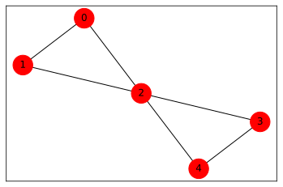
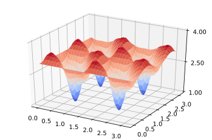
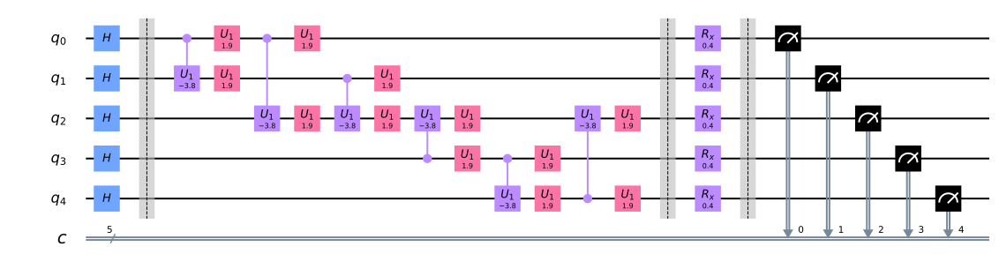
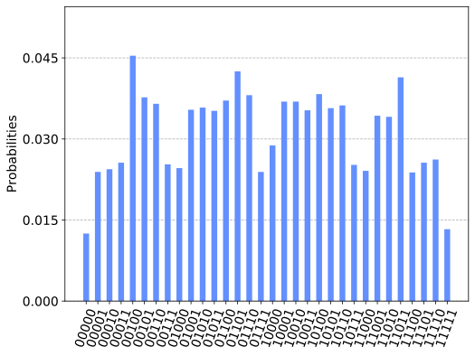
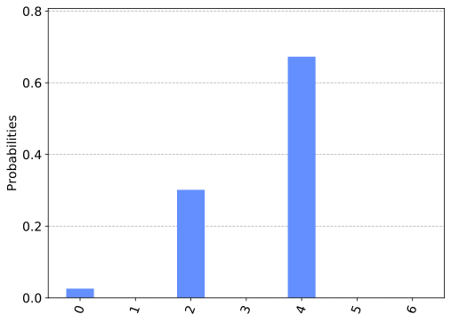
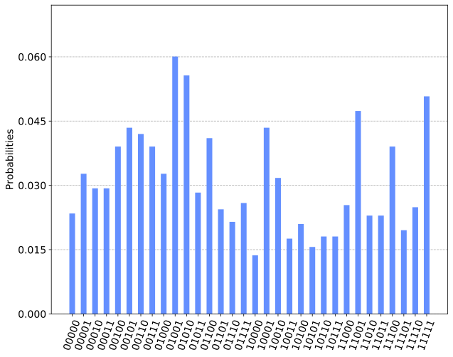
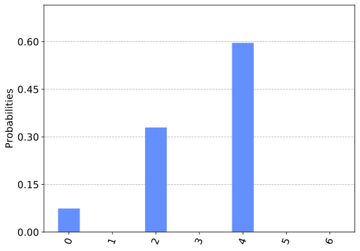

Solving combinatorial optimization problems using QAOA
======================================================

In this tutorial, we introduce combinatorial optimization problems,
explain approximate optimization algorithms, explain how the Quantum
Approximate Optimization Algorithm (QAOA) works and present the
implementation of an example that can be run on a simulator or on a 5
qubit quantum chip

.. contents::
   :local:

1. Introduction 
----------------

Combinatorial optimization `1 <#references>`__ means searching for an
optimal solution in a finite or countably infinite set of potential
solutions. Optimality is defined with respect to some criterion
function, which is to be minimized or maximized, which is typically
called the cost function.

There are various types of optimization problems. These include
Minimization: cost, distance, length of a traversal, weight, processing
time, material, energy consumption, number of objects. Maximization:
profit, value, output, return, yield, utility, efficiency, capacity,
number of objects. Any maximization problem can be cast in terms of a
minimization problem and vice versa. Hence the general form a
combinatorial optimization problem is given by

.. math::  \text{maximize } \;\;      C(x)

.. math::  \text{subject to } \;\; x \in S 

where :math:`x \in S`, is a discreet variable and
:math:`C : D \rightarrow \mathbb{R}` is the cost function. That maps
from some domain :math:`S` in to the real numbers :math:`\mathbb{R}`.
The variable :math:`x` can be subject to a set of constraints and lies
within the set :math:`S \subset D` of feasible points.

In binary combinatorial optimization problems, the cost function can
typically be expressed as a sum of terms that only involve a subsets
:math:`Q \subset[n]` of the :math:`n` bits in the string
:math:`x \in \{0,1\}^n` . The cost function :math:`C` typically written
in the canonical form

.. math::  C(x) = \sum_{(Q,\overline{Q}) \subset [n]} w_{(Q,\overline{Q})} \; \prod_{i\in Q} x_i \; \prod_{j\in \overline{Q}} (1- x_j), 

where :math:`x_i \in \{0,1\}` and
:math:`w_{(Q,\overline{Q})}\in \mathbb{R}`. We want to find the n-bit
string :math:`x` for which :math:`C(x)` is the maximal.

1.1 Diagonal Hamiltonians
~~~~~~~~~~~~~~~~~~~~~~~~~

This cost function can be mapped to a Hamiltonian that is diagonal in
the computational basis. Given the cost-fucntion :math:`C` this
Hamiltonian is then written as

.. math::  H = \sum_{x \in \{0,1\}^n} C(x) |x \rangle\langle x| 

where :math:`x \in \{0,1\}^n` labels the computational basis states
:math:`|x \rangle \in \mathbb{C}^{2^n}`. If the cost function only has
has at most weight :math:`k` terms, i.e. when only :math:`Q` conribute
that involve at most :math:`Q \leq k` bits, then this diagonal
Hamiltonian is also only a sum of weight :math:`k` Pauli :math:`Z`
operators.

The expansion of :math:`H` in to Pauli :math:`Z` operators can be
obtained from the cannonical expansion expantion of the cost-function
:math:`C` by substituting for every binary variable
:math:`x_i \in \{0,1\}` the matrix
:math:`x_i \rightarrow 2^{-1}(1 - Z_i)`. Here :math:`Z_i` is read as the
Pauli :math:`Z` operator that acts on qubit :math:`i` and trivial on all
others, i.e.

.. math::  Z_i = \left(\begin{array}{cc} 1 & 0 \\ 0 & -1 \end{array}\right). 

This means that the spin - Hamiltonian encoding the classical cost
funtion is written as a :math:`|Q|` - local quantum spin Hamiltonian
only involving Pauli :math:`Z`- operators.

.. math::  H = \sum_{(Q,\overline{Q}) \subset [n]} w_{(Q,\overline{Q})} \; \frac{1}{2^{|Q| + |\overline{Q}|}}\prod_{i\in Q} \left(1 - Z_i\right) \; \prod_{j\in \overline{Q}} \left(1 + Z_j\right).

Now, we will assume that only a few (polynomially many in :math:`n`)
:math:`w_{(Q,\overline{Q})}` will be non-zero. Moreover we will assume
that the set :math:`|(Q,\overline{Q})|` is bounded and not too large.
This means we can write the cost function as well as the Hamiltonian
:math:`H` as the sum of :math:`m` local terms :math:`\hat{C}_k`,

.. math::  H = \sum_{k = 1}^n \hat{C}_k, 

where both :math:`m` and the support of :math:`\hat{C}_k` is reasonably
bounded.

2 Examples: 
------------

We consider 2 examples to illustrate combinatorial optimization
problems. We will only implement the first example as in Qiskit, but
provide a sequence of exercises that give the instructions to implement
the second example as well.

2.1 (weighted) :math:`MAXCUT`
~~~~~~~~~~~~~~~~~~~~~~~~~~~~~

Consider an :math:`n`-node non-directed graph *G = (V, E)* where *\|V\|
= n* with edge weights :math:`w_{ij}>0`, :math:`w_{ij}=w_{ji}`, for
:math:`(j,k)\in E`. A cut is defined as a partition of the original set
V into two subsets. The cost function to be optimized is in this case
the sum of weights of edges connecting points in the two different
subsets, *crossing* the cut. By assigning :math:`x_i=0` or :math:`x_i=1`
to each node :math:`i`, one tries to maximize the global profit function
(here and in the following summations run over indices 0,1,…n-1)

.. math:: C(\textbf{x}) = \sum_{i,j = 1}^n w_{ij} x_i (1-x_j).

To simplify notation, we assume uniform weights $ w_{ij} = 1$ for
:math:`(i,j) \in E`. In order to find a solution to this problem on a
quantum computer, one needs first to map it to a diagonal Hamiltonian as
discussed above. We write the sum as a sum over edges in the set
:math:`(i,j) = E`

.. math:: C(\textbf{x}) = \sum_{i,j = 1}^n w_{ij} x_i (1-x_j)  = \sum_{(i,j) \in E} \left( x_i (1-x_j) + x_j (1-x_i)\right)

To map is to a spin Hamiltonian we make the assignment
:math:`x_i\rightarrow (1-Z_i)/2`, where :math:`Z_i` is the Pauli Z
operator that has eigenvalues :math:`\pm 1` and obtain
:math:`X \rightarrow H`

.. math::  H = \sum_{(j,k) \in E} \frac{1}{2}\left(1 - Z_j Z_k \right).

This means that the Hamiltonian can be written as a sum of
:math:`m = |E|` local terms
:math:`\hat{C}_e = \frac{1}{2}\left(1 - Z_{e1}Z_{e2}\right)` with
:math:`e = (e1,e2) \in E`.

2.2 Constraint satisfaction problems and :math:`MAX \; 3-SAT`.
~~~~~~~~~~~~~~~~~~~~~~~~~~~~~~~~~~~~~~~~~~~~~~~~~~~~~~~~~~~~~~

Another example of a combinatorial optimization problem is
:math:`3-SAT`. Here the cost function
:math:`C(\textbf{x}) = \sum_{k = 1}^m c_k(\textbf{x})` is a sum of
clauses :math:`c_k(\textbf{x})` that constrain the values of :math:`3`
bits of some :math:`\textbf{x} \in \{0,1\}^n` that participate in the
clause. Consider for instance this example of a :math:`3-SAT` clause

.. math::  c_1(\textbf{x}) = (1-x_1)(1-x_3)x_{132} 

for a bit string :math:`\textbf{x} \in \{0,1\}^{133}`. The clause can
only be satisfied by setting the bits :math:`x_1 = 0`,\ :math:`x_3 = 0`
and :math:`x_{132} = 1`. The :math:`3-SAT` problem now asks whether
there is a bit -string that satisfies all of the :math:`m` clauses or
whether no such string exists. This decision problem is the prime
example of a problem that is :math:`NP`- complete.

The closely related optimization problem :math:`MAX \; 3-SAT` asks to
find the bit string :math:`\textbf{x}` that satisfies the maximal number
of of clauses in :math:`C(\textbf{x})`. This can of course be turned
again in to a decision problem if we ask where there exists a bit string
that satisfies more than :math:`\tilde{m}` of the :math:`m` clauses,
which is again :math:`NP`-complete.

3. Approximate optimization algorithms 
---------------------------------------

Both the previously considered problems :math:`MAXCUT` and
:math:`MAX \; 3-SAT` are actually known to be a NP-hard problems
`1 <#references>`__. In fact it turns out that many combinatorial
optimization problems are computationally hard to solve in general. In
light of this fact, we can’t expect to find a provably efficient
algorithm, i.e. an algorithm with polynomial runtime in the problem
size, that solves these problems. This also applies to quantum
algorithms. One possible approach to such problems is to develop
heuristic algortihms that don’t have a polynomial runtime guarantee but
appear to perform well on some instances of such problems. Another
alternative are approximate algorithms.

Approximate optimization algorithms find approximate solutions to
:math:`NP`-hard optimization problems. These algorithms are efficient
and provide a provable guarantee on how close the approximate solution
is to the actual optimum of the problem.

The guarantee typically comes in the form of an approximation ratio,
:math:`\alpha \leq 0`. A probabilistic approximate optimization
algorithm guarantees that it produces a bit-string
:math:`\textbf{x}^* \in \{0,1\}^n` so that *with high probability* we
have that with a postive
:math:`C_{max} = \max_{\textbf{x}}C(\textbf{x})`

.. math::  C_{max} \geq C(\textbf{x}^*) \geq \alpha C_{max}. 

For the :math:`MAXCUT` problem there is a famous approximate algorithm
due to Goemans and Williamson `2 <#references>`__ . This algorithm is
based on an SDP relaxation of the original problem combined with a
probabilistic rounding technique that yields an with high probabilty
approximate solution :math:`\textbf{x}^*` that has an approximation
ratio of :math:`\alpha \approx 0.868`. This approximation ratio is
actually believed to optimal so we do not expect to see an improvement
by using a quantum algorithm.

4. The QAOA algorithm 
----------------------

The Quantum approximate optimization algorithm (QAOA) by Farhi, Goldsone
and Gutmann `3 <#references>`__ takes the approach of classical
aproximate algorithms and looks for a quantum analogue that will
likewise produce a classical bit -string :math:`x^*` that with high
probabilty is expected to have a good approximation ratio
:math:`\alpha`. Before discussing the details, let us first present the
general idea of this approach.

4.1 Overview:
~~~~~~~~~~~~~

We want to find a quantum state
:math:`|\psi_p(\vec{\gamma},\vec{\beta})\rangle`, that depends on some
real parameters :math:`\vec{\gamma},\vec{\beta} \in \mathbb{R}^p`, which
has the property that it maximizes the expectation value with respect to
the problem Hamiltonian :math:`H`. Given this trial state we search for
parameters :math:`\vec{\gamma}^*,\vec{\beta}^*` that maximize
:math:`F_p(\vec{\gamma},\vec{\beta}) = \langle \psi_p(\vec{\gamma},\vec{\beta})|H|\psi_p(\vec{\alpha},\vec{\beta})\rangle`.

Once we have such a state and the corresponding parameters we prepare
the state :math:`|\psi_p(\vec{\gamma}^*,\vec{\beta}^*)\rangle` on a
quantum computer and measure the state in the :math:`Z` basis
:math:`|x \rangle = |x_1,\ldots x_n \rangle` to obtain a random outcome
:math:`x^*`.

We will see that this random :math:`x^*` is going to be a bit-string
that is with high probability close to the expected value
:math:`M_p = F_p(\vec{\gamma}^*,\vec{\beta}^*)`. Hence, if :math:`M_p`
is close to :math:`C_{max}` so is :math:`C(x^*)`.

4.2 The components of the QAOA algorithm.
~~~~~~~~~~~~~~~~~~~~~~~~~~~~~~~~~~~~~~~~~

4.2.1 The QAOA trial state 
~~~~~~~~~~~~~~~~~~~~~~~~~~~

Central to QAOA is the trial state
:math:`|\psi_p(\vec{\gamma},\vec{\beta})\rangle` that will be prepared
on the quantum computer. Ideally we want this state to give rise to a
large expectation value
:math:`F_p(\vec{\alpha},\vec{\beta}) = \langle \vec{\gamma},\vec{\beta})|H|\psi_p(\vec{\gamma},\vec{\beta})\rangle`
with respect to the problem Hamiltonian :math:`H`. In *CITE* Farhi, the
trial states :math:`|\psi_p(\vec{\gamma},\vec{\beta})\rangle` are
constructed from the problem Hamiltonian :math:`H` together with single
qubit Pauli :math:`X` rotations. That means, given a problems
Hamiltonian

.. math::  H = \sum_{k = 1}^m \hat{C}_k 

 diagonal in the computational basis and a transverse field Hamiltonian

.. math::  B = \sum_{i = 1}^n X_i 

 the trial state is prepared by applying :math:`p` alternating unitaries

.. math::  |\psi_p(\vec{\gamma},\vec{\beta})\rangle = e^{ -i\beta_p B } e^{ -i\gamma_p H } \ldots e^{ -i\beta_1 B } e^{ -i\gamma_1 H } |+\rangle^n 

to the product state :math:`|+\rangle^n` with $ X
\|+:raw-latex:`\rangle `= \|+:raw-latex:`\rangle`$.

This particular ansatz has the advantage that there exists an explicit
choice for the vectors :math:`\vec{\gamma}^*,\vec{\beta}^*` such that
for :math:`M_p = F_p(\vec{\alpha}^*,\vec{\beta}^*)` when we take the
limit :math:`\lim_{p \rightarrow \infty} M_p = C_{max}`. This follows by
viewing the trial state
:math:`|\psi_p(\vec{\gamma},\vec{\beta}) \rangle` as the state that
follows from troterizing the adiabatic evolution with respect to
:math:`H` and the transverse field Hamiltonian :math:`B`, c.f. Ref
`3 <#references>`__.

Conversely the disadvantage of this trial state is one would typically
want a state that has been generated from a quantum circuit that is not
too deep. Here depth is measured with respect to the gates that can be
applied directly on the quantum chip. Hence there are other proposals
that suggest using Ansatz trial state that are more tailored to the
Hardware of the quantum chip Ref. `4 <#references>`__, Ref.
`5 <#references>`__.

4.2.2 Computing the expectation value 
~~~~~~~~~~~~~~~~~~~~~~~~~~~~~~~~~~~~~~

An important component of this approach is that we will have to compute
or estimate the expectation value

.. math::

    
   F_p(\vec{\gamma},\vec{\beta}) = \langle \psi_p(\vec{\gamma},\vec{\beta})|H|\psi_p(\vec{\alpha},\vec{\beta})\rangle 

 so we can optimize the parameters :math:`\vec{\gamma},\vec{\beta}`. We
will be considering two scenarios here.

Classical evaluation
^^^^^^^^^^^^^^^^^^^^

Note that when the circuit to prepare
:math:`|\psi_p(\vec{\alpha},\vec{\beta})\rangle` is not too deep it may
be possible to evaluate the expectation value :math:`F_p` classically.

This happpens for instance when one considers :math:`MAXCUT` for graphs
with bounded degree and one considers a circuit with :math:`p=1`. We
will see an example of this in the Qiskit implementation below (section
5.2) and provide an exercise to compute the expectation value.

To illustrate the idea, recall that the Hamiltonian can be written as a
sum of individual terms :math:`H = \sum_{k = 1}^m \hat{C}_k`. Due to the
linearlity of the expectation value, it is sufficient to consider the
expectation values of the individual summands. For :math:`p = 1` one has
that

.. math::  \langle \psi_1(\vec{\gamma},\vec{\beta})|\hat{C}_k|\psi_1(\vec{\alpha},\vec{\beta})\rangle =  \langle +^n | e^{ i\gamma_1 H } e^{   i\beta_1 B } | \hat{C}_k |  e^{ -i\beta_1 B } e^{ -i\gamma_1 H } |+^n\rangle.

Observe that with :math:`B = \sum_{i = 1}^n X_i` the unitary
:math:`e^{ -i\beta_1 B }` is actually a product of single qubit
rotations about :math:`X` with an angle :math:`\beta` for which we will
write :math:`X(\beta)_k = \exp(i\beta X_k)`.

All the individual rotations that don’t act on the qubits where
:math:`\hat{C}_k` is supported commute with :math:`\hat{C}_k` and
therefore cancel. This does not increase the support of the operator
:math:`\hat{C}_k`. This means that the second set of unitary gates
:math:`e^{ -i\gamma_1 H } = \prod_{l=1}^m U_l(\gamma)` have a large set
of gates :math:`U_l(\gamma) = )e^{ -i\gamma_1 \hat{C}_l }` that commute
with the operator :math:`e^{ i\beta_1 B } \hat{C}_k e^{ -i\beta_1 B }`.
The only gates :math:`U_l(\gamma) = e^{ -i\gamma_1 \hat{C}_l }` that
contribute to the expectation value are those which involve qubits in
the support of the original :math:`\hat{C}_k`.

Hence, for bounded degree interaction the support of
:math:`e^{ i\gamma_1 H } e^{ i\beta_1 B } \hat{C}_k e^{ -i\beta_1 B } e^{ -i\gamma_1 H }`
only expands by an amount given by the degree of the interaction in
:math:`H` and is therefore independent of the system size. This means
that for these smaller sub problems the expectation values are
independent of :math:`n` and can be evaluated classically. The case of a
general degree :math:`3` is considered in `3 <#references>`__.

This is a general observation, which means that if we have a problem
where the circuit used for the trial state preparation only increases
the support of each term in the Hamiltonian by a constant amount the
cost function can be directly evaluated.

When this is the case, and only a few parameters :math:`\beta, \gamma`
are needed in the preparation of the trial state, these can be found
easily by a simple grid search. Furthermore, an exact optimal value of
:math:`M_p` can be used to bound the approximation ratio

.. math::  \frac{M_p}{C_{max}} \geq \alpha 

to obtain an estimate of :math:`\alpha`. For this case the QAOA
algorithm has the same characteristics as a conventional approximate
optimization algorithm that comes with a guaranteed approximation ratio
that can be obtained with polynomial efficiency in the problem size.

Evaluation on a quantum computer
^^^^^^^^^^^^^^^^^^^^^^^^^^^^^^^^

When the quantum circuit becomes too deep to be evalauted classically,
or when the connectivity of the Problem Hamiltonian is too high we can
resort to other means of estimating the expectation value. This involves
directly estimating :math:`F_p(\vec{\gamma},\vec{\beta})` on the quantum
computer. The approach here follows the path of the conventional
expectation value estimation as used in -CITE - VQE, where a trial state
:math:`| \psi(\vec{\gamma},\vec{\beta})` is prepared directly on the
quantum computer and the expectation value is obtained from sampling.

Since QAOA has a diagonal Hamiltonian :math:`H` it is actually straight
forward to estimate the expectation value. We only need to obtain
samples from the trial state in the computational basis. Recall that
:math:`H = \sum_{x \in \{0,1\}^n} C(x) |x \rangle\langle x|` so that we
can obtain the sampling estimate of

.. math::  \langle \psi_p(\vec{\gamma},\vec{\beta})|H|\psi_p(\vec{\alpha},\vec{\beta})\rangle = \sum_{x \in \{0,1\}^n} C(x) |\langle x| \psi_p(\vec{\gamma},\vec{\beta}) \rangle |^2

by repeated single qubit measurements of the state $\|
:raw-latex:`\psi`\_p(:raw-latex:`\vec{\gamma}`,:raw-latex:`\vec{\beta}`)
:raw-latex:`\rangle `$ in the :math:`Z` - basis. For every bit - string
:math:`x` obtained from the distribution
:math:`|\langle x| \psi_p(\vec{\gamma},\vec{\beta}) \rangle |^2` we
evaluate the cost function :math:`C(x)` and average it over the total
number of samples. The resulting empirical average approximates the
expectation value up to an additive sampling error that lies within the
variance of the state. The variance will be discussed below.

With access to the expectation value, we can now run a classical
optimization algorithm, such as `6 <#references>`__, to optimize the
:math:`F_p`.

While this approach does not lead to an a-priori approximation guaratee
for :math:`x^*`, the optimzed function value can be used later to
provide an estimate for the approximation ratio :math:`\alpha`.

4.3.3 Obtaining a good approximate solution with high probability
~~~~~~~~~~~~~~~~~~~~~~~~~~~~~~~~~~~~~~~~~~~~~~~~~~~~~~~~~~~~~~~~~

The algorithm is naturally probabilistic in nature and produces random
bit strings from the ditribution
:math:`|\langle x| \psi_p(\vec{\gamma},\vec{\beta}) \rangle |^2`. So how
can we be sure that we will sample an approximation :math:`x^*` that is
close to the value of the optimized expectation value :math:`M_p`? Note
that this question is also relvant to the estimation of :math:`M_p` on a
quantum computer in the first place. If the samples drawn from
:math:`|\langle x| \psi_p(\vec{\gamma},\vec{\beta}) \rangle |^2` have
too much variance, many samples are necessary to determine the mean.

We will draw a bit string :math:`x^*` that is close to the mean
:math:`M_p` with high probability when the energy as variable has little
variance.

Note that the number of terms in the Hamiltonian
:math:`H = \sum_{k=1}^m \hat{C}_k` are bounded by :math:`m`. Say each
individual summand :math:`\hat{C}_k` has an operator norm that can be
bounded by a universal constant :math:`\|\hat{C}_k\| \leq \tilde{C}` for
all :math:`k = 1\ldots m`. Then consider

.. math::

   \begin{eqnarray}
   \langle \psi_p(\vec{\gamma},\vec{\beta})|H^2|\psi_p(\vec{\alpha},\vec{\beta})\rangle - \langle \psi_p(\vec{\gamma},\vec{\beta})|H|\psi_p(\vec{\alpha},\vec{\beta})\rangle^2 &\leq & \langle \psi_p(\vec{\gamma},\vec{\beta})|H^2|\psi_p(\vec{\alpha},\vec{\beta})\rangle \\\nonumber
   &=& \sum_{k,l =1}^m  \langle \psi_p(\vec{\gamma},\vec{\beta})|\hat{C}_k \hat{C}_l |\psi_p(\vec{\alpha},\vec{\beta})\rangle \\\nonumber 
   &\leq& m^2 \tilde{C}^2 \\\nonumber
   \end{eqnarray}

where we have used that
:math:`\langle \psi_p(\vec{\gamma},\vec{\beta})|\hat{C}_k \hat{C}_l |\psi_p(\vec{\alpha},\vec{\beta})\rangle \leq \tilde{C}^2`.

This means that the variance of any expectation
:math:`F_p(\vec{\gamma},\vec{\beta})` is bounded by
:math:`m^2 \tilde{C}^2`. Hence this in particular applies for
:math:`M_p`. Furthermore if :math:`m` only grows polynomially in the
number of qubits :math:`n`, we know that taking polynomially growing
number of samples
:math:`s = O\left(\frac{\tilde{C}^2 m^2}{\epsilon^2}\right)` from
:math:`|\langle x| \psi_p(\vec{\gamma},\vec{\beta}) \rangle |^2` will be
sufficient to obtain a :math:`x^*` that leads to an :math:`C(x^*)` that
will be close to :math:`M_p`.

5. Qiskit Implementation
------------------------

As the example implementation we consider the :math:`MAXCUT` problem on
the butterfly graph of the openly avaliable IBMQ 5-qubit chip. The graph
will be defined below and corresponds to the native connectivity of the
divice. This allows us to implement the original version of the
:math:`QAOA` algorithm, where the cost - function :math:`C` and the
Hamiltonian :math:`H` that is used to generate the state coincide.
Moreover, for such a simple graph the exact cost function can be
calculated analytically. To implement the circuit, we follow the
notation and gate defintions from the `Qiskit
Documentation <https://qiskit.org/documentation/>`__.

As the first step will will load Qiskit and additional python packages.

.. code:: ipython3

    %matplotlib inline
    # useful additional packages 
    
    #import math tools
    import numpy as np
    
    # We import the tools to handle general Graphs
    import networkx as nx
    
    # We import plotting tools 
    import matplotlib.pyplot as plt 
    from   matplotlib import cm
    from   matplotlib.ticker import LinearLocator, FormatStrFormatter
    %config InlineBackend.figure_format = 'svg' # Makes the images look nice
    
    # importing Qiskit
    from qiskit import Aer, IBMQ
    from qiskit import QuantumRegister, ClassicalRegister, QuantumCircuit, execute
    
    from qiskit.providers.ibmq      import least_busy
    from qiskit.tools.monitor       import job_monitor
    from qiskit.visualization import plot_histogram

5.1 Problem definition
~~~~~~~~~~~~~~~~~~~~~~

We define the cost function in terms of the butterfly graph of the
superconducting chip. The graph has :math:`n = 5` vertices $ V =
{0,1,2,3,4,5}$ and six edges
:math:`E = \{(0,1),(0,2),(1,2),(3,2),(3,4),(4,2)\}`, which will all
carry the same unit weight :math:`w_{ij} = 1`. We load an additional
network package to encode the graph and plot connectivity below.

.. code:: ipython3

    # Generating the butterfly graph with 5 nodes 
    n     = 5
    V     = np.arange(0,n,1)
    E     =[(0,1,1.0),(0,2,1.0),(1,2,1.0),(3,2,1.0),(3,4,1.0),(4,2,1.0)] 
    
    G     = nx.Graph()
    G.add_nodes_from(V)
    G.add_weighted_edges_from(E)
    
    # Generate plot of the Graph
    colors       = ['r' for node in G.nodes()]
    default_axes = plt.axes(frameon=True)
    pos          = nx.spring_layout(G)
    
    nx.draw_networkx(G, node_color=colors, node_size=600, alpha=1, ax=default_axes, pos=pos)

.. parsed-literal::

    /usr/local/anaconda3/lib/python3.7/site-packages/networkx/drawing/nx_pylab.py:579: MatplotlibDeprecationWarning: 
    The iterable function was deprecated in Matplotlib 3.1 and will be removed in 3.3. Use np.iterable instead.
      if not cb.iterable(width):

5.2 Optimal trial state parameters
~~~~~~~~~~~~~~~~~~~~~~~~~~~~~~~~~~

In this example we consider the case for :math:`p = 1`, i.e. only layer
of gates. The expectation value
:math:`F_1(\gamma,\beta) = \langle \psi_1(\beta,\gamma)|H|\psi_1{\beta,\gamma}`
can be calculated analytically for this simple setting. Let us discuss
the steps explicitly for the Hamiltonian
:math:`H = \sum_{(j,k) \in E} \frac{1}{2}\left(1 - Z_i Z_k)\right)`. Due
to the linearity of the expectation value we can compute the expectation
value for the edges individually

.. math:: f_{(i,k)}(\beta,\alpha) =  \langle \psi_1(\gamma,\beta)|\;\frac{1}{2}\left(1 - Z_i Z_k)\right)\;|\psi_1(\gamma,\beta)\rangle. 

For the butterfly graph as plotted above, we observe that there are only
two kinds of edges :math:`A = \{(0,1),(3,4)\}` and
:math:`B = \{(0,2),(1,2),(2,3),(2,4)\}`. The edges in :math:`A` only
have two neighboring edges, while the edges in :math:`B` have four. You
can convince yourself that we only need to compute the expectation of a
single edge in each set since the other expectation values will be the
same. This means that we can compute
:math:`F_1(\gamma,\beta) = 2 f_A(\gamma,\beta) + 4f_B(\gamma,\beta)` by
evaluating only computing two expectation values. Note, that following
the argument as outlined in `section 4.2.2 <#section_422>`__, all the
gates that do not intersect with the Pauli opertor :math:`Z_0Z_1` or
:math:`Z_0Z_2` commute and cancel out so that we only need to compute

.. math:: f_A(\gamma,\beta) = \frac{1}{2}\left(1 - \langle +^3|U_{21}(\gamma)U_{02}(\gamma)U_{01}(\gamma)X_{0}(\beta)X_{1}(\beta)\;Z_0Z_1\; X^\dagger_{1}(\beta)X^\dagger_{0}(\beta)U^\dagger_{01}(\gamma)U^\dagger_{02}(\gamma)U^\dagger_{12}(\gamma)  | +^3 \rangle \right)

and

.. math:: f_B(\gamma,\beta) = \frac{1}{2}\left(1 - \langle +^5|U_{21}(\gamma)U_{24}(\gamma)U_{23}(\gamma)U_{01}(\gamma)U_{02}(\gamma)X_{0}(\beta)X_{2}(\beta)\;Z_0Z_2\; X^\dagger_{0}(\beta)X^\dagger_{2}(\beta)U^\dagger_{02}(\gamma)U^\dagger_{01}(\gamma)U^\dagger_{12}(\gamma)U^\dagger_{23}(\gamma)U^\dagger_{24}(\gamma)  | +^5 \rangle \right)

| How complex these expectation values become in general depend only on
  the degree of the graph we are considering and is independent of the
  size of the full graph if the degree is bounded. A direct evaluation
  of this expression with
  :math:`U_{k,l}(\gamma) = \exp\frac{i\gamma}{2}\left(1 - Z_kZ_l\right)`
  and
| :math:`X_k(\beta) = \exp(i\beta X_k)` yields

.. math:: f_A(\gamma,\beta) = \frac{1}{2}\left(sin(4\gamma)sin(4\beta) + sin^2(2\beta)sin^2(2\gamma)\right)

and

.. math:: f_B(\gamma,\beta) = \frac{1}{2}\left(1 - sin^2(2\beta)sin^2(2\gamma)cos^2(4\gamma) - \frac{1}{4}sin(4\beta)sin(4\gamma)(1+cos^2(4\gamma))\right) 

These results can now be combined as described above, and the
expectation value is therefore given by

.. math::  F_1(\gamma,\beta) = 3 - \left(sin^2(2\beta)sin^2(2\gamma)- \frac{1}{2}sin(4\beta)sin(4\gamma)\right)\left(1  + cos^2(4\gamma)\right),

We plot the function :math:`F_1(\gamma,\beta)` and use a simple grid
search to find the parameters :math:`(\gamma^*,\beta^*)` that maximize
the expectation value.

.. code:: ipython3

    # Evaluate the function
    step_size   = 0.1;
    
    a_gamma         = np.arange(0, np.pi, step_size)
    a_beta          = np.arange(0, np.pi, step_size)
    a_gamma, a_beta = np.meshgrid(a_gamma,a_beta)
    
    F1 = 3-(np.sin(2*a_beta)**2*np.sin(2*a_gamma)**2-0.5*np.sin(4*a_beta)*np.sin(4*a_gamma))*(1+np.cos(4*a_gamma)**2)
    
    # Grid search for the minimizing variables
    result = np.where(F1 == np.amax(F1))
    a      = list(zip(result[0],result[1]))[0]
    
    gamma  = a[0]*step_size;
    beta   = a[1]*step_size;
    
    # Plot the expetation value F1
    fig = plt.figure()
    ax  = fig.gca(projection='3d')
    
    surf = ax.plot_surface(a_gamma, a_beta, F1, cmap=cm.coolwarm, linewidth=0, antialiased=True)
    
    ax.set_zlim(1,4)
    ax.zaxis.set_major_locator(LinearLocator(3))
    ax.zaxis.set_major_formatter(FormatStrFormatter('%.02f'))
    
    plt.show()
    
    #The smallest parameters and the expectation can be extracted
    print('\n --- OPTIMAL PARAMETERS --- \n')
    print('The maximal expectation value is:  M1 = %.03f' % np.amax(F1))
    print('This is attained for gamma = %.03f and beta = %.03f' % (gamma,beta))

.. parsed-literal::

    
     --- OPTIMAL PARAMETERS --- 
    
    The maximal expectation value is:  M1 = 3.431
    This is attained for gamma = 1.900 and beta = 0.200

5.3 Quantum circuit
~~~~~~~~~~~~~~~~~~~

With these parameters we can now construct the circuit that prepares the
trial state for the Graph or the Graph :math:`G = (V,E)` described above
with vertex set :math:`V = \{0,1,2,3,4\}` and the edges are
:math:`E = \{(0,1),(0,2),(1,2),(3,2),(3,4),(4,2)\}`. The circuit is
going to requite :math:`n = 5` qubits and we prepare the state

.. math::  |\psi_1(\gamma ,\beta)\rangle = e^{ -i\beta B } e^{ -i\gamma H } |+\rangle^n.  

Recall that the terms are given by :math:`B = \sum_{k \in V} X_k` and
:math:`H = \sum_{(k,m) \in E} \frac{1}{2}\left(1 - Z_kZ_m\right)`. To
generate the circuit we follow these steps:

-  We first implement 5 - Hadamard :math:`H` gates to generate the
   unifrom superposition.

-  This is follow by :math:`6` Ising type gates :math:`U_{k,l}(\gamma)`
   with angle :math:`\gamma` along the edges :math:`(k,l) \in E`. This
   gate can be expressed in terms of the native Qiskit gates as

.. math::  U_{k,l}(\gamma) = C_{u1}(-2\gamma)_{k,l}u1(\gamma)_k u1(\gamma)_l

-  Lastly we apply single qubit :math:`X` rotations :math:`X_k(\beta)`
   for every vertex :math:`k \in V` with :math:`\beta` as angle. This
   gate directly parametrized as :math:`X_k(\beta) = R_x(2\beta)_k` in
   Qiskit.

-  In the last step we measure the qubits in the computational basis,
   i.e. we perfrom a :math:`Z` - measurement and record the resulting
   bit-string :math:`x \in \{0,1\}^5`.

.. code:: ipython3

    # prepare the quantum and classical resisters
    QAOA = QuantumCircuit(len(V), len(V))
    
    # apply the layer of Hadamard gates to all qubits
    QAOA.h(range(len(V)))
    QAOA.barrier()
    
    # apply the Ising type gates with angle gamma along the edges in E
    for edge in E:
        k = edge[0]
        l = edge[1]
        QAOA.cu1(-2*gamma, k, l)
        QAOA.u1(gamma, k)
        QAOA.u1(gamma, l)
        
    # then apply the single qubit X - rotations with angle beta to all qubits
    QAOA.barrier()
    QAOA.rx(2*beta, range(len(V)))
    
    # Finally measure the result in the computational basis
    QAOA.barrier()
    QAOA.measure(range(len(V)),range(len(V)))
    
    ### draw the circuit for comparison
    QAOA.draw(output='mpl')

5.4 Cost function evaluation
~~~~~~~~~~~~~~~~~~~~~~~~~~~~

Finally, we need a routine to compute the cost function value from the
bit string. This is necessary to decide whether we have found a “good
candidate” bitstring :math:`x` but could also be used to estimate the
expectation value :math:`F_1(\gamma,\beta)` in settings where the
expectation value can not be evalutated directly.

.. code:: ipython3

    # Compute the value of the cost function
    def cost_function_C(x,G):
        
        E = G.edges()
        if( len(x) != len(G.nodes())):
            return np.nan
            
        C = 0;
        for index in E:
            e1 = index[0]
            e2 = index[1]
            
            w      = G[e1][e2]['weight']
            C = C + w*x[e1]*(1-x[e2]) + w*x[e2]*(1-x[e1])
            
        return C

5a. Running QAOA on a simulator
-------------------------------

We first run the algorithm on a local QASM simulator.

.. code:: ipython3

    # run on local simulator
    backend      = Aer.get_backend("qasm_simulator")
    shots        = 10000
    
    simulate     = execute(QAOA, backend=backend, shots=shots)
    QAOA_results = simulate.result()
    
    plot_histogram(QAOA_results.get_counts(),figsize = (8,6),bar_labels = False)

Evaluate the date from the simulation
^^^^^^^^^^^^^^^^^^^^^^^^^^^^^^^^^^^^^

Let us now proceed to calculate the relevant information from the
simulated data. We will use the obtained results to

-  Compute the mean energy and check whether it agrees with the
   theoretical prediction
-  Report the sampled bitstring :math:`x^*` with the largest observed
   cost function :math:`C(x^*)`
-  Plot the Histogram of the energies to see whether it indeed
   concentrates around the predicted mean

.. code:: ipython3

    # Evaluate the data from the simulator
    counts = QAOA_results.get_counts()
    
    avr_C       = 0
    max_C       = [0,0]
    hist        = {}
    
    for k in range(len(G.edges())+1):
        hist[str(k)] = hist.get(str(k),0)
    
    for sample in list(counts.keys()):
    
        # use sampled bit string x to compute C(x)
        x         = [int(num) for num in list(sample)]
        tmp_eng   = cost_function_C(x,G)
        
        # compute the expectation value and energy distribution
        avr_C     = avr_C    + counts[sample]*tmp_eng
        hist[str(round(tmp_eng))] = hist.get(str(round(tmp_eng)),0) + counts[sample]
        
        # save best bit string
        if( max_C[1] < tmp_eng):
            max_C[0] = sample
            max_C[1] = tmp_eng
                    
    M1_sampled   = avr_C/shots
    
    print('\n --- SIMULATION RESULTS ---\n')
    print('The sampled mean value is M1_sampled = %.02f while the true value is M1 = %.02f \n' % (M1_sampled,np.amax(F1)))
    print('The approximate solution is x* = %s with C(x*) = %d \n' % (max_C[0],max_C[1]))
    print('The cost function is distributed as: \n')
    plot_histogram(hist,figsize = (8,6),bar_labels = False)

.. parsed-literal::

    
     --- SIMULATION RESULTS ---
    
    The sampled mean value is M1_sampled = 3.28 while the true value is M1 = 3.43 
    
    The approximate solution is x* = 10100 with C(x*) = 4 
    
    The cost function is distributed as: 
    

5b. Running QAOA on a real quantum device
-----------------------------------------

We then see how the same circuit can be executed on real-device
backends.

.. code:: ipython3

    # Use the IBMQ essex device
    provider = IBMQ.load_account()
    backend = provider.get_backend('ibmq_essex')
    shots   = 2048
    
    job_exp = execute(QAOA, backend=backend, shots=shots)
    job_monitor(job_exp)

.. parsed-literal::

    Job Status: job has successfully run

.. code:: ipython3

    exp_results = job_exp.result()
    plot_histogram(exp_results.get_counts(),figsize = (10,8),bar_labels = False)

Evaluate the data from the experiment
^^^^^^^^^^^^^^^^^^^^^^^^^^^^^^^^^^^^^

We can now repeat the same analysis as before and compare the
experimental result.

.. code:: ipython3

    # Evaluate the data from the experiment
    counts = exp_results.get_counts()
    
    avr_C       = 0
    max_C       = [0,0]
    hist        = {}
    
    for k in range(len(G.edges())+1):
        hist[str(k)] = hist.get(str(k),0)
    
    for sample in list(counts.keys()):
    
        # use sampled bit string x to compute C(x)
        x         = [int(num) for num in list(sample)]
        tmp_eng   = cost_function_C(x,G)
        
        # compute the expectation value and energy distribution
        avr_C     = avr_C    + counts[sample]*tmp_eng
        hist[str(round(tmp_eng))] = hist.get(str(round(tmp_eng)),0) + counts[sample]
        
        # save best bit string
        if( max_C[1] < tmp_eng):
            max_C[0] = sample
            max_C[1] = tmp_eng
                    
    M1_sampled   = avr_C/shots
    
    print('\n --- EXPERIMENTAL RESULTS ---\n')
    print('The sampled mean value is M1_sampled = %.02f while the true value is M1 = %.02f \n' % (M1_sampled,np.amax(F1)))
    print('The approximate solution is x* = %s with C(x*) = %d \n' % (max_C[0],max_C[1]))
    print('The cost function is distributed as: \n')
    plot_histogram(hist,figsize = (8,6),bar_labels = False)

.. parsed-literal::

    
     --- EXPERIMENTAL RESULTS ---
    
    The sampled mean value is M1_sampled = 3.04 while the true value is M1 = 3.43 
    
    The approximate solution is x* = 10100 with C(x*) = 4 
    
    The cost function is distributed as: 
    

6. Problems
-----------

0. The QAOA algortihm produces a bit string, is this string the optimal
   solution for this graph? Compare the experimental results from the
   superconducting chip with the results from the local QASM simulation.

1. We have computed the cost function :math:`F_1` analytically in
   `section 5.2 <#implementation_sec52>`__. Verify the steps and compute
   :math:`f_A(\gamma,\beta)` as well :math:`f_B(\gamma,\beta)`.

2. We have given an exact expression for :math:`F_1` in the Qiskit
   implementation.

   -Write a routine to estimate the expectation value
   :math:`F_1(\gamma,\beta)` from the samples obtained in the result
   (hint: use the function cost_function_C(x,G) from `section
   5.4 <#implementation_sec54>`__ and the evaluation of the data in both
   section `5.a / 5.b <#implementationsim>`__)

   -Use an optimizaion routine,e.g. SPSA from the VQE example in this
   tutorial, to optimize the parameters in the sampled
   :math:`F_1(\gamma,\beta)` numerically. Do you find the same values
   for :math:`\gamma^*,\beta^*` ?

3. The Trial circuit in `section 5.3 <#implementation_sec53>`__
   corresponds to depth :math:`p=1` and was directly aimed at being
   compatible with the Hardware.

   -Use the routine from exercise 2 to evaluate the cost functions
   :math:`F_p(\gamma,\beta)` for :math:`p=2,3`. What do you expect to
   see in the actual Hardware?

   -Generalize this class of trial state to other candidate wave
   fuctions, such as the Hardware efficient ansatz of Ref.
   `4 <#references>`__.

4. Consder an example of :math:`MAX \;\; 3-SAT` as discussed in the
   example section and modify the function cost_function_C(c,G) from
   `section 5.4 <#implementation_sec54>`__ you have used to compute
   :math:`F_p` accordingly. Run the QAOA algorithm for this instance of
   :math:`MAX \; 3-SAT` using the hardware efficient algorithm and
   analyze the results.

7. References
-------------

1. Garey, Michael R.; David S. Johnson (1979). Computers and
   Intractability: A Guide to the Theory of NP-Completeness. W. H.
   Freeman. ISBN 0-7167-1045-5
2. Goemans, Michel X., and David P. Williamson. `Journal of the ACM
   (JACM) 42.6 (1995):
   1115-1145 <http://www-math.mit.edu/~goemans/PAPERS/maxcut-jacm.pdf>`__.
3. Farhi, Edward, Jeffrey Goldstone, and Sam Gutmann. “A quantum
   approximate optimization algorithm.” arXiv preprint `arXiv:1411.4028
   (2014) <https://arxiv.org/abs/1411.4028>`__.
4. Kandala, Abhinav, et al. “Hardware-efficient variational quantum
   eigensolver for small molecules and quantum magnets.” `Nature
   549.7671 (2017):
   242 <https://www.nature.com/articles/nature23879>`__.
5. Farhi, Edward, et al. “Quantum algorithms for fixed qubit
   architectures.” arXiv preprint `arXiv:1703.06199
   (2017) <https://arxiv.org/abs/1703.06199>`__.
6. Spall, J. C. (1992), `IEEE Transactions on Automatic Control,
   vol. 37(3),
   pp. 332–341 <https://ieeexplore.ieee.org/document/119632>`__.

.. code:: ipython3

    import qiskit
    qiskit.__qiskit_version__

.. parsed-literal::

    {'qiskit-terra': '0.11.1',
     'qiskit-aer': '0.3.4',
     'qiskit-ignis': '0.2.0',
     'qiskit-ibmq-provider': '0.4.5',
     'qiskit-aqua': '0.6.2',
     'qiskit': '0.14.1'}

