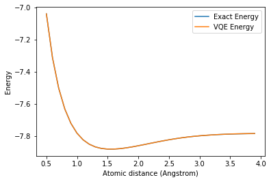

Simulating Molecules using VQE
==============================

In this tutorial, we introduce the Variational Quantum Eigensolver
(VQE), motivate its use, explain the necessary theory, and demonstrate
its implementation in finding the ground state energy of molecules.

Contents
--------

.. contents:: Quick links throoughout the document:

   1. `Mathematical Background <#backgroundmath>`__
   2. `Bounding the Ground State <#groundstate>`__

3. `The Variational Quantum Eigensolver <#vqe>`__

   1. `Variational Forms <#varforms>`__
   2. `Simple Variational Forms <#simplevarform>`__
   3. `Parameter Optimization <#optimization>`__
   4. `Example with a Single Qubit Variational Form <#example>`__
   5. `Structure of Common Variational Forms <#commonvarforms>`__

4. `VQE Implementation in Qiskit <#implementation>`__

   1. `Running VQE on a Statevector
      Simulator <#implementationstatevec>`__
   2. `Running VQE on a Noisy Simulator <#implementationnoisy>`__

5. `Problems <#problems>`__
6. `References <#references>`__

Introduction
------------

In many applications it is important to find the minimum eigenvalue of a
matrix. For example, in chemistry, the minimum eigenvalue of a Hermitian
matrix characterizing the molecule is the ground state energy of that
system. In the future, the quantum phase estimation algorithm may be
used to find the minimum eigenvalue. However, its implementation on
useful problems requires circuit depths exceeding the limits of hardware
available in the NISQ era. Thus, in 2014, Peruzzo *et al.* proposed VQE
to estimate the ground state energy of a molecule using much shallower
circuits [1].

Formally stated, given a Hermitian matrix :math:`H` with an unknown
minimum eigenvalue :math:`\lambda_{min}`, associated with the eigenstate
:math:`|\psi_{min}\rangle`, VQE provides an estimate
:math:`\lambda_{\theta}` bounding :math:`\lambda_{min}`:

:raw-latex:`\begin{align*}
    \lambda_{min} \le \lambda_{\theta} \equiv \langle \psi(\theta) |H|\psi(\theta) \rangle
\end{align*}`

where :math:`|\psi(\theta)\rangle` is the eigenstate associated with
:math:`\lambda_{\theta}`. By applying a parameterized circuit,
represented by :math:`U(\theta)`, to some arbitrary starting state
:math:`|\psi\rangle`, the algorithm obtains an estimate
:math:`U(\theta)|\psi\rangle \equiv |\psi(\theta)\rangle` on
:math:`|\psi_{min}\rangle`. The estimate is iteratively optimized by a
classical controller changing the parameter :math:`\theta` minimizing
the expectation value of
:math:`\langle \psi(\theta) |H|\psi(\theta) \rangle`.

The Variational Method of Quantum Mechanics
-------------------------------------------

Mathematical Background
~~~~~~~~~~~~~~~~~~~~~~~

VQE is an application of the variational method of quantum mechanics. To
better understand the variational method, some preliminary mathematical
background is provided. An eigenvector, :math:`|\psi_i\rangle`, of a
matrix :math:`A` is invariant under transformation by :math:`A` up to a
scalar multiplicative constant (the eigenvalue :math:`\lambda_i`). That
is,

:raw-latex:`\begin{align*}
    A |\psi_i\rangle = \lambda_i |\psi_i\rangle
\end{align*}`

Furthermore, a matrix :math:`H` is Hermitian when it is equal to its own
conjugate transpose.

:raw-latex:`\begin{align*}
    H = H^{\dagger}
\end{align*}`

The spectral theorem states that the eigenvalues of a Hermitian matrix
must be real. Thus, any eigenvalue of :math:`H` has the property that
:math:`\lambda_i = \lambda_i^*`. As any measurable quantity must be
real, Hermitian matrices are suitable for describing the Hamiltonians of
quantum systems. Moreover, :math:`H` may be expressed as

:raw-latex:`\begin{align*}
    H = \sum_{i = 1}^{N} \lambda_i |\psi_i\rangle \langle \psi_i |
\end{align*}`

where each :math:`\lambda_i` is the eigenvalue corresponding to the
eigenvector :math:`|\psi_i\rangle`. Furthermore, the expectation value
of the observable :math:`H` on an arbitrary quantum state
:math:`|\psi\rangle` is given by

:raw-latex:`\begin{align}
    \langle H \rangle_{\psi} &\equiv \langle \psi | H | \psi \rangle
\end{align}`

Substituting :math:`H` with its representation as a weighted sum of its
eigenvectors,

:raw-latex:`\begin{align}
    \langle H \rangle_{\psi} = \langle \psi | H | \psi \rangle &= \langle \psi | \left(\sum_{i = 1}^{N} \lambda_i |\psi_i\rangle \langle \psi_i |\right) |\psi\rangle\\
    &= \sum_{i = 1}^{N} \lambda_i \langle \psi | \psi_i\rangle \langle \psi_i | \psi\rangle \\
    &= \sum_{i = 1}^{N} \lambda_i | \langle \psi_i | \psi\rangle |^2
\end{align}`

The last equation demonstrates that the expectation value of an
observable on any state can be expressed as a linear combination using
the eigenvalues associated with :math:`H` as the weights. Moreover, each
of the weights in the linear combination is greater than or equal to 0,
as :math:`| \langle \psi_i | \psi\rangle |^2 \ge 0` and so it is clear
that

:raw-latex:`\begin{align}
    \lambda_{min} \le \langle H \rangle_{\psi} = \langle \psi | H | \psi \rangle = \sum_{i = 1}^{N} \lambda_i | \langle \psi_i | \psi\rangle |^2
\end{align}`

The above equation is known as the **variational method** (in some texts
it is also known as the variational principle) [2]. It is important to
note that this implies that the expectation value of any wave function
will always be at least the minimum eigenvalue associated with
:math:`H`. Moreover, the expectation value of state
:math:`|\psi_{min}\rangle` is given by
:math:`\langle \psi_{min}|H|\psi_{min}\rangle = \langle \psi_{min}|\lambda_{min}|\psi_{min}\rangle = \lambda_{min}`.
Thus, as expected, :math:`\langle H \rangle_{\psi_{min}}=\lambda_{min}`.

Bounding the Ground State
~~~~~~~~~~~~~~~~~~~~~~~~~

When the Hamiltonian of a system is described by the Hermitian matrix
:math:`H` the ground state energy of that system, :math:`E_{gs}`, is the
smallest eigenvalue associated with :math:`H`. By arbitrarily selecting
a wave function :math:`|\psi \rangle` (called an *ansatz*) as an initial
guess approximating :math:`|\psi_{min}\rangle`, calculating its
expectation value, :math:`\langle H \rangle_{\psi}`, and iteratively
updating the wave function, arbitrarily tight bounds on the ground state
energy of a Hamiltonian may be obtained.

The Variational Quantum Eigensolver
-----------------------------------

Variational Forms
~~~~~~~~~~~~~~~~~

A systematic approach to varying the ansatz is required to implement the
variational method on a quantum computer. VQE does so through the use of
a parameterized circuit with a fixed form. Such a circuit is often
called a *variational form*, and its action may be represented by the
linear transformation :math:`U(\theta)`. A variational form is applied
to a starting state :math:`|\psi\rangle` (such as the vacuum state
:math:`|0\rangle`, or the Hartree Fock state) and generates an output
state :math:`U(\theta)|\psi\rangle\equiv |\psi(\theta)\rangle`.
Iterative optimization over :math:`|\psi(\theta)\rangle` aims to yield
an expectation value
:math:`\langle \psi(\theta)|H|\psi(\theta)\rangle \approx E_{gs} \equiv \lambda_{min}`.
Ideally, :math:`|\psi(\theta)\rangle` will be close to
:math:`|\psi_{min}\rangle` (where ‘closeness’ is characterized by either
state fidelity, or Manhattan distance) although in practice, useful
bounds on :math:`E_{gs}` can be obtained even if this is not the case.

Moreover, a fixed variational form with a polynomial number of
parameters can only generate transformations to a polynomially sized
subspace of all the states in an exponentially sized Hilbert space.
Consequently, various variational forms exist. Some, such as Ry and RyRz
are heuristically designed, without consideration of the target domain.
Others, such as UCCSD, utilize domain specific knowledge to generate
close approximations based on the problem’s structure. The structure of
common variational forms is discussed in greater depth later in this
document.

Simple Variational Forms
~~~~~~~~~~~~~~~~~~~~~~~~

When constructing a variational form we must balance two opposing goals.
Ideally, our :math:`n` qubit variational form would be able to generate
any possible state :math:`|\psi\rangle` where
:math:`|\psi\rangle \in \mathbb{C}^N` and :math:`N=2^n`. However, we
would like the variational form to use as few parameters as possible.
Here, we aim to give intuition for the construction of variational forms
satisfying our first goal, while disregarding the second goal for the
sake of simplicity.

Consider the case where :math:`n=1`. The U3 gate takes three parameters,
:math:`\theta, \phi` and :math:`\lambda`, and represents the following
transformation:

:raw-latex:`\begin{align}
    U3(\theta, \phi, \lambda) = \begin{pmatrix}\cos(\frac{\theta}{2}) & -e^{i\lambda}\sin(\frac{\theta}{2}) \\ e^{i\phi}\sin(\frac{\theta}{2}) & e^{i\lambda + i\phi}\cos(\frac{\theta}{2}) \end{pmatrix}
\end{align}`

Up to a global phase, any possible single qubit transformation may be
implemented by appropriately setting these parameters. Consequently, for
the single qubit case, a variational form capable of generating any
possible state is given by the circuit:

.. figure:: images/U3_var_form.png
   :alt: u3_var_form

Moreover, this universal ‘variational form’ only has 3 parameters and
thus can be efficiently optimized. It is worth emphasising that the
ability to generate an arbitrary state ensures that during the
optimization process, the variational form does not limit the set of
attainable states over which the expectation value of :math:`H` can be
taken. Ideally, this ensures that the minimum expectation value is
limited only by the capabilities of the classical optimizer.

A less trivial universal variational form may be derived for the 2 qubit
case, where two body interactions, and thus entanglement, must be
considered to achieve universality. Based on the work presented by
*Shende et al.* [3] the following is an example of a universal
parameterized 2 qubit circuit:

.. figure:: images/two_qubit_var_form.png
   :alt: 2qubit_var_form

Allow the transformation performed by the above circuit to be
represented by :math:`U(\theta)`. When optimized variationally, the
expectation value of :math:`H` is minimized when
:math:`U(\theta)|\psi\rangle \equiv |\psi(\theta)\rangle \approx |\psi_{min}\rangle`.
By formulation, :math:`U(\theta)` may produce a transformation to any
possible state, and so this variational form may obtain an arbitrarily
tight bound on two qubit ground state energies, only limited by the
capabilities of the classical optimizer.

Parameter Optimization
~~~~~~~~~~~~~~~~~~~~~~

Once an efficiently parameterized variational form has been selected, in
accordance with the variational method, its parameters must be optimized
to minimize the expectation value of the target Hamiltonian. The
parameter optimization process has various challenges. For example,
quantum hardware has various types of noise and so objective function
evaluation (energy calculation) may not necessarily reflect the true
objective function. Additionally, some optimizers perform a number of
objective function evaluations dependent on cardinality of the parameter
set. An appropriate optimizer should be selected by considering the
requirements of a application.

A popular optimization strategy is gradient decent where each parameter
is updated in the direction yielding the largest local change in energy.
Consequently, the number of evaluations performed depends on the number
of optimization parameters present. This allows the algorithm to quickly
find a local optimum in the search space. However, this optimization
strategy often gets stuck at poor local optima, and is relatively
expensive in terms of the number of circuit evaluations performed. While
an intuitive optimization strategy, it is not recommended for use in
VQE.

An appropriate optimizer for optimizing a noisy objective function is
the *Simultaneous Perturbation Stochastic Approximation* optimizer
(SPSA). SPSA approximates the gradient of the objective function with
only two measurements. It does so by concurrently perturbing all of the
parameters in a random fashion, in contrast to gradient decent where
each parameter is perturbed independently. When utilizing VQE in either
a noisy simulator or on real hardware, SPSA is a recommended as the
classical optimizer.

When noise is not present in the cost function evaluation (such as when
using VQE with a statevector simulator), a wide variety of classical
optimizers may be useful. Two such optimizers supported by Qiskit Aqua
are the *Sequential Least Squares Programming* optimizer (SLSQP) and the
*Constrained Optimization by Linear Approximation* optimizer (COBYLA).
It is worth noting that COBYLA only performs one objective function
evaluation per optimization iteration (and thus the number of
evaluations is independent of the parameter set’s cardinality).
Therefore, if the objective function is noise-free and minimizing the
number of performed evaluations is desirable, it is recommended to try
COBYLA.

Example with a Single Qubit Variational Form
~~~~~~~~~~~~~~~~~~~~~~~~~~~~~~~~~~~~~~~~~~~~

We will now use the simple single qubit variational form to solve a
problem similar to ground state energy estimation. Specifically, we are
given a random probability vector :math:`\vec{x}` and wish to determine
a possible parameterization for our single qubit variational form such
that it outputs a probability distribution that is close to
:math:`\vec{x}` (where closeness is defined in terms of the Manhattan
distance between the two probability vectors).

We first create the random probability vector in python:

.. code:: ipython3

    import numpy as np
    np.random.seed(999999)
    target_distr = np.random.rand(2)
    # We now convert the random vector into a valid probability vector
    target_distr /= sum(target_distr)

We subsequently create a function that takes the parameters of our
single U3 variational form as arguments and returns the corresponding
quantum circuit:

.. code:: ipython3

    from qiskit import QuantumCircuit, ClassicalRegister, QuantumRegister
    def get_var_form(params):
        qr = QuantumRegister(1, name="q")
        cr = ClassicalRegister(1, name='c')
        qc = QuantumCircuit(qr, cr)
        qc.u3(params[0], params[1], params[2], qr[0])
        qc.measure(qr, cr[0])
        return qc

Now we specify the objective function which takes as input a list of the
variational form’s parameters, and returns the cost associated with
those parameters:

.. code:: ipython3

    from qiskit import Aer, execute
    backend = Aer.get_backend("qasm_simulator")
    NUM_SHOTS = 10000
    
    def get_probability_distribution(counts):
        output_distr = [v / NUM_SHOTS for v in counts.values()]
        if len(output_distr) == 1:
            output_distr.append(0)
        return output_distr
    
    def objective_function(params):
        # Obtain a quantum circuit instance from the paramters
        qc = get_var_form(params)
        # Execute the quantum circuit to obtain the probability distribution associated with the current parameters
        result = execute(qc, backend, shots=NUM_SHOTS).result()
        # Obtain the counts for each measured state, and convert those counts into a probability vector
        output_distr = get_probability_distribution(result.get_counts(qc))
        # Calculate the cost as the distance between the output distribution and the target distribution
        cost = sum([np.abs(output_distr[i] - target_distr[i]) for i in range(2)])
        return cost

Finally, we create an instance of the COBYLA optimizer, and run the
algorithm. Note that the output varies from run to run. Moreover, while
close, the obtained distribution might not be exactly the same as the
target distribution, however, increasing the number of shots taken will
increase the accuracy of the output.

.. code:: ipython3

    from qiskit.aqua.components.optimizers import COBYLA
    
    # Initialize the COBYLA optimizer
    optimizer = COBYLA(maxiter=500, tol=0.0001)
    
    # Create the initial parameters (noting that our single qubit variational form has 3 parameters)
    params = np.random.rand(3)
    ret = optimizer.optimize(num_vars=3, objective_function=objective_function, initial_point=params)
    
    # Obtain the output distribution using the final parameters
    qc = get_var_form(ret[0])
    counts = execute(qc, backend, shots=NUM_SHOTS).result().get_counts(qc)
    output_distr = get_probability_distribution(counts)
    
    print("Target Distribution:", target_distr)
    print("Obtained Distribution:", output_distr)
    print("Output Error (Manhattan Distance):", ret[1])
    print("Parameters Found:", ret[0])

.. parsed-literal::

    Target Distribution: [0.51357006 0.48642994]
    Obtained Distribution: [0.5206, 0.4794]
    Output Error (Manhattan Distance): 0.008659881261160907
    Parameters Found: [1.54305723 0.1226433  0.48569819]

Structure of Common Variational Forms
~~~~~~~~~~~~~~~~~~~~~~~~~~~~~~~~~~~~~

As already discussed, it is not possible for a polynomially
parameterized variational form to generate a transformation to any
state. Variational forms can be grouped into two categories, depending
on how they deal with this limitation. The first category of variational
forms use domain or application specific knowledge to limit the set of
possible output states. The second approach uses a heuristic circuit
without prior domain or application specific knowledge.

The first category of variational forms exploit characteristics of the
problem domain to restrict the set of transformations that may be
required. For example, when calculating the ground state energy of a
molecule, the number of particles in the system is known *a priori*.
Therefore, if a starting state with the correct number of particles is
used, by limiting the variational form to only producing particle
preserving transformations, the number of parameters required to span
the new transformation subspace can be greatly reduced. Indeed, by
utilizing similar information from Coupled-Cluster theory, the
variational form UCCSD can obtain very accurate results for molecular
ground state energy estimation when starting from the Hartree Fock
state. Another example illustrating the exploitation of domain-specific
knowledge follows from considering the set of circuits realizable on
real quantum hardware. Extant quantum computers, such as those based on
super conducting qubits, have limited qubit connectivity. That is, it is
not possible to implement 2-qubit gates on arbitrary qubit pairs
(without inserting swap gates). Thus, variational forms have been
constructed for specific quantum computer architectures where the
circuits are specifically tuned to maximally exploit the natively
available connectivity and gates of a given quantum device. Such a
variational form was used in 2017 to successfully implement VQE for the
estimation of the ground state energies of molecules as large as
BeH\ :math:`_2` on an IBM quantum computer [4].

In the second approach, gates are layered such that good approximations
on a wide range of states may be obtained. Qiskit Aqua supports three
such variational forms: RyRz, Ry and SwapRz (we will only discuss the
first two). All of these variational forms accept multiple
user-specified configurations. Three essential configurations are the
number of qubits in the system, the depth setting, and the entanglement
setting. A single layer of a variational form specifies a certain
pattern of single qubit rotations and CX gates. The depth setting says
how many times the variational form should repeat this pattern. By
increasing the depth setting, at the cost of increasing the number of
parameters that must be optimized, the set of states the variational
form can generate increases. Finally, the entanglement setting selects
the configuration, and implicitly the number, of CX gates. For example,
when the entanglement setting is linear, CX gates are applied to
adjacent qubit pairs in order (and thus :math:`n-1` CX gates are added
per layer). When the entanglement setting is full, a CX gate is applied
to each qubit pair in each layer. The circuits for RyRz corresponding to
``entanglement="full"`` and ``entanglement="linear"`` can be seen by
executing the following code snippet:

.. code:: ipython3

    from qiskit.aqua.components.variational_forms import RYRZ
    entanglements = ["linear", "full"]
    for entanglement in entanglements:
        form = RYRZ(num_qubits=4, depth=1, entanglement=entanglement)
        if entanglement == "linear":
            print("=============Linear Entanglement:=============")
        else:
            print("=============Full Entanglement:=============")
        # We initialize all parameters to 0 for this demonstration
        print(form.construct_circuit([0] * form.num_parameters).draw(fold=100))
        print()

.. parsed-literal::

    =============Linear Entanglement:=============
            ┌───────────┐┌───────┐ ░                                                                 ░ »
    q_0: |0>┤ U3(0,0,0) ├┤ U1(0) ├─░───────────────■─────────────────────────────────────────────────░─»
            ├───────────┤├───────┤ ░ ┌──────────┐┌─┴─┐┌──────────┐                                   ░ »
    q_1: |0>┤ U3(0,0,0) ├┤ U1(0) ├─░─┤ U2(0,pi) ├┤ X ├┤ U2(0,pi) ├──■────────────────────────────────░─»
            ├───────────┤├───────┤ ░ ├──────────┤└───┘└──────────┘┌─┴─┐┌──────────┐                  ░ »
    q_2: |0>┤ U3(0,0,0) ├┤ U1(0) ├─░─┤ U2(0,pi) ├─────────────────┤ X ├┤ U2(0,pi) ├──■───────────────░─»
            ├───────────┤├───────┤ ░ ├──────────┤                 └───┘└──────────┘┌─┴─┐┌──────────┐ ░ »
    q_3: |0>┤ U3(0,0,0) ├┤ U1(0) ├─░─┤ U2(0,pi) ├──────────────────────────────────┤ X ├┤ U2(0,pi) ├─░─»
            └───────────┘└───────┘ ░ └──────────┘                                  └───┘└──────────┘ ░ »
    «     ┌───────────┐┌───────┐ ░ 
    «q_0: ┤ U3(0,0,0) ├┤ U1(0) ├─░─
    «     ├───────────┤├───────┤ ░ 
    «q_1: ┤ U3(0,0,0) ├┤ U1(0) ├─░─
    «     ├───────────┤├───────┤ ░ 
    «q_2: ┤ U3(0,0,0) ├┤ U1(0) ├─░─
    «     ├───────────┤├───────┤ ░ 
    «q_3: ┤ U3(0,0,0) ├┤ U1(0) ├─░─
    «     └───────────┘└───────┘ ░ 
    
    =============Full Entanglement:=============
            ┌───────────┐┌───────┐ ░                                                                »
    q_0: |0>┤ U3(0,0,0) ├┤ U1(0) ├─░───────────────■────────────────■────────────────■──────────────»
            ├───────────┤├───────┤ ░ ┌──────────┐┌─┴─┐┌──────────┐  │                │              »
    q_1: |0>┤ U3(0,0,0) ├┤ U1(0) ├─░─┤ U2(0,pi) ├┤ X ├┤ U2(0,pi) ├──┼────────────────┼──────────────»
            ├───────────┤├───────┤ ░ ├──────────┤└───┘└──────────┘┌─┴─┐┌──────────┐  │  ┌──────────┐»
    q_2: |0>┤ U3(0,0,0) ├┤ U1(0) ├─░─┤ U2(0,pi) ├─────────────────┤ X ├┤ U2(0,pi) ├──┼──┤ U2(0,pi) ├»
            ├───────────┤├───────┤ ░ ├──────────┤                 └───┘└──────────┘┌─┴─┐├──────────┤»
    q_3: |0>┤ U3(0,0,0) ├┤ U1(0) ├─░─┤ U2(0,pi) ├──────────────────────────────────┤ X ├┤ U2(0,pi) ├»
            └───────────┘└───────┘ ░ └──────────┘                                  └───┘└──────────┘»
    «                                                                            ░ ┌───────────┐»
    «q_0: ───────────────────────────────────────────────────────────────────────░─┤ U3(0,0,0) ├»
    «                                                                            ░ ├───────────┤»
    «q_1: ─────■────────────────────■────────────────────────────────────────────░─┤ U3(0,0,0) ├»
    «        ┌─┴─┐    ┌──────────┐  │                                            ░ ├───────────┤»
    «q_2: ───┤ X ├────┤ U2(0,pi) ├──┼────────────────────────────■───────────────░─┤ U3(0,0,0) ├»
    «     ┌──┴───┴───┐└──────────┘┌─┴─┐┌──────────┐┌──────────┐┌─┴─┐┌──────────┐ ░ ├───────────┤»
    «q_3: ┤ U2(0,pi) ├────────────┤ X ├┤ U2(0,pi) ├┤ U2(0,pi) ├┤ X ├┤ U2(0,pi) ├─░─┤ U3(0,0,0) ├»
    «     └──────────┘            └───┘└──────────┘└──────────┘└───┘└──────────┘ ░ └───────────┘»
    «     ┌───────┐ ░ 
    «q_0: ┤ U1(0) ├─░─
    «     ├───────┤ ░ 
    «q_1: ┤ U1(0) ├─░─
    «     ├───────┤ ░ 
    «q_2: ┤ U1(0) ├─░─
    «     ├───────┤ ░ 
    «q_3: ┤ U1(0) ├─░─
    «     └───────┘ ░ 
    

Assume the depth setting is set to :math:`d`. Then, RyRz has
:math:`n\times (d+1)\times 2` parameters, Ry with linear entanglement
has :math:`2n\times(d + \frac{1}{2})` parameters, and Ry with full
entanglement has :math:`d\times n\times \frac{(n + 1)}{2} + n`
parameters.

VQE Implementation in Qiskit
----------------------------

This section illustrates an implementation of VQE using the programmatic
approach. Qiskit Aqua also enables a declarative implementation,
however, it reveals less information about the underlying algorithm.
This code, specifically the preparation of qubit operators, is based on
the code found in the Qiskit Tutorials repository (and as of July 2019,
may be found at: https://github.com/Qiskit/qiskit-tutorials ).

The following libraries must first be imported.

.. code:: ipython3

    from qiskit.aqua.algorithms import VQE, ExactEigensolver
    import matplotlib.pyplot as plt
    %matplotlib inline
    import numpy as np
    from qiskit.chemistry.components.variational_forms import UCCSD
    from qiskit.chemistry.components.initial_states import HartreeFock
    from qiskit.aqua.components.variational_forms import RYRZ
    from qiskit.aqua.components.optimizers import COBYLA, SPSA, SLSQP
    from qiskit.aqua.operators import Z2Symmetries
    from qiskit import IBMQ, BasicAer, Aer
    from qiskit.chemistry.drivers import PySCFDriver, UnitsType
    from qiskit.chemistry import FermionicOperator
    from qiskit import IBMQ
    from qiskit.providers.aer import noise
    from qiskit.aqua import QuantumInstance
    from qiskit.ignis.mitigation.measurement import CompleteMeasFitter

Running VQE on a Statevector Simulator
~~~~~~~~~~~~~~~~~~~~~~~~~~~~~~~~~~~~~~

We demonstrate the calculation of the ground state energy for LiH at
various interatomic distances. A driver for the molecule must be created
at each such distance. Note that in this experiment, to reduce the
number of qubits used, we freeze the core and remove two unoccupied
orbitals. First, we define a function that takes an interatomic distance
and returns the appropriate qubit operator, :math:`H`, as well as some
other information about the operator.

.. code:: ipython3

    def get_qubit_op(dist):
        driver = PySCFDriver(atom="Li .0 .0 .0; H .0 .0 " + str(dist), unit=UnitsType.ANGSTROM, 
                             charge=0, spin=0, basis='sto3g')
        molecule = driver.run()
        freeze_list = [0]
        remove_list = [-3, -2]
        repulsion_energy = molecule.nuclear_repulsion_energy
        num_particles = molecule.num_alpha + molecule.num_beta
        num_spin_orbitals = molecule.num_orbitals * 2
        remove_list = [x % molecule.num_orbitals for x in remove_list]
        freeze_list = [x % molecule.num_orbitals for x in freeze_list]
        remove_list = [x - len(freeze_list) for x in remove_list]
        remove_list += [x + molecule.num_orbitals - len(freeze_list)  for x in remove_list]
        freeze_list += [x + molecule.num_orbitals for x in freeze_list]
        ferOp = FermionicOperator(h1=molecule.one_body_integrals, h2=molecule.two_body_integrals)
        ferOp, energy_shift = ferOp.fermion_mode_freezing(freeze_list)
        num_spin_orbitals -= len(freeze_list)
        num_particles -= len(freeze_list)
        ferOp = ferOp.fermion_mode_elimination(remove_list)
        num_spin_orbitals -= len(remove_list)
        qubitOp = ferOp.mapping(map_type='parity', threshold=0.00000001)
        qubitOp = Z2Symmetries.two_qubit_reduction(qubitOp, num_particles)
        shift = energy_shift + repulsion_energy
        return qubitOp, num_particles, num_spin_orbitals, shift

First, the exact ground state energy is calculated using the qubit
operator and a classical exact eigensolver. Subsequently, the initial
state :math:`|\psi\rangle` is created, which the VQE instance uses to
produce the final ansatz :math:`\min_{\theta}(|\psi(\theta)\rangle)`.
The exact result and the VQE result at each interatomic distance is
stored. Observe that the result given by
``vqe.run(backend)['energy'] + shift`` is equivalent the quantity
:math:`\min_{\theta}\left(\langle \psi(\theta)|H|\psi(\theta)\rangle\right)`,
where the minimum is not necessarily the global minimum.

When initializing the VQE instance with
``VQE(qubitOp, var_form, optimizer, 'matrix')`` the expectation value of
:math:`H` on :math:`|\psi(\theta)\rangle` is directly calculated through
matrix multiplication. However, when using an actual quantum device, or
a true simulator such as the ``qasm_simulator`` with
``VQE(qubitOp, var_form, optimizer, 'paulis')`` the calculation of the
expectation value is more complicated. A Hamiltonian may be represented
as a sum of a Pauli strings, with each Pauli term acting on a qubit as
specified by the mapping being used. Each Pauli string has a
corresponding circuit appended to the circuit corresponding to
:math:`|\psi(\theta)\rangle`. Subsequently, each of these circuits is
executed, and all of the results are used to determine the expectation
value of :math:`H` on :math:`|\psi(\theta)\rangle`. In the following
example, we initialize the VQE instance with ``matrix`` mode, and so the
expectation value is directly calculated through matrix multiplication.

Note that the following code snippet may take a few minutes to run to
completion.

.. code:: ipython3

    backend = BasicAer.get_backend("statevector_simulator")
    distances = np.arange(0.5, 4.0, 0.1)
    exact_energies = []
    vqe_energies = []
    optimizer = SLSQP(maxiter=5)
    for dist in distances:
        qubitOp, num_particles, num_spin_orbitals, shift = get_qubit_op(dist)
        result = ExactEigensolver(qubitOp).run()
        exact_energies.append(result['energy'] + shift)
        initial_state = HartreeFock(
            qubitOp.num_qubits,
            num_spin_orbitals,
            num_particles,
            'parity'
        ) 
        var_form = UCCSD(
            qubitOp.num_qubits,
            depth=1,
            num_orbitals=num_spin_orbitals,
            num_particles=num_particles,
            initial_state=initial_state,
            qubit_mapping='parity'
        )
        vqe = VQE(qubitOp, var_form, optimizer)
        results = vqe.run(backend)['energy'] + shift
        vqe_energies.append(results)
        print("Interatomic Distance:", np.round(dist, 2), "VQE Result:", results, "Exact Energy:", exact_energies[-1])
        
    print("All energies have been calculated")

.. parsed-literal::

    Interatomic Distance: 0.5 VQE Result: -7.039710215565218 Exact Energy: -7.0397325216352
    Interatomic Distance: 0.6 VQE Result: -7.31334430290689 Exact Energy: -7.313345828761003
    Interatomic Distance: 0.7 VQE Result: -7.500921095751998 Exact Energy: -7.500922090905937
    Interatomic Distance: 0.8 VQE Result: -7.630976914888905 Exact Energy: -7.630978249333209
    Interatomic Distance: 0.9 VQE Result: -7.7208107948706335 Exact Energy: -7.720812412134779
    Interatomic Distance: 1.0 VQE Result: -7.782240655507769 Exact Energy: -7.782242402637009
    Interatomic Distance: 1.1 VQE Result: -7.823597493067004 Exact Energy: -7.823599276362815
    Interatomic Distance: 1.2 VQE Result: -7.850696622555617 Exact Energy: -7.8506983775960215
    Interatomic Distance: 1.3 VQE Result: -7.867561602360669 Exact Energy: -7.867563290110055
    Interatomic Distance: 1.4 VQE Result: -7.876999876625421 Exact Energy: -7.877001491818371
    Interatomic Distance: 1.5 VQE Result: -7.881014173736876 Exact Energy: -7.881015715646997
    Interatomic Distance: 1.6 VQE Result: -7.881070663268204 Exact Energy: -7.8810720440309145
    Interatomic Distance: 1.7 VQE Result: -7.878267161938819 Exact Energy: -7.878268167584997
    Interatomic Distance: 1.8 VQE Result: -7.873440112088826 Exact Energy: -7.873440293132828
    Interatomic Distance: 1.9 VQE Result: -7.8672336666975875 Exact Energy: -7.867233964816027
    Interatomic Distance: 2.0 VQE Result: -7.860152328052092 Exact Energy: -7.8601532073787785
    Interatomic Distance: 2.1 VQE Result: -7.852595105573739 Exact Energy: -7.852595827876739
    Interatomic Distance: 2.2 VQE Result: -7.844878726257743 Exact Energy: -7.844879093009718
    Interatomic Distance: 2.3 VQE Result: -7.837257439559378 Exact Energy: -7.837257967615506
    Interatomic Distance: 2.4 VQE Result: -7.829935044964875 Exact Energy: -7.829937002623397
    Interatomic Distance: 2.5 VQE Result: -7.823070191793284 Exact Energy: -7.823076642134093
    Interatomic Distance: 2.6 VQE Result: -7.8167825917026885 Exact Energy: -7.8167951504729345
    Interatomic Distance: 2.7 VQE Result: -7.811153437700115 Exact Energy: -7.811168284803364
    Interatomic Distance: 2.8 VQE Result: -7.806218298530634 Exact Energy: -7.8062295600898475
    Interatomic Distance: 2.9 VQE Result: -7.801962397110541 Exact Energy: -7.80197360233255
    Interatomic Distance: 3.0 VQE Result: -7.798352411524604 Exact Energy: -7.7983634309151295
    Interatomic Distance: 3.1 VQE Result: -7.7953268158537385 Exact Energy: -7.795340451637538
    Interatomic Distance: 3.2 VQE Result: -7.792800697723607 Exact Energy: -7.7928348067386075
    Interatomic Distance: 3.3 VQE Result: -7.790603800220275 Exact Energy: -7.790774009971013
    Interatomic Distance: 3.4 VQE Result: -7.788715355351082 Exact Energy: -7.789088897991485
    Interatomic Distance: 3.5 VQE Result: -7.787215777163667 Exact Energy: -7.787716973466142
    Interatomic Distance: 3.6 VQE Result: -7.786080385670116 Exact Energy: -7.786603763673839
    Interatomic Distance: 3.7 VQE Result: -7.785203496927196 Exact Energy: -7.785702912499905
    Interatomic Distance: 3.8 VQE Result: -7.78447953997175 Exact Energy: -7.784975591698672
    Interatomic Distance: 3.9 VQE Result: -7.783853365855263 Exact Energy: -7.784389611675315
    All energies have been calculated

.. code:: ipython3

    plt.plot(distances, exact_energies, label="Exact Energy")
    plt.plot(distances, vqe_energies, label="VQE Energy")
    plt.xlabel('Atomic distance (Angstrom)')
    plt.ylabel('Energy')
    plt.legend()
    plt.show()

Note that the VQE results are very close to the exact results, and so
the exact energy curve is hidden by the VQE curve.

Running VQE on a Noisy Simulator
~~~~~~~~~~~~~~~~~~~~~~~~~~~~~~~~

Here, we calculate the ground state energy for H\ :math:`_2` using a
noisy simulator and error mitigation.

First, we prepare the qubit operator representing the molecule’s
Hamiltonian:

.. code:: ipython3

    driver = PySCFDriver(atom='H .0 .0 -0.3625; H .0 .0 0.3625', unit=UnitsType.ANGSTROM, charge=0, spin=0, basis='sto3g')
    molecule = driver.run()
    num_particles = molecule.num_alpha + molecule.num_beta
    qubitOp = FermionicOperator(h1=molecule.one_body_integrals, h2=molecule.two_body_integrals).mapping(map_type='parity')
    qubitOp = Z2Symmetries.two_qubit_reduction(qubitOp, num_particles)

Now, we load a device coupling map and noise model from the IBMQ
provider and create a quantum instance, enabling error mitigation:

.. code:: ipython3

    IBMQ.load_account()
    provider = IBMQ.get_provider(hub='ibm-q')
    backend = Aer.get_backend("qasm_simulator")
    device = provider.get_backend("ibmqx2")
    coupling_map = device.configuration().coupling_map
    noise_model = noise.device.basic_device_noise_model(device.properties())
    quantum_instance = QuantumInstance(backend=backend, shots=1000, 
                                       noise_model=noise_model, 
                                       coupling_map=coupling_map,
                                       measurement_error_mitigation_cls=CompleteMeasFitter,
                                       cals_matrix_refresh_period=30,)

Finally, we must configure the optimizer, the variational form, and the
VQE instance. As the effects of noise increase as the number of two
qubit gates circuit depth increase, we use a heuristic variational form
(RYRZ) rather than UCCSD as RYRZ has a much shallower circuit than UCCSD
and uses substantially fewer two qubit gates.

The following code may take a few minutes to run to completion.

.. code:: ipython3

    exact_solution = ExactEigensolver(qubitOp).run()
    print("Exact Result:", exact_solution['energy'])
    optimizer = SPSA(max_trials=100)
    var_form = RYRZ(qubitOp.num_qubits, depth=1, entanglement="linear")
    vqe = VQE(qubitOp, var_form, optimizer=optimizer)
    ret = vqe.run(quantum_instance)
    print("VQE Result:", ret['energy'])

.. parsed-literal::

    Exact Result: -1.8671209783412681
    VQE Result: -1.8429114965754119

When noise mitigation is enabled, even though the result does not fall
within chemical accuracy (defined as being within 0.0016 Hartree of the
exact result), it is fairly close to the exact solution.

Problems
--------

1. You are given a Hamiltonian :math:`H` with the promise that its
   ground state is close to a maximally entangled :math:`n` qubit state.
   Explain which variational form (or forms) is likely to efficiently
   and accurately learn the the ground state energy of :math:`H`. You
   may also answer by creating your own variational form, and explaining
   why it is appropriate for use with this Hamiltonian.
2. Calculate the number of circuit evaluations performed per
   optimization iteration, when using the COBYLA optimizer, the
   ``qasm_simulator`` with 1000 shots, and a Hamiltonian with 60 Pauli
   strings.
3. Use VQE to estimate the ground state energy of BeH\ :math:`_2` with
   an interatomic distance of :math:`1.3`\ Å. You may re-use the
   function ``get_qubit_op(dist)`` by replacing
   ``atom="Li .0 .0 .0; H .0 .0 " + str(dist)`` with
   ``atom="Be .0 .0 .0; H .0 .0 -" + str(dist) + "; H .0 .0 " + str(dist)``
   and invoking the function with ``get_qubit_op(1.3)``. Note that
   removing the unoccupied orbitals does not preserve chemical precision
   for this molecule. However, to get the number of qubits required down
   to 6 (and thereby allowing efficient simulation on most laptops), the
   loss of precision is acceptable. While beyond the scope of this
   exercise, the interested reader may use qubit tapering operations to
   reduce the number of required qubits to 7, without losing any
   chemical precision.

References
----------

1. Peruzzo, Alberto, et al. “A variational eigenvalue solver on a
   photonic quantum processor.” *Nature communications* 5 (2014): 4213.
2. Griffiths, David J., and Darrell F. Schroeter. Introduction to
   quantum mechanics. *Cambridge University Press*, 2018.
3. Shende, Vivek V., Igor L. Markov, and Stephen S. Bullock. “Minimal
   universal two-qubit cnot-based circuits.” arXiv preprint
   quant-ph/0308033 (2003).
4. Kandala, Abhinav, et al. “Hardware-efficient variational quantum
   eigensolver for small molecules and quantum magnets.” Nature 549.7671
   (2017): 242.
