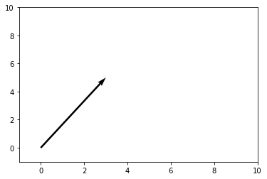
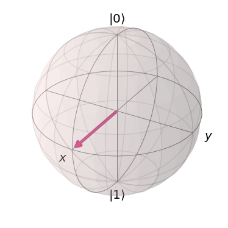
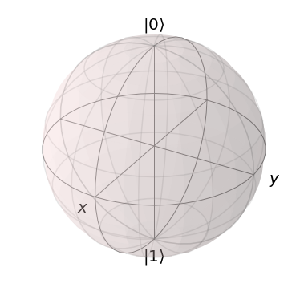

.. raw:: html

   <h1>

An Introduction to Linear Algebra for Quantum Computing

.. raw:: html

   </h1>

.. code:: ipython3

    from matplotlib import pyplot as plt
    import numpy as np
    from qiskit import *
    from qiskit.visualization import plot_bloch_vector

**Introduction**

Linear algebra is the language of quantum computing. For this reason, it
is crucial to develop a good understanding of the basic mathematical
concepts that are built upon in order to arrive at many of the amazing
and interesting constructions seen in quantum computation! The goal of
this section of the textbook is to start at the absolute basics of
linear algebra: vectors and vector spaces, and build a foundation that
the reader can then leverage in their study of quantum computing.

**Vectors and Vector Spaces**

We will start our investigation into introductory linear algebra by
first discussing one of the most important mathematical quantities in
quantum computation, the vector!

Formally, a **vector** :math:`|v\rangle` is defined as elements of a set
known as a vector space. A more intuitive and geometric definition is
that a vector “is a mathematical quantity with both direction and
magnitude”. For instance, consider a vector with :math:`x` and :math:`y`
components of the form :math:`\begin{pmatrix} 3 \\\\ 5 \end{pmatrix}`.
This vector can be visualized as an arrow pointing in the direction of
:math:`3` unit down the :math:`x` axis and :math:`5` units up the
:math:`y` axis:

.. code:: ipython3

    plt.figure()
    ax = plt.gca()
    ax.quiver([3], [5], angles='xy', scale_units='xy', scale=1)
    ax.set_xlim([-1, 10])
    ax.set_ylim([-1, 10])
    plt.draw()
    plt.show()

Note that “tail” of the vector doesn’t have to be positioned at the
origin, all that matters is that it is pointing in the correct
direction.

Now, let’s talk about a concrete example of vectors in quantum
computing. Oftentimes, in quantum computing, we deal with **state
vectors**, which are simply vectors, no different than the one just
presented. They point to a specific point in space that corresponds to a
particular quantum state. Oftentimes, this is visualized using a Bloch
sphere. For instance, a vector, representing the state of a quantum
system could look something like this arrow, enclosed inside the Bloch
sphere, which is the so-called “state” space of all possible points to
which our state vectors can “point”:

.. code:: ipython3

    plot_bloch_vector([1, 0, 0])

Hopefully this helps to illuminate how vectors can be used to store
information about quantum states. This particular state corresponds to
an even superposition between :math:`|0\rangle` and :math:`|1\rangle`
(you can see that the arrow is halfway between :math:`|0\rangle` at the
top and :math:`|1\rangle` at the bottom of the sphere!). Our vectors are
allowed to rotate anywhere on the surface of the sphere, and each of
these points represents a different quantum state!

Now that we have talked about vectors a bit more intuitively, in the
context of quantum computing, we can go back to our more formal
definition of a vector, which is that a vector is an element of a vector
space. From this, it follows that we must define a vector space. A
**vector space** :math:`V` over a **field** F is a set of objects
(vectors), where two conditions hold. Firstly, **vector addition** of
two vectors :math:`|a\rangle, \ |b\rangle \ \in \ V` will yield a third
vector :math:`|a\rangle \ + \ |b\rangle \ = \ |c\rangle`, also contained
in :math:`V`. The second condition is that **scalar multiplication**
between some :math:`|a\rangle \ \in \ V` and some :math:`n \ \in \ F`,
denoted by :math:`n|a\rangle` is also contained within :math:`V`.

We will now clarify this previous definition by working through a basic
example. Let us demonstrate that the set :math:`\mathbb{R}^2` over the
field :math:`\mathbb{R}` is a vector space. We assert that

.. math::

   \begin{pmatrix} x_1 \\\\ y_1 \end{pmatrix} \ + \ \begin{pmatrix} x_2 \\\\ y_2 \end{pmatrix} \ = \ \begin{pmatrix} x_1 \ + \ x_2 \\\\ y_1 \ + \ y_2 \end{pmatrix}

is contained within :math:`\mathbb{R}^2`. This is evidently the case, as
the sum of two real numbers is a real number[1], making both components
of the newly-formed vector real numbers. In turn, the vector is
contained in :math:`\\mathbb{R}^2`. We also assert that:

.. math:: n |v\rangle \ = \ \begin{pmatrix} nx \\\\ ny \end{pmatrix} \ \in \ V \ \ \ \ \forall n \ \in \ \mathbb{R}

is contained within :math:`\\mathbb{R}^2`. The product of a real number
and a real number is in turn a real number, making the values of the new
vector real, and thus proving this statement.

**Matrices and Matrix Operations**

Now that we have introduced vectors, we can turn our attention to
another fundamental concept: a **matrix**. The best way to think of
matrices from a quantum computational/quantum mechanical perspective is
the fact that matrices are mathematical objects that transform vectors
to other vectors:

.. math:: |v\rangle \ \rightarrow \ |v'\rangle \ = \ M |v\rangle

Generally, matrices are written as “arrays” of numbers, looking
something like this:

.. math:: M \ = \ \begin{pmatrix} 1 & -2 & 3 \\\\ 1 & 5i & 0 \\\\ 1 \ + \ i & 7 & -4 \end{pmatrix}

We can actually “apply” a matrix to a vector by performing matrix
multiplication. In general, matrix multiplication between two matrices
involves taking the first row of the first matrix, and multiplying each
element by its “partner” in the first column of the second matrix (the
first number of the row is multiplied by the first number of the column,
second number of the row and second number of column, etc.) These new
numbers are then added up, and we have the first element of the first
row of the new matrix! To fill in the rest of the first row, we repeat
this process for the second, third, etc. columns of the second matrix.
Then we take the second row of the first matrix, and repeat the process
for each column of the second matrix, getting the second row. We perform
this process until we have used all rows of the first matrix. The
resulting matrix is our new matrix! That may have been confusing, so
here is an example:

.. math:: \begin{pmatrix} 2 & 0 \\\\ 5 & -1 \end{pmatrix} \begin{pmatrix} -3 & 1 \\\\ 2 & 1 \end{pmatrix} \ = \ \begin{pmatrix} (2)(-3) + (0)(2) & (2)(1) \ + \ (0)(1) \\\\ (5)(-3) + (-1)(2) & (5)(1) \ + \ (-1)(1) \end{pmatrix} \ = \ \begin{pmatrix} -6 & 2 \\\\ -17 & 4 \end{pmatrix}

As you can see, we simply used the previously outlined process to arrive
at the final matrix! Going back to “applying” matrices to vectors, all
we have to realize is that a vector is simply a matrix with :math:`1`
column, so matrix multiplication behaves the exact same way! As we
previously discussed, in quantum computing we have some quantum state
vector that we are manipulating in order to perform quantum computation.
Well, as you can probably guess, the way that we represent the
manipulation of that vector mathematically is through the application of
matrices. We manipulate qubits in our quantum computer by applying
sequences of **quantum gates**. As it turns out, we can express each of
these quantum gates as a different matrix that can be “applied” to a
state vector, thus changing the state. For instance, one of the most
commonly seen quantum gates is the Pauli-X gate, which is represented by
the follwing matrix:

.. math:: \sigma_x \ = \ \begin{pmatrix} 0 & 1 \\\\ 1 & 0 \end{pmatrix}

This gate acts kind of similarly to the classical NOT logic gate. It
maps the computational basis state :math:`|0\rangle` to
:math:`|1\rangle` and :math:`|1\rangle` to :math:`|0\rangle` (it “flips”
the state). As actual column vectors, we write the two basis states:

.. math:: |0\rangle \ = \ \begin{pmatrix} 1 \\\\ 0 \end{pmatrix} \ \ \ \ \ \ \ |1\rangle \ = \ \begin{pmatrix} 0 \\\\ 1 \end{pmatrix}

So when we apply this matrix to each of the vectors:

.. math:: \sigma_x |0\rangle \ = \ \begin{pmatrix} 0 & 1 \\\\ 1 & 0 \end{pmatrix} \begin{pmatrix} 1 \\\\ 0 \end{pmatrix} \ = \ \begin{pmatrix} (0)(1) \ + \ (1)(0) \\\\ (1)(1) \ + \ (0)(0) \end{pmatrix} \ = \ \begin{pmatrix} 0 \\\\ 1 \end{pmatrix} \ = \ |1\rangle

.. math:: \sigma_x |1\rangle \ = \ \begin{pmatrix} 0 & 1 \\\\ 1 & 0 \end{pmatrix} \begin{pmatrix} 0 \\\\ 1 \end{pmatrix} \ = \ \begin{pmatrix} (0)(0) \ + \ (1)(1) \\\\ (1)(0) \ + \ (0)(1) \end{pmatrix} \ = \ \begin{pmatrix} 1 \\\\ 0 \end{pmatrix} \ = \ |0\rangle

And so the matrix acts on the state vectors exactly as expected!

Within quantum computation, we often deal with two very important types
of matrices: **Hermitian** and **Unitary** matrices. The former is more
important in the study of quantum mechanics, but is still definitely
worth talking about in a study of quantum computation. The latter is of
unparalleled importance in both quantum mechanics and quantum
computation. If there is one concept that the reader should take away
from this entire linear algebra section, it should be the idea of a
unitary matrix.

Firstly, a Hermitian matrix is simply a matrix that is equal to its
**conjugate transpose** (denoted with a :math:`\dagger` symbol). This
essentially means taking a matrix, flipping the sign in its imaginary
components, and then reflecting the entries of the matrix across its
main diagonal (the diagonal that goes from the top left corner to the
bottom right corner). For instance, a matrix that we commonly use in
quantum computation, the Pauli-Y matrix is Hermitian:

.. math:: \sigma_y \ = \ \begin{pmatrix} 0 & -i \\\\ i & 0 \end{pmatrix} \ \Rightarrow \ \sigma_y^{\dagger} \ = \ \begin{pmatrix} 0 & -(i) \\\\ -(-i) & 0 \end{pmatrix} \ = \ \begin{pmatrix} 0 & -i \\\\ i & 0 \end{pmatrix} \ = \ \sigma_y

Notice how we switched the places of the :math:`i` and the :math:`-i`
(as we are reflecting across the main diagonal, the zeroes remain
unchanged), and then flip the sign. A unitary matrix is very similar.
Specifically, a unitary matrix is a matrix such that the **inverse
matrix** is equal to the conjugate transpose of the original matrix.

Let’s go on a quick tangent and talk a bit about what the **inverse
matrix** is. The inverse of some matrix :math:`A`, denoted as
:math:`A^{-1}` is simply a matrix such that:

.. math:: A^{-1} A \ = \ A A^{-1} \ = \ \mathbb{I}

Where :math:`\mathbb{I}` is the identity matrix. The identity matrix is
just a matrix that has zeroes everywhere, except along the main diagonal
(top left to bottom right), which is all ones. The reason why it is
called the identity matrix is because it acts trivially on any other
matrix (it has no effect). If you don’t believe me, check it in a couple
cases and convince yourself!

I don’t want to go too deep into the inverse matrix, and frankly, when
matrices get larger than :math:`2 \ \times \ 2`, calculating the inverse
becomes a huge pain and is left to computers for the most part. For a
:math:`2 \ \times \ 2` matrix, the inverse is defined as:

.. math:: A \ = \ \begin{pmatrix} a & b \\\\ c & d \end{pmatrix} \ \Rightarrow \ A^{-1} \ = \ \frac{1}{\text{det} \ A} \begin{pmatrix} d & -b \\\\ -c & a \end{pmatrix}

Where :math:`\text{det} \ A` is the **determinant** of the matrix. In
the :math:`2 \ \times \ 2` case,
:math:`\text{det} \ A \ = \ ad \ - \ bc`.

To be completely honest, the calculating of inverse matrices is
**rarely** important in quantum computing. Since most of the matrices we
deal with are unitary, we already know that the inverse is simply given
by taking the conjugate transpose, so we don’t have to go through this
annoying process of rigorously calculating the inverse.

Anyways, going back to to unitary matrices, we can now look at a basic
example. As it turns out, the Pauli-Y matrix, in addition to being
Hermitian, is also unitary (it is equal to its conjugate transpose,
which is also equal to its inverse, therefore, the Pauli-Y matrix is its
own inverse, that’s pretty cool!). We can verify that this matrix is in
fact unitary:

.. math:: \sigma_y \ = \ \begin{pmatrix} 0 & -i \\\\ i & 0 \end{pmatrix} \ \ \ \ \ \sigma_y^{\dagger} \ = \ \begin{pmatrix} 0 & -i \\\\ i & 0 \end{pmatrix} \ \Rightarrow \ \sigma_y^{\dagger} \sigma_y \ = \ \begin{pmatrix} (0)(0) + (-i)(i) & (0)(-i) \ + \ (-i)(0) \\\\ (i)(0) \ + \ (0)(i) &  (i)(-i) \ + \ (0)(0) \end{pmatrix} \ = \ \begin{pmatrix} 1 & 0 \\\\ 0 & 1 \end{pmatrix} \ = \ \mathbb{I}

The reason why unitary matrices are so important in the context of
quantum computation will become more apparent in the section on Hilbert
spaces, but the basic idea is that evolution of a quantum state by
application of a unitary matrix “preserves” the quantum state in a sense
(we will discuss this more rigorously in the Hilbert spaces section, and
even more so in the quantum mechanics subtopic of the textbook).

**Spanning Sets, Linear Dependence and Bases**

We are now in a position to discuss the construction of vector spaces.
Consider some vector space :math:`V`. We say that some set of vectors
:math:`S` spans a subspace :math:`V_S \ \subset \ V` (subset closed
under vector space operations) of the vector space if we can write any
vector in the subspace as a **linear combination** of vectors contained
within the spanning set.

A linear combination of some collection vectors
:math:`|v_1\rangle, \ ..., \ |v_n\rangle` in some vector space over a
field :math:`F` is defined as an arbitrary sum of these vectors (which
of course will be another vector, which we will call
:math:`|v\rangle`!):

.. math:: |v\rangle \ = \ f_1 |v_1\rangle \ + \ f_2 |v_2\rangle \ + \ ... \ + \ f_n |v_n\rangle \ = \ \displaystyle\sum_{i} \ f_i |v_i\rangle

Where each :math:`f_i` is some element of :math:`F`. Now, if we have a
set of vectors that spans a space, we are simply saying that **any other
vector** in the vector space can be written as a linear combination of
these vectors.

Now, we are in a position to define a **basis**, which is a specific
case of a spanning set, but first, we must talk about **linear
dependence**. This is a fairly straightforward idea as well. A set of
vectors :math:`|v_1\rangle, \ ..., \ |v_n\rangle` is said to be linearly
dependent if there exist corresponding coefficients for each vector,
:math:`b_i \ \in \ F`, such that:

.. math:: b_1 |v_1\rangle \ + \ b_2 |v_2\rangle \ + \ ... \ + \ b_n |v_n\rangle \ = \ \displaystyle\sum_{i} \ b_i |v_i\rangle \ = \ 0

Where at least one of the :math:`b_i` coefficients is non-zero. This is
equivalent to the more intuitive statement that “the set of vectors can
be expressed as linear combinations of each other”. This can be proven
fairly simply. Let us have the set
:math:`\{|v_1\rangle, \ ..., \ |v_n\rangle \}` along with the
corresponding coefficients
:math:`\{|b_1\rangle, \ ..., \ |b_n\rangle \}`, such that the linear
combination is equal to :math:`0`. Since there is at least one vector
with a non-zero coefficient, we choose a term in the linear combination
:math:`b_a |v_a\rangle`:

.. math:: \displaystyle\sum_{i} \ b_i |v_i\rangle \ = \ b_a |v_a\rangle \ + \ \displaystyle\sum_{i, \ i \ \neq \ a} \ b_i |v_i\rangle \ = \ 0 \ \Rightarrow \ |v_a\rangle \ = \ - \displaystyle\sum_{i, \ i \ \neq \ a} \ \frac{b_i}{b_a} |v_i\rangle \ = \ \displaystyle\sum_{i, \ i \ \neq \ a} \ c_i |v_i\rangle

In the case that :math:`b_a` is the only non-zero coefficient, it is
necessarily true that :math:`|v_a\rangle` is the null vector,
automatically making the set linearly dependent. If this is not the
case, :math:`|v_a\rangle` has been written as a linear combination of
non-zero vectors, as was shown above. To prove the converse, we assume
that there exists some vector :math:`|v_a\rangle` in the subspace
:math:`|v_1\rangle, ..., \ |v_n\rangle` that can be written as a linear
combination of other vectors in the subspace. This means that:

.. math:: |v_a\rangle \ = \ \displaystyle\sum_{s} b_s |v_s\rangle

Where :math:`s` is an index that runs over a subset of the subspace. It
follows that:

.. math:: |v_a\rangle \ - \ \displaystyle\sum_{s} b_s |v_s\rangle \ = \ |v_a\rangle \ - \ (|v_{s_1}\rangle \ + \ ... \ + \ |v_{s_r}\rangle) \ = \ 0

For all vectors in the subspace that are not included in the subset
indexed by :math:`s`, we set their coefficients, indexed by :math:`q`
equal to :math:`0`. Thus,

.. math:: |v_a\rangle \ - \ (|v_{s_1}\rangle \ + \ ... \ + \ |v_{s_r}\rangle) \ + \ (0)(|v_{q_1}\rangle \ + \ ... \ + \ |v_{q_t}\rangle) \ = \ 0

Which is a linear combination of all elements in the subspace
:math:`|v_1\rangle, \ ..., \ |v_n\rangle` which is equal to :math:`0`,
thus completing the proof that the two definitions of linear dependence
imply each other.

Let’s now consider a basic example. For instance, consider the set of
two vectors in :math:`\mathbb{R}^2`, consisting of
:math:`|a\rangle \ = \ \begin{pmatrix} 1 \\\\ 0 \end{pmatrix}` and
:math:`|b\rangle \ = \ \begin{pmatrix} 2 \\\\ 0 \end{pmatrix}`. Well, for
example, if we choose the field over our vector space to be
:math:`\mathbb{R}`, then we can create a linear combination of these
vectors that equates to :math:`0`. For example:

.. math:: 2|a\rangle \ - \ |b\rangle \ = \ 0

A set of vectors is said to be **linearly independent** if a linear
combination of vectors is :math:`0` only if every coefficient is equal
to :math:`0`.

The notion of a basis is simply a **linearly independent spanning set**.
In this sense, the basis of a vector space is the minimal possible set
that spans the entire space. We call the size of the basis set the
**dimension** of the vector space.

The reason why bases and spanning sets are so important is becasue they
allow us to “shrink down” vector spaces and express them in terms of
only a few vectors rather than a ton! Oftentimes, we can come to certain
conclusions about our basis set that we can generalize to the entire
vector space, simply because we know every vector in the space is just a
linear combination of the basis vectors. Consider in quantum
computation, how one of the bases that we often deal with is
:math:`|0\rangle, \ |1\rangle`. We can write any other qubit state as a
linear combination of these basis vectors. For instance, the linear
combination

.. math:: \frac{|0\rangle \ + \ |1\rangle}{\sqrt{2}}

represents a superposition between the :math:`|0\rangle` and
:math:`|1\rangle` basis state, with equal probability of measuring the
state to be in either one of the basis vector states. (this is kind of
intuitive, as the “weight” or the “amount of each basis vector” in the
linear combination is equal, both being scaled by :math:`1/\sqrt{2}`).

**Hilbert Spaces, Orthonormality, and the Inner Product**

Hilbert Spaces are one of the most important mathematical constructs in
quantum mechanics and quantum computation. Less rigorously, a Hilbert
space can be thought of as the space state in which all quantum state
vectors “live”. The main fact that differentiates a Hilbert space from
any random vector space is that a Hilbert space is equipped with an
**inner product**, which is an operation that can be performed between
two vectors, returning a scalar.

In the context of quantum mechanics and quantum computation, the inner
product between two state vectors returns a scalar quantity representing
the amount to which the first vector lies along the second vector. From
this, the probabilities of measurement in different quantum states,
among other things can be calculated (this will be discussed more in the
quantum mechanics subtopic).

For two vectors :math:`|a\rangle` and :math:`|b\rangle` in a Hilbert
space, we denote the inner product as :math:`\langle a | b \rangle`,
where :math:`\langle a |` is equal to the conjugate transpose of
:math:`|a\rangle`, denoted :math:`|a\rangle^{\dagger}`. Thus, the inner
product between two vectors of the Hilbert space looks something like:

.. math:: \langle a | b \rangle \ = \ \begin{pmatrix} a_1^{*} & a_2^{*} & ... & a_n^{*} \end{pmatrix} \begin{pmatrix} b_1 \\\\ b_2 \\\\ . \\\\ . \\\\ . \\\\ b_n \end{pmatrix} \ = \ a_1^{*} b_1 \ + \ a_2^{*} b_2 \ + \ ... \ + \ a_n^{*} b_n

Where :math:`*` denotes the complex conjugate of the vector.

One of the most important conditions for a Hilbert space representing a
quantum system is that the inner product of a vector with itself is
equal to one: :math:`\langle \psi | \psi \rangle \ = \ 1`. This is the
so-called normalization condition, and essentially just states that the
length of the vector squared (each componenet of the vector is squared
and summed together, by defintion of the inner product) must be equal to
one. The physical significance of this is that the length of a vector in
a particular direction is representative of the “probability amplitude”
of the quantum system with regards to being measured in that particular
state. Obviously, the probability of the quantum system being measured
in the state that it is actually in must be :math:`1`, after all, the
sum of the probabilities of finding the quantum system in any particular
state has to equal one (I mean, it has to be in **some** state!).

Let’s consider the Bloch sphere:

.. code:: ipython3

    plot_bloch_vector([0, 0, 0])

The surface of this sphere, along with the inner product between qubit
state vectors, is a valid Hilbert space! In addition to this, it can be
seen that the normalization condition holds true, as the radius of the
Bloch sphere is :math:`1`, therefore the length squared of each vector
must also be equal to one!

The last thing that is worth noting about Hilbert spaces and the inner
product is their relationship to **unitary matrices**. The reason why
unitary matrices are so important in quantum computation is because they
**preserve the inner product**, meaning that no matter how you transform
a vector under a sequence of unitary matrices, the normalization
condition still holds true. This can be demonstrated in the following
short proof:

.. math:: \langle \psi | \psi \rangle \ = \ 1 \ \Rightarrow \ |\psi\rangle \ \rightarrow \ U |\psi\rangle \ = \ |\psi'\rangle \ \Rightarrow \ \langle \psi' | \psi' \rangle \ = \ (U |\psi\rangle)^{\dagger} U|\psi\rangle \ = \ \langle \psi | U^{\dagger} U |\psi\rangle \ = \ \langle \psi | \psi \rangle \ = \ 1

This essentially means that unitary evolution sends quantum states to
other valid quantum states. For a single qubit Hilbert space,
represented by the Bloch sphere, unitary transformations correspond to
rotations of state vectors to different points on the sphere, not
changing the length of the state vector in any way.

**Eigenvectors and Eigenvalues**

Consider the relationship of the form:

.. math:: A |v\rangle \ = \ \lambda |v\rangle

Where :math:`A` is a matrix, and :math:`\lambda` is some number. If we
are given some matrix :math:`A`, and need to find the vectors
:math:`|v\rangle` and numbers :math:`\lambda` that satisfy this
relationship, we call these vectors **eigenvectors** and their
corresponding number multipliers **eigenvalues**. Eigenvectors and
eigenvalues have very important physical significance in the context of
quantum mechanics, and therefore quantum computation. Given some
:math:`A`, we exploit an interesting trick in order to find the set of
eigenvectors and corresponding eigenvalues. Let us re-arrange our
equation as:

.. math:: A |v\rangle \ - \ \lambda |v\rangle \ = 0 \ \Rightarrow \ (A \ - \ \lambda \mathbb{I}) |v\rangle \ = \ 0

Now, if we multiply both sides of this equation by the inverse matrix
:math:`(A \ - \ \lambda \mathbb{I})^{-1}`, we get
:math:`|v\rangle \ = \ 0`. This is an extraneous solution (we don’t
allow eigenvectors to be the null vector, or else any eigenvalue/matrix
combination would satisfy the eigenvector-eigenvalue relationship).
Thus, in order to find the allowed eigenvectors and eigenvalues, we have
to assume that the matrix :math:`(A \ - \ \lambda \mathbb{I})` is
**non-invertible**. Recall from earlier that the inverse of a matrix is
of the form:

.. math:: M^{-1} \ = \ \frac{1}{\text{det} (M)} \ F(M)

Where :math:`F(M)` is some new matrix (don’t worry about what that
matrix actually is, it doesn’t matter in this context) that depends on
:math:`M`. The part of this equation we are interested in is the inverse
of the determinant. If the determinant of the matrix :math:`M` is
:math:`0`, it follows that the inverse is undefined, and thus so is the
inverse, making the matrix :math:`M` non-invertible! Thus, we require
that:

.. math:: \text{det} (A \ - \ \lambda \mathbb{I}) \ = \ 0

From this, we can determine :math:`\lambda`, then we plug each value of
lambda back into the original equation to get the eigenvalues! Let’s do
an example, and find the eigenvectors/eigenvalues of the Pauli-Z matrix,
:math:`\sigma_z`. We start with:

.. math:: \text{det} (\sigma_z \ - \ \lambda \mathbb{I}) \ = \ \text{det} \begin{pmatrix} 1 \ - \ \lambda & 0 \\\\ 0 & -1 \ - \ \lambda \end{pmatrix}  \ = \ (-1 \ - \ \lambda)(1 \ - \ \lambda) \ = \ 1 \ - \ \lambda^2 \ = \ 0 \ \Rightarrow \ \lambda \ = \ \pm 1

The equation, in terms of lambda that is obtained when solving the
determinant is called the **characteristic polynomial**. We can then
plug each of these values back into the original equation. We’ll start
with :math:`\lambda \ = \ 1`:

.. math:: \begin{pmatrix} 1 & 0 \\\\ 0 & -1 \end{pmatrix} |v\rangle \ = \ |v\rangle \ \Rightarrow \ \begin{pmatrix} 1 & 0 \\\\ 0 & -1 \end{pmatrix} \begin{pmatrix} a \\\\ b \end{pmatrix} \ = \ \begin{pmatrix} a \\\\ b \end{pmatrix} \ \Rightarrow \begin{pmatrix} a \\\\ -b \end{pmatrix} \ = \ \begin{pmatrix} a \\\\ b \end{pmatrix}

So this means that :math:`a` can be any number and :math:`b` is
:math:`0`. Thus, the vector :math:`\begin{pmatrix} 1 \\\\ 0 \end{pmatrix}`
forms a basis for all vectors that satisfy our relationship, and is thus
the eigenvector that corresponds to the eigenvalue of :math:`1`! We do
the same thing for :math:`\lambda \ = \ -1`:

.. math:: \begin{pmatrix} 1 & 0 \\\\ 0 & -1 \end{pmatrix} |v\rangle \ = \ -|v\rangle \ \Rightarrow \ \begin{pmatrix} 1 & 0 \\\\ 0 & -1 \end{pmatrix} \begin{pmatrix} a \\\\ b \end{pmatrix} \ = \ \begin{pmatrix} -a \\\\ -b \end{pmatrix} \ \Rightarrow \begin{pmatrix} a \\\\ -b \end{pmatrix} \ = \ \begin{pmatrix} -a \\\\ -b \end{pmatrix}

This time, :math:`b` can be any number and :math:`a` is :math:`0`, thus
our basis vector (and thus our eigenvector corresponding to :math:`-1`)
is :math:`\begin{pmatrix} 0 \\\\ 1 \end{pmatrix}`. Notice how the
eigenvectors of the Pauli-Z matrix are the quantum computational basis
states :math:`|0\rangle` and :math:`|1\rangle`! This is no coincidence!
For instance, when we measure a qubit in the :math:`Z`-basis, we are
referring to performing a measurement that collapses the qubit’s state
into one of the eigenvectors of the Z matrix, either :math:`|0\rangle`
or :math:`|1\rangle`!

**Matrix Exponentials**

The notion of a matrix exponential is a very specific idea, but one that
is so important that it warrants its own section in this part of the
textbook. Oftentimes in quantum computing (and when I say oftentimes, I
mean **all the time**, especially during the creation of variational or
parametrized quantum circuits), we will see unitary transformations in
the form:

.. math:: U \ = \ e^{i\gamma H}

Where :math:`H` is some Hermitian matrix and :math:`\gamma` is some real
number. It is fairly simple to prove that all matrices of this form are
unitary. Taking the conjugate transpose of :math:`U`, we get:

.. math:: U^{\dagger} \ = \ \Big( e^{i\gamma H} \Big)^{\dagger} \ = \ e^{-i \gamma H^{\dagger}}

But since :math:`H` is Hermitian, we know that
:math:`H^{\dagger} \ = \ H`, thus:

.. math:: e^{-i \gamma H^{\dagger}} \ = \ e^{-i \gamma H} \ \Rightarrow \ U^{\dagger} U \ = \ e^{-i \gamma H} e^{i\gamma H} \ = \ \mathbb{I}

See, fairly straightforward! But wait, a matrix inside of an exponential
seems super weird. How is it even still a matrix? Well, this actually
becomes much more apparent when we expand our exponential function as a
Taylor series. If you recall from calculus, a Taylor series is
essentially a way to write any function as an infinite-degree
polynomial. I won’t go too far into this idea, but the main idea is that
we choose the terms of the polynomial and centre it at some point
:math:`x_0` lying on the function we are trying to transform into the
polynomial, such that the zeroth, first, second, third, etc. derivative
at this point is the same for both the original function and the
polynomial. Thus, we write our Taylor series in the form:

.. math:: g(x) \ = \ \displaystyle\sum_{n \ = \ 0}^{\infty} \ f^{(n)}(x_0) \ \frac{(x \ - \ x_0)^n}{n!}

Where :math:`g(x)` is the polynomial, :math:`f(x)` is the original
function, :math:`f^{(n)}` is the :math:`n`-th derivative of :math:`f`,
and :math:`x_0` is the point at which we centre the function. Since we
are not approximating, :math:`x_0` doesn’t actually matter, so for
simplicity, we choose :math:`x_0 \ = \ 0`, and the Taylor series becomes
a Maclaurin series:

.. math:: g(x) \ = \ \displaystyle\sum_{n \ = \ 0}^{\infty} \ f^{(n)}(0) \ \frac{x^n}{n!}

And so, if we choose :math:`f(x) \ = \ e^x`, we can create an equivalent
polynomial using the Maclaurin series. Since the derivative of
:math:`e^x` is simply :math:`e^x`, and evidently, :math:`e^0 \ = \ 1`,
we get:

.. math:: g(x) \ = \ \displaystyle\sum_{n \ = \ 0}^{\infty} \ \frac{x^n}{n!} \ = \ e^x

And so for some matrix, :math:`i \gamma H`, we get:

.. math:: e^{i \gamma H} \ = \ \displaystyle\sum_{n \ = \ 0}^{\infty} \ \frac{(i \gamma H)^n}{n!}

This makes much more sense; the exponential of a matrix is a matrix. It
is an infinite sum of powers of matrices, which looks kind of
intimidating, but at least we have concluded that the matrix exponential
is in fact a matrix! We are now in a position to demonstrate a very
important fact, if we have some matrix :math:`B` such that
:math:`B^2 \ = \ \mathbb{I}` (this is called an **involutory matrix**),
then:

.. math:: e^{i \gamma B} \ = \ \cos(\gamma) \mathbb{I} \ + \ i \sin(\gamma) B

We start with the Maclaurin series:

.. math:: e^{i \gamma B} \ = \ \displaystyle\sum_{n \ = \ 0}^{\infty} \ \frac{(i \gamma B)^n}{n!}

Notice that we can split the summation into an imaginary part and a real
part, based on whether :math:`n` is even or odd in each term of the sum:

.. math:: \displaystyle\sum_{n \ = \ 0}^{\infty} \ \frac{(i \gamma B)^n}{n!} \ = \ \displaystyle\sum_{n \ = \ 0}^{\infty} \ \frac{(-1)^n \gamma^{2n} B^{2n}}{(2n)!} \ + \ i \displaystyle\sum_{n \ = \ 0}^{\infty} \frac{(-1)^n \gamma^{2n + 1} B^{2n + 1}}{(2n + 1)!}

Now, let us find the Maclaurin series for both :math:`\sin x` and
:math:`\cos x`. We’ll start with :math:`f(x) \ = \ \sin x`:

.. math:: \sin x \ = \ \displaystyle\sum_{n \ = \ 0}^{\infty} \ f^{n}(0) \frac{x^n}{n!}

Well, the derivative of :math:`\sin x` is **cyclical** in a sense (each
arrow represents taking the derivative of the previous function):

.. math:: \sin x \ \rightarrow \ \cos x \ \rightarrow \ -\sin x \ \rightarrow \ -\cos x \ \rightarrow \ \sin x

Since :math:`\sin (0) \ = \ 0` and :math:`\cos (0) \ = \ 1`, all of the
terms with even :math:`n` become :math:`0` and we get:

.. math:: \displaystyle\sum_{n \ = \ 0}^{\infty} \ f^{n}(0) \frac{x^n}{n!} \ = \ \displaystyle\sum_{n \ = \ 0}^{\infty} \ \frac{(-1)^n x^{2n \ + \ 1}}{(2n \ + \ 1)!}

This looks awfully similar to the odd term of our original equation, in
fact, if we let :math:`x \ = \ \gamma B`, they are exactly the same. We
follow a process that is almost identical to show that the even terms
are identical to the Maclaurin series for :math:`f(x) \ = \ \cos x`:

.. math:: \cos x \ = \ \displaystyle\sum_{n \ = \ 0}^{\infty} \ f^{n}(0) \frac{x^n}{n!}

.. math:: \Rightarrow \ \cos x \ \rightarrow \ -\sin x \ \rightarrow \ -\cos x \ \rightarrow \ \sin x \ \rightarrow \ \cos x

.. math:: \Rightarrow \ \displaystyle\sum_{n \ = \ 0}^{\infty} \ f^{n}(0) \frac{x^n}{n!} \ = \ \displaystyle\sum_{n \ = \ 0}^{\infty} \ \frac{(-1)^n x^{2n}}{(2n)!}

Now, let us go back to the original equation. Recall that
:math:`B^2 \ = \ \mathbb{I}` For any :math:`n`, we have:

.. math:: B^{2n} \ = \ \big( B^2 \Big)^n \ = \ \mathbb{I}^n \ = \ \mathbb{I}

.. math:: B^{2n \ + \ 1} \ = \ B \ \big( B^2 \Big)^n \ = \ B \ \mathbb{I}^n \ = \ B \ \mathbb{I} \ = \ B

Substituting in all of this new information, we get:

.. math:: \displaystyle\sum_{n \ = \ 0}^{\infty} \ \frac{(-1)^n \gamma^{2n} B^{2n}}{(2n)!} \ + \ i \displaystyle\sum_{n \ = \ 0}^{\infty} \frac{(-1)^n \gamma^{2n + 1} B^{2n + 1}}{(2n + 1)!} \ = \ \mathbb{I} \displaystyle\sum_{n \ = \ 0}^{\infty} \ \frac{(-1)^n \gamma^{2n}}{(2n)!} \ + \ i B \displaystyle\sum_{n \ = \ 0}^{\infty} \frac{(-1)^n \gamma^{2n + 1}}{(2n + 1)!} \ = \ \cos (\gamma) \mathbb{I} \ + \ i \sin (\gamma) B

We did it! This fact is **super** useful in quantum computation!
Consider the Pauli matrices:

.. math:: \sigma_x \ = \ \begin{pmatrix} 0 & 1 \\\\ 1 & 0 \end{pmatrix}

.. math:: \sigma_y \ = \ \begin{pmatrix} 0 & i \\\\ -i & 0 \end{pmatrix}

.. math:: \sigma_z \ = \ \begin{pmatrix} 1 & 0 \\\\ 0 & -1 \end{pmatrix}

These matrices are incredibly important to quantum computation, they are
some of the most fundamental “quantum gates” used to manipulate qubits.
As it turns out, these operations are not only unitary, they are also
**Hermitian** and **Involutory**. This means that a matrix of the form
:math:`e^{i \gamma \sigma_k} \ k \ \in \ \{x, \ y, \ z\}` is not only a
valid unitary matrix that can act upon a quantum state vector (a qubit),
but it can be expressed using the sine-cosine relationship that we just
proved! This fact is very powerful, and is seen throughout quantum
computational theory, as gates of this type are used all the time (as
you will see in future sections of this textbook)!

Before we end this section, there is one other useful fact about matrix
exponentials that is worth discussing: if we have some matrix :math:`M`,
with eigenvectors :math:`|v\rangle` and corresponding eigenvalues
:math:`v`, then:

.. math:: e^{M} |v\rangle \ = \ e^v |v\rangle

This one is much more straightforward to prove:

.. math:: e^M |v\rangle \ = \ \displaystyle\sum_{n \ = \ 0}^{\infty} \ \frac{B^n |v\rangle}{n!} \ = \ \displaystyle\sum_{n \ = \ 0}^{\infty} \ \frac{v^n |v\rangle}{n!} \ = \ e^v |v\rangle

This fact is super useful as well. Often when creating quantum circuits
that simulate a certain Hamiltonian (especially for variational
circuits), gates of the form :math:`e^{i \gamma \sigma_z}` will be used.
Well, since :math:`|0\rangle` and :math:`|1\rangle` are eigenvalues of
:math:`\sigma_z`, we can easily determine mathematically that
:math:`e^{i \gamma \sigma_z}` will add a phase of :math:`e^{i \gamma}`
to :math:`|0\rangle` and will add a phase of :math:`e^{-i\gamma}` to
:math:`|1\rangle`. This then allows us to construct this gate in terms
of :math:`CNOT` and phase/rotation gates fairly easily, as we know
mathematically the outcome of the gate on each of the computational
basis states.

This fact doesn’t only apply to exponentials of the :math:`\sigma_z`
gate. For example, we can determine the outcome of a gate of the form
:math:`e^{i \gamma \sigma_x}` on the eigenvectors of :math:`\sigma_x`,
:math:`(|0\rangle \ + \ |1\rangle)/\sqrt{2}` and
:math:`(|0\rangle \ - \ |1\rangle)/\sqrt{2}`. The same applies for
exponentials of the :math:`\sigma_y` matrix.

References
----------

[1] Cayley, Arthur. “A Memoir on the Theory of Matrices.” Philosophical
Transactions of the Royal Society of London, vol. 148, 1858, pp. 17–37.
JSTOR.

[2] A New Branch of Mathematics: The Ausdehnungslehre of 1844 and Other
Works: Hermann Grassmann, Lloyd C. Kannenberg: 9780812692761

