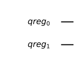
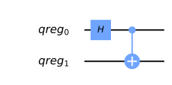
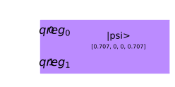
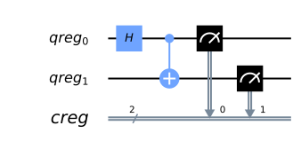
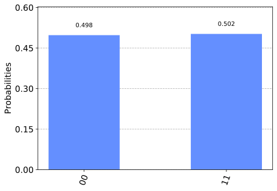
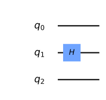
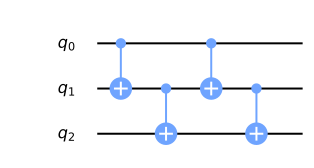
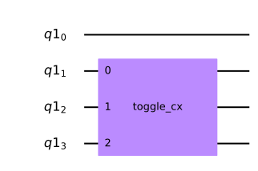

Basic Qiskit Syntax
===================

Installation
~~~~~~~~~~~~

Qiskit is a package in Python for doing everything you’ll ever need with
quantum computing.

If you don’t have it already, you need to install it. Once it is
installed, you need to import it.

There are generally two steps to installing Qiskit. The first one is to
install Anaconda, a python package that comes with almost all
dependencies that you will ever need. Once you’ve done this, Qiskit can
then be installed by running the command

::

   pip install qiskit

in your terminal. For detailed installation instructions, refer to `the
documentation page
here <https://qiskit.org/documentation/install.html>`__.

**Note: The rest of this section is intended for people who already know
the fundamental concepts of quantum computing.** It can be used for
readers who wish to skip straight to the later chapters in which those
concepts are put to use. All other readers should read the `Introduction
to Python and Jupyter
notebooks <../ch-prerequisites/python-and-jupyter-notebooks.html>`__,
and then move on directly to the start of `Chapter
1 <../ch-states/introduction.html>`__.

Quantum circuits
~~~~~~~~~~~~~~~~

.. code:: ipython3

    from qiskit import *
    %config InlineBackend.figure_format = 'svg' # Makes the images look nice

The object at the heart of Qiskit is the quantum circuit. Here’s how we
create one, which we will call ``qc``

.. code:: ipython3

    qc = QuantumCircuit()

This circuit is currently completely empty, with no qubits and no
outputs.

Quantum registers
~~~~~~~~~~~~~~~~~

To make the circuit less trivial, we need to define a register of
qubits. This is done using a ``QuantumRegister`` object. For example,
let’s define a register consisting of two qubits and call it ``qr``.

.. code:: ipython3

    qr = QuantumRegister(2,'qreg')

Giving it a name like ``'qreg'`` is optional.

Now we can add it to the circuit using the ``add_register`` method, and
see that it has been added by checking the ``qregs`` variable of the
circuit object.

.. code:: ipython3

    qc.add_register( qr )
    
    qc.qregs

.. parsed-literal::

    [QuantumRegister(2, 'qreg')]

Now our circuit has some qubits, we can use another attribute of the
circuit to see what it looks like: ``draw()`` .

.. code:: ipython3

    qc.draw(output='mpl')

Our qubits are ready to begin their journey, but are currently just
sitting there in state ``|0>``.

Applying Gates
^^^^^^^^^^^^^^

To make something happen, we need to add gates. For example, let’s try
out ``h()``.

.. code:: ipython3

    qc.h()

::

    ---------------------------------------------------------------------------

    TypeError                                 Traceback (most recent call last)

    <ipython-input-6-68b196ebf214> in <module>
    ----> 1 qc.h()
    

    TypeError: h() missing 1 required positional argument: 'q'

Here we got an error, because we didn’t tell the operation which qubit
it should act on. The two qubits in our register ``qr`` can be
individially addressed as ``qr[0]`` and ``qr[1]``.

.. code:: ipython3

    qc.h( qr[0] )

.. parsed-literal::

    <qiskit.circuit.instructionset.InstructionSet at 0x7fd7e0f8b550>

Ignore the output in the above. When the last line of a cell has no
``=``, Jupyter notebooks like to print out what is there. In this case,
it’s telling us that there is a Hadamard as defined by Qiskit. To
suppress this output, we could use a ``;``.

We can also add a controlled-NOT using ``cx``. This requires two
arguments: control qubit, and then target qubit.

.. code:: ipython3

    qc.cx( qr[0], qr[1] );

Now our circuit has more to show

.. code:: ipython3

    qc.draw(output='mpl')

Statevector simulator
~~~~~~~~~~~~~~~~~~~~~

We are now at the stage that we can actually look at an output from the
circuit. Specifcially, we will use the ‘statevector simulator’ to see
what is happening to the state vector of the two qubits.

To get this simulator ready to go, we use the following line.

.. code:: ipython3

    vector_sim = Aer.get_backend('statevector_simulator')

In Qiskit, we use *backend* to refer to the things on which quantum
programs actually run (simulators or real quantum devices). To set up a
job for a backend, we need to set up the corresponding backend object.

The simulator we want is defined in the part of qiskit known as ``Aer``.
By giving the name of the simulator we want to the ``get_backend()``
method of Aer, we get the backend object we need. In this case, the name
is ``'statevector_simulator'``.

A list of all possible simulators in Aer can be found using

.. code:: ipython3

    Aer.backends()

.. parsed-literal::

    [<QasmSimulator('qasm_simulator') from AerProvider()>,
     <StatevectorSimulator('statevector_simulator') from AerProvider()>,
     <UnitarySimulator('unitary_simulator') from AerProvider()>]

All of these simulators are ‘local’, meaning that they run on the
machine on which Qiskit is installed. Using them on your own machine can
be done without signing up to the IBMQ user agreement.

Running the simulation is done by Qiskit’s ``execute`` command, which
needs to be provided with the circuit to be run and the ‘backend’ to run
it on (in this case, a simulator).

.. code:: ipython3

    job = execute( qc, vector_sim )

This creates an object that handles the job, which here has been called
``job``. All we need from this is to extract the result. Specifically,
we want the statevector.

.. code:: ipython3

    ket = job.result().get_statevector()
    for amplitude in ket:
        print(amplitude)

.. parsed-literal::

    (0.7071067811865476+0j)
    0j
    0j
    (0.7071067811865475+0j)

This is the vector for a Bell state
:math:`\left( \left|00\right\rangle + \left|11\right\rangle \right)/\sqrt{2}`,
which is what we’d expect given the circuit.

While we have a nicely defined state vector, we can show another feature
of Qiskit: it is possible to initialize a circuit with an arbitrary pure
state.

.. code:: ipython3

    new_qc = QuantumCircuit( qr )
    
    new_qc.initialize( ket, qr )
    
    new_qc.draw(output='mpl')

Classical registers and the qasm simulator
~~~~~~~~~~~~~~~~~~~~~~~~~~~~~~~~~~~~~~~~~~

In the above simulation, we got out a statevector. That’s not what we’d
get from a real quantum computer. For that we need measurement. And to
handle measurement we need to define where the results will go. This is
done with a ``ClassicalRegister``. Let’s define a two bit classical
register, in order to measure both of our two qubits.

.. code:: ipython3

    cr = ClassicalRegister(2,'creg')
    
    qc.add_register(cr)

Now we can use the ``measure`` method of the quantum circuit. This
requires two arguments: the qubit being measured, and the bit where the
result is written.

Let’s measure both qubits, and write their results in different bits.

.. code:: ipython3

    qc.measure(qr[0],cr[0])
    qc.measure(qr[1],cr[1])
    
    qc.draw(output='mpl')

Now we can run this on a local simulator whose effect is to emulate a
real quantum device. For this we need to add another input to the
execute function, ``shots``, which determines how many times we run the
circuit to take statistics. If you don’t provide any ``shots`` value,
you get the default of 1024.

.. code:: ipython3

    emulator = Aer.get_backend('qasm_simulator')
    
    job = execute( qc, emulator, shots=8192 )

The result is essentially a histogram in the form of a Python
dictionary.

.. code:: ipython3

    hist = job.result().get_counts()
    print(hist)

.. parsed-literal::

    {'00': 4077, '11': 4115}

We can even get qiskit to plot it as a histogram.

.. code:: ipython3

    from qiskit.visualization import plot_histogram
    
    plot_histogram( hist )

For compatible backends we can also ask for and get the ordered list of
results.

.. code:: ipython3

    job = execute( qc, emulator, shots=10, memory=True )
    samples = job.result().get_memory()
    print(samples)

.. parsed-literal::

    ['11', '00', '11', '00', '11', '00', '11', '00', '00', '00']

Note that the bits are labelled from right to left. So ``cr[0]`` is the
one to the furthest right, and so on. As an example of this, here’s an 8
qubit circuit with a Pauli :math:`X` on only the qubit numbered ``7``,
which has its output stored to the bit numbered ``7``.

.. code:: ipython3

    qubit = QuantumRegister(8)
    bit = ClassicalRegister(8)
    circuit = QuantumCircuit(qubit,bit)
    
    circuit.x(qubit[7])
    circuit.measure(qubit,bit) # this is a way to do all the qc.measure(qr8[j],cr8[j]) at once
    
    execute( circuit, emulator, shots=8192 ).result().get_counts()

.. parsed-literal::

    {'10000000': 8192}

The ``1`` appears at the left.

This numbering reflects the role of the bits when they represent an
integer.

.. math::  b_{n-1} ~ b_{n-2} ~ \ldots ~ b_1 ~ b_0 = \sum_j ~ b_j ~ 2^j 

So the string we get in our result is the binary for :math:`2^7` because
it has a ``1`` for the bit numbered ``7``.

Simplified notation
~~~~~~~~~~~~~~~~~~~

Multiple quantum and classical registers can be added to a circuit.
However, if we need no more than one of each, we can use a simplified
notation.

For example, consider the following.

.. code:: ipython3

    qc = QuantumCircuit(3)

The single argument to ``QuantumCircuit`` is interpreted as the number
of qubits we want. So this circuit is one that has a single quantum
register consisting of three qubits, and no classical register.

When adding gates, we can then refer to the three qubits simply by their
index: 0, 1 or 2. For example, here’s a Hadamard on qubit 1.

.. code:: ipython3

    qc.h(1)
    
    qc.draw(output='mpl')

To define a circuit with both quantum and classical registers, we can
supply two arguments to ``QuantumCircuit``. The first will be
interpreted as the number of qubits, and the second will be the number
of bits. For example, here’s a two qubit circuit for which we’ll take a
single bit of output.

.. code:: ipython3

    qc = QuantumCircuit(2,1)

To see this in action, here is a simple circuit. Note that, when making
a measurement, we also refer to the bits in the classical register by
index.

.. code:: ipython3

    qc.h(0)
    qc.cx(0,1)
    qc.measure(1,0)
    
    qc.draw(output='mpl')

.. image:: qiskit_files/qiskit_60_0.svg

Creating custom gates
~~~~~~~~~~~~~~~~~~~~~

As we’ve seen, it is possible to combine different circuits to make
bigger ones. We can also use a more sophisticated version of this to
make custom gates. For example, here is a circuit that implements a
``cx`` between qubits 0 and 2, using qubit 1 to mediate the process.

.. code:: ipython3

    sub_circuit = QuantumCircuit(3, name='toggle_cx')
    sub_circuit.cx(0,1)
    sub_circuit.cx(1,2)
    sub_circuit.cx(0,1)
    sub_circuit.cx(1,2)
    
    sub_circuit.draw(output='mpl')

We can now turn this into a gate

.. code:: ipython3

    toggle_cx = sub_circuit.to_instruction()

and then insert it into other circuits using any set of qubits we choose

.. code:: ipython3

    qr = QuantumRegister(4)
    new_qc = QuantumCircuit(qr)
    
    new_qc.append(toggle_cx, [qr[1],qr[2],qr[3]])
    
    new_qc.draw(output='mpl')

Accessing on real quantum hardware
~~~~~~~~~~~~~~~~~~~~~~~~~~~~~~~~~~

Backend objects can also be set up using the ``IBMQ`` package. The use
of these requires us to `sign with an IBMQ
account <https://qiskit.org/documentation/install.html#access-ibm-q-systems>`__.
Assuming the credentials are already loaded onto your computer, you sign
in with

.. code:: ipython3

    IBMQ.load_account()

.. parsed-literal::

    <AccountProvider for IBMQ(hub='ibm-q', group='open', project='main')>

Now let’s see what additional backends we have available.

.. code:: ipython3

    provider = IBMQ.get_provider(hub='ibm-q')
    provider.backends()

.. parsed-literal::

    [<IBMQSimulator('ibmq_qasm_simulator') from IBMQ(hub='ibm-q', group='open', project='main')>,
     <IBMQBackend('ibmqx2') from IBMQ(hub='ibm-q', group='open', project='main')>,
     <IBMQBackend('ibmq_16_melbourne') from IBMQ(hub='ibm-q', group='open', project='main')>,
     <IBMQBackend('ibmq_vigo') from IBMQ(hub='ibm-q', group='open', project='main')>,
     <IBMQBackend('ibmq_ourense') from IBMQ(hub='ibm-q', group='open', project='main')>,
     <IBMQBackend('ibmq_london') from IBMQ(hub='ibm-q', group='open', project='main')>,
     <IBMQBackend('ibmq_burlington') from IBMQ(hub='ibm-q', group='open', project='main')>,
     <IBMQBackend('ibmq_essex') from IBMQ(hub='ibm-q', group='open', project='main')>,
     <IBMQBackend('ibmq_armonk') from IBMQ(hub='ibm-q', group='open', project='main')>]

Here there is one simulator, but the rest are prototype quantum devices.

We can see what they are up to with the ``status()`` method.

.. code:: ipython3

    for backend in provider.backends():
        print( backend.status() )

.. parsed-literal::

    BackendStatus(backend_name='ibmq_qasm_simulator', backend_version='0.1.547', operational=True, pending_jobs=0, status_msg='active')
    BackendStatus(backend_name='ibmqx2', backend_version='2.0.5', operational=True, pending_jobs=40, status_msg='active')
    BackendStatus(backend_name='ibmq_16_melbourne', backend_version='2.0.1', operational=True, pending_jobs=19, status_msg='active')
    BackendStatus(backend_name='ibmq_vigo', backend_version='1.0.2', operational=True, pending_jobs=4, status_msg='active')
    BackendStatus(backend_name='ibmq_ourense', backend_version='1.0.1', operational=True, pending_jobs=11, status_msg='active')
    BackendStatus(backend_name='ibmq_london', backend_version='1.0.0', operational=True, pending_jobs=3, status_msg='active')
    BackendStatus(backend_name='ibmq_burlington', backend_version='1.1.4', operational=True, pending_jobs=3, status_msg='active')
    BackendStatus(backend_name='ibmq_essex', backend_version='1.0.1', operational=True, pending_jobs=8, status_msg='active')
    BackendStatus(backend_name='ibmq_armonk', backend_version='1.1.0', operational=True, pending_jobs=17, status_msg='calibrating')

Let’s get the backend object for the largest public device.

.. code:: ipython3

    real_device = provider.get_backend('ibmq_16_melbourne')

We can use this to run a job on the device in exactly the same way as
for the emulator.

We can also extract some of its properties.

.. code:: ipython3

    properties = real_device.properties()
    coupling_map = real_device.configuration().coupling_map

From this we can construct a noise model to mimic the noise on the
device.

.. code:: ipython3

    from qiskit.providers.aer import noise
    
    noise_model = noise.device.basic_device_noise_model(properties)

And then run the job on the emulator, with it reproducing all these
features of the real device. Here’s an example with a circuit that
should output ``'10'`` in the noiseless case.

.. code:: ipython3

    qc = QuantumCircuit(2,2)
    qc.x(1)
    qc.measure(0,0)
    qc.measure(1,1)
    
    job = execute(qc, emulator, shots=1024, noise_model=noise_model,
                        coupling_map=coupling_map,
                        basis_gates=noise_model.basis_gates)
    
    job.result().get_counts()

.. parsed-literal::

    {'00': 54, '01': 1, '10': 968, '11': 1}

Now the very basics have been covered, let’s learn more about what
qubits and quantum circuits are all about.

.. code:: ipython3

    import qiskit
    qiskit.__qiskit_version__

.. parsed-literal::

    {'qiskit-terra': '0.11.1',
     'qiskit-aer': '0.3.4',
     'qiskit-ignis': '0.2.0',
     'qiskit-ibmq-provider': '0.4.5',
     'qiskit-aqua': '0.6.2',
     'qiskit': '0.14.1'}

