Calibrating qubits using Qiskit and OpenPulse
=============================================

Qiskit is an open-source framework for programming quantum computers
(Ref. `1 <#refs>`__). Using Qiskit, quantum circuits can be built,
simulated and executed on quantum devices.

OpenPulse provides a language for specifying pulse level control
(i.e. control of the continuous time dynamics of input signals) of a
general quantum device independent of the specific hardware
implementation (Ref. `2 <#refs>`__).

In this tutorial, we show how to implement typical single-qubit
calibration and characterization experiments using Qiskit and OpenPulse.
These are typically the first round of experiments that would be done in
the lab immediately after a device has been fabricated and installed
into a system. The presentation is pedagogical, and allows students to
explore two-level-system dynamics experimentally. All units are returned
as standard SI (ie Hz, sec, etc).

Each experiment gives us more information about the system, which is
typically used in subsequent experiments. For this reason, this notebook
has to be mostly executed in order.

Contents
--------

.. contents:: Quick links throoughout the document:

Part 2. Calibrating and using a :math:`\pi` pulse A. `Calibrating
:math:`\pi` pulses using a Rabi experiment <#rabi>`__ B. `Determining 0
vs 1 <#zerovone>`__ C. `Measuring :math:`T_1` using inversion
recovery <#T1>`__

Part 3. Determining qubit coherence A. `Measuring the qubit frequency
precisely using a Ramsey experiment <#ramsey>`__ B. `Measuring
:math:`T_2` using Hahn echoes <#hahn>`__

Part 4. `References <#refs>`__

0. Getting started 
-------------------

We’ll first get our basic dependencies set up and ready to go. Since we
want to use real, noisy devices for our calibration experiments in this
notebook, we need to load our IBMQ account and set the appropriate
backend.

.. code:: ipython3

    import warnings
    warnings.filterwarnings('ignore')
    from qiskit.tools.jupyter import *
    
    from qiskit import IBMQ
    IBMQ.load_account()
    provider = IBMQ.get_provider(hub='ibm-q', group='open', project='main')
    backend = provider.get_backend('ibmq_armonk')

We verify that the backend supports OpenPulse features by checking the
backend configuration. The config provides us with general information
about the structure of the backend setup.

.. code:: ipython3

    backend_config = backend.configuration()
    assert backend_config.open_pulse, "Backend doesn't support OpenPulse"

For instance, we can find the sampling time for the backend pulses
within the backend configuration. This will be a very useful value to us
as we build and execute our calibration routines.

.. code:: ipython3

    dt = backend_config.dt
    print(f"Sampling time: {dt*1e9} ns")    # The configuration returns dt in seconds, so multiply by
                                            # 1e9 to get nanoseconds

.. parsed-literal::

    Sampling time: 0.2222222222222222 ns

The backend defaults provide a starting point for how to use the
backend. It contains estimates for qubit frequencies and default
programs to enact basic quantum operators. We can access them with the
following:

.. code:: ipython3

    backend_defaults = backend.defaults()

Part 1
======

1. Finding the qubit frequency using a frequency sweep 
-------------------------------------------------------

We begin by searching for the qubit frequency. The qubit frequency is
the difference in energy between the ground and excited states, which we
label the :math:`\vert0\rangle` and :math:`\vert1\rangle` states,
respectively. This frequency will be crucial for creating pulses which
enact particular quantum operators on the qubit – the final goal of our
calibration!

With superconducting qubits, higher energy levels are also available,
but we fabricate the systems to be anharmonic so that we can control
which transition we are exciting. That way, we are able to isolate two
energy levels and treat each qubit as a basic two-level system, ignoring
higher energy states.

In a typical lab setting, the qubit frequency can be found by sweeping a
range of frequencies and looking for signs of absorption using a tool
known as a Network Analyzer. This measurement gives a rough estimate of
the qubit frequency. Later on, we will see how to do a more precise
measurement using a Ramsey pulse sequence.

First, we define the frequency range that will be swept in search of the
qubit. Since this can be arbitrarily broad, we restrict ourselves to a
window of 40 MHz around the estimated qubit frequency in
``backend_defaults``. We step the frequency in units of 1 MHz.

.. code:: ipython3

    import numpy as np
    
    # unit conversion factors -> all backend properties returned in SI (Hz, sec, etc)
    GHz = 1.0e9 # Gigahertz
    MHz = 1.0e6 # Megahertz
    us = 1.0e-6 # Microseconds
    ns = 1.0e-9 # Nanoseconds
    
    # We will find the qubit frequency for the following qubit.
    qubit = 0
    
    # The sweep will be centered around the estimated qubit frequency.
    center_frequency_Hz = backend_defaults.qubit_freq_est[qubit]        # The default frequency is given in Hz
                                                                        # warning: this will change in a future release
    print(f"Qubit {qubit} has an estimated frequency of {center_frequency_Hz / GHz} GHz.")
    
    # We will sweep 40 MHz around the estimated frequency
    frequency_span_Hz = 40 * MHz
    # in steps of 1 MHz.
    frequency_step_Hz = 1 * MHz
    
    # We will sweep 20 MHz above and 20 MHz below the estimated frequency
    frequency_min = center_frequency_Hz - frequency_span_Hz / 2
    frequency_max = center_frequency_Hz + frequency_span_Hz / 2
    # Construct an np array of the frequencies for our experiment
    frequencies_GHz = np.arange(frequency_min / GHz, 
                                frequency_max / GHz, 
                                frequency_step_Hz / GHz)
    
    print(f"The sweep will go from {frequency_min / GHz} GHz to {frequency_max / GHz} GHz \
    in steps of {frequency_step_Hz / MHz} MHz.")

.. parsed-literal::

    Qubit 0 has an estimated frequency of 4.974286302306341 GHz.
    The sweep will go from 4.9542863023063415 GHz to 4.9942863023063415 GHz in steps of 1.0 MHz.

Next, we define the pulses we will use for our experiment. We will start
with the drive pulse, which is a Gaussian pulse.

Remember the value ``dt`` from earlier? All durations in pulse are given
in terms of ``dt``. In the next cell, we define the length of the drive
pulse in terms of ``dt``.

.. code:: ipython3

    # samples need to be multiples of 16
    def get_closest_multiple_of_16(num):
        return (int(num) - (int(num)%16))

.. code:: ipython3

    from qiskit import pulse            # This is where we access all of our Pulse features!
    from qiskit.pulse import pulse_lib  # This Pulse module helps us build sampled pulses for common pulse shapes
    
    
    # Drive pulse parameters (us = microseconds)
    drive_sigma_us = 0.075                     # This determines the actual width of the gaussian
    drive_samples_us = drive_sigma_us*8        # This is a truncating parameter, because gaussians don't have 
                                               # a natural finite length
    
    drive_sigma = get_closest_multiple_of_16(drive_sigma_us * us /dt)       # The width of the gaussian in units of dt
    drive_samples = get_closest_multiple_of_16(drive_samples_us * us /dt)   # The truncating parameter in units of dt
    drive_amp = 0.3
    # Drive pulse samples
    drive_pulse = pulse_lib.gaussian(duration=drive_samples,
                                     sigma=drive_sigma,
                                     amp=drive_amp,
                                     name='freq_sweep_excitation_pulse')

Next, we will create the instructions we need to measure our qubit. This
actually consists of two pulses: one stimulates the readout with a
Gaussian-Square pulse applied at the readout resonator frequency, and
the other triggers the data acquisition instrument to acquire data for
the duration of the pulse.

.. code:: ipython3

    ### Construct the measurement pulse
    # Measurement pulse parameters
    
    meas_samples_us = 3.0
    meas_sigma_us = 0.014     # The width of the gaussian part of the rise and fall
    meas_risefall_us = 0.1    # and the truncating parameter: how many samples to dedicate to the risefall
    
    meas_samples = get_closest_multiple_of_16(meas_samples_us * us/dt)
    meas_sigma = get_closest_multiple_of_16(meas_sigma_us * us/dt)       # The width of the gaussian part in units of dt
    meas_risefall = get_closest_multiple_of_16(meas_risefall_us * us/dt) # The truncating parameter in units of dt
    
    meas_amp = 0.25
    # Measurement pulse samples
    meas_pulse = pulse_lib.gaussian_square(duration=meas_samples,
                                           sigma=meas_sigma,
                                           amp=meas_amp,
                                           risefall=meas_risefall,
                                           name='measurement_pulse')
    
    ### Construct the acquire pulse to trigger the acquisition
    # Acquire pulse samples
    acq_cmd = pulse.Acquire(duration=meas_samples)

We have to check one additional thing in order to properly measure our
qubits: the measurement map. This is a hardware constraint. When
acquisition is done for one qubit, it is also done on other qubits. We
have to respect this constraint when building our program in OpenPulse.
Let’s check which group of qubits our qubit is in:

.. code:: ipython3

    # Find out which group of qubits need to be acquired with this qubit
    meas_map_idx = None
    for i, measure_group in enumerate(backend_config.meas_map):
        if qubit in measure_group:
            meas_map_idx = i
            break
    assert meas_map_idx is not None, f"Couldn't find qubit {qubit} in the meas_map!"

Lastly, we specify the channels on which we will apply our pulses.
Drive, measure, and acquire channels are indexed by qubit index.

.. code:: ipython3

    ### Collect the necessary channels
    drive_chan = pulse.DriveChannel(qubit)
    meas_chan = pulse.MeasureChannel(qubit)
    acq_chan = pulse.AcquireChannel(qubit)

Now that the pulse parameters have been defined, and we have created the
pulse shapes for our experiments, we can proceed to creating the pulse
schedules.

At each frequency, we will send a drive pulse of that frequency to the
qubit and measure immediately after the pulse. The pulse envelopes are
independent of frequency, so we will build a reusable ``schedule``, and
we will specify the drive pulse frequency with a frequency configuration
array.

.. code:: ipython3

    # Create the base schedule
    # Start with drive pulse acting on the drive channel
    schedule = pulse.Schedule(name='Frequency sweep')
    schedule += drive_pulse(drive_chan)
    
    # In a new schedule, which we will use again later, add a measurement stimulus on the
    # measure channel pulse to trigger readout
    measure_schedule = meas_pulse(meas_chan)
    # Trigger data acquisition, and store measured values into respective memory slots
    measure_schedule += acq_cmd([pulse.AcquireChannel(i) for i in backend_config.meas_map[meas_map_idx]],
                                [pulse.MemorySlot(i) for i in backend_config.meas_map[meas_map_idx]])
    # The left shift `<<` is special syntax meaning to shift the start time of the schedule by some duration
    schedule += measure_schedule << schedule.duration
    
    # Create the frequency settings for the sweep (MUST BE IN HZ)
    frequencies_Hz = frequencies_GHz*GHz
    schedule_frequencies = [{drive_chan: freq} for freq in frequencies_Hz]

As a sanity check, it’s always a good idea to look at the pulse
schedule. This is done using ``schedule.draw()`` as shown below.

.. code:: ipython3

    schedule.draw(channels_to_plot=[drive_chan, meas_chan], label=True, scaling=1.0)

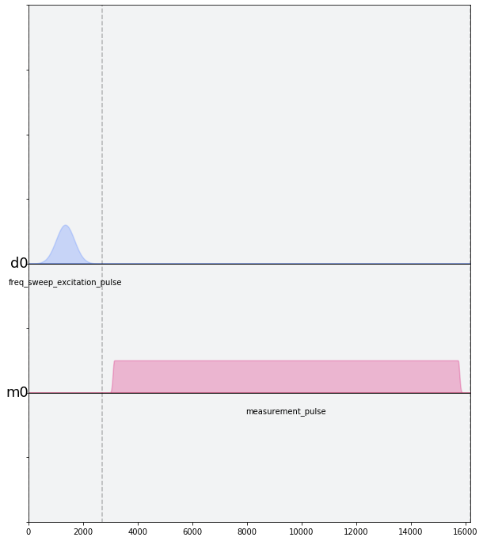

We assemble the ``schedules`` and ``schedule_frequencies`` above into a
program object, called a Qobj, that can be sent to the quantum device.
We request that each schedule (each point in our frequency sweep) is
repeated ``num_shots_per_frequency`` times in order to get a good
estimate of the qubit response.

We also specify measurement settings. ``meas_level=0`` returns raw data
(an array of complex values per shot), ``meas_level=1`` returns kerneled
data (one complex value per shot), and ``meas_level=2`` returns
classified data (a 0 or 1 bit per shot). We choose ``meas_level=1`` to
replicate what we would be working with if we were in the lab, and
hadn’t yet calibrated the discriminator to classify 0s and 1s. We ask
for the ``'avg'`` of the results, rather than each shot individually.

.. code:: ipython3

    from qiskit import assemble
    
    num_shots_per_frequency = 1024
    frequency_sweep_program = assemble(schedule,
                                       backend=backend, 
                                       meas_level=1,
                                       meas_return='avg',
                                       shots=num_shots_per_frequency,
                                       schedule_los=schedule_frequencies)

Finally, we can run the assembled program on the backend using:

.. code:: ipython3

    job = backend.run(frequency_sweep_program)

It is always a good idea to print the ``job_id`` for later retrieval,
and to monitor the job status by using ``job_monitor()``

.. code:: ipython3

    # print(job.job_id())
    from qiskit.tools.monitor import job_monitor
    job_monitor(job)

.. parsed-literal::

    Job Status: job has successfully run

Once the job is run, the results can be retrieved using:

.. code:: ipython3

    frequency_sweep_results = job.result(timeout=120) # timeout parameter set to 120 seconds

We will extract the results and plot them using ``matplotlib``:

.. code:: ipython3

    %matplotlib inline
    import matplotlib.pyplot as plt
    
    sweep_values = []
    for i in range(len(frequency_sweep_results.results)):
        # Get the results from the ith experiment
        res = frequency_sweep_results.get_memory(i)
        # Get the results for `qubit` from this experiment
        sweep_values.append(res[qubit])
    
    plt.scatter(frequencies_GHz, sweep_values, color='black') # plot real part of sweep values
    plt.xlim([min(frequencies_GHz), max(frequencies_GHz)])
    plt.xlabel("Frequency [GHz]")
    plt.ylabel("Measured signal [a.u.]")
    plt.show()

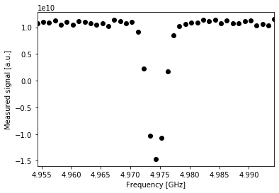

As you can see above, the peak near the center corresponds to the
location of the qubit frequency. The signal shows power-broadening,
which is a signature that we are able to drive the qubit off-resonance
as we get close to the center frequency. To get the value of the peak
frequency, we will fit the values to a resonance response curve, which
is typically a Lorentzian shape.

.. code:: ipython3

    from scipy.optimize import curve_fit
    
    def fit_function(x_values, y_values, function, init_params):
        fitparams, conv = curve_fit(function, x_values, y_values, init_params)
        y_fit = function(x_values, *fitparams)
        
        return fitparams, y_fit

.. code:: ipython3

    fit_params, y_fit = fit_function(frequencies_GHz,
                                     sweep_values, 
                                     lambda x, A, q_freq, B, C: (A / np.pi) * (B / ((x - q_freq)**2 + B**2)) + C,
                                     [-2e10, 4.975, 1, 3e10] # initial parameters for curve_fit
                                    )

.. code:: ipython3

    plt.scatter(frequencies_GHz, sweep_values, color='black')
    plt.plot(frequencies_GHz, y_fit, color='red')
    plt.xlim([min(frequencies_GHz), max(frequencies_GHz)])
    
    plt.xlabel("Frequency [GHz]")
    plt.ylabel("Measured Signal [a.u.]")
    plt.show()

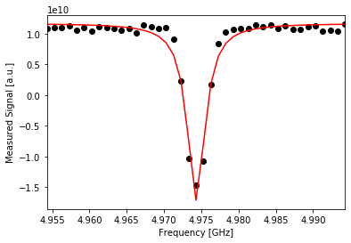

.. code:: ipython3

    A, rough_qubit_frequency, B, C = fit_params
    rough_qubit_frequency = rough_qubit_frequency*GHz # make sure qubit freq is in Hz
    print(f"We've updated our qubit frequency estimate from "
          f"{round(backend_defaults.qubit_freq_est[qubit] / GHz, 5)} GHz to {round(rough_qubit_frequency/GHz, 5)} GHz.")

.. parsed-literal::

    We've updated our qubit frequency estimate from 4.97429 GHz to 4.97432 GHz.

Part 2. Calibrating and using a :math:`\pi` pulse
=================================================

A. Calibrating :math:`\pi` pulses using a Rabi experiment 
----------------------------------------------------------

Once we know the frequency of our qubit, the next step is to determine
the strength of a :math:`\pi` pulse. Strictly speaking of the qubit as a
two-level system, a :math:`\pi` pulse is one that takes the qubit from
:math:`\vert0\rangle` to :math:`\vert1\rangle`, and vice versa. This is
also called the :math:`X` or :math:`X180` gate, or bit-flip operator. We
already know the microwave frequency needed to drive this transition
from the previous frequency sweep experiment, and we now seek the
amplitude needed to achieve a :math:`\pi` rotation from
:math:`\vert0\rangle` to :math:`\vert1\rangle`. The desired rotation is
shown on the Bloch sphere in the figure below – you can see that the
:math:`\pi` pulse gets its name from the angle it sweeps over on a Bloch
sphere.

.. figure:: https://github.com/aasfaw/qiskit-intros/blob/master/zero_to_one_X180.png?raw=true
   :alt: bloch1

We will change the drive amplitude in small increments and measuring the
state of the qubit each time. We expect to see oscillations which are
commonly named Rabi oscillations, as the qubit goes from
:math:`\vert0\rangle` to :math:`\vert1\rangle` and back.

.. code:: ipython3

    # This experiment uses these values from the previous experiment:
        # `qubit`,
        # `measure_schedule`, and
        # `rough_qubit_frequency`.
    
    # Rabi experiment parameters
    num_rabi_points = 50
    
    # Drive amplitude values to iterate over: 50 amplitudes evenly spaced from 0 to 0.75
    drive_amp_min = 0
    drive_amp_max = 0.75
    drive_amps = np.linspace(drive_amp_min, drive_amp_max, num_rabi_points)

.. code:: ipython3

    # Build the Rabi experiments:
    #    A drive pulse at the qubit frequency, followed by a measurement,
    #    where we vary the drive amplitude each time.
    rabi_schedules = []
    for drive_amp in drive_amps:
        rabi_pulse = pulse_lib.gaussian(duration=drive_samples, amp=drive_amp, 
                                        sigma=drive_sigma, name=f"Rabi drive amplitude = {drive_amp}")
        this_schedule = pulse.Schedule(name=f"Rabi drive amplitude = {drive_amp}")
        this_schedule += rabi_pulse(drive_chan)
        # Reuse the measure_schedule from the frequency sweep experiment
        this_schedule += measure_schedule << this_schedule.duration
        rabi_schedules.append(this_schedule)

The schedule will look essentially the same as the frequency sweep
experiment. The only difference is that we are running a set of
experiments which vary the amplitude of the drive pulse, rather than its
modulation frequency.

.. code:: ipython3

    rabi_schedules[-1].draw(channels_to_plot=[drive_chan, meas_chan], label=True, scaling=1.0)

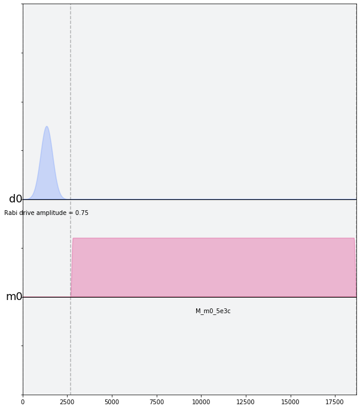

.. code:: ipython3

    # Assemble the schedules into a Qobj
    num_shots_per_point = 1024
    
    rabi_experiment_program = assemble(rabi_schedules,
                                       backend=backend,
                                       meas_level=1,
                                       meas_return='avg',
                                       shots=num_shots_per_point,
                                       schedule_los=[{drive_chan: rough_qubit_frequency}]
                                                    * num_rabi_points)

.. code:: ipython3

    # print(job.job_id())
    job = backend.run(rabi_experiment_program)
    job_monitor(job)

.. parsed-literal::

    Job Status: job has successfully run

.. code:: ipython3

    rabi_results = job.result(timeout=120)

Now that we have our results, we will extract them and fit them to a
sinusoidal curve. For the range of drive amplitudes we selected, we
expect that we will rotate the qubit several times completely around the
Bloch sphere, starting from :math:`|0\rangle`. The amplitude of this
sinusoid tells us the fraction of the shots at that Rabi drive amplitude
which yielded the :math:`|1\rangle` state. We want to find the drive
amplitude needed for the signal to oscillate from a maximum (all
:math:`|0\rangle` state) to a minimum (all :math:`|1\rangle` state) –
this gives the calibrated amplitude that enacts a :math:`\pi` pulse.

.. code:: ipython3

    # center data around 0
    def baseline_remove(values):
        return np.array(values) - np.mean(values)

.. code:: ipython3

    rabi_values = []
    for i in range(num_rabi_points):
        # Get the results for `qubit` from the ith experiment
        rabi_values.append(rabi_results.get_memory(i)[qubit])
    
    rabi_values = np.real(baseline_remove(rabi_values))
    
    plt.xlabel("Drive amp [a.u.]")
    plt.ylabel("Measured signal [a.u.]")
    plt.scatter(drive_amps, rabi_values, color='black') # plot real part of Rabi values
    plt.show()

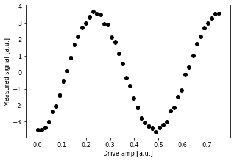

.. code:: ipython3

    fit_params, y_fit = fit_function(drive_amps,
                                     rabi_values, 
                                     lambda x, A, B, drive_period, phi: (A*np.cos(2*np.pi*x/drive_period - phi) + B),
                                     [1.5e10, 0.1e10, 0.5, 0])
    
    plt.scatter(drive_amps, rabi_values, color='black')
    plt.plot(drive_amps, y_fit, color='red')
    
    drive_period = fit_params[2] # get period of rabi oscillation
    
    plt.axvline(drive_period/2, color='red', linestyle='--')
    plt.axvline(drive_period, color='red', linestyle='--')
    plt.annotate("", xy=(drive_period, 0), xytext=(drive_period/2,0), arrowprops=dict(arrowstyle="<->", color='red'))
    plt.annotate("$\pi$", xy=(drive_period/2-0.03, 0.1e10), color='red')
    
    plt.xlabel("Drive amp [a.u.]", fontsize=15)
    plt.ylabel("Measured signal [a.u.]", fontsize=15)
    plt.show()

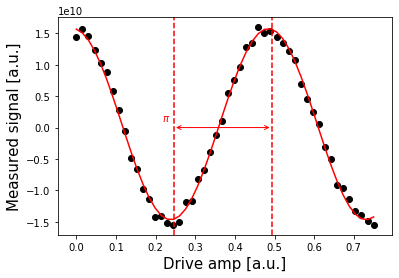

.. code:: ipython3

    pi_amp = abs(drive_period / 2)
    print(f"Pi Amplitude = {pi_amp}")

.. parsed-literal::

    Pi Amplitude = 0.2463992641781328

Our :math:`\pi` pulse!
~~~~~~~~~~~~~~~~~~~~~~

Let’s define our pulse, with the amplitude we just found, so we can use
it in later experiments.

.. code:: ipython3

    pi_pulse = pulse_lib.gaussian(duration=drive_samples,
                                  amp=pi_amp, 
                                  sigma=drive_sigma,
                                  name='pi_pulse')

B. Determining 0 vs 1 
----------------------

Once our :math:`\pi` pulses have been calibrated, we can now create the
state :math:`\vert1\rangle` with good probability. We can use this to
find out what the states :math:`\vert0\rangle` and :math:`\vert1\rangle`
look like in our measurements, by repeatedly preparing them and plotting
the measured signal. This is what we use to build a discriminator, which
is simply a function which takes a measured and kerneled complex value
(``meas_level=1``) and classifies it as a 0 or a 1 (``meas_level=2``).

.. code:: ipython3

    # Create two schedules
    
    # Ground state schedule
    gnd_schedule = pulse.Schedule(name="ground state")
    gnd_schedule += measure_schedule
    
    # Excited state schedule
    exc_schedule = pulse.Schedule(name="excited state")
    exc_schedule += pi_pulse(drive_chan)  # We found this in Part 2A above
    exc_schedule += measure_schedule << exc_schedule.duration

.. code:: ipython3

    gnd_schedule.draw(channels_to_plot=[drive_chan, meas_chan], label=True, scaling=1.0)

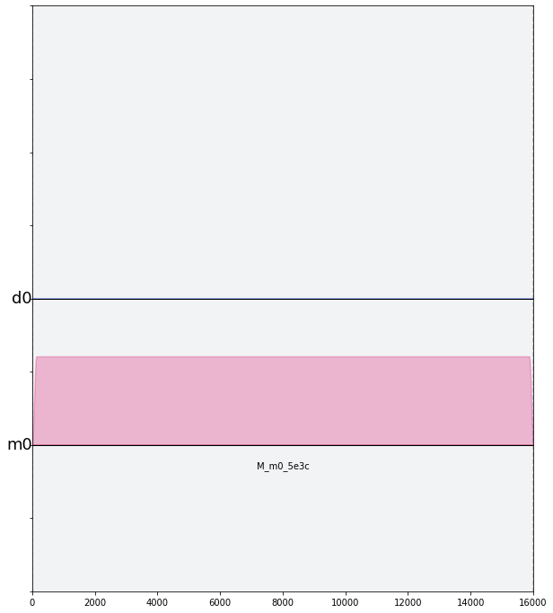

.. code:: ipython3

    exc_schedule.draw(channels_to_plot=[drive_chan, meas_chan], label=True, scaling=1.0)

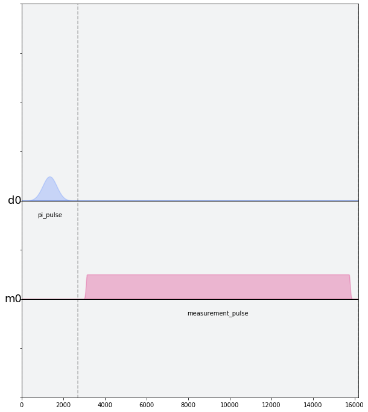

We assemble the ground and excited state preparation schedules into one
Qobj. Each of these will run ``num_shots`` times. We choose
``meas_level=1`` this time, because we do not want the results already
classified for us as :math:`|0\rangle` or :math:`|1\rangle`. Instead, we
want kerneled data: raw acquired data that has gone through a kernel
function to yield a single complex value for each shot. (You can think
of a kernel as a dot product applied to the raw measurement data.) We
pass the same frequency for both schedules, although it is only used by
the ``exc_schedule``.

.. code:: ipython3

    # Execution settings
    num_shots = 1024
    
    gnd_exc_program = assemble([gnd_schedule, exc_schedule],
                               backend=backend,
                               meas_level=1,
                               meas_return='single',
                               shots=num_shots,
                               schedule_los=[{drive_chan: rough_qubit_frequency}] * 2)

.. code:: ipython3

    # print(job.job_id())
    job = backend.run(gnd_exc_program)
    job_monitor(job)

.. parsed-literal::

    Job Status: job has successfully run

.. code:: ipython3

    gnd_exc_results = job.result(timeout=120)

Now that we have the results, we can visualize the two populations which
we have prepared on a simple scatter plot, showing results from the
ground state program in blue and results from the excited state
preparation program in red.

.. code:: ipython3

    gnd_results = gnd_exc_results.get_memory(0)[:, qubit]
    exc_results = gnd_exc_results.get_memory(1)[:, qubit]
    
    plt.figure(figsize=[4,4])
    # Plot all the results
    # All results from the gnd_schedule are plotted in blue
    plt.scatter(np.real(gnd_results), np.imag(gnd_results), 
                    s=5, cmap='viridis', c='blue', alpha=0.5, label='state_0')
    # All results from the exc_schedule are plotted in red
    plt.scatter(np.real(exc_results), np.imag(exc_results), 
                    s=5, cmap='viridis', c='red', alpha=0.5, label='state_1')
    
    # Plot a large dot for the average result of the 0 and 1 states.
    mean_gnd = np.mean(gnd_results) # takes mean of both real and imaginary parts
    mean_exc = np.mean(exc_results)
    plt.scatter(np.real(mean_gnd), np.imag(mean_gnd), 
                s=200, cmap='viridis', c='black',alpha=1.0, label='state_0_mean')
    plt.scatter(np.real(mean_exc), np.imag(mean_exc), 
                s=200, cmap='viridis', c='black',alpha=1.0, label='state_1_mean')
    
    plt.ylabel('I [a.u.]', fontsize=15)
    plt.xlabel('Q [a.u.]', fontsize=15)
    plt.title("0-1 discrimination", fontsize=15)
    
    plt.show()

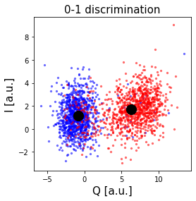

We can clearly see that the two populations of :math:`|0\rangle` and
:math:`|1\rangle` form their own clusters. Kerneled measurement results
(from ``meas_level=1``) are classified (into ``meas_level=2``) by
applying a discriminator which optimally separates these two clusters.
Optimal separation is simply a line in the IQ plane, equidistant from
the average results we plotted above in the large dot, and normal to the
line connecting the two dots.

We can set up a quick classifier function by returning 0 if a given
point is closer to the mean of the ground state results, and returning 1
if the point is closer to the average excited state results.

.. code:: ipython3

    import math
    
    def classify(point: complex):
        """Classify the given state as |0> or |1>."""
        def distance(a, b):
            return math.sqrt((np.real(a) - np.real(b))**2 + (np.imag(a) - np.imag(b))**2)
        return int(distance(point, mean_exc) < distance(point, mean_gnd))

C. Measuring :math:`T_1` using inversion recovery 
--------------------------------------------------

The :math:`T_1` time of a qubit is the time it takes for a qubit to
decay from the excited state to the ground state. It is important
because it limits the duration of meaningful programs we can run on the
quantum computer.

Measuring :math:`T_1` is similar to our previous experiments, and uses
the :math:`\pi` pulse we’ve calibrated. We again apply a single drive
pulse, our :math:`\pi` pulse, then apply a measure pulse. However, this
time we do not apply the measurement immediately. We insert a delay, and
vary that delay between experiments. When we plot the measured signal
against delay time, we will see a signal that decays exponentially as
the qubit relaxes in energy. The decay time is the :math:`T_1`, or
relaxation time, of the qubit!

.. code:: ipython3

    # T1 experiment parameters
    time_max_us = 450
    time_step_us = 6
    times_us = np.arange(1, time_max_us, time_step_us)
    # Convert to units of dt
    delay_times_dt = times_us * us / dt
    # We will use the same `pi_pulse` and qubit frequency that we calibrated and used before

.. code:: ipython3

    # Create schedules for the experiment 
    t1_schedules = []
    for delay in delay_times_dt:
        this_schedule = pulse.Schedule(name=f"T1 delay = {delay * dt/us} us")
        this_schedule += pi_pulse(drive_chan)
        this_schedule |= measure_schedule << int(delay)
        t1_schedules.append(this_schedule)

We can check out our :math:`T_1` schedule, too. To really get a sense of
this experiment, try looking at a couple of the schedules by running the
next cell multiple times, with different values of ``sched_idx``. You
will see the measurement pulse start later as you increase
``sched_idx``.

.. code:: ipython3

    sched_idx = 0
    t1_schedules[sched_idx].draw(channels_to_plot=[drive_chan, meas_chan], label=True, scaling=1.0)

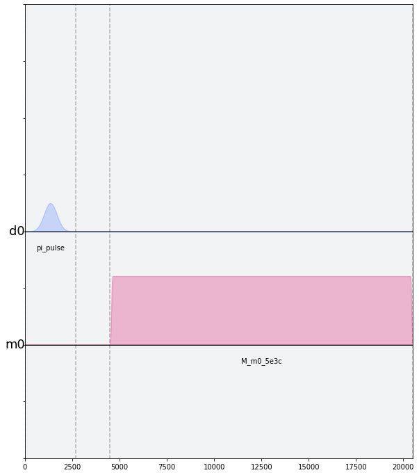

.. code:: ipython3

    # Execution settings
    num_shots = 256
    
    t1_experiment = assemble(t1_schedules,
                             backend=backend, 
                             meas_level=1,
                             meas_return='avg',
                             shots=num_shots,
                             schedule_los=[{drive_chan: rough_qubit_frequency}] * len(t1_schedules))

.. code:: ipython3

    job = backend.run(t1_experiment)
    # print(job.job_id())
    job_monitor(job)

.. parsed-literal::

    Job Status: job has successfully run

.. code:: ipython3

    t1_results = job.result(timeout=120)

.. code:: ipython3

    t1_values = []
    for i in range(len(times_us)):
        t1_values.append(t1_results.get_memory(i)[qubit])
    
    plt.scatter(times_us, t1_values, color='black') 
    plt.title("$T_1$ Experiment", fontsize=15)
    plt.xlabel('Delay before measurement [$\mu$s]', fontsize=15)
    plt.ylabel('Signal [a.u.]', fontsize=15)
    plt.show()

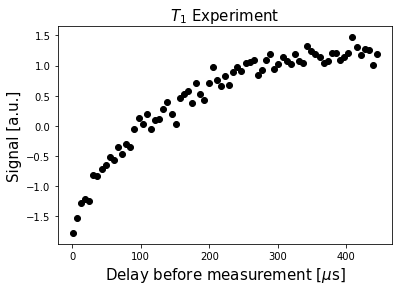

We can then fit the data to a decaying exponential, giving us T1!

.. code:: ipython3

    # Fit the data
    fit_params, y_fit = fit_function(times_us, t1_values, 
                lambda x, A, C, T1: (A * np.exp(-x / T1) + C),
                [-3e10, 3e10, 100]
                )
    
    _, _, T1 = fit_params
    
    plt.scatter(times_us, t1_values, color='black')
    plt.plot(times_us, y_fit, color='red', label=f"T1 = {T1:.2f} us")
    plt.xlim(0, np.max(times_us))
    plt.title("$T_1$ Experiment", fontsize=15)
    plt.xlabel('Delay before measurement [$\mu$s]', fontsize=15)
    plt.ylabel('Signal [a.u.]', fontsize=15)
    plt.legend()
    plt.show()

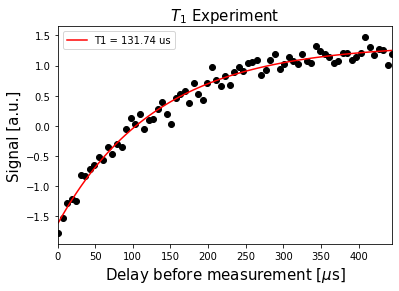

Part 3. Determining qubit coherence
===================================

A. Measuring the qubit frequency precisely using a Ramsey experiment 
---------------------------------------------------------------------

Now, we determine the qubit frequency to better precision. This is done
using a Ramsey pulse sequence. In this pulse sequence, we first apply a
:math:`\pi/2` (“pi over two”) pulse, wait some time :math:`\Delta t`,
and then apply another :math:`\pi/2` pulse. Since we are measuring the
signal from the qubit at the same frequency as the pulses, we should
observe oscillations at the difference in frequency between the applied
pulses and the qubit.

.. figure:: https://github.com/aasfaw/qiskit-intros/blob/master/dephasing.png?raw=true
   :alt: bloch2

.. code:: ipython3

    # Ramsey experiment parameters
    time_max_us = 1.8
    time_step_us = 0.025
    times_us = np.arange(0.1, time_max_us, time_step_us)
    # Convert to units of dt
    delay_times_dt = times_us * us / dt
    
    # Drive parameters
    # The drive amplitude for pi/2 is simply half the amplitude of the pi pulse
    drive_amp = pi_amp / 2
    # x_90 is a concise way to say pi_over_2; i.e., an X rotation of 90 degrees
    x90_pulse = pulse_lib.gaussian(duration=drive_samples,
                                   amp=drive_amp, 
                                   sigma=drive_sigma,
                                   name='x90_pulse')

.. code:: ipython3

    # create schedules for Ramsey experiment 
    ramsey_schedules = []
    
    for delay in delay_times_dt:
        this_schedule = pulse.Schedule(name=f"Ramsey delay = {delay * dt / us} us")
        this_schedule |= x90_pulse(drive_chan)
        this_schedule |= x90_pulse(drive_chan) << int(this_schedule.duration + delay)
        this_schedule |= measure_schedule << int(this_schedule.duration)
    
        ramsey_schedules.append(this_schedule)

Just like for :math:`T_1` schedules, it will be illuminating to execute
the next cell multiple times to inspect a few of the schedules we’ve
made. As you look at increasing indices of ``ramsey_schedules``, the
delay between the two :math:`\pi/2` pulses will increase.

.. code:: ipython3

    ramsey_schedules[0].draw(channels_to_plot=[drive_chan, meas_chan], label=True, scaling=1.0)

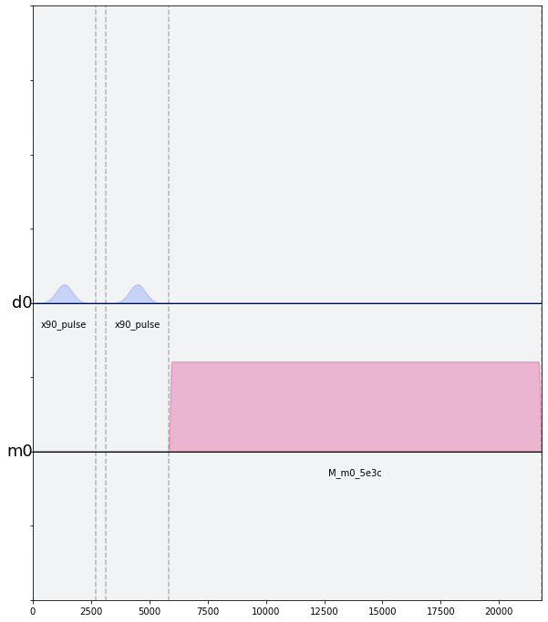

Here, we will apply a commonly used experimental trick. We will drive
the pulses off-resonance by a known amount, which we will call
``detuning_MHz``. The measured Ramsey signal should show oscillations
with frequency near ``detuning_MHz``, with a small offset. This small
offset is exactly how far away ``rough_qubit_frequency`` was from the
qubit frequency.

.. code:: ipython3

    # Execution settings
    num_shots = 256
    
    detuning_MHz = 2 
    ramsey_frequency = round(rough_qubit_frequency + detuning_MHz * MHz, 6) # need ramsey freq in Hz
    ramsey_program = assemble(ramsey_schedules,
                                 backend=backend,
                                 meas_level=1,
                                 meas_return='avg',
                                 shots=num_shots,
                                 schedule_los=[{drive_chan: ramsey_frequency}]*len(ramsey_schedules)
                                )

.. code:: ipython3

    job = backend.run(ramsey_program)
    # print(job.job_id())
    job_monitor(job)

.. parsed-literal::

    Job Status: job has successfully run

.. code:: ipython3

    ramsey_results = job.result(timeout=120)

.. code:: ipython3

    ramsey_values = []
    for i in range(len(times_us)):
        ramsey_values.append(ramsey_results.get_memory(i)[qubit])
        
    plt.scatter(times_us, ramsey_values, color='black')
    plt.xlim(0, np.max(times_us))
    plt.title("Ramsey Experiment", fontsize=15)
    plt.xlabel('Delay between X90 pulses [$\mu$s]', fontsize=15)
    plt.ylabel('Measured Signal [a.u.]', fontsize=15)
    plt.show()

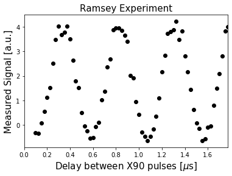

We will fit the data to a sinusoid, and extract the information we are
interested in – namely, :math:`\Delta f`.

.. code:: ipython3

    fit_params, y_fit = fit_function(times_us, ramsey_values,
                                     lambda x, A, del_f_MHz, C, B: (
                                              A * np.cos(2*np.pi*del_f_MHz*x - C) + B
                                             ),
                                     [2e10, 1./0.4, 0, 0.25e10]
                                    )
    
    # Off-resonance component
    _, del_f_MHz, _, _, = fit_params # freq is MHz since times in us
    
    plt.scatter(times_us, ramsey_values, color='black')
    plt.plot(times_us, y_fit, color='red', label=f"df = {del_f_MHz:.2f} MHz")
    plt.xlim(0, np.max(times_us))
    plt.xlabel('Delay between X90 pulses [$\mu$s]', fontsize=15)
    plt.ylabel('Measured Signal [a.u.]', fontsize=15)
    plt.title('Ramsey Experiment', fontsize=15)
    plt.legend()
    plt.show()

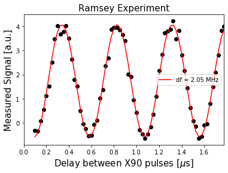

Now that we know ``del_f_MHz``, we can update our estimate of the qubit
frequency.

.. code:: ipython3

    precise_qubit_freq = rough_qubit_frequency + (del_f_MHz - detuning_MHz) * MHz # get new freq in Hz
    print(f"Our updated qubit frequency is now {round(precise_qubit_freq/GHz, 6)} GHz. "
          f"It used to be {round(rough_qubit_frequency / GHz, 6)} GHz")

.. parsed-literal::

    Our updated qubit frequency is now 4.974351 GHz. It used to be 4.974318 GHz

B. Measuring :math:`T_2` using Hahn echoes 
-------------------------------------------

Next, we can measure the coherence time, :math:`T_2`, of our qubit. The
pulse sequence used to do this experiment is known as a Hahn echo, a
term that comes from the NMR community. A Hahn echo experiment is very
similar to the Ramsey experiment above, with an additional :math:`\pi`
pulse between the two :math:`\pi/2` pulses. The :math:`\pi` pulse at
time :math:`\tau` reverses the accumulation of phase, and results in an
echo at time :math:`2\tau`, where we apply the last :math:`\pi/2` pulse
to do our measurement.

The decay time for the Hahn echo experiment gives us the coherence time,
:math:`T_2`.

.. code:: ipython3

    # T2 experiment parameters
    tau_max_us = 200
    tau_step_us = 4
    taus_us = np.arange(2, tau_max_us, tau_step_us)
    # Convert to units of dt
    delay_times_dt = taus_us * us / dt
    
    # We will use the pi_pulse and x90_pulse from previous experiments

.. code:: ipython3

    t2_schedules = []
    for tau in delay_times_dt:
        this_schedule = pulse.Schedule(name=f"T2 delay = {tau *dt/us} us")
        this_schedule |= x90_pulse(drive_chan)
        this_schedule |= pi_pulse(drive_chan) << int(this_schedule.duration + tau)
        this_schedule |= x90_pulse(drive_chan) << int(this_schedule.duration + tau)
        this_schedule |= measure_schedule << int(this_schedule.duration)
        
        t2_schedules.append(this_schedule)

.. code:: ipython3

    t2_schedules[0].draw(channels_to_plot=[drive_chan, meas_chan], label=True, scaling=1.0)

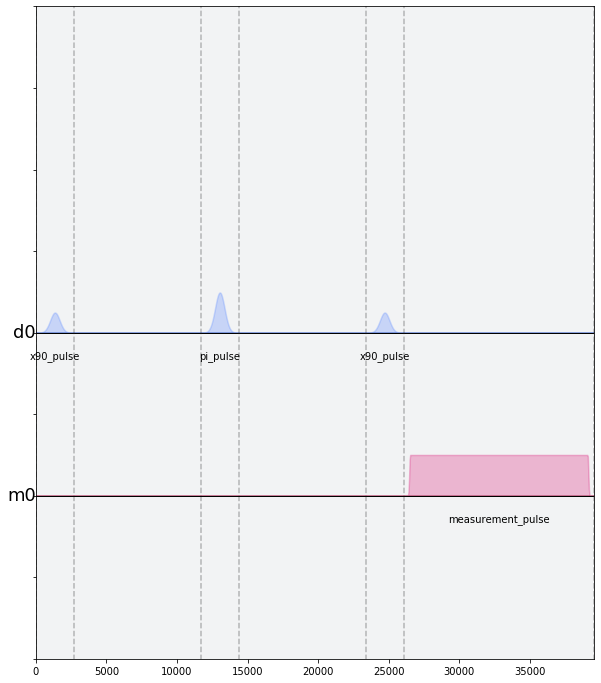

.. code:: ipython3

    # Execution settings
    num_shots_per_point = 512
    
    t2_experiment = assemble(t2_schedules,
                             backend=backend,
                             meas_level=1,
                             meas_return='avg',
                             shots=num_shots_per_point,
                             schedule_los=[{drive_chan: precise_qubit_freq}]
                                          * len(t2_schedules))

.. code:: ipython3

    job = backend.run(t2_experiment)
    # print(job.job_id())
    job_monitor(job)

.. parsed-literal::

    Job Status: job has successfully run

.. code:: ipython3

    t2_results = job.result(timeout=120)

.. code:: ipython3

    t2_values = []
    for i in range(len(taus_us)):
        t2_values.append(t2_results.get_memory(i)[qubit])
    
    plt.scatter(2*taus_us, t2_values, color='black')
    plt.xlabel('Delay between X90 pulse and $\pi$ pulse [$\mu$s]', fontsize=15)
    plt.ylabel('Measured Signal [a.u.]', fontsize=15)
    plt.title('Hahn Echo Experiment', fontsize=15)
    plt.show()

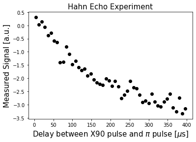

.. code:: ipython3

    fit_params, y_fit = fit_function(2*taus_us, t2_values,
                 lambda x, A, B, T2: (A * np.exp(-x / T2) + B),
                 [-1.2e15, -2.4e15, 20])
    
    _, _, T2 = fit_params
    print()
    
    plt.scatter(2*taus_us, t2_values, color='black')
    plt.plot(2*taus_us, y_fit, color='red', label=f"T2 = {T2:.2f} us")
    plt.xlim(0, np.max(2*taus_us))
    plt.xlabel('Delay between X90 pulse and $\pi$ pulse [$\mu$s]', fontsize=15)
    plt.ylabel('Measured Signal [a.u.]', fontsize=15)
    plt.title('Hahn Echo Experiment', fontsize=15)
    plt.legend()
    plt.show()

.. parsed-literal::

    

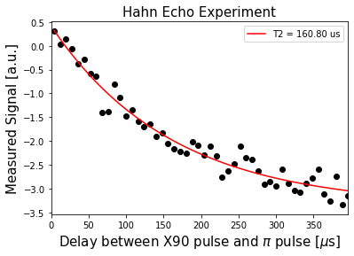

C. Dynamical decoupling 
------------------------

A single :math:`\pi` pulse is able to eliminate quasi-static noise due
to the reversal of phase accumulation. This concept can be extended to
noise that cannot be approximated as quasi-static by applying several
:math:`\pi` pulses in succession. This technique, commonly known as
dynamical decoupling, allows us to cancel different frequencies of noise
and is used to extract longer coherence times from qubits.

.. code:: ipython3

    # DD experiment parameters
    tau_us_min = 1
    tau_us_max = 40
    tau_step_us = 1.5
    taus_us = np.arange(tau_us_min, tau_us_max, tau_step_us)
    # Convert to units of dt
    taus_dt = taus_us * us / dt
    num_pi_pulses = 6 # apply two pi pulses
    print(f"Total time ranges from {2.*num_pi_pulses*taus_us[0]} to {2.*num_pi_pulses*taus_us[-1]} us")

.. parsed-literal::

    Total time ranges from 12.0 to 462.0 us

.. code:: ipython3

    T2DD_schedules = []
    for delay in taus_dt:
        this_schedule = pulse.Schedule(name=f"T2DD delay = {delay * dt/us} us")
        this_schedule |= x90_pulse(drive_chan)
        this_schedule |= pi_pulse(drive_chan) << int(this_schedule.duration + delay)
    
        for _ in range(num_pi_pulses - 1):
            this_schedule |= pi_pulse(drive_chan) << int(this_schedule.duration + 2*delay)
    
        this_schedule |= x90_pulse(drive_chan) << int(this_schedule.duration + delay)
        this_schedule |= measure_schedule << int(this_schedule.duration)
        
        T2DD_schedules.append(this_schedule)

.. code:: ipython3

    T2DD_schedules[0].draw(channels_to_plot=[drive_chan, meas_chan], label=True, scaling=1.0)

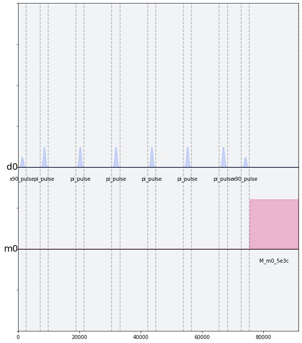

.. code:: ipython3

    num_shots_per_point = 1024
    
    T2DD_experiment = assemble(T2DD_schedules,
                                 backend=backend,
                                 meas_level=1,
                                 meas_return='avg',
                                 shots=num_shots_per_point,
                                 schedule_los=[{drive_chan: precise_qubit_freq}]
                                              * len(T2DD_schedules))

.. code:: ipython3

    job = backend.run(T2DD_experiment)
    # print(job.job_id())
    job_monitor(job)

.. parsed-literal::

    Job Status: job has successfully run

.. code:: ipython3

    T2DD_results = job.result(timeout=120)

.. code:: ipython3

    times_us = 2.*num_pi_pulses*taus_us
    DD_values = []
    for i in range(len(taus_us)):
        DD_values.append(T2DD_results.get_memory(i)[qubit])
    
    plt.scatter(times_us, DD_values, color='black')
    plt.xlim(0, np.max(times_us))
    plt.xlabel('Total time before measurement [$\mu$s]', fontsize=15)
    plt.ylabel('Measured Signal [a.u.]', fontsize=15)
    plt.title('Dynamical Decoupling Experiment', fontsize=15)
    plt.show()

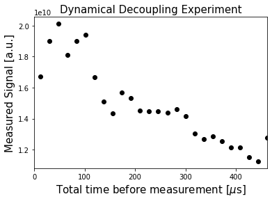

.. code:: ipython3

    # Fit the data
    fit_func = lambda x, A, B, T2DD: (A * np.exp(-x / T2DD) + B)
    fitparams, conv = curve_fit(fit_func, times_us, DD_values, [1.7e10, 0.8e10, 150])
    
    _, _, T2DD = fitparams
    plt.scatter(times_us, DD_values, color='black')
    plt.plot(times_us, fit_func(times_us, *fitparams), color='red', label=f"T2DD = {T2DD:.2f} us")
    plt.xlim([0, np.max(times_us)])
    plt.xlabel('Total time before measurement [$\mu$s]', fontsize=15)
    plt.ylabel('Measured Signal [a.u.]', fontsize=15)
    plt.title('Dynamical Decoupling Experiment', fontsize=15)
    plt.legend()
    plt.show()

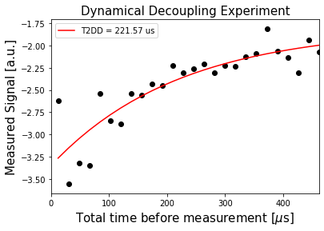

Part 4. References 
===================

1. H. Abraham, I. Y. Akhalwaya, G. Aleksandrowicz, T. Alexander, G.
   Alexandrowics, E. Arbel, A. Asfaw, C. Azaustre, P. Barkoutsos, G.
   Barron, L. Bello, Y. Ben-Haim, L. S. Bishop, S. Bosch, D. Bucher, CZ,
   F. Cabrera, P. Calpin, L. Capelluto, J. Carballo, C.-F. Chen, A.
   Chen, R. Chen, J. M. Chow, C. Claus, A. W. Cross, A. J. Cross, J.
   Cruz- Benito, C. Culver, A. D. C ́orcoles-Gonzales, S. Dague, M.
   Dartiailh, A. R. Davila, D. Ding, E. Dumitrescu, K. Dumon, I. Duran,
   P. Eendebak, D. Egger, M. Everitt, P. M. Fern ́andez, A. Frisch, A.
   Fuhrer, J. Gacon, Gadi, B. G. Gago, J. M. Gambetta, L. Garcia, S.
   Garion, Gawel-Kus, L. Gil, J. Gomez-Mosquera, S. de la Puente Gonz
   ́alez, D. Green-
   berg,J.A.Gunnels,I.Haide,I.Hamamura,V.Havlicek,J.Hellmers,L􏰀.Herok,H.Horii,
   C. Howington, W. Hu, S. Hu, H. Imai, T. Imamichi, R. Iten, T. Itoko,
   A. Javadi-Abhari, Jessica, K. Johns, N. Kanazawa, A. Karazeev, P.
   Kassebaum, V. Krishnan, K. Kr- sulich, G. Kus, R. LaRose, R. Lambert,
   J. Latone, S. Lawrence, P. Liu, P. B. Z. Mac, Y. Maeng, A. Malyshev,
   J. Marecek, M. Marques, D. Mathews, A. Matsuo, D. T. Mc- Clure, C.
   McGarry, D. McKay, S. Meesala, A. Mezzacapo, R. Midha, Z. Minev, P.
   Mu- rali, J. Mu ̈ggenburg, D. Nadlinger, G. Nannicini, P. Nation, Y.
   Naveh, Nick-Singstock, P. Niroula, H. Norlen, L. J. O’Riordan, S.
   Oud, D. Padilha, H. Paik, S. Perriello, A. Phan, M. Pistoia, A.
   Pozas-iKerstjens, V. Prutyanov, J. P ́erez, Quintiii, R. Raymond, R.
   M.-C. Redondo, M. Reuter, D. M. Rodr ́ıguez, M. Ryu, M. Sandberg, N.
   Sathaye, B. Schmitt, C. Schnabel, T. L. Scholten, E. Schoute, I. F.
   Sertage, Y. Shi, A. Silva, Y. Siraichi, S. Sivarajah, J. A. Smolin,
   M. Soeken, D. Steenken, M. Stypulkoski, H. Takahashi, C. Taylor, P.
   Taylour, S. Thomas, M. Tillet, M. Tod, E. de la Torre, K. Trabing, M.
   Treinish, TrishaPe, W. Turner, Y. Vaknin, C. R. Valcarce, F. Varchon,
   D. Vogt- Lee, C. Vuillot, J. Weaver, R. Wieczorek, J. A. Wildstrom,
   R. Wille, E. Winston, J. J. Woehr, S. Woerner, R. Woo, C. J. Wood, R.
   Wood, S. Wood, J. Wootton, D. Yeralin, J. Yu, L. Zdanski, Zoufalc,
   azulehner, drholmie, fanizzamarco, kanejess, klinvill, merav aharoni,
   ordmoj, tigerjack, yang.luh, and yotamvakninibm, “Qiskit: An
   open-source framework for quantum computing,” 2019.
2. D. C. McKay, T. Alexander, L. Bello, M. J. Biercuk, L. Bishop, J.
   Chen, J. M. Chow, A. D. C ́orcoles, D. Egger, S. Filipp, J. Gomez, M.
   Hush, A. Javadi-Abhari, D. Moreda, P. Nation, B. Paulovicks, E.
   Winston, C. J. Wood, J. Wootton, and J. M. Gambetta, “Qiskit backend
   specifications for OpenQASM and OpenPulse experiments,” 2018.

.. code:: ipython3

    import qiskit.tools.jupyter
    %qiskit_version_table

.. raw:: html

    <h3>Version Information</h3><table><tr><th>Qiskit Software</th><th>Version</th></tr><tr><td>Qiskit</td><td>0.14.1</td></tr><tr><td>Terra</td><td>0.11.1</td></tr><tr><td>Aer</td><td>0.3.4</td></tr><tr><td>Ignis</td><td>0.2.0</td></tr><tr><td>Aqua</td><td>0.6.2</td></tr><tr><td>IBM Q Provider</td><td>0.4.5</td></tr><tr><th>System information</th></tr><tr><td>Python</td><td>3.7.4 (default, Aug 13 2019, 15:17:50) 
    [Clang 4.0.1 (tags/RELEASE_401/final)]</td></tr><tr><td>OS</td><td>Darwin</td></tr><tr><td>CPUs</td><td>8</td></tr><tr><td>Memory (Gb)</td><td>32.0</td></tr><tr><td colspan='2'>Tue Jan 28 13:09:07 2020 GMT</td></tr></table>

