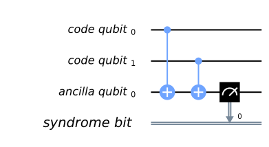
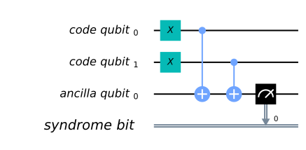
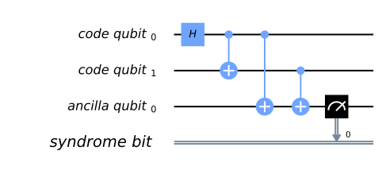
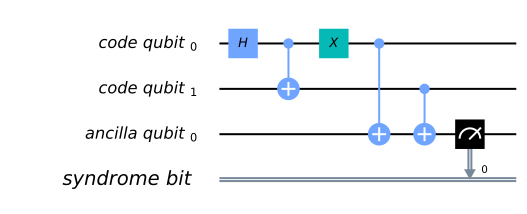
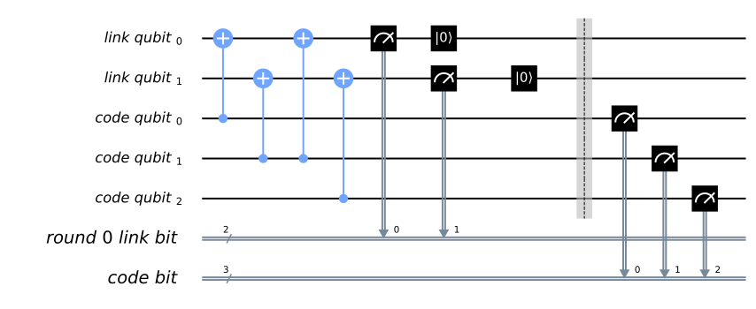
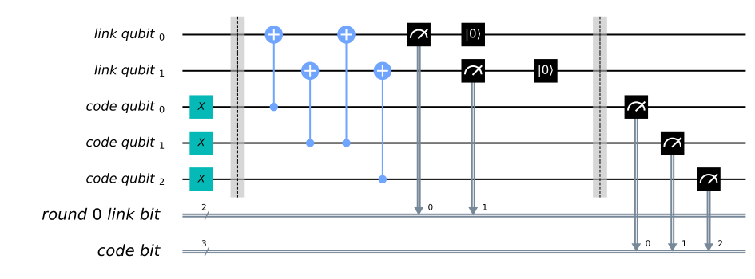
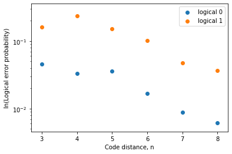

Introduction to Quantum Error Correction via the Repetition Code
================================================================

Introduction
------------

Quantum computing requires us to encode information in qubits. Most
quantum algorithms developed over the past few decades have assumed that
these qubits are perfect: they can be prepared in any state we desire,
and be manipulated with complete precision. Qubits that obey these
assumptions are often known as *logical qubits*.

The last few decades have also seen great advances in finding physical
systems that behave as qubits, with better quality qubits being
developed all the time. However, the imperfections can never be removed
entirely. These qubits will always be much too imprecise to serve
directly as logical qubits. Instead, we refer to them as *physical
qubits*.

In the current era of quantum computing, we seek to use physical qubits
despite their imperfections, by designing custom algorithms and using
error mitigation effects. For the future era of fault-tolerance,
however, we must find ways to build logical qubits from physical qubits.
This will be done through the process of quantum error correction, in
which logical qubits are encoded in a a large numbers of physical
qubits. The encoding is maintained by constantly putting the physical
qubits through a highly entangling circuit. Auxilliary degrees of
freedom are also constantly measured, to detect signs of errors and
allow their effects to be removed. The operations on the logical qubits
required to implement quantum computation will be performed by
essentially making small perturbations to this procedure.

Because of the vast amount effort required for this process, most
operations performed in fault-tolerant quantum computers will be done to
serve the purpose of error detection and correction. So when
benchmarking our progress towards fault-tolerant quantum computation, we
must keep track of how well our devices perform error correction.

In this chapter we will look at a particular example of error
correction: the repetition code. Though not a true example of quantum
error correction - it uses physical qubits to encode a logical *bit*,
rather than a qubit - it serves as a simple guide to all the basic
concepts in any quantum error correcting code. We will also see how it
can be run on current prototype devices.

Introduction to the repetition code
-----------------------------------

The basics of error correction
~~~~~~~~~~~~~~~~~~~~~~~~~~~~~~

The basic ideas behind error correction are the same for classical
information as for classical information. This allows us to begin by
considering a very straightforward example: speaking on the phone. If
someone asks you a question to which the answer is ‘yes’ or ‘no’, the
way you give your response will depend on two factors:

-  How important is it that you are understood correctly?
-  How good is your connection?

Both of these can be paramaterized with probabilities. For the first, we
can use :math:`P_a`, the maximum acceptable probability of being
misunderstood. If you are being asked to confirm a preference for ice
cream flavours, and don’t mind too much if you get vanilla rather than
chocolate, :math:`P_a` might be quite high. If you are being asked a
question on which someone’s life depends, however, :math:`P_a` will be
much lower.

For the second we can use :math:`p`, the probability that your answer is
garbled by a bad connectiom. For simplicity, let’s imagine a case where
a garbled ‘yes’ doesn’t simply sound like nonsense, but sounds like a
‘no’. And similarly a ‘no’ is transformed into ‘yes’. Then :math:`p` is
the probability that you are completely misunderstood.

A good connection or a relatively unimportant question will result in
:math:`p<P_a`. In this case it is fine to simply answer in the most
direct way possible: you just say ‘yes’ or ‘no’.

If, however, your connection is poor and your answer is important, we
will have :math:`p>P_a`. A single ‘yes’ or ‘no’ is not enough in this
case. The probability of being misunderstood would be too high. Instead
we must encode our answer in a more complex structure, allowing the
receiver to decode our meaning despite the possibility of the message
being disrupted. The simplest method is the one that many would do
without thinking: simply repeat the answer many times. For example say
‘yes, yes, yes’ instead of ‘yes’ or ‘no, no no’ instead of ‘no’.

If the receiver hears ‘yes, yes, yes’ in this case, they will of course
conclude that the sender meant ‘yes’. If they hear ‘no, yes, yes’, ‘yes,
no, yes’ or ‘yes, yes, no’, they will probably conclude the same thing,
since there is more positivity than negativity in the answer. To be
misunderstood in this case, at least two of the replies need to be
garbled. The probability for this, :math:`P`, will be less than
:math:`p`. When encoded in this way, the message therefore becomes more
likely to be understood. The code cell below shows an example of this.

.. code:: ipython3

    p = 0.01
    P = 3 * p**2 * (1-p) + p**3 # probability of 2 or 3 errors
    print('Probability of a single reply being garbled:',p)
    print('Probability of a the majority of three replies being garbled:',P)

.. parsed-literal::

    Probability of a single reply being garbled: 0.01
    Probability of a the majority of three replies being garbled: 0.00029800000000000003

If :math:`P<P_a`, this technique solves our problem. If not, we can
simply add more repetitions. The fact that :math:`P<p` above comes from
the fact that we need at least two replies to be garbled to flip the
majority, and so even the most likely possibilities have a probability
of :math:`\sim p^2`. For five repetitions we’d need at least three
replies to be garbled to flip the majority, which happens with
probability :math:`\sim p^3`. The value for :math:`P` in this case would
then be even lower. Indeed, as we increase the number of repetitions,
:math:`P` will decrease exponentially. No matter how bad the connection,
or how certain we need to be of our message getting through correctly,
we can acheive it by just repeating our answer enough times.

Though this is a simple example, it contains all the aspects of error
correction. \* There is some information to be sent or stored: In this
case, a ‘yes’ or ’no. \* The information is encoded in a larger system
to protect it against noise: In this case, by repeating the message. \*
The information is finally decoded, mitigating for the effects of noise:
In this case, by trusting the majority of the transmitted messages.

This same encoding scheme can also be used for binary, by simply
substituting ``0`` and ``1`` for ‘yes’ and ’no. It can therefore also be
easily generalized to qubits by using the states
:math:`\left|0\right\rangle` and :math:`\left|1\right\rangle`. In each
case it is known as the *repetition code*. Many other forms of encoding
are also possible in both the classical and quantum cases, which
outperform the repetition code in many ways. However, its status as the
simplest encoding does lend it to certain applications. One is exactly
what it is used for in Qiskit: as the first and simplest test of
implementing the ideas behind quantum error correction.

Correcting errors in qubits
~~~~~~~~~~~~~~~~~~~~~~~~~~~

We will now implement these ideas explicitly using Qiskit. To see the
effects of imperfect qubits, we simply can use the qubits of the
prototype devices. We can also reproduce the effects in simulations. The
function below creates a simple noise models in order to do this. These
go beyond the simple case dicussed earlier, of a single noise event
which happens with a probability :math:`p`. Instead we consider two
forms of error that can occur. One is a gate error: an imperfection in
any operation we perform. We model this here in a simple way, using
so-called depolarizing noise. The effect of this will be, with
probabilty :math:`p_{gate}` ,to replace the state of any qubit with a
completely random state. For two qubit gates, it is applied
independently to each qubit. The other form of noise is that for
measurement. This simply flips between a ``0`` to a ``1`` and vice-versa
immediately before measurement with probability :math:`p_{meas}`.

.. code:: ipython3

    from qiskit.providers.aer.noise import NoiseModel
    from qiskit.providers.aer.noise.errors import pauli_error, depolarizing_error
    
    def get_noise(p_meas,p_gate):
    
        error_meas = pauli_error([('X',p_meas), ('I', 1 - p_meas)])
        error_gate1 = depolarizing_error(p_gate, 1)
        error_gate2 = error_gate1.tensor(error_gate1)
    
        noise_model = NoiseModel()
        noise_model.add_all_qubit_quantum_error(error_meas, "measure") # measurement error is applied to measurements
        noise_model.add_all_qubit_quantum_error(error_gate1, ["x"]) # single qubit gate error is applied to x gates
        noise_model.add_all_qubit_quantum_error(error_gate2, ["cx"]) # two qubit gate error is applied to cx gates
            
        return noise_model

With this we’ll now create such a noise model with a probability of
:math:`1\%` for each type of error.

.. code:: ipython3

    noise_model = get_noise(0.01,0.01)

Let’s see what affect this has when try to store a ``0`` using three
qubits in state :math:`\left|0\right\rangle`. We’ll repeat the process
``shots=1024`` times to see how likely different results are.

.. code:: ipython3

    from qiskit import QuantumCircuit, execute, Aer
    
    qc0 = QuantumCircuit(3,3,name='0') # initialize circuit with three qubits in the 0 state
    
    qc0.measure(qc0.qregs[0],qc0.cregs[0]) # measure the qubits
    
    # run the circuit with th noise model and extract the counts
    counts = execute( qc0, Aer.get_backend('qasm_simulator'),noise_model=noise_model).result().get_counts()
    
    print(counts)

.. parsed-literal::

    {'010': 12, '000': 999, '100': 4, '001': 9}

Here we see that almost all results still come out ``'000'``, as they
would if there was no noise. Of the remaining possibilities, those with
a majority of ``0``\ s are most likely. In total, much less than 100
samples come out with a majority of ``1``\ s. When using this circuit to
encode a ``0``, this means that :math:`P<1\%`

Now let’s try the same for storing a ``1`` using three qubits in state
:math:`\left|1\right\rangle`.

.. code:: ipython3

    qc1 = QuantumCircuit(3,3,name='0') # initialize circuit with three qubits in the 0 state
    qc1.x(qc1.qregs[0]) # flip each 0 to 1
    
    qc1.measure(qc1.qregs[0],qc1.cregs[0]) # measure the qubits
    
    # run the circuit with th noise model and extract the counts
    counts = execute( qc1, Aer.get_backend('qasm_simulator'),noise_model=noise_model).result().get_counts()
    
    print(counts)

.. parsed-literal::

    {'010': 1, '011': 25, '110': 13, '111': 962, '101': 23}

The number of samples that come out with a majority in the wrong state
(``0`` in this case) is again much less than 100, so :math:`P<1\%`.
Whether we store a ``0`` or a ``1``, we can retrieve the information
with a smaller probability of error than either of our sources of noise.

This was possible because the noise we considered was relatively weak.
As we increase :math:`p_{meas}` and :math:`p_{gate}`, the higher the
probability :math:`P` will be. The extreme case of this is for either of
them to have a :math:`50/50` chance of applying the bit flip error,
``x``. For example, let’s run the same circuit as before but with
:math:`p_{meas}=0.5` and :math:`p_{gate}=0`.

.. code:: ipython3

    noise_model = get_noise(0.5,0.0)
    counts = execute( qc1, Aer.get_backend('qasm_simulator'),noise_model=noise_model).result().get_counts()
    print(counts)

.. parsed-literal::

    {'110': 120, '001': 126, '100': 128, '101': 117, '010': 141, '011': 137, '111': 142, '000': 113}

With this noise, all outcomes occur with equal probability, with
differences in results being due only to statistical noise. No trace of
the encoded state remains. This is an important point to consider for
error correction: sometimes the noise is too strong to be corrected. The
optimal approach is to combine a good way of encoding the information
you require, with hardware whose noise is not too strong.

Storing qubits
~~~~~~~~~~~~~~

So far, we have considered cases where there is no delay between
encoding and decoding. For qubits, this means that there is no
significant amount of time that passes between initializing the circuit,
and making the final measurements.

However, there are many cases for which there will be a significant
delay. As an obvious example, one may wish to encode a quantum state and
store it for a long time, like a quantum hard drive. A less obvious but
much more important example is performing fault-tolerant quantum
computation itself. For this, we need to store quantum states and
preserve their integrity during the computation. This must also be done
in a way that allows us to manipulate the stored information in any way
we need, and which corrects any errors we may introduce when performing
the manipulations.

In all cases, we need account for the fact that errors do not only occur
when something happens (like a gate or measurement), they also occur
when the qubits are idle. Such noise is due to the fact that the qubits
interact with each other and their environment. The longer we leave our
qubits idle for, the greater the effects of this noise becomes. If we
leave them for long enough, we’ll encounter a situation like the
:math:`p_{meas}=0.5` case above, where the noise is too strong for
errors to be reliably corrected.

The solution is to keep measuring throughout. No qubit is left idle for
too long. Instead, information is constantly being extracted from the
system to keep track of the errors that have occurred.

For the case of classical information, where we simply wish to store a
``0`` or ``1``, this can be done by just constantly measuring the value
of each qubit. By keeping track of when the values change due to noise,
we can easily deduce a history of when errors occurred.

For quantum information, however, it is not so easy. For example,
consider the case that we wish to encode the logical state
:math:`\left|+\right\rangle`. Our encoding is such that

.. math:: \left|0\right\rangle \rightarrow \left|000\right\rangle,~~~ \left|1\right\rangle \rightarrow \left|111\right\rangle.

To encode the logical :math:`\left|+\right\rangle` state we therefore
need

.. math:: \left|+\right\rangle=\frac{1}{\sqrt{2}}\left(\left|0\right\rangle+\left|1\right\rangle\right)\rightarrow \frac{1}{\sqrt{2}}\left(\left|000\right\rangle+\left|111\right\rangle\right).

With the repetition encoding that we are using, a z measurement (which
distinguishes between the :math:`\left|0\right\rangle` and
:math:`\left|1\right\rangle` states) of the logical qubit is done using
a z measurement of each physical qubit. The final result for the logical
measurement is decoded from the physical qubit measurement results by
simply looking which output is in the majority.

As mentioned earlier, we can keep track of errors on logical qubits that
are stored for a long time by constantly performing z measurements of
the physical qubits. However, note that this effectively corresponds to
constantly peforming z measurements of the physical qubits. This is fine
if we are simply storing a ``0`` or ``1``, but it has undesired effects
if we are storing a superposition. Specifically: the first time we do
such a check for errors, we will collapse the superposition.

This is not ideal. If we wanted to do some computation on our logical
qubit, or is we wish to peform a basis change before final measurement,
we need to preserve the superposition. Destroying it is an error. But
this is not an error caused by imperfections in our devices. It is an
error that we have introduced as part of our attempts to correct errors.
And since we cannot hope to recreate any arbitrary superposition stored
in our quantum computer, it is an error than cannot be corrected.

For this reason, we must find another way of keeping track of the errors
that occur when our logical qubit is stored for long times. This should
give us the information we need to detect and correct errors, and to
decode the final measurment result with high probability. However, it
should not cause uncorrectable errors to occur during the process by
collapsing superpositions that we need to preserve.

The way to do this is with the following circuit element.

.. code:: ipython3

    from qiskit import QuantumRegister, ClassicalRegister
    %config InlineBackend.figure_format = 'svg' # Makes the images look nice
    
    cq = QuantumRegister(2,'code\ qubit\ ')
    lq = QuantumRegister(1,'ancilla\ qubit\ ')
    sb = ClassicalRegister(1,'syndrome\ bit\ ')
    qc = QuantumCircuit(cq,lq,sb)
    qc.cx(cq[0],lq[0])
    qc.cx(cq[1],lq[0])
    qc.measure(lq,sb)
    qc.draw(output='mpl')

Here we have three physical qubits. Two are called ‘code qubits’, and
the other is called an ‘ancilla qubit’. One bit of output is extracted,
called the syndrome bit. The ancilla qubit is always initialized in
state :math:`\left|0\right\rangle`. The code qubits, however, can be
initialized in different states. To see what affect different inputs
have on the output, we can create a circuit ``qc_init`` that prepares
the code qubits in some state, and then run the circuit ``qc_init+qc``.

First, the trivial case: ``qc_init`` does nothing, and so the code
qubits are initially :math:`\left|00\right\rangle`.

.. code:: ipython3

    qc_init = QuantumCircuit(cq)
    
    (qc_init+qc).draw(output='mpl')

.. code:: ipython3

    counts = execute( qc_init+qc, Aer.get_backend('qasm_simulator')).result().get_counts()
    print('Results:',counts)

.. parsed-literal::

    Results: {'0': 1024}

The outcome, in all cases, is ``0``.

Now let’s try an initial state of :math:`\left|11\right\rangle`.

.. code:: ipython3

    qc_init = QuantumCircuit(cq)
    qc_init.x(cq)
    
    (qc_init+qc).draw(output='mpl')

.. code:: ipython3

    counts = execute( qc_init+qc, Aer.get_backend('qasm_simulator')).result().get_counts()
    print('Results:',counts)

.. parsed-literal::

    Results: {'0': 1024}

The outcome in this case is also always ``0``. Given the linearity of
quantum mechanics, we can expect the same to be true also for any
superposition of :math:`\left|00\right\rangle` and
:math:`\left|11\right\rangle`, such as the example below.

.. code:: ipython3

    qc_init = QuantumCircuit(cq)
    qc_init.h(cq[0])
    qc_init.cx(cq[0],cq[1])
    
    (qc_init+qc).draw(output='mpl')

.. code:: ipython3

    counts = execute( qc_init+qc, Aer.get_backend('qasm_simulator')).result().get_counts()
    print('Results:',counts)

.. parsed-literal::

    Results: {'0': 1024}

The opposite outcome will be found for an initial state of
:math:`\left|01\right\rangle`, :math:`\left|10\right\rangle` or any
superposition thereof.

.. code:: ipython3

    qc_init = QuantumCircuit(cq)
    qc_init.h(cq[0])
    qc_init.cx(cq[0],cq[1])
    qc_init.x(cq[0])
    
    (qc_init+qc).draw(output='mpl')

.. code:: ipython3

    counts = execute( qc_init+qc, Aer.get_backend('qasm_simulator')).result().get_counts()
    print('Results:',counts)

.. parsed-literal::

    Results: {'1': 1024}

In such cases the output is always ``'1'``.

This measurement is therefore telling us about a collective property of
multiple qubits. Specifically, it looks at the two code qubits and
determines whether their state is the same or different in the z basis.
For basis states that are the same in the z basis, like
:math:`\left|00\right\rangle` and :math:`\left|11\right\rangle`, the
measurement simply returns ``0``. It also does so for any superposition
of these. Since it does not distinguish between these states in any way,
it also does not collapse such a superposition.

Similarly, For basis states that are different in the z basis it returns
a ``1``. This occurs for :math:`\left|01\right\rangle`,
:math:`\left|10\right\rangle` or any superposition thereof.

Now suppose we apply such a ‘syndrome measurement’ on all pairs of
physical qubits in our repetition code. If their state is described by a
repeated :math:`\left|0\right\rangle`, a repeated
:math:`\left|1\right\rangle`, or any superposition thereof, all the
syndrome measurements will return ``0``. Given this result, we will know
that our states are indeed encoded in the repeated states that we want
them to be, and can deduce that no errors have occurred. If some
syndrome measurements return ``1``, however, it is a signature of an
error. We can therefore use these measurement results to determine how
to decode the result.

Quantum repetition code
~~~~~~~~~~~~~~~~~~~~~~~

We now know enough to understand exactly how the quantum version of the
repetition code is implemented

We can use it in Qiskit by importing the required tools from Ignis.

.. code:: ipython3

    from qiskit.ignis.verification.topological_codes import RepetitionCode
    from qiskit.ignis.verification.topological_codes import lookuptable_decoding
    from qiskit.ignis.verification.topological_codes import GraphDecoder

We are free to choose how many physical qubits we want the logical qubit
to be encoded in. We can also choose how many times the syndrome
measurements will be applied while we store our logical qubit, before
the final readout measurement. Let us start with the smallest
non-trivial case: three repetitions and one syndrome measurement round.
The circuits for the repetition code can then be created automatically
from the using the ``RepetitionCode`` object from Qiskit-Ignis.

.. code:: ipython3

    n = 3
    T = 1
    
    code = RepetitionCode(n,T)

With this we can inspect various properties of the code, such as the
names of the qubit registers used for the code and ancilla qubits.

The ``RepetitionCode`` contains two quantum circuits that implement the
code: One for each of the two possible logical bit values. Here are
those for logical ``0`` and ``1``, respectively.

.. code:: ipython3

    # this bit is just needed to make the labels look nice
    for reg in code.circuit['0'].qregs+code.circuit['1'].cregs:
        reg.name = reg.name.replace('_','\ ') + '\ '
    
    code.circuit['0'].draw(output='mpl')

.. code:: ipython3

    code.circuit['1'].draw(output='mpl')

In these circuits, we have two types of physical qubits. There are the
‘code qubits’, which are the three physical qubits across which the
logical state is encoded. There are also the ‘link qubits’, which serve
as the ancilla qubits for the syndrome measurements.

Our single round of syndrome measurements in these circuits consist of
just two syndrome measurements. One compares code qubits 0 and 1, and
the other compares code qubits 1 and 2. One might expect that a further
measurement, comparing code qubits 0 and 2, should be required to create
a full set. However, these two are sufficient. This is because the
information on whether 0 and 2 have the same z basis state can be
inferred from the same information about 0 and 1 with that for 1 and 2.
Indeed, for :math:`n` qubits, we can get the required information from
just :math:`n-1` syndrome measurements of neighbouring pairs of qubits.

Running these circuits on a simulator without any noise leads to very
simple results.

.. code:: ipython3

    def get_raw_results(code,noise_model=None):
    
        circuits = code.get_circuit_list()
        job = execute( circuits, Aer.get_backend('qasm_simulator'), noise_model=noise_model )
        raw_results = {}
        for log in ['0','1']:
            raw_results[log] = job.result().get_counts(log)
        return raw_results
    
    raw_results = get_raw_results(code)
    for log in raw_results:
        print('Logical',log,':',raw_results[log],'\n')

.. parsed-literal::

    Logical 0 : {'000 00': 1024} 
    
    Logical 1 : {'111 00': 1024} 
    

Here we see that the output comes in two parts. The part on the right
holds the outcomes of the two syndrome measurements. That on the left
holds the outcomes of the three final measurements of the code qubits.

For more measurement rounds, :math:`T=4` for example, we would have the
results of more syndrome measurements on the right.

.. code:: ipython3

    code = RepetitionCode(n,4)
    
    raw_results = get_raw_results(code)
    for log in raw_results:
        print('Logical',log,':',raw_results[log],'\n')

.. parsed-literal::

    Logical 0 : {'000 00 00 00 00': 1024} 
    
    Logical 1 : {'111 00 00 00 00': 1024} 
    

For more repetitions, :math:`n=5` for example, each set of measurements
would be larger. The final measurement on the left would be of :math:`n`
qubits. The :math:`T` syndrome measurements would each be of the
:math:`n-1` possible neighbouring pairs.

.. code:: ipython3

    code = RepetitionCode(5,4)
    
    raw_results = get_raw_results(code)
    for log in raw_results:
        print('Logical',log,':',raw_results[log],'\n')

.. parsed-literal::

    Logical 0 : {'00000 0000 0000 0000 0000': 1024} 
    
    Logical 1 : {'11111 0000 0000 0000 0000': 1024} 
    

Lookup table decoding
~~~~~~~~~~~~~~~~~~~~~

Now let’s return to the :math:`n=3`, :math:`T=1` example and look at a
case with some noise.

.. code:: ipython3

    code = RepetitionCode(3,1)
    
    noise_model = get_noise(0.05,0.05)
    
    raw_results = get_raw_results(code,noise_model)
    for log in raw_results:
        print('Logical',log,':',raw_results[log],'\n')

.. parsed-literal::

    Logical 0 : {'010 11': 3, '001 10': 3, '011 01': 1, '010 10': 3, '100 00': 49, '110 01': 1, '011 00': 6, '010 01': 22, '000 01': 84, '101 00': 3, '100 10': 3, '000 10': 50, '100 01': 9, '000 00': 686, '110 00': 4, '011 10': 1, '001 00': 45, '001 01': 3, '010 00': 44, '000 11': 4} 
    
    Logical 1 : {'110 11': 3, '101 01': 19, '101 11': 25, '001 11': 1, '001 10': 4, '011 01': 3, '011 11': 4, '010 10': 2, '100 00': 6, '110 01': 23, '011 00': 46, '111 01': 67, '010 01': 6, '100 11': 1, '101 00': 43, '100 10': 1, '101 10': 7, '100 01': 1, '111 11': 12, '110 10': 6, '110 00': 42, '011 10': 25, '111 10': 76, '001 00': 3, '111 00': 589, '001 01': 4, '010 00': 5} 
    

Here we have created ``raw_results``, a dictionary that holds both the
results for a circuit encoding a logical ``0`` and ``1`` encoded for a
logical ``1``.

Our task when confronted with any of the possible outcomes we see here
is to determine what the outcome should have been, if there was no
noise. For an outcome of ``'000 00'`` or ``'111 00'``, the answer is
obvious. These are the results we just saw for a logical ``0`` and
logical ``1``, respectively, when no errors occur. The former is the
most common outcome for the logical ``0`` even with noise, and the
latter is the most common for the logical ``1``. We will therefore
conclude that the outcome was indeed that for logical ``0`` whenever we
encounter ``'000 00'``, and the same for logical ``1`` when we encounter
``'111 00'``.

Though this tactic is optimal, it can nevertheless fail. Note that
``'111 00'`` typically occurs in a handful of cases for an encoded
``0``, and ``'00 00'`` similarly occurs for an encoded ``1``. In this
case, through no fault of our own, we will incorrectly decode the
output. In these cases, a large number of errors conspired to make it
look like we had a noiseless case of the opposite logical value, and so
correction becomes impossible.

We can employ a similar tactic to decode all other outcomes. The outcome
``'001 00'``, for example, occurs far more for a logical ``0`` than a
logical ``1``. This is because it could be caused by just a single
measurement error in the former case (which incorrectly reports a single
``0`` to be ``1``), but would require at least two errors in the latter.
So whenever we see ``'001 00'``, we can decode it as a logical ``0``.

Applying this tactic over all the strings is a form of so-called ‘lookup
table decoding’. This is where every possible outcome is analyzed, and
the most likely value to decode it as is determined. For many qubits,
this quickly becomes intractable, as the number of possible outcomes
becomes so large. In these cases, more algorithmic decoders are needed.
However, lookup table decoding works well for testing out small codes.

We can use tools in Qiskit to implement lookup table decoding for any
code. For this we need two sets of results. One is the set of results
that we actually want to decode, and for which we want to calcate the
probability of incorrect decoding, :math:`P`. We will use the
``raw_results`` we already have for this.

The other set of results is one to be used as the lookup table. This
will need to be run for a large number of samples, to ensure that it
gets good statistics for each possible outcome. We’ll use
``shots=10000``.

.. code:: ipython3

    circuits = code.get_circuit_list()
    job = execute( circuits, Aer.get_backend('qasm_simulator'), noise_model=noise_model, shots=10000 )
    table_results = {}
    for log in ['0','1']:
        table_results[log] = job.result().get_counts(log)

With this data, which we call ``table_results``, we can now use the
``lookuptable_decoding`` function from Qiskit. This takes each outcome
from ``raw_results`` and decodes it with the information in
``table_results``. Then it checks if the decoding was correct, and uses
this information to calculate :math:`P`.

.. code:: ipython3

    P = lookuptable_decoding(raw_results,table_results)
    print('P =',P)

.. parsed-literal::

    P = {'0': 0.0285, '1': 0.0184}

Here we see that the values for :math:`P` are lower than those for
:math:`p_{meas}` and :math:`p_{gate}`, so we get an improvement in the
reliability for storing the bit value. Note also that the value of
:math:`P` for an encoded ``1`` is higher than that for ``0``. This is
because the encoding of ``1`` requires the application of ``x`` gates,
which are an additional source of noise.

Graph theoretic decoding
~~~~~~~~~~~~~~~~~~~~~~~~

The decoding considered above produces the best possible results, and
does so without needing to use any details of the code. However, it has
a major drawback that counters these advantages: the lookup table grows
exponentially large as code size increases. For this reason, decoding is
typically done in a more algorithmic manner that takes into account the
structure of the code and its resulting syndromes.

For the codes of ``topological_codes`` this structure is revealed using
post-processing of the syndromes. Instead of using the form shown above,
with the final measurement of the code qubits on the left and the
outputs of the syndrome measurement rounds on the right, we use the
``process_results`` method of the code object to rewrite them in a
different form.

For example, below is the processed form of a ``raw_results``
dictionary, in this case for :math:`n=3` and :math:`T=2`. Only results
with 50 or more samples are shown for clarity.

.. code:: ipython3

    code = RepetitionCode(3,2)
    
    raw_results = get_raw_results(code,noise_model)
    
    results = code.process_results( raw_results )
    
    for log in ['0','1']:
        print('\nLogical ' + log + ':')
        print('raw results       ', {string:raw_results[log][string] for string in raw_results[log] if raw_results[log][string]>=50 })
        print('processed results ', {string:results[log][string] for string in results[log] if results[log][string]>=50 })

.. parsed-literal::

    
    Logical 0:
    raw results        {'000 00 01': 70, '000 00 00': 473}
    processed results  {'0 0  01 01 00': 70, '0 0  00 00 00': 473}
    
    Logical 1:
    raw results        {'111 01 00': 59, '111 00 00': 457}
    processed results  {'1 1  00 01 01': 59, '1 1  00 00 00': 457}

Here we can see that ``'000 00 00'`` has been transformed to
``'0 0  00 00 00'``, and ``'111 00 00'`` to ``'1 1  00 00 00'``, and so
on.

In these new strings, the ``0 0`` to the far left for the logical ``0``
results and the ``1 1`` to the far left of the logical ``1`` results are
the logical readout. Any code qubit could be used for this readout,
since they should (without errors) all be equal. It would therefore be
possible in principle to just have a single ``0`` or ``1`` at this
position. We could also do as in the original form of the result and
have :math:`n`, one for each qubit. Instead we use two, from the two
qubits at either end of the line. The reason for this will be shown
later. In the absence of errors, these two values will always be equal,
since they represent the same encoded bit value.

After the logical values follow the :math:`n-1` results of the syndrome
measurements for the first round. A ``0`` implies that the corresponding
pair of qubits have the same value, and ``1`` implies they they are
different from each other. There are :math:`n-1` results because the
line of :math:`d` code qubits has :math:`n-1` possible neighboring
pairs. In the absence of errors, they will all be ``0``. This is exactly
the same as the first such set of syndrome results from the original
form of the result.

The next block is the next round of syndrome results. However, rather
than presenting these results directly, it instead gives us the syndrome
change between the first and second rounds. It is therefore the bitwise
``OR`` of the syndrome measurement results from the second round with
those from the first. In the absence of errors, they will all be ``0``.

Any subsequent blocks follow the same formula, though the last of all
requires some comment. This is not measured using the standard method
(with a link qubit). Instead it is calculated from the final readout
measurement of all code qubits. Again it is presented as a syndrome
change, and will be all ``0`` in the absence of errors. This is the
:math:`T+1`-th block of syndrome measurements since, as it is not done
in the same way as the others, it is not counted among the :math:`T`
syndrome measurement rounds.

The following examples further illustrate this convention.

**Example 1:** ``0 0  0110 0000 0000`` represents a :math:`d=5`,
:math:`T=2` repetition code with encoded ``0``. The syndrome shows that
(most likely) the middle code qubit was flipped by an error before the
first measurement round. This causes it to disagree with both
neighboring code qubits for the rest of the circuit. This is shown by
the syndrome in the first round, but the blocks for subsequent rounds do
not report it as it no longer represents a change. Other sets of errors
could also have caused this syndrome, but they would need to be more
complex and so presumably less likely.

**Example 2:** ``0 0  0010 0010 0000`` represents a :math:`d=5`,
:math:`T=2` repetition code with encoded ``0``. Here one of the syndrome
measurements reported a difference between two code qubits in the first
round, leading to a ``1``. The next round did not see the same effect,
and so resulted in a ``0``. However, since this disagreed with the
previous result for the same syndrome measurement, and since we track
syndrome changes, this change results in another ``1``. Subsequent
rounds also do not detect anything, but this no longer represents a
change and hence results in a ``0`` in the same position. Most likely
the measurement result leading to the first ``1`` was an error.

**Example 3:** ``0 1  0000 0001 0000`` represents a :math:`d=5`,
:math:`T=2` repetition code with encoded ``1``. A code qubit on the end
of the line is flipped before the second round of syndrome measurements.
This is detected by only a single syndrome measurement, because it is on
the end of the line. For the same reason, it also disturbs one of the
logical readouts.

Note that in all these examples, a single error causes exactly two
characters in the string to change from the value they would have with
no errors. This is the defining feature of the convention used to
represent stabilizers in ``topological_codes``. It is used to define the
graph on which the decoding problem is defined.

Specifically, the graph is constructed by first taking the circuit
encoding logical ``0``, for which all bit values in the output string
should be ``0``. Many copies of this and then created and run on a
simulator, with a different single Pauli operator inserted into each.
This is done for each of the three types of Pauli operator on each of
the qubits and at every circuit depth. The output from each of these
circuits can be used to determine the effects of each possible single
error. Since the circuit contains only Clifford operations, the
simulation can be performed efficiently.

In each case, the error will change exactly two of the characters
(unless it has no effect). A graph is then constructed for which each
bit of the output string corresponds to a node, and the pairs of bits
affected by the same error correspond to an edge.

The process of decoding a particular output string typically requires
the algorithm to deduce which set of errors occured, given the syndrome
found in the output string. This can be done by constructing a second
graph, containing only nodes that correspond to non-trivial syndrome
bits in the output. An edge is then placed between each pair of nodes,
with an corresponding weight equal to the length of the minimal path
between those nodes in the original graph. A set of errors consistent
with the syndrome then corresponds then to finding a perfect matching of
this graph. To deduce the most likely set of errors to have occurred, a
good tactic would be to find one with the least possible number of
errors that is consistent with the observed syndrome. This corresponds
to a minimum weight perfect matching of the graph.

Using minimal weight perfect matching is a standard decoding technique
for the repetition code and surface code, and is implement in Qiskit
Ignis. It can also be used in other cases, such as Color codes, but it
does not find the best approximation of the most likely set of errors
for every code and noise model. For that reason, other decoding
technques based on the same graph can be used. The ``GraphDecoder`` of
Qiskit Ignis calculates these graphs for a given code, and will provide
a range of methods to analyze it. At time of writing, only minimum
weight perfect matching is implemented.

Note that, for codes such as the surface code, it is not strictly true
than each single error will change the value of only two bits in the
output string. A :math:`\sigma^y` error, for example would flip a pair
of values corresponding to two different types of stabilizer, which are
typically decoded independently. Output for these codes will therefore
be presented in a way that acknowledges this, and analysis of such
syndromes will correspondingly create multiple independent graphs to
represent the different syndrome types.

Running a repetition code benchmarking procedure
------------------------------------------------

We will now run examples of repetition codes on real devices, and use
the results as a benchmark. First, we will breifly summarize the
process. This applies to this example of the repetition code, but also
for other benchmarking procedures in ``topological_codes``, and indeed
for Qiskit Ignis in general. In each case, the following three-step
process is used.

1. A task is defined. Qiskit Ignis determines the set of circuits that
   must be run and creates them.
2. The circuits are run. This is typically done using Qiskit. However,
   in principle any service or experimental equipment could be
   interfaced.
3. Qiskit Ignis is used to process the results from the circuits, to
   create the output required for the given task.

For ``topological_codes``, step 1 requires the type and size of quantum
error correction code to be chosen. Each type of code has a dedicated
Python class. A corresponding object is initialized by providing the
paramters required, such as ``n`` and ``T`` for a ``RepetitionCode``
object. The resulting object then contains the circuits corresponding to
the given code encoding simple logical qubit states (such as
:math:`\left|0\right\rangle` and :math:`\left|1\right\rangle`), and then
running the procedure of error detection for a specified number of
rounds, before final readout in a straightforward logical basis
(typically a standard
:math:`\left|0\right\rangle`/:math:`\left|1\right\rangle` measurement).

For ``topological_codes``, the main processing of step 3 is the
decoding, which aims to mitigate for any errors in the final readout by
using the information obtained from error detection. The optimal
algorithm for decoding typically varies between codes. However, codes
with similar structure often make use of similar methods.

The aim of ``topological_codes`` is to provide a variety of decoding
methods, implemented such that all the decoders can be used on all of
the codes. This is done by restricting to codes for which decoding can
be described as a graph-theoretic minimization problem. This classic
example of such codes are the toric and surface codes. The property is
also shared by 2D color codes and matching codes. All of these are
prominent examples of so-called topological quantum error correcting
codes, which led to the name of the subpackage. However, note that not
all topological codes are compatible with such a decoder. Also, some
non-topological codes will be compatible, such as the repetition code.

The decoding is done by the ``GraphDecoder`` class. A corresponding
object is initialiazed by providing the code object for which the
decoding will be performed. This is then used to determine the graph on
which the decoding problem will be defined. The results can then be
processed using the various methods of the decoder object.

In the following we will see the above ideas put into practice for the
repetition code. In doing this we will employ two Boolean variables,
``step_2`` and ``step_3``. The variable ``step_2`` is used to show which
parts of the program need to be run when taking data from a device, and
``step_3`` is used to show the parts which process the resulting data.

Both are set to false by default, to ensure that all the program
snippets below can be run using only previously collected and processed
data. However, to obtain new data one only needs to use
``step_2 = True``, and perform decoding on any data one only needs to
use ``step_3 = True``.

.. code:: ipython3

    step_2 = False
    step_3 = False

To benchmark a real device we need the tools required to access that
device over the cloud, and compile circuits suitable to run on it. These
are imported as follows.

.. code:: ipython3

    from qiskit import IBMQ
    from qiskit.compiler import transpile
    from qiskit.transpiler import PassManager

We can now create the backend object, which is used to run the circuits.
This is done by supplying the string used to specify the device. Here
``'ibmq_16_melbourne'`` is used, which has 15 active qubits at time of
writing. We will also consider the 53 qubit *Rochester* device, which is
specified with ``'ibmq_rochester'``.

.. code:: ipython3

    device_name = 'ibmq_16_melbourne'
    
    if step_2:
        
        IBMQ.load_account()
        
        for provider in IBMQ.providers():
            for potential_backend in provider.backends():
                if potential_backend.name()==device_name:
                    backend = potential_backend
    
        coupling_map = backend.configuration().coupling_map

When running a circuit on a real device, a transpilation process is
first implemented. This changes the gates of the circuit into the native
gate set implement by the device. In some cases these changes are fairly
trivial, such as expressing each Hadamard as a single qubit rotation by
the corresponding Euler angles. However, the changes can be more major
if the circuit does not respect the connectivity of the device. For
example, suppose the circuit requires a controlled-NOT that is not
directly implemented by the device. The effect must be then be
reproduced with techniques such as using additional controlled-NOT gates
to move the qubit states around. As well as introducing additional
noise, this also delocalizes any noise already present. A single qubit
error in the original circuit could become a multiqubit monstrosity
under the action of the additional transpilation. Such non-trivial
transpilation must therefore be prevented when running quantum error
correction circuits.

Tests of the repetition code require qubits to be effectively ordered
along a line. The only controlled-NOT gates required are between
neighbours along that line. Our first job is therefore to study the
coupling map of the device, and find a line.

.. figure:: images/melbourne.png
   :alt: Fig. 1. The coupling map of the IBM Q Melbourne device.

   Fig. 1. The coupling map of the IBM Q Melbourne device.

For Melbourne it is possible to find a line that covers all 15 qubits.
The choice one specified in the list ``line`` below is designed to avoid
the most error prone ``cx`` gates. For the 53 qubit *Rochester* device,
there is no single line that covers all 53 qubits. Instead we can use
the following choice, which covers 43.

.. code:: ipython3

    if device_name=='ibmq_16_melbourne':
        line = [13,14,0,1,2,12,11,3,4,10,9,5,6,8,7]
    elif device_name=='ibmq_rochester':
        line = [10,11,17,23,22,21,20,19,16,7,8,9,5]#,0,1,2,3,4,6,13,14,15,18,27,26,25,29,36,37,38,41,50,49,48,47,46,45,44,43,42,39,30,31]

Now we know how many qubits we have access to, we can create the
repetition code objects for each code that we will run. Note that a code
with ``n`` repetitions uses :math:`n` code qubits and :math:`n-1` link
qubits, and so :math:`2n-1` in all.

.. code:: ipython3

    n_min = 3
    n_max = int((len(line)+1)/2)
    
    code = {}
    
    for n in range(n_min,n_max+1):
        code[n] = RepetitionCode(n,1)

Before running the circuits from these codes, we need to ensure that the
transpiler knows which physical qubits on the device it should use. This
means using the qubit of ``line[0]`` to serve as the first code qubit,
that of ``line[1]`` to be the first link qubit, and so on. This is done
by the following function, which takes a repetition code object and a
``line``, and creates a Python dictionary to specify which qubit of the
code corresponds to which element of the line.

.. code:: ipython3

    def get_initial_layout(code,line):
        initial_layout = {}
        for j in range(n):
            initial_layout[code.code_qubit[j]] = line[2*j]
        for j in range(n-1):
            initial_layout[code.link_qubit[j]] = line[2*j+1]
        return initial_layout

Now we can transpile the circuits, to create the circuits that will
actually be run by the device. A check is also made to ensure that the
transpilation indeed has not introduced non-trivial effects by
increasing the number of qubits. Furthermore, the compiled circuits are
collected into a single list, to allow them all to be submitted at once
in the same batch job.

.. code:: ipython3

    if step_2:
        
        circuits = []
        for n in range(n_min,n_max+1):
            initial_layout = get_initial_layout(code[n],line)
            for log in ['0','1']:
                circuits.append( transpile(code[n].circuit[log], backend=backend, initial_layout=initial_layout) )
                num_cx = dict(circuits[-1].count_ops())['cx']
                assert num_cx==2*(n-1), str(num_cx) + ' instead of ' + str(2*(n-1)) + ' cx gates for n = ' + str(n)

We are now ready to run the job. As with the simulated jobs considered
already, the results from this are extracted into a dictionary
``raw_results``. However, in this case it is extended to hold the
results from different code sizes. This means that ``raw_results[n]`` in
the following is equivalent to one of the ``raw_results`` dictionaries
used earlier, for a given ``n``.

.. code:: ipython3

    if step_2:
        
        job = execute(circuits,backend,shots=8192)
    
        raw_results = {}
        j = 0
        for d in range(n_min,n_max+1):
            raw_results[d] = {}
            for log in ['0','1']:
                raw_results[d][log] = job.result().get_counts(j)
                j += 1

It can be convenient to save the data to file, so that the processing of
step 3 can be done or repeated at a later time.

.. code:: ipython3

    if step_2: # save results
        with open('results/raw_results_'+device_name+'.txt', 'w') as file:
            file.write(str(raw_results))
    elif step_3: # read results
        with open('results/raw_results_'+device_name+'.txt', 'r') as file:
            raw_results = eval(file.read())

As we saw previously, the process of decoding first needs the results to
be rewritten in order for the syndrome to be expressed in the correct
form. As such, the ``process_results`` method of each the repetition
code object ``code[n]`` is used to create determine a results dictionary
``results[n]`` from each ``raw_results[n]``.

.. code:: ipython3

    if step_3:
        results = {}
        for n in range(n_min,n_max+1):
            results[n] = code[n].process_results( raw_results[n] )

The decoding also needs us to set up the ``GraphDecoder`` object for
each code. The initialization of these involves the construction of the
graph corresponding to the syndrome, as described in the last section.

.. code:: ipython3

    if step_3:
        dec = {}
        for n in range(n_min,n_max+1):
            dec[n] = GraphDecoder(code[n])

Finally, the decoder object can be used to process the results. Here the
default algorithm, minimim weight perfect matching, is used. The end
result is a calculation of the logical error probability. When running
step 3, the following snippet also saves the logical error
probabilities. Otherwise, it reads in previously saved probabilities.

.. code:: ipython3

    if step_3:
        
        logical_prob_match = {}
        for n in range(n_min,n_max+1):
            logical_prob_match[n] = dec[n].get_logical_prob(results[n])
            
        with open('results/logical_prob_match_'+device_name+'.txt', 'w') as file:
            file.write(str(logical_prob_match))
            
    else:
        with open('results/logical_prob_match_'+device_name+'.txt', 'r') as file:
            logical_prob_match = eval(file.read())

The resulting logical error probabilities are displayed in the following
graph, whch uses a log scale used on the y axis. We would expect that
the logical error probability decays exponentially with increasing
:math:`n`. If this is the case, it is a confirmation that the device is
compatible with this basis test of quantum error correction. If not, it
implies that the qubits and gates are not sufficiently reliable.

Fortunately, the results from IBM Q prototype devices typically do show
the expected exponential decay. For the results below, we can see that
small codes do represent an exception to this rule. Other deviations can
also be expected, such as when the increasing the size of the code means
uses a group of qubits with either exceptionally low or high noise.

.. code:: ipython3

    import matplotlib.pyplot as plt
    import numpy as np
    
    x_axis = range(n_min,n_max+1)
    P = { log: [logical_prob_match[n][log] for n in x_axis] for log in ['0', '1'] }
    
    ax = plt.gca()
    plt.xlabel('Code distance, n')
    plt.ylabel('ln(Logical error probability)')
    ax.scatter( x_axis, P['0'], label="logical 0")
    ax.scatter( x_axis, P['1'], label="logical 1")
    ax.set_yscale('log')
    ax.set_ylim(ymax=1.5*max(P['0']+P['1']),ymin=0.75*min(P['0']+P['1']))
    plt.legend()
    
    plt.show()

Another insight we can gain is to use the results to determine how
likely certain error processes are to occur.

To do this we use the fact that each edge in the syndrome graph
represents a particular form of error, occuring on a particular qubit at
a particular point within the circuit. This is the unique single error
that causes the syndrome values corresponding to both of the adjacent
nodes to change. Using the results to estimate the probability of such a
syndrome therefore allows us to estimate the probability of such an
error event. Specifically, to first order it is clear that

.. math::

   \frac{p}{1-p} \approx \frac{C_{11}}{C_{00}}

Here :math:`p` is the probaility of the error corresponding to a
particular edge, :math:`C_{11}` is the number of counts in the
``results[n]['0']`` correponding to the syndrome value of both adjacent
nodes being ``1``, and :math:`C_{00}` is the same for them both being
``0``.

The decoder object has a method ``weight_syndrome_graph`` which
determines these ratios, and assigns each edge the weight
:math:`-\ln(p/(1-p))`. By employing this method and inspecting the
weights, we can easily retreive these probabilities.

.. code:: ipython3

    if step_3:
    
        dec[n_max].weight_syndrome_graph(results=results[n_max])
    
        probs = []
        for edge in dec[n_max].S.edges:
            ratio = np.exp(-dec[n_max].S.get_edge_data(edge[0],edge[1])['distance'])
            probs.append( ratio/(1+ratio) )
            
        with open('results/probs_'+device_name+'.txt', 'w') as file:
            file.write(str(probs))
            
    else:
        
        with open('results/probs_'+device_name+'.txt', 'r') as file:
            probs = eval(file.read())

Rather than display the full list, we can obtain a summary via the mean,
standard devation, minimum, maximum and quartiles.

.. code:: ipython3

    import pandas as pd
    
    pd.Series(probs).describe().to_dict()

.. parsed-literal::

    {'count': 29.0,
     'mean': 0.18570187935383517,
     'std': 0.12966061187100628,
     'min': 0.014967523298503253,
     '25%': 0.05383187483426147,
     '50%': 0.1799797775530839,
     '75%': 0.2753350576063955,
     'max': 0.4345054945054945}

The benchmarking of the devices does not produce any set of error
probabilities that is exactly equivalent. However, the probabilities for
readout errors and controlled-NOT gate errors could serve as a good
comparison. Specifically, we can use the ``backend`` object to obtain
these values from the benchmarking.

.. code:: ipython3

    if step_3:
    
        gate_probs = []
        for j,qubit in enumerate(line):
            
            gate_probs.append( backend.properties().readout_error(qubit) )
            
            cx1,cx2 = 0,0
            if j>0:
                gate_probs( backend.properties().gate_error('cx',[qubit,line[j-1]]) )
            if j<len(line)-1:
                gate_probs( backend.properties().gate_error('cx',[qubit,line[j+1]]) )
                    
        with open('results/gate_probs_'+device_name+'.txt', 'w') as file:
            file.write(str(gate_probs))
            
    else:
        
        with open('results/gate_probs_'+device_name+'.txt', 'r') as file:
            gate_probs = eval(file.read())
        
    pd.Series(gate_probs).describe().to_dict()

.. parsed-literal::

    {'count': 15.0,
     'mean': 0.08386929848831581,
     'std': 0.06860851140104485,
     'min': 0.02134613228239715,
     '25%': 0.050219500857068944,
     '50%': 0.05460651866864599,
     '75%': 0.09450000000000003,
     'max': 0.28}

If the results above are orders of magnitude different from those
obtained in the repetition code, we would have cause to worry that one
is seeing the effects of errors that the other does not. However, we
typically see relatively good agreement.

Clearly, further analysis could be made. Such as comparing different
runs, and using different possible choices for ``line``, to get a
greater insight into a device. However, here we limit outselves to
simply showing the most straightforward results that can be obtained
from a repetition code.

Summary
~~~~~~~

The repetition code is a simple example of the basic principles of
quantum error correction. These are as follows.

1. The information we wish to store and process takes the form of
   ‘logical qubits’. The states of these are encoded across many of the
   actual ‘physical qubits’ of a device.

2. Information about errors is extracted constantly through a process of
   ‘syndrome’ measurement. These consist of measurements that extract no
   information about the logical stored information. Instead they assess
   collective properties of groups of physical qubits, in order to
   determine when faults arise in the encoding of the logical qubits.

3. The information from syndrome measurements allows the effects of
   errors to be identified and mitigated for with high probability. This
   requires a decoding method.

There is another basic principle for which the repetition code is not
such a good example.

4. Manipulating stored information must require action on multiple
   physical qubits. The minimum number required for any code is is known
   as the distance of the code, :math:`d`. Possible manipulations
   include performing an ``x`` operation on the logical qubit (flipping
   an encoded :math:`\left|0\right\rangle` to an encoded
   :math:`\left|1\right\rangle`, and vice-versa), or performing a
   logical z measurement (distinguishing an encoded
   :math:`\left|0\right\rangle` from an encoded
   :math:`\left|1\right\rangle`).

This makes it harder to perform operations on logical qubits when
required: both for us, and for errors. The latter is, of course, the
reason why this behaviour is required. If logical information could be
acessed using only a single physical qubit, it would always be possible
for single stray errors to disturb the logical qubit. The aim is usually
to make it relatively straightforward for us to perform logical
operations, given that we know how to do it, but hard for noise to
achieve it by random chance.

In terms of making it hard for noise to peform a logical ``x``, the
repetition code cannot be beaten: All code qubits must be flipped to
flip the logical value. From this perspective, :math:`d=n`. For a z
measurement, however, the repetition code is very poor. In the ideal
case of no errors, the logical z basis information is repeated across
every code qubit. Measuring any single code qubit is therefore
sufficient to deduce the logical value. For this logical operation, and
the overal distance, is therefore :math:`d=1` for the repetition code.
This is also reflected by the fact that the code is unable to detect and
correct logical ``z`` errors.

For a better example of quantum error correction, we therefore need to
find alternatives to the repetition approach. One of the foremost
examples is the surface code, which will be added to this textbook as
soon as it is implemented in Ignis.

