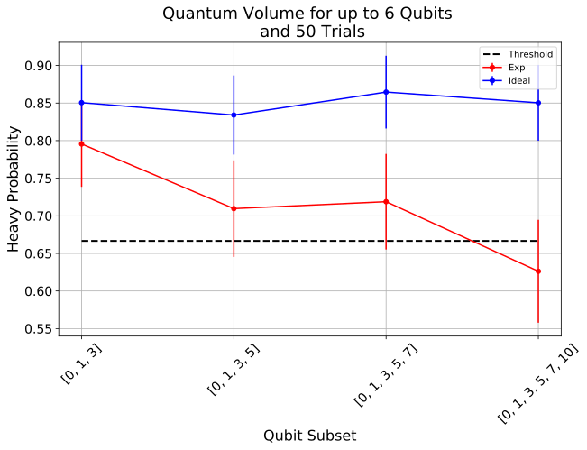

Measuring Quantum Volume
========================

Introduction
------------

**Quantum Volume (QV)** is a single-number metric that can be measured
using a concrete protocol on near-term quantum computers of modest size.
The QV method quantifies the largest random circuit of equal width and
depth that the computer successfully implements. Quantum computing
systems with high-fidelity operations, high connectivity, large
calibrated gate sets, and circuit rewriting toolchains are expected to
have higher quantum volumes.

The Quantum Volume Protocol
---------------------------

A QV protocol (see [1]) consists of the following steps:

(We should first import the relevant qiskit classes for the
demonstration).

.. code:: ipython3

    %matplotlib inline
    %config InlineBackend.figure_format = 'svg' # Makes the images look nice
    import matplotlib.pyplot as plt
    
    #Import Qiskit classes
    import qiskit
    from qiskit.providers.aer.noise import NoiseModel
    from qiskit.providers.aer.noise.errors.standard_errors import depolarizing_error, thermal_relaxation_error
    
    #Import the qv function
    import qiskit.ignis.verification.quantum_volume as qv

Step 1: Generate QV sequences
~~~~~~~~~~~~~~~~~~~~~~~~~~~~~

It is well-known that quantum algorithms can be expressed as
polynomial-sized quantum circuits built from two-qubit unitary gates.
Therefore, a model circuit consists of :math:`d` layers of random
permutations of the qubit labels, followed by random two-qubit gates
(from :math:`SU(4)`). When the circuit width :math:`m` is odd, one of
the qubits is idle in each layer.

More precisely, a **QV circuit** with **depth :math:`d`** and **width
:math:`m`**, is a sequence :math:`U = U^{(d)}...U^{(2)}U^{(1)}` of
:math:`d` layers:

.. math::  U^{(t)} = U^{(t)}_{\pi_t(m'-1),\pi_t(m)} \otimes ... \otimes U^{(t)}_{\pi_t(1),\pi_t(2)} 

 each labeled by times :math:`t = 1 ... d` and acting on
:math:`m' = 2 \lfloor n/2 \rfloor` qubits. Each layer is specified by
choosing a uniformly random permutation :math:`\pi_t \in S_m` of the
:math:`m` qubit indices and sampling each :math:`U^{(t)}_{a,b}`, acting
on qubits :math:`a` and :math:`b`, from the Haar measure on
:math:`SU(4)`.

In the following example we have 6 qubits Q0,Q1,Q3,Q5,Q7,Q10. We are
going to look at subsets up to the full set (each volume circuit will be
depth equal to the number of qubits in the subset)

.. code:: ipython3

    # qubit_lists: list of list of qubit subsets to generate QV circuits
    qubit_lists = [[0,1,3],[0,1,3,5],[0,1,3,5,7],[0,1,3,5,7,10]]
    # ntrials: Number of random circuits to create for each subset
    ntrials = 50

We generate the quantum volume sequences. We start with a small example
(so it doesn’t take too long to run).

.. code:: ipython3

    qv_circs, qv_circs_nomeas = qv.qv_circuits(qubit_lists, ntrials)

As an example, we print the circuit corresponding to the first QV
sequence. Note that the ideal circuits are run on the first n qubits
(where n is the number of qubits in the subset).

.. code:: ipython3

    #pass the first trial of the nomeas through the transpiler to illustrate the circuit
    qv_circs_nomeas[0] = qiskit.compiler.transpile(qv_circs_nomeas[0], basis_gates=['u1','u2','u3','cx'])

.. code:: ipython3

    print(qv_circs_nomeas[0][0])

.. parsed-literal::

              ┌────────────────────────────┐     ┌────────────────────────┐     »
    qr_0: |0>─┤ U3(0.48988,0.46514,4.0504) ├──■──┤ U3(0.6982,pi/2,-3pi/2) ├──■──»
             ┌┴────────────────────────────┤┌─┴─┐└─┬───────────────────┬──┘┌─┴─┐»
    qr_1: |0>┤ U3(1.2912,-0.15877,-3.3023) ├┤ X ├──┤ U3(pi/2,0,-3.313) ├───┤ X ├»
             └─┬──────────────────────────┬┘└───┘  └───────────────────┘   └───┘»
    qr_2: |0>──┤ U3(0.8218,-2.45,-3.3776) ├─────────────────────────────────────»
               └──────────────────────────┘                                     »
     cr_0: 0 ═══════════════════════════════════════════════════════════════════»
                                                                                »
     cr_1: 0 ═══════════════════════════════════════════════════════════════════»
                                                                                »
     cr_2: 0 ═══════════════════════════════════════════════════════════════════»
                                                                                »
    «      ┌─────────────────────┐     ┌────────────────────────────┐     »
    «qr_0: ┤ U3(0.13752,0,-pi/2) ├──■──┤ U3(2.5728,0.46322,-5.1975) ├──■──»
    «      └───┬──────────────┬──┘┌─┴─┐└┬──────────────────────────┬┘  │  »
    «qr_1: ────┤ U2(pi,-pi/2) ├───┤ X ├─┤ U3(0.3552,1.0817,2.1398) ├───┼──»
    «          └──────────────┘   └───┘ └──────────────────────────┘ ┌─┴─┐»
    «qr_2: ──────────────────────────────────────────────────────────┤ X ├»
    «                                                                └───┘»
    «cr_0: ═══════════════════════════════════════════════════════════════»
    «                                                                     »
    «cr_1: ═══════════════════════════════════════════════════════════════»
    «                                                                     »
    «cr_2: ═══════════════════════════════════════════════════════════════»
    «                                                                     »
    «      ┌─────────────────────────┐     ┌───────────────────────┐     »
    «qr_0: ┤ U3(0.78372,pi/2,-3pi/2) ├──■──┤ U3(0.068539,-pi,pi/2) ├──■──»
    «      └─────────────────────────┘  │  └───────────────────────┘  │  »
    «qr_1: ─────────────────────────────┼─────────────────────────────┼──»
    «         ┌────────────────────┐  ┌─┴─┐     ┌──────────────┐    ┌─┴─┐»
    «qr_2: ───┤ U3(pi/2,0,-3.3893) ├──┤ X ├─────┤ U2(pi,-pi/2) ├────┤ X ├»
    «         └────────────────────┘  └───┘     └──────────────┘    └───┘»
    «cr_0: ══════════════════════════════════════════════════════════════»
    «                                                                    »
    «cr_1: ══════════════════════════════════════════════════════════════»
    «                                                                    »
    «cr_2: ══════════════════════════════════════════════════════════════»
    «                                                                    »
    «      ┌────────────────────────────┐┌───┐    ┌───────────────┐     ┌───┐»
    «qr_0: ┤ U3(2.6972,-2.2647,-1.8724) ├┤ X ├────┤ U2(0,-3.2783) ├─────┤ X ├»
    «      └────────────────────────────┘└─┬─┘┌───┴───────────────┴────┐└─┬─┘»
    «qr_1: ────────────────────────────────■──┤ U3(1.1855,pi/2,-3pi/2) ├──■──»
    «       ┌──────────────────────────┐      └────────────────────────┘     »
    «qr_2: ─┤ U3(1.6701,1.3647,2.4575) ├─────────────────────────────────────»
    «       └──────────────────────────┘                                     »
    «cr_0: ══════════════════════════════════════════════════════════════════»
    «                                                                        »
    «cr_1: ══════════════════════════════════════════════════════════════════»
    «                                                                        »
    «cr_2: ══════════════════════════════════════════════════════════════════»
    «                                                                        »
    «          ┌──────────────┐   ┌───┐┌──────────────────────────────┐
    «qr_0: ────┤ U2(pi,-pi/2) ├───┤ X ├┤ U3(0.23709,-0.97045,-4.7703) ├
    «      ┌───┴──────────────┴──┐└─┬─┘└┬───────────────────────────┬─┘
    «qr_1: ┤ U3(0.39732,0,-pi/2) ├──■───┤ U3(0.27488,0.6929,3.3133) ├──
    «      └─────────────────────┘      └───────────────────────────┘  
    «qr_2: ────────────────────────────────────────────────────────────
    «                                                                  
    «cr_0: ════════════════════════════════════════════════════════════
    «                                                                  
    «cr_1: ════════════════════════════════════════════════════════════
    «                                                                  
    «cr_2: ════════════════════════════════════════════════════════════
    «                                                                  

Step 2: Simulate the ideal QV circuits
~~~~~~~~~~~~~~~~~~~~~~~~~~~~~~~~~~~~~~

The quantum volume method requires that we know the ideal output for
each circuit, so we use the statevector simulator in Aer to get the
ideal result.

.. code:: ipython3

    #The Unitary is an identity (with a global phase)
    backend = qiskit.Aer.get_backend('statevector_simulator')
    ideal_results = []
    for trial in range(ntrials):
        print('Simulating trial %d'%trial)
        ideal_results.append(qiskit.execute(qv_circs_nomeas[trial], backend=backend).result())

.. parsed-literal::

    Simulating trial 0
    Simulating trial 1
    Simulating trial 2
    Simulating trial 3
    Simulating trial 4
    Simulating trial 5
    Simulating trial 6
    Simulating trial 7
    Simulating trial 8
    Simulating trial 9
    Simulating trial 10
    Simulating trial 11
    Simulating trial 12
    Simulating trial 13
    Simulating trial 14
    Simulating trial 15
    Simulating trial 16
    Simulating trial 17
    Simulating trial 18
    Simulating trial 19
    Simulating trial 20
    Simulating trial 21
    Simulating trial 22
    Simulating trial 23
    Simulating trial 24
    Simulating trial 25
    Simulating trial 26
    Simulating trial 27
    Simulating trial 28
    Simulating trial 29
    Simulating trial 30
    Simulating trial 31
    Simulating trial 32
    Simulating trial 33
    Simulating trial 34
    Simulating trial 35
    Simulating trial 36
    Simulating trial 37
    Simulating trial 38
    Simulating trial 39
    Simulating trial 40
    Simulating trial 41
    Simulating trial 42
    Simulating trial 43
    Simulating trial 44
    Simulating trial 45
    Simulating trial 46
    Simulating trial 47
    Simulating trial 48
    Simulating trial 49

Next, we load the ideal results into a quantum volume fitter

.. code:: ipython3

    qv_fitter = qv.QVFitter(qubit_lists=qubit_lists)
    qv_fitter.add_statevectors(ideal_results)

Step 3: Calculate the heavy outputs
~~~~~~~~~~~~~~~~~~~~~~~~~~~~~~~~~~~

To define when a model circuit :math:`U` has been successfully
implemented in practice, we use the *heavy output* generation problem.
The ideal output distribution is
:math:`p_U(x) = |\langle x|U|0 \rangle|^2`, where
:math:`x \in \{0,1\}^m` is an observable bit-string.

Consider the set of output probabilities given by the range of
:math:`p_U(x)` sorted in ascending order
:math:`p_0 \leq p_1 \leq \dots \leq p_{2^m-1}`. The median of the set of
probabilities is :math:`p_{med} = (p_{2^{m-1}} + p_{2^{m-1}-1})/2`, and
the *heavy outputs* are

.. math::  H_U = \{ x \in \{0,1\}^m \text{ such that } p_U(x)>p_{med} \}.

 The heavy output generation problem is to produce a set of output
strings such that more than two-thirds are heavy.

As an illustration, we print the heavy outputs from various depths and
their probabilities (for trial 0):

.. code:: ipython3

    for qubit_list in qubit_lists:
        l = len(qubit_list)
        print ('qv_depth_'+str(l)+'_trial_0:', qv_fitter._heavy_outputs['qv_depth_'+str(l)+'_trial_0'])

.. parsed-literal::

    qv_depth_3_trial_0: ['000', '010', '011', '110']
    qv_depth_4_trial_0: ['0010', '0100', '1000', '1001', '1011', '1100', '1101', '1110']
    qv_depth_5_trial_0: ['00000', '00010', '00011', '00100', '00110', '00111', '01011', '01110', '10011', '10110', '11000', '11001', '11010', '11011', '11100', '11110']
    qv_depth_6_trial_0: ['000000', '000001', '000100', '000111', '001001', '001011', '001100', '001111', '010010', '010011', '010100', '010101', '010111', '011011', '011100', '011110', '100000', '100010', '100100', '100110', '101001', '101100', '101101', '110010', '110011', '110100', '110110', '110111', '111001', '111010', '111101', '111110']

.. code:: ipython3

    for qubit_list in qubit_lists:
        l = len(qubit_list)
        print ('qv_depth_'+str(l)+'_trial_0:', qv_fitter._heavy_output_prob_ideal['qv_depth_'+str(l)+'_trial_0'])

.. parsed-literal::

    qv_depth_3_trial_0: 0.8288139087679129
    qv_depth_4_trial_0: 0.7468559283300261
    qv_depth_5_trial_0: 0.9114554008944362
    qv_depth_6_trial_0: 0.8137429780949403

Step 4: Define the noise model
~~~~~~~~~~~~~~~~~~~~~~~~~~~~~~

We define a noise model for the simulator. To simulate decay, we add
depolarizing error probabilities to the CNOT and U gates.

.. code:: ipython3

    noise_model = NoiseModel()
    p1Q = 0.002
    p2Q = 0.02
    noise_model.add_all_qubit_quantum_error(depolarizing_error(p1Q, 1), 'u2')
    noise_model.add_all_qubit_quantum_error(depolarizing_error(2*p1Q, 1), 'u3')
    noise_model.add_all_qubit_quantum_error(depolarizing_error(p2Q, 2), 'cx')
    #noise_model = None

We can execute the QV sequences either using Qiskit Aer Simulator (with
some noise model) or using IBMQ provider, and obtain a list of
exp_results.

.. code:: ipython3

    backend = qiskit.Aer.get_backend('qasm_simulator')
    basis_gates = ['u1','u2','u3','cx'] # use U,CX for now
    shots = 1024
    exp_results = []
    for trial in range(ntrials):
        print('Running trial %d'%trial)
        exp_results.append(qiskit.execute(qv_circs[trial], basis_gates=basis_gates, backend=backend, noise_model=noise_model, backend_options={'max_parallel_experiments': 0}).result())

.. parsed-literal::

    Running trial 0
    Running trial 1
    Running trial 2
    Running trial 3
    Running trial 4
    Running trial 5
    Running trial 6
    Running trial 7
    Running trial 8
    Running trial 9
    Running trial 10
    Running trial 11
    Running trial 12
    Running trial 13
    Running trial 14
    Running trial 15
    Running trial 16
    Running trial 17
    Running trial 18
    Running trial 19
    Running trial 20
    Running trial 21
    Running trial 22
    Running trial 23
    Running trial 24
    Running trial 25
    Running trial 26
    Running trial 27
    Running trial 28
    Running trial 29
    Running trial 30
    Running trial 31
    Running trial 32
    Running trial 33
    Running trial 34
    Running trial 35
    Running trial 36
    Running trial 37
    Running trial 38
    Running trial 39
    Running trial 40
    Running trial 41
    Running trial 42
    Running trial 43
    Running trial 44
    Running trial 45
    Running trial 46
    Running trial 47
    Running trial 48
    Running trial 49

Step 5: Calculate the average gate fidelity
~~~~~~~~~~~~~~~~~~~~~~~~~~~~~~~~~~~~~~~~~~~

The *average gate fidelity* between the :math:`m`-qubit ideal unitaries
:math:`U` and the executed :math:`U'` is:

.. math::  F_{avg}(U,U') = \frac{|Tr(U^{\dagger}U')|^2/2^m+1}{2^m+1}

The observed distribution for an implementation :math:`U'` of model
circuit :math:`U` is :math:`q_U(x)`, and the probability of sampling a
heavy output is:

.. math::  h_U = \sum_{x \in H_U} q_U(x)

As an illustration, we print the heavy output counts from various depths
(for trial 0):

.. code:: ipython3

    qv_fitter.add_data(exp_results)
    for qubit_list in qubit_lists:
        l = len(qubit_list)
        #print (qv_fitter._heavy_output_counts)
        print ('qv_depth_'+str(l)+'_trial_0:', qv_fitter._heavy_output_counts['qv_depth_'+str(l)+'_trial_0'])

.. parsed-literal::

    qv_depth_3_trial_0: 786
    qv_depth_4_trial_0: 669
    qv_depth_5_trial_0: 797
    qv_depth_6_trial_0: 590

Step 6: Calculate the achievable depth
~~~~~~~~~~~~~~~~~~~~~~~~~~~~~~~~~~~~~~

The probability of observing a heavy output by implementing a randomly
selected depth :math:`d` model circuit is:

.. math:: h_d = \int_U h_U dU

The *achievable depth* :math:`d(m)` is the largest :math:`d` such that
we are confident that :math:`h_d > 2/3`. In other words,

.. math::  h_1,h_2,\dots,h_{d(m)}>2/3 \text{ and } h_{d(m+1)} \leq 2/3

We now convert the heavy outputs in the different trials and calculate
the mean :math:`h_d` and the error for plotting the graph.

.. code:: ipython3

    plt.figure(figsize=(10, 6))
    ax = plt.gca()
    
    # Plot the essence by calling plot_rb_data
    qv_fitter.plot_qv_data(ax=ax, show_plt=False)
    
    # Add title and label
    ax.set_title('Quantum Volume for up to %d Qubits \n and %d Trials'%(len(qubit_lists[-1]), ntrials), fontsize=18)
    
    plt.show()

Step 7: Calculate the Quantum Volume
~~~~~~~~~~~~~~~~~~~~~~~~~~~~~~~~~~~~

The quantum volume treats the width and depth of a model circuit with
equal importance and measures the largest square-shaped (i.e.,
:math:`m = d`) model circuit a quantum computer can implement
successfully on average.

The *quantum volume* :math:`V_Q` is defined as

.. math:: \log_2 V_Q = \arg\max_{m} \min (m, d(m))

We list the statistics for each depth. For each depth we list if the
depth was successful or not and with what confidence interval. For a
depth to be successful the confidence interval must be > 97.5%.

.. code:: ipython3

    qv_success_list = qv_fitter.qv_success()
    qv_list = qv_fitter.ydata
    QV = 1
    for qidx, qubit_list in enumerate(qubit_lists):
        if qv_list[0][qidx]>2/3:
            if qv_success_list[qidx][0]:
                print("Width/depth %d greater than 2/3 (%f) with confidence %f (successful). Quantum volume %d"%
                      (len(qubit_list),qv_list[0][qidx],qv_success_list[qidx][1],qv_fitter.quantum_volume()[qidx]))
                QV = qv_fitter.quantum_volume()[qidx]
            else:
                print("Width/depth %d greater than 2/3 (%f) with confidence %f (unsuccessful)."%
                      (len(qubit_list),qv_list[0][qidx],qv_success_list[qidx][1]))
        else:
            print("Width/depth %d less than 2/3 (unsuccessful)."%len(qubit_list))

.. parsed-literal::

    Width/depth 3 greater than 2/3 (0.795547) with confidence 0.988079 (successful). Quantum volume 8
    Width/depth 4 greater than 2/3 (0.709590) with confidence 0.748125 (unsuccessful).
    Width/depth 5 greater than 2/3 (0.718770) with confidence 0.793734 (unsuccessful).
    Width/depth 6 less than 2/3 (unsuccessful).

.. code:: ipython3

    print ("The Quantum Volume is:", QV) 

.. parsed-literal::

    The Quantum Volume is: 8

References
~~~~~~~~~~

[1] Andrew W. Cross, Lev S. Bishop, Sarah Sheldon, Paul D. Nation, and
Jay M. Gambetta, *Validating quantum computers using randomized model
circuits*, Phys. Rev. A **100**, 032328 (2019).
https://arxiv.org/pdf/1811.12926

.. code:: ipython3

    import qiskit
    qiskit.__qiskit_version__

.. parsed-literal::

    {'qiskit-terra': '0.11.1',
     'qiskit-aer': '0.3.4',
     'qiskit-ignis': '0.2.0',
     'qiskit-ibmq-provider': '0.4.5',
     'qiskit-aqua': '0.6.2',
     'qiskit': '0.14.1'}

