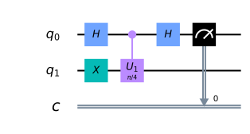
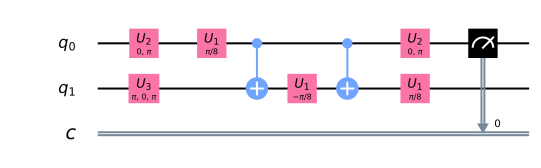
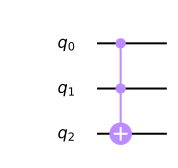
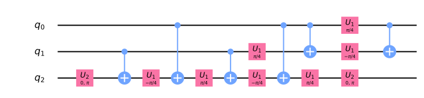
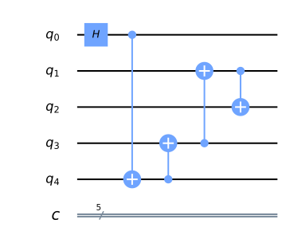
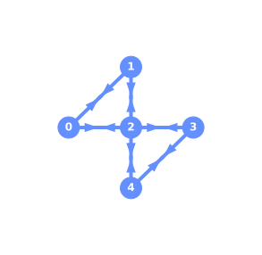

Transpiling Quantum Circuits
============================
.. contents:: Contents
   :local:

In this chapter we will investigate how quantum circuits are transformed
when run on quantum devices. That we need to modify the circuits at all
is a consequence of the limitations of current quantum computing
hardware. Namely, the limited connectivity inherent in most quantum
hardware, restricted gate sets, as well as environmental noise and gate
errors, all conspire to limit the effective computational power on
today’s quantum devices. Fortunately, quantum circuit rewriting tool
chains have been developed that directly address these issues, and
return heavily optimized circuits mapped to targeted quantum devices.
Here we will explore the IBM Qiskit ‘transpiler’ circuit rewriting
framework.

.. code:: ipython3

    import numpy as np
    from qiskit import *
    from qiskit.tools.jupyter import *
    from qiskit.providers.ibmq import least_busy
    %matplotlib inline
    %config InlineBackend.figure_format = 'svg' # Makes the images look nice

.. code:: ipython3

    IBMQ.load_account()

.. parsed-literal::

    <AccountProvider for IBMQ(hub='ibm-q', group='open', project='main')>

Core Steps in Circuit Rewriting
-------------------------------

As we will see, rewriting quantum circuits to match hardware constraints
and optimize for performance can be far from trivial. The flow of logic
in the rewriting tool chain need not be linear, and can often have
iterative sub-loops, conditional branches, and other complex behaviors.
That being said, the basic building blocks follow the structure given
below.

.. figure:: images/transpiling_core_steps.png
   :alt: image1

Our goal in this section is to see what each of these “passes” does at a
high-level, and then begin exploring their usage on a set of common
circuits.

Unrolling to Basis Gates
~~~~~~~~~~~~~~~~~~~~~~~~

When writing a quantum circuit you are free to use any quantum gate
(unitary operator) that you like, along with a collection of non-gate
operations such as qubit measurements and reset operations. However,
when running a circuit on a real quantum device one no longer has this
flexibility. Due to limitations in, for example, the physical
interactions between qubits, difficulty in implementing multi-qubit
gates, control electronics etc, a quantum computing device can only
natively support a handful of quantum gates and non-gate operations. In
the present case of IBM Q devices, the native gate set can be found by
querying the devices themselves:

.. code:: ipython3

    provider = IBMQ.get_provider(group='open')
    provider.backends(simulator=False)

.. parsed-literal::

    [<IBMQBackend('ibmqx2') from IBMQ(hub='ibm-q', group='open', project='main')>,
     <IBMQBackend('ibmq_16_melbourne') from IBMQ(hub='ibm-q', group='open', project='main')>,
     <IBMQBackend('ibmq_vigo') from IBMQ(hub='ibm-q', group='open', project='main')>,
     <IBMQBackend('ibmq_ourense') from IBMQ(hub='ibm-q', group='open', project='main')>,
     <IBMQBackend('ibmq_london') from IBMQ(hub='ibm-q', group='open', project='main')>,
     <IBMQBackend('ibmq_burlington') from IBMQ(hub='ibm-q', group='open', project='main')>,
     <IBMQBackend('ibmq_essex') from IBMQ(hub='ibm-q', group='open', project='main')>,
     <IBMQBackend('ibmq_armonk') from IBMQ(hub='ibm-q', group='open', project='main')>]

.. code:: ipython3

    backend = least_busy(provider.backends(filters=lambda x: x.configuration().n_qubits >= 5 and not x.configuration().simulator and x.status().operational==True))
    backend.configuration().basis_gates

.. parsed-literal::

    ['u1', 'u2', 'u3', 'cx', 'id']

We see that the our device supports five native gates: three
single-qubit gates (``u1``, ``u2``, ``u3``, and ``id``) and one
two-qubit entangling gate ``cx``. In addition, the device supports qubit
measurements (otherwise we can not read out an answer!). Although we
have queried only a single device, all IBM Q devices support this gate
set.

The ``u*`` gates represent arbitrary single-qubit rotations of one, two,
and three angles. The ``u1`` gates are single-parameter rotations that
represent generalized phase gates of the form

.. math::

   U_{1}(\lambda) = \begin{bmatrix}
   1 & 0 \\\\
   0 & e^{i\lambda}
   \end{bmatrix}

This set includes common gates such as :math:`Z`, :math:`T`,
:math:`T^{\dagger}`, :math:`S`, and :math:`S^{\dagger}`. It turns out
that these gates do not actually need to be performed on hardware, but
instead, can be implemented in software as “virtual gates”. These
virtual gates are called “frame changes” and take zero time, and have no
associated error; they are free gates on hardware.

Two-angle rotations, :math:`U_{2}(\phi,\lambda)`, are actually two frame
changes with a single :math:`X_{\pi/2}` gate in between them, and can be
used to synthesize gates like the Hadamard (:math:`U_{2}(0,\pi)`) gate.
As the only actual gate performed is the :math:`X_{\pi/2}` gate, the
error and gate time associated with any :math:`U_{2}` gate is the same
as an :math:`X_{\pi/2}` gate. Similarly,
:math:`U_{3}(\theta,\phi,\lambda)` gates are formed from three frame
changes with two :math:`X_{\pi/2}` gates in between them. The errors and
gate times are twice those of a single :math:`X_{\pi/2}`. The identity
gate, :math:`id`, is straightforward, and is a placeholder gate with a
fixed time-interval.

The only entangling gate supported by the IBM Q devices is the CNOT gate
(``cx``) that, in the computational basis, can be written as:

.. math::

   \mathrm{CNOT}(0,1) = \begin{bmatrix}
   1 & 0 & 0 & 0 \\\\
   0 & 0 & 0 & 1 \\\\
   0 & 0 & 1 & 0 \\\\
   0 & 1 & 0 & 0
   \end{bmatrix}

,

where we see that the matrix form follows from the specific bit-ordering
convention used in Qiskit.

Every quantum circuit run on a IBM Q device must be expressed using only
these basis gates. For example, suppose one wants to run a simple phase
estimation circuit:

.. code:: ipython3

    qr = QuantumRegister(2, 'q')
    cr = ClassicalRegister(1, 'c')
    qc = QuantumCircuit(qr, cr)
    
    qc.h(qr[0])
    qc.x(qr[1])
    qc.cu1(np.pi/4, qr[0], qr[1])
    qc.h(qr[0])
    qc.measure(qr[0], cr[0])
    qc.draw(output='mpl')

We have :math:`H`, :math:`X`, and controlled-\ :math:`U_{1}` gates, all
of which are not in our devices basis gate set, and must be expanded. We
will see that this expansion is taken care of for you, but for now let
us just rewrite the circuit in the basis gate set:

.. code:: ipython3

    qr = QuantumRegister(2, 'q')
    cr = ClassicalRegister(1, 'c')
    qc_basis = QuantumCircuit(qr, cr)
    
    # Hadamard in U2 format
    qc_basis.u2(0, np.pi, qr[0])
    # X gate in U3 format
    qc_basis.u3(np.pi, 0, np.pi, qr[1])
    
    # Decomposition for controlled-U1 with lambda=pi/4
    qc_basis.u1(np.pi/8, qr[0]) 
    qc_basis.cx(qr[0], qr[1]) 
    qc_basis.u1(-np.pi/8, qr[1]) 
    qc_basis.cx(qr[0], qr[1])
    qc_basis.u1(np.pi/8, qr[1])
    
    # Hadamard in U2 format
    qc_basis.u2(0, np.pi, qr[0]) 
    
    qc_basis.measure(qr[0], cr[0])
    qc_basis.draw(output='mpl')

A few things to highlight. One, the circuit has gotten longer with
respect to the initial one. This can be verified by checking the depth
of the circuits:

.. code:: ipython3

    print(qc.depth(), ',', qc_basis.depth())

.. parsed-literal::

    4 , 7

Second, although we had a single controlled gate, the fact that it was
not in the basis set means that, when expanded, it requires more than a
single ``cx`` gate to implement. All said, unrolling to the basis set of
gates leads to an increase in the length of a quantum circuit and the
number of gates. Both of these increases lead to more errors from the
environment and gate errors, respectively, and further circuit rewriting
steps must try to mitigate this effect through circuit optimizations.

Finally, we will look at the particularly important example of a
Toffoli, or controlled-controlled-not gate:

.. code:: ipython3

    qr = QuantumRegister(3, 'q')
    qc = QuantumCircuit(qr)
    
    qc.ccx(qr[0], qr[1], qr[2])
    qc.draw(output='mpl')

As a three-qubit gate, it should already be clear that this is not in
the basis set of our devices. We have already seen that controlled gates
not in the basis set are typically decomposed into multiple CNOT gates.
This is doubly true for controlled gates with more than two qubits,
where multiple CNOT gates are needed to implement the entangling across
the multiple qubits. In our basis set, the Toffoli gate can be written
as:

.. code:: ipython3

    qr = QuantumRegister(3, 'q')
    qc_basis = QuantumCircuit(qr)
    
    qc_basis.u2(0,np.pi, qr[2])
    qc_basis.cx(qr[1], qr[2])
    qc_basis.u1(-np.pi/4, qr[2])
    qc_basis.cx(qr[0], qr[2])
    qc_basis.u1(np.pi/4, qr[2])
    qc_basis.cx(qr[1], qr[2])
    qc_basis.u1(np.pi/4, qr[1])
    qc_basis.u1(-np.pi/4, qr[2])
    qc_basis.cx(qr[0], qr[2])
    qc_basis.cx(qr[0], qr[1])
    qc_basis.u1(np.pi/4, qr[2])
    qc_basis.u1(np.pi/4, qr[0])
    qc_basis.u1(-np.pi/4, qr[1])
    qc_basis.u2(0,np.pi, qr[2])
    qc_basis.cx(qr[0], qr[1])
    qc_basis.draw(output='mpl')

Therefore, for every Toffoli gate in a quantum circuit, the IBM Q
hardware must execute six CNOT gates, and a handful of single-qubit
gates. From this example, it should be clear that any algorithm that
makes use of multiple Toffoli gates will end up as a circuit with large
depth and with therefore be appreciably affected by noise and gate
errors.

Initial Layout
~~~~~~~~~~~~~~

.. code:: ipython3

    qr = QuantumRegister(5, 'q')
    cr = ClassicalRegister(5, 'c')
    qc = QuantumCircuit(qr, cr)
    
    qc.h(qr[0])
    qc.cx(qr[0], qr[4])
    qc.cx(qr[4], qr[3])
    qc.cx(qr[3], qr[1])
    qc.cx(qr[1], qr[2])
    
    qc.draw(output='mpl')

.. code:: ipython3

    from qiskit.visualization.gate_map import plot_gate_map
    plot_gate_map(backend, plot_directed=True)

