The Atoms of Computation
========================

Programming a quantum computer is now something that anyone can do in
the comfort of their own home.

But what to create? What is a quantum program anyway? In fact, what is a
quantum computer?

These questions can be answered by making comparisons to standard
digital computers. Unfortunately, most people don’t actually understand
how digital computers work either. In this article we’ll look at the
basics principles behind these devices. To help us transition over to
quantum computing later on, we’ll do it using the same tools as we’ll
use for quantum.

.. code:: ipython3

    from qiskit import QuantumCircuit, execute, Aer
    from qiskit.visualization import plot_histogram
    %config InlineBackend.figure_format = 'svg' # Makes the images look nice

Splitting information into bits
~~~~~~~~~~~~~~~~~~~~~~~~~~~~~~~

The first thing we need to know about is the idea of bits. These are
designed to be the world’s simplest alphabet. With only two characters,
0 and 1, we can represent any piece of information.

One example is numbers. In European languages, numbers are usually
represented using a string of the ten digits 0, 1, 2, 3, 4, 5, 6, 7, 8
and 9. In this string of digits, each digit represents how many times
the number contains a certain power of ten. For example, when we write
9213, we mean

.. math::  9000 + 200 + 10 + 3 

or, expressed in a way that emphasizes the powers of ten

.. math::  (9\times10^3) + (2\times10^2) + (1\times10^1) + (3\times10^0) 

Though we usually use this system based on the number 10, we can just as
easily use one based on any other number. The binary number system, for
example, is based on the number two. This means using the two characters
0 and 1 to express numbers as multiples of powers of two. For example,
9213 becomes 10001111111101, since

.. math::  9213  = (1 \times 2^{13}) + (0 \times 2^{12}) + (0 \times 2^{11})+ (0 \times 2^{10}) +(1 \times 2^9) + (1 \times 2^8) + (1 \times 2^7) \\\\ \,\,\,   + (1 \times 2^6) + (1 \times 2^5) + (1 \times 2^4) + (1 \times 2^3) + (1 \times 2^2) + (0 \times 2^1) + (1 \times 2^0) 

In this we are expressing numbers as multiples of 2, 4, 8, 16, 32, etc.
instead of 10, 100, 1000, etc.

These strings of bits, known as binary strings, can be used to represent
more than just numbers. For example, there is a way to represent any
text using bits. For any letter, number, or punctuation mark you want to
use, you can find a corresponding string of at most eight bits using
`this
table. <https://www.ibm.com/support/knowledgecenter/en/ssw_aix_72/com.ibm.aix.networkcomm/conversion_table.htm>`__
Though these are quite arbitrary, this is a widely agreed upon standard.
In fact, it’s what was used to transmit this article to you through the
internet.

This is how all information is represented in computers. Whether
numbers, letters, images, or sound, it all exists in the form of binary
strings.

Like our standard digital computers, quantum computers are based on this
same basic idea. The main difference is that they use *qubits*, a
variant of the bit that can be manipulated in quantum ways. In the rest
of this textbook, we will explore what qubits are, what they can do, and
how they do it. In this section, however, we are not talking about
quantum at all. So we just use qubits as if they were bits.

Computation as a diagram
~~~~~~~~~~~~~~~~~~~~~~~~

Whether we are using qubits or bits, we need to manipulate them in order
to turn the inputs we have into the outputs we need. For the very
simplest programs for small numbers of bits, it is useful to represent
this process in a diagram known as a *circuit diagram*. These have
inputs on the left, outputs on the right, and operations represented by
arcane symbols in between. These operations are called ‘gates’, mostly
for historical reasons.

Here’s an example of what a circuit looks like for standard, bit-based
computers. You aren’t expected to understand what it does. It is simply
to give you an idea of what these circuits look like.

For quantum computers we use the same basic idea, but we have different
conventions for how to represent inputs, outputs, and the symbols used
for operations. Here is the quantum circuit that represents the same
process as above.

In the rest of this section, we will explain how to build circuits. At
the end, you’ll know how to create the circuit above, what it does, and
why it is useful.

Your first quantum circuit
~~~~~~~~~~~~~~~~~~~~~~~~~~

In a circuit we typically need to do three jobs: First encode the input,
then do some actual computation, and finally extract an output. For your
first quantum circuit, we’ll focus on the last of these jobs. We start
by creating a circuit with eight qubits and eight outputs.

.. code:: ipython3

    n = 8
    n_q = 8
    n_b = 8
    qc_output = QuantumCircuit(n_q,n_b)

This circuit, which we have called ``qc_output``, is created by Qiskit
using ``QuantumCircuit``. The number ``n_q`` defines the number of
qubits in the circuit. With ``n_b`` we define the number of output bits
we will extract from the circuit at the end.

The extraction of outputs in a quantum circuit is done using an
operation called ``measure``. Each measurement tells a specific qubit to
give an output to a specific output bit. The following code adds a
``measure`` operation to each of our eight qubits. The qubits and bits
are both labelled by the numbers from 0 to 7 (because that’s how
programmers like to do things). The command ``qc.measure(j,j)`` adds a
measurement to our circuit ``qc`` that tells qubit ``j`` to write an
output to bit ``j``.

.. code:: ipython3

    for j in range(n):
        qc_output.measure(j,j)

Now our circuit has something in, let’s take a look at it.

.. code:: ipython3

    qc_output.draw(output='mpl')

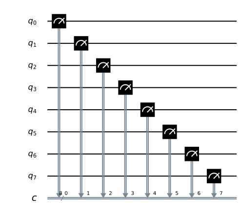

Qubits are always initialized to give the output ``0``. Since we don’t
do anything to our qubits in the circuit above, this is exactly the
result we’ll get when we measure them. We can see this by running the
circuit many times and plotting the results in a histogram. We will find
that the result is always ``00000000``: a ``0`` from each qubit.

.. code:: ipython3

    counts = execute(qc_output,Aer.get_backend('qasm_simulator')).result().get_counts()
    plot_histogram(counts)

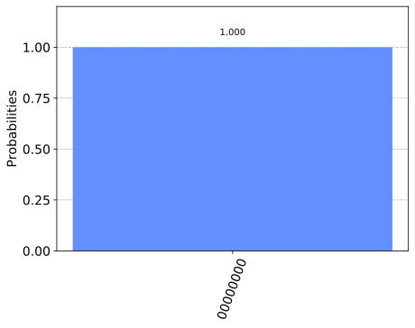

The reason for running many times and showing the result as a histogram
is because quantum computers may have some randomness in their results.
In this case, since we aren’t doing anything quantum, we get just the
``00000000`` result with certainty.

Note that this result comes from a quantum simulator, which is a
standard computer calculating what a quantum computer would do.
Simulations are only possible for small numbers of qubits, but they are
nevertheless a very useful tool when designing your first quantum
circuits. To run on a real device you simply need to replace
``Aer.get_backend('qasm_simulator')`` with the backend object of the
device you want to use.

Encoding an input
~~~~~~~~~~~~~~~~~

Now let’s look at how to encode a different binary string as an input.
For this we need what is known as a NOT gate. This is the most basic
operation that you can do in a computer. It simply flips the bit value:
``0`` becomes ``1`` and ``1`` becomes ``0``. For qubits, it is an
operation called ``x`` that does the job of the NOT.

Below we create a new circuit dedicated to the job of encoding and call
it ``qc_encode``. For now, we only specify the number of qubits.

.. code:: ipython3

    qc_encode = QuantumCircuit(n)
    qc_encode.x(7)
    
    qc_encode.draw(output='mpl')

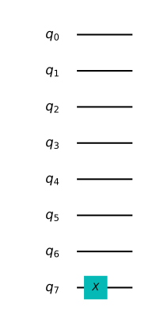

Extracting results can be done using the circuit we have from before:
``qc_output``. Adding the two circuits using ``qc_encode + qc_output``
creates a new circuit with everything needed to extract an output added
at the end.

.. code:: ipython3

    qc = qc_encode + qc_output
    qc.draw(output='mpl',justify='none')

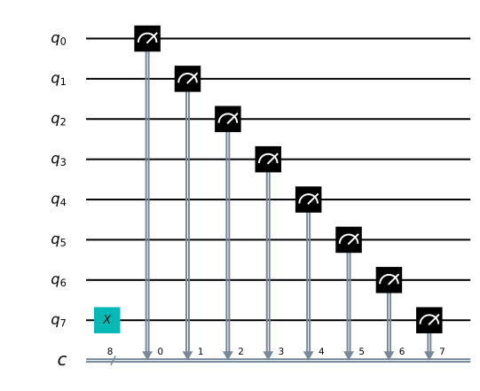

Now we can run the combined circuit and look at the results.

.. code:: ipython3

    counts = execute(qc,Aer.get_backend('qasm_simulator')).result().get_counts()
    plot_histogram(counts)

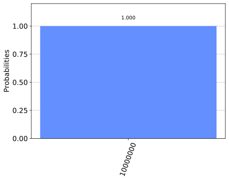

Now our computer outputs the string ``10000000`` instead.

The bit we flipped, which comes from qubit 7, lives on the far left of
the string. This is because Qiskit numbers the bits in a string from
right to left. If this convention seems odd to you, don’t worry. It
seems odd to lots of other people too, and some prefer to number their
bits the other way around. But this system certainly has its advantages
when we are using the bits to represent numbers. Specifically, it means
that qubit 7 is telling us about how many :math:`2^7`\ s we have in our
number. So by flipping this bit, we’ve now written the number 128 in our
simple 8-bit computer.

Now try out writing another number for yourself. You could do your age,
for example. Just use a search engine to find out what the number looks
like in binary (if it includes a ‘0b’, just ignore it), and then add
some 0s to the left side if you are younger than 64.

.. code:: ipython3

    qc_encode = QuantumCircuit(n)
    qc_encode.x(1)
    qc_encode.x(5)
    
    qc_encode.draw(output='mpl')

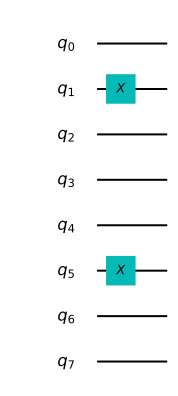

Now we know how to encode information in a computer. The next step is to
process it: To take an input that we have encoded, and turn it into an
output that we need.

Remembering how to add
~~~~~~~~~~~~~~~~~~~~~~

To look at turning inputs into outputs, we need a problem to solve.
Let’s do some basic maths. In primary school you will have learned how
to take large mathematical problems and break them down into manageable
pieces. For example, how would you go about solving the following?

::

      9213
   +  1854
   =  ????

One way is to do it digit by digit, from right to left. So we start with
3+4

::

      9213
   +  1854
   =  ???7

And then 1+5

::

      9213
   +  1854
   =  ??67

Then we have 2+8=10. Since this is a two digit answer, we need to carry
the one over to the next column.

::

      9213
   +  1854
   =  ?067
      ¹ 

Finally we have 9+1+1=11, and get our answer

::

      9213
   +  1854
   = 11067
      ¹ 

This may just be simple addition, but it demonstrates the principles
behind all algorithms. Whether the algorithm is designed to solve
mathematical problems or process text or images, we always break big
tasks down into small and simple steps.

To run on a computer, algorithms need to be compiled down to the
smallest and simplest steps possible. To see what these look like, let’s
do the above addition problem again, but in binary.

::

      10001111111101
   +  00011100111110
                                       
   =  ??????????????

Note that the second number has a bunch of extra 0s on the left. This
just serves to make the two strings the same length.

Our first task is to do the 1+0 for the column on the right. In binary,
as in any number system, the answer is 1. We get the same result for the
0+1 of the second column.

::

      10001111111101
   +  00011100111110

   =  ????????????11 

Next we have 1+1. As you’ll surely be aware, 1+1=2. In binary, the
number 2 is written ``10``, and so requires two bits. This means that we
need to carry the 1, just as we would for the number 10 in decimal.

::

      10001111111101
   +  00011100111110
   =  ???????????011 
                ¹ 

The next column now requires us to calculate ``1+1+1``. This means
adding three numbers together, so things are getting complicated for our
computer. But we can still compile it down to simpler operations, and do
it in a way that only ever requires us to add two bits together. For
this we can start with just the first two 1s.

::

      1
   +  1
   = 10

Now we need to add this ``10`` to the final ``1`` , which can be done
using our usual method of going through the columns.

::

     10
   + 01
   = 11

The final answer is ``11`` (also known as 3).

Now we can get back to the rest of the problem. With the answer of
``11``, we have another carry bit.

::

      10001111111101
   +  00011100111110
   =  ??????????1011
               ¹¹

So now we have another 1+1+1 to do. But we already know how to do that,
so it’s not a big deal.

In fact, everything left so far is something we already know how to do.
This is because, if you break everything down into adding just two bits,
there’s only four possible things you’ll ever need to calculate. Here
are the four basic sums (we’ll write all the answers with two bits to be
consistent).

::

   0+0 = 00 (in decimal, this is 0+0=0)
   0+1 = 01 (in decimal, this is 0+1=1)
   1+0 = 01 (in decimal, this is 1+0=1)
   1+1 = 10 (in decimal, this is 1+1=2)

This is called a *half adder*. If our computer can implement this, and
if it can chain many of them together, it can add anything.

Adding with Qiskit
~~~~~~~~~~~~~~~~~~

Let’s make our own half adder using Qiskit. This will include a part of
the circuit that encodes the input, a part that executes the algorithm,
and a part that extracts the result. The first part will need to be
changed whenever we want to use a new input, but the rest will always
remain the same.

The two bits we want to add are encoded in the qubits 0 and 1. The above
example encodes a ``1`` in both these qubits, and so it seeks to find
the solution of ``1+1``. The result will be a string of two bits, which
we will read out from the qubits 2 and 3. All that remains is to fill in
the actual program, which lives in the blank space in the middle.

The dashed lines in the image are just to distinguish the different
parts of the circuit (although they can have more interesting uses too).
They are made by using the ``barrier`` command.

The basic operations of computing are known as logic gates. We’ve
already used the NOT gate, but this is not enough to make our half
adder. We could only use it to manually write out the answers. But since
we want the computer to do the actual computing for us, we’ll need some
more powerful gates.

To see what we need, let’s take another look at what our half adder
needs to do.

::

   0+0 = 00
   0+1 = 01
   1+0 = 01
   1+1 = 10

The rightmost bit in all four of these answers is completely determined
by whether the two bits we are adding are the same or different. So for
``0+0`` and ``1+1``, where the two bits are equal, the rightmost bit of
the answer comes out ``0``. For ``0+1`` and ``1+0``, where we are adding
different bit values, the rightmost bit is ``1``.

To get this part of our solution correct, we need something that can
figure out whether two bits are different or not. Traditionally, in the
study of digital computation, this is called an XOR gate.

In quantum computers, the job of the XOR gate is done by the
controlled-NOT gate. Since that’s quite a long name, we usually just
call it the CNOT. In Qiskit its name is ``cx``, which is even shorter.
In circuit diagrams it is drawn as in the image below.

.. code:: ipython3

    qc_cnot = QuantumCircuit(2)
    qc_cnot.cx(0,1)
    qc_cnot.draw(output='mpl')

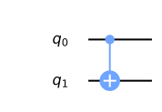

This is applied to a pair of qubits. One acts as the control qubit (this
is the one with the little dot). The other acts as the *target qubit*
(with the big circle).

There are multiple ways to explain the effect of the CNOT. One is to say
that it looks at its two input bits to see whether they are the same or
different. Then it writes over the target qubit with the answer. The
target becomes ``0`` if they are the same, and ``1`` if they are
different.

Another way of explaining the CNOT is to say that it does a NOT on the
target if the control is ``1``, and does nothing otherwise. This
explanation is just as valid as the previous one (in fact, it’s the one
that gives the gate its name).

Try the CNOT out for yourself by trying each of the possible inputs. For
example, here’s a circuit that tests the CNOT with the input ``01``.

.. code:: ipython3

    qc = QuantumCircuit(2,2)
    qc.x(0)
    qc.cx(0,1)
    qc.measure(0,0)
    qc.measure(1,1)
    qc.draw(output='mpl')

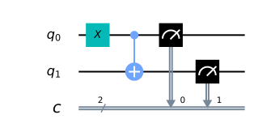

If you execute this circuit, you’ll find that the output is ``11``. We
can think of this happening because of either of the following reasons.

-  The CNOT calculates whether the input values are different and finds
   that they are, which means that it wants to output ``1``. It does
   this by writing over the state of qubit 1 (which, remember, is on the
   left of the bit string), turning ``01`` into ``11``.

-  The CNOT sees that qubit 0 is in state ``1``, and so applies a NOT to
   qubit 1. This flips the ``0`` of qubit 1 into a ``1``, and so turns
   ``01`` into ``11``.

For our half adder, we don’t want to overwrite one of our inputs.
Instead, we want to write the result on a different pair of qubits. For
this we can use two CNOTs.

.. code:: ipython3

    qc_ha = QuantumCircuit(4,2)
    # encode inputs in qubits 0 and 1
    qc_ha.x(0) # For a=0, remove this line. For a=1, leave it.
    qc_ha.x(1) # For b=0, remove this line. For b=1, leave it.
    qc_ha.barrier()
    # use cnots to write the XOR of the inputs on qubit 2
    qc_ha.cx(0,2)
    qc_ha.cx(1,2)
    qc_ha.barrier()
    # extract outputs
    qc_ha.measure(2,0) # extract XOR value
    qc_ha.measure(3,1)
    
    qc_ha.draw(output='mpl')

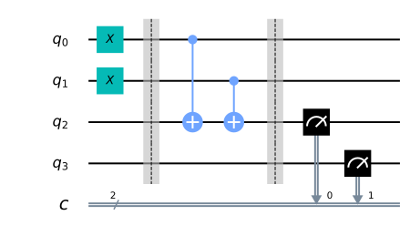

We are now halfway to a fully working half adder. We just have the other
bit of the output left to do: the one that will live on qubit 4.

If you look again at the four possible sums, you’ll notice that there is
only one case for which this is ``1`` instead of ``0``:
``1+1``\ =\ ``10``. It happens only when both the bits we are adding are
``1``.

To calculate this part of the output, we could just get our computer to
look at whether both of the inputs are ``1``. If they are — and only if
they are — we need to do a NOT gate on qubit 4. That will flip it to the
required value of ``1`` for this case only, giving us the output we
need.

For this we need a new gate: like a CNOT, but controlled on two qubits
instead of just one. This will perform a NOT on the target qubit only
when both controls are in state ``1``. This new gate is called the
*Toffoli*. For those of you who are familiar with Boolean logic gates,
it is basically an AND gate.

In Qiskit, the Toffoli is represented with the ``ccx`` command.

.. code:: ipython3

    qc_ha = QuantumCircuit(4,2)
    # encode inputs in qubits 0 and 1
    qc_ha.x(0) # For a=0, remove the this line. For a=1, leave it.
    qc_ha.x(1) # For b=0, remove the this line. For b=1, leave it.
    qc_ha.barrier()
    # use cnots to write the XOR of the inputs on qubit 2
    qc_ha.cx(0,2)
    qc_ha.cx(1,2)
    # use ccx to write the AND of the inputs on qubit 3
    qc_ha.ccx(0,1,3)
    qc_ha.barrier()
    # extract outputs
    qc_ha.measure(2,0) # extract XOR value
    qc_ha.measure(3,1) # extract AND value
    
    qc_ha.draw(output='mpl')

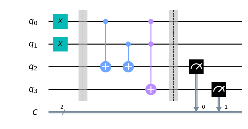

In this example we are calculating ``1+1``, because the two input bits
are both ``1``. Let’s see what we get.

.. code:: ipython3

    counts = execute(qc_ha,Aer.get_backend('qasm_simulator')).result().get_counts()
    plot_histogram(counts)

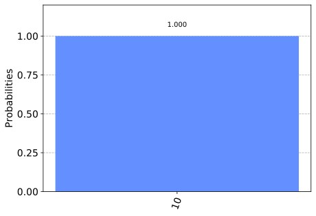

The result is ``10``, which is the binary representation of the number
2. We have built a computer that can solve the famous mathematical
problem of 1+1!

Now you can try it out with the other three possible inputs, and show
that our algorithm gives the right results for those too.

The half adder contains everything you need for addition. With the NOT,
CNOT and Toffoli gates, we can create programs that add any set of
numbers of any size.

These three gates are enough to do everything else in computing too. In
fact, we can even do without the CNOT, and the NOT gate is only really
needed to create bits with value ``1``. The Toffoli gate is essentially
the atom of mathematics. It is the simplest element into which every
other problem-solving technique can be compiled.

As we’ll see, in quantum computing we split the atom.

.. code:: ipython3

    import qiskit
    qiskit.__qiskit_version__

.. parsed-literal::

    {'qiskit-terra': '0.11.1',
     'qiskit-aer': '0.3.4',
     'qiskit-ignis': '0.2.0',
     'qiskit-ibmq-provider': '0.4.5',
     'qiskit-aqua': '0.6.2',
     'qiskit': '0.14.1'}

