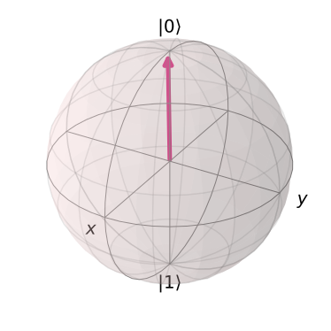

Pauli Matrices and the Bloch Sphere
===================================

.. code:: ipython3

    from qiskit import *
    from qiskit.visualization import plot_bloch_vector
    %config InlineBackend.figure_format = 'svg' # Makes the images look nice

In this section we’ll further develop the topics introduced in the last,
and introduce a useful visualization of single-qubit states.

Pauli matrices
~~~~~~~~~~~~~~

Wherever there are vectors, matrices are not far behind. The three
important matrices for qubits are known as the Pauli matrices.

.. math::

   X= \begin{pmatrix} 0&1 \\\\\\\\ 1&0 \end{pmatrix}\\\\\\\\
   Y= \begin{pmatrix} 0&-i \\\\\\\\ i&0 \end{pmatrix}\\\\\\\\
   Z= \begin{pmatrix} 1&0 \\\\\\\\ 0&-1 \end{pmatrix}

 These have many useful properties, as well as a deep connection to the
x, y and z measurements. Specifically, we can use them to calculate the
three quantities used in the last section:

.. math::

   \langle a | X | a\rangle = p^x_0 (|a\rangle)-p^x_1(|a\rangle),\\\\
   \langle a | Y | a\rangle = p^y_0 (|a\rangle)-p^y_1(|a\rangle),\\\\
   \langle a | Z | a\rangle = p^z_0 (|a\rangle)-p^z_1(|a\rangle).

 These quantities are known as the expectation values of the three
matrices. In calculating them, we make use of standard matrix
multiplication.

Typically, we prefer to use a more compact notation for the quantities
above. Since we usually know what state we are talking about in any
given situation, we don’t explicitly write it in. This allows us to
write :math:`\langle X \rangle = \langle a|X|a \rangle`, etc. Our
statement from the last section, regarding the conservation of certainty
for an isolated qubit, can then be written

$$:raw-latex:`\langle `X :raw-latex:`\rangle`^2 + :raw-latex:`\langle `Y
:raw-latex:`\rangle`^2 + :raw-latex:`\langle `Z :raw-latex:`\rangle`^2 =
1.

$$

To calculate these values in Qiskit, we first need a single qubit
circuit to analyze.

.. code:: ipython3

    qc = QuantumCircuit(1)

Then we need to define the x, y and z measurements.

.. code:: ipython3

    # z measurement of qubit 0
    measure_z = QuantumCircuit(1,1)
    measure_z.measure(0,0);
    
    # x measurement of qubit 0
    measure_x = QuantumCircuit(1,1)
    measure_x.h(0)
    measure_x.measure(0,0)
    
    # y measurement of qubit 0
    measure_y = QuantumCircuit(1,1)
    measure_y.sdg(0)
    measure_y.h(0)
    measure_y.measure(0,0);

Finally we can run the circuit with each kind of measurement, calculate
the probabities and use them to determine :math:`\langle X \rangle`,
:math:`\langle Y \rangle` and :math:`\langle Z \rangle`. This requires a
process largely similar to the one used in the last section to calculate
total certainty.

Here we place the results in a list called ``bloch_vector``, for which
``bloch_vector[0]`` is :math:`\langle X \rangle`, ``bloch_vector[1]`` is
:math:`\langle Y \rangle` and ``bloch_vector[2]`` is
:math:`\langle Z \rangle`

.. code:: ipython3

    shots = 2**14 # number of samples used for statistics
    
    bloch_vector = []
    for measure_circuit in [measure_x, measure_y, measure_z]:
        
        # run the circuit with a the selected measurement and get the number of samples that output each bit value
        counts = execute(qc+measure_circuit,Aer.get_backend('qasm_simulator'),shots=shots).result().get_counts()
    
        # calculate the probabilities for each bit value
        probs = {}
        for output in ['0','1']:
            if output in counts:
                probs[output] = counts[output]/shots
            else:
                probs[output] = 0
                
        bloch_vector.append( probs['0'] -  probs['1'] )

The Bloch sphere
~~~~~~~~~~~~~~~~

Let’s take a moment to think a little about the numbers
:math:`\langle X \rangle`, :math:`\langle Y \rangle` and
:math:`\langle Z \rangle`. Though their values depend on what state our
qubit is in, they are always constrained to be no larger than 1, and no
smaller than -1. They also collectively obey the condition
:math:`\langle X \rangle^2 + \langle Y \rangle^2 + \langle Z \rangle^2 = 1`.

The same properties are also shared by another set of three numbers that
we know from a completely different context. To see what they are, first
consider a sphere. For this, we can describe every point on the surface
in terms of its x, y and z coordinates. We’ll place the origin of our
coordinate system at the center of the sphere. The coordinates are then
constrained by the radius in both directions: they can be no greater
than :math:`r` , and no less than :math:`-r` . For simplicity, let’s set
the radius to be :math:`r=1`.

For any point, the distance from the center of the sphere can be
determined by the 3D version of Pythagoras’ theorem. Specifically,
:math:`x^2 + y^2 + z^2`. For points on the surface, this distance is
always 1.

So now we have three numbers that can each be no greater than 1, no less
than -1, and for which the sum of the squares is always 1. All exactly
the same as :math:`\langle X \rangle`, :math:`\langle Y \rangle` and
:math:`\langle Z \rangle`. They even have pretty much the same names as
these values.

Because of this correspondence, we can apply all our existing knowledge
and intuition about balls to our understanding of qubits. Specifically,
we can visualize any single-qubit state as a point on the surface of a
sphere. We call this the Bloch sphere.

.. code:: ipython3

    plot_bloch_vector( bloch_vector )

We usually associate :math:`|0\rangle` with the north pole,
:math:`|1\rangle` with the south, and the states for the x and y
measurements around the equator. Any pair of orthogonal states
correspond to diametrically opposite points on this sphere.

As we’ll see in future sections, the Bloch sphere makes it easier to
understand single-qubit operations. Each moves points around on the
surface of the sphere, and so can be interpreted as a simple rotation.

.. code:: ipython3

    import qiskit
    qiskit.__qiskit_version__

.. parsed-literal::

    {'qiskit-terra': '0.11.1',
     'qiskit-aer': '0.3.4',
     'qiskit-ignis': '0.2.0',
     'qiskit-ibmq-provider': '0.4.5',
     'qiskit-aqua': '0.6.2',
     'qiskit': '0.14.1'}

