The Unique Properties of Qubits
===============================

.. code:: ipython3

    from qiskit import *
    from qiskit.visualization import plot_histogram
    %config InlineBackend.figure_format = 'svg' # Makes the images look nice

You now know something about bits, and about how our familiar digital
computers work. All the complex variables, objects and data structures
used in modern software are basically all just big piles of bits. Those
of us who work on quantum computing call these *classical variables.*
The computers that use them, like the one you are using to read this
article, we call *classical computers*.

In quantum computers, our basic variable is the *qubit*: a quantum
variant of the bit. These are quantum objects, obeying the laws of
quantum mechanics. Unlike any classical variable, these cannot be
represented by some number of classical bits. They are fundamentally
different.

The purpose of this section is to give you your first taste of what a
qubit is, and how they are unique. We’ll do this in a way that requires
essentially no math. This means leaving terms like ‘superposition’ and
‘entanglement’ until future sections, since it is difficult to properly
convey their meaning without pointing at an equation.

Instead, we will use another well-known feature of quantum mechanics:
the uncertainty principle.

Heisenberg’s uncertainty principle
~~~~~~~~~~~~~~~~~~~~~~~~~~~~~~~~~~

The most common formulation of the uncertainty principle refers to the
position and momentum of a particle: the more precisely its position is
defined, the more uncertainty there is in its momentum, and vice-versa.

|image0|

.. |image0| image:: ./images/heisenberg_xkcd.png

This is a common feature of quantum objects, though it need not always
refer to position and momentum. There are many possible sets of
parameters for different quantum objects, where certain knowledge of one
means that our observations of the others will be completely random.

To see how the uncertainty principle affects qubits, we need to look at
measurement. As we saw in the last section, this is the method by which
we extract a bit from a qubit.

.. code:: ipython3

    measure_z = QuantumCircuit(1,1)
    measure_z.measure(0,0)
    
    measure_z.draw(output='mpl')

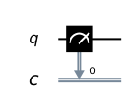

On the `Circuit
Composer <https://quantum-computing.ibm.com/composer>`__, the same
operation looks like this.

.. figure:: https://s3.us-south.cloud-object-storage.appdomain.cloud/strapi/e8401fb5e3ff4cd18590010209203bc4uni1.png
   :alt: A z measurement

This version has a small ‘z’ written in the box that represents the
operation. This hints at the fact that this kind of measurement is not
the only one. In fact, it is only one of an infinite number of possible
ways to extract a bit from a qubit. Specifically, it is known as a *z
measurement*.

Another commonly used measurement is the *x measurement*. It can be
performed using the following sequence of gates.

.. code:: ipython3

    measure_x = QuantumCircuit(1,1)
    measure_x.h(0)
    measure_x.measure(0,0)
    
    measure_x.draw(output='mpl')

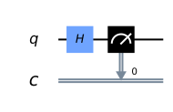

Later chapters will explain why this sequence of operations performs a
new kind of measurement. For now, you’ll need to trust us.

Like the position and momentum of a quantum particle, the z and x
measurements of a qubit are governed by the uncertainty principle. Below
we’ll look at results from a few different circuits to see this effect
in action.

Results for an empty circuit
^^^^^^^^^^^^^^^^^^^^^^^^^^^^

The easiest way to see an example is to take a freshly initialized
qubit.

.. code:: ipython3

    qc_0 = QuantumCircuit(1)
    
    qc_0.draw(output='mpl')

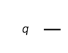

Qubits are always initialized such that they are certain to give the
result ``0`` for a z measurement. The resulting histogram will therefore
simply have a single column, showing the 100% probability of getting a
``0``.

.. code:: ipython3

    qc = qc_0 + measure_z
    
    print('Results for z measurement:')
    counts = execute(qc,Aer.get_backend('qasm_simulator')).result().get_counts()
    plot_histogram(counts)

.. parsed-literal::

    Results for z measurement:

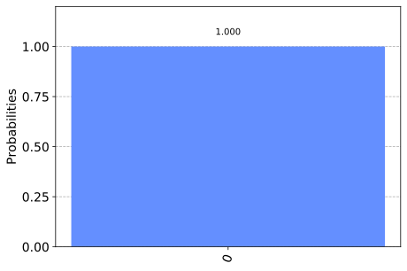

If we instead do an x measurement, the results will be completely
random.

.. code:: ipython3

    qc = qc_0 +  measure_x
    
    print('Results for x measurement:')
    counts = execute(qc,Aer.get_backend('qasm_simulator')).result().get_counts()
    plot_histogram(counts)

.. parsed-literal::

    Results for x measurement:

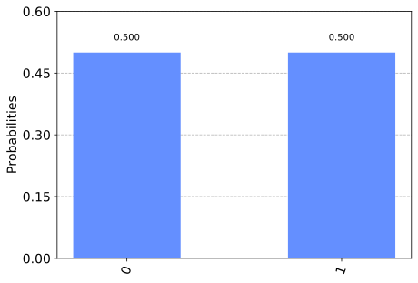

Note that the reason why the results are not split exactly 50/50 here is
because we take samples by repeating the circuit a finite number of
times, and so there will always be statistical noise. In this case, the
default of ``shots=1024`` was used.

Results for a single Hadamard
^^^^^^^^^^^^^^^^^^^^^^^^^^^^^

Now we’ll try a different circuit. This has a single gate called a
Hadamard, which we will learn more about in future sections.

.. code:: ipython3

    qc_plus = QuantumCircuit(1)
    qc_plus.h(0)
    
    qc_plus.draw(output='mpl')

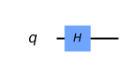

To see what effect it has, let’s first try the z measurement.

.. code:: ipython3

    qc = qc_plus + measure_z
    
    qc.draw()
    
    print('Results for z measurement:')
    counts = execute(qc,Aer.get_backend('qasm_simulator')).result().get_counts()
    plot_histogram(counts)

.. parsed-literal::

    Results for z measurement:

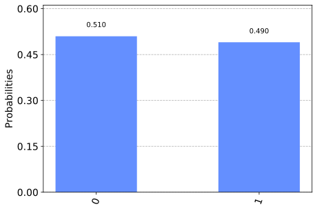

Here we see that it is the results of the z measurement that are random
for this circuit.

Now let’s see what happens for an x measurement.

.. code:: ipython3

    qc = qc_plus + measure_x
    
    print('Results for x measurement:')
    counts = execute(qc,Aer.get_backend('qasm_simulator')).result().get_counts()
    plot_histogram(counts)

.. parsed-literal::

    Results for x measurement:

For the x measurement, it is certain that the output for this circuit is
``0``. The results here are therefore very different to what we saw for
the empty circuit. The Hadamard has lead to an entirely opposite set of
outcomes.

Results for a y rotation
^^^^^^^^^^^^^^^^^^^^^^^^

Using other circuits we can manipulate the results in different ways.
Here is an example with an ``ry`` gate.

.. code:: ipython3

    qc_y = QuantumCircuit(1)
    qc_y.ry( -3.14159/4,0)
    
    qc_y.draw(output='mpl')

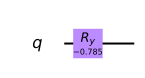

We will learn more about ``ry`` in future sections. For now, just notice
the effect it has for the z and x measurements.

.. code:: ipython3

    qc = qc_y + measure_z
    
    print('Results for z measurement:')
    counts = execute(qc,Aer.get_backend('qasm_simulator')).result().get_counts()
    plot_histogram(counts)

.. parsed-literal::

    Results for z measurement:

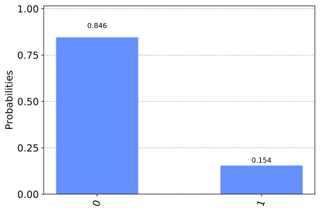

Here we have a case that we have not seen before. The z measurement is
most likely to output ``0``, but it is not completely certain. A similar
effect is seen below for the x measurement: it is most likely, but not
certain, to output ``1``.

.. code:: ipython3

    qc = qc_y + measure_x
    
    print('\nResults for x measurement:')
    counts = execute(qc,Aer.get_backend('qasm_simulator')).result().get_counts()
    plot_histogram(counts)

.. parsed-literal::

    
    Results for x measurement:

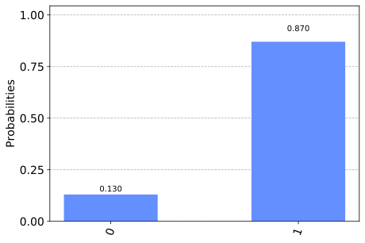

These results hint at an important principle: Qubits have a limited
amount of certainty that they can hold. This ensures that, despite the
different ways we can extract outputs from a qubit, it can only be used
to store a single bit of information. In the case of the blank circuit,
this certainty was dedicated entirely to the outcomes of z measurements.
For the circuit with a single Hadamard, it was dedicated entirely to x
measurements. In this case, it is shared between the two.

Einstein vs. Bell
~~~~~~~~~~~~~~~~~

We have now played with some of the features of qubits, but we haven’t
done anything that couldn’t be reproduced by a few bits and a random
number generator. You can therefore be forgiven for thinking that
quantum variables are just classical variables with some randomness
bundled in.

This is essentially the claim made by Einstein, Podolsky and Rosen back
in 1935. They objected to the uncertainty seen in quantum mechanics, and
thought it meant that the theory was incomplete. They thought that a
qubit should always know what output it would give for both kinds of
measurement, and that it only seems random because some information is
hidden from us. As Einstein said: God does not play dice with the
universe.

No one spoke of qubits back then, and people hardly spoke of computers.
But if we translate their arguments into modern language, they
essentially claimed that qubits can indeed be described by some form of
classical variable. They didn’t know how to do it, but they were sure it
could be done. Then quantum mechanics could be replaced by a much nicer
and more sensible theory.

It took until 1964 to show that they were wrong. J. S. Bell proved that
quantum variables behaved in a way that was fundamentally unique. Since
then, many new ways have been found to prove this, and extensive
experiments have been done to show that this is exactly the way the
universe works. We’ll now consider a simple demonstration, using a
variant of *Hardy’s paradox*.

For this we need two qubits, set up in such a way that their results are
correlated. Specifically, we want to set them up such that we see the
following properties.

1. If z measurements are made on both qubits, they never both output
   ``0``.
2. If an x measurement of one qubit outputs ``1``, a z measurement of
   the other will output ``0``.

If we have qubits that satisfy these properties, what can we infer about
the remaining case: an x measurement of both?

For example, let’s think about the case where both qubits output ``1``
for an x measurement. By applying property 2 we can deduce what the
result would have been if we had made z measurements instead: We would
have gotten an output of ``0`` for both. However, this result is
impossible according to property 1. We can therefore conclude that an
output of ``1`` for x measurements of both qubits must also be
impossible.

The paragraph you just read contains all the math in this section. Don’t
feel bad if you need to read it a couple more times!

Now let’s see what actually happens. Here is a circuit, composed of
gates you will learn about in later sections. It prepares a pair of
qubits that will satisfy the above properties.

.. code:: ipython3

    qc_hardy = QuantumCircuit(2)
    qc_hardy.ry(1.911,1)
    qc_hardy.cx(1,0)
    qc_hardy.ry(0.785,0)
    qc_hardy.cx(1,0)
    qc_hardy.ry(2.356,0)
    
    qc_hardy.draw(output='mpl')

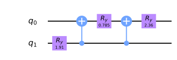

Let’s see it in action. First a z measurement of both qubits.

.. code:: ipython3

    measurements = QuantumCircuit(2,2)
    # z measurement on both qubits
    measurements.measure(0,0)
    measurements.measure(1,1)
    
    qc = qc_hardy + measurements
    
    print('\nResults for two z measurements:')
    counts = execute(qc,Aer.get_backend('qasm_simulator')).result().get_counts()
    plot_histogram(counts)

.. parsed-literal::

    
    Results for two z measurements:

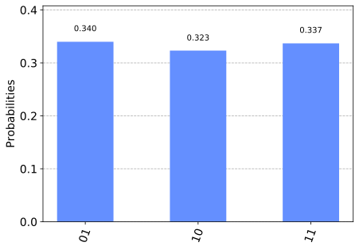

The probability of ``00`` is zero, and so these qubits do indeed satisfy
property 1.

Next, let’s see the results of an x measurement of one and a z
measurement of the other.

.. code:: ipython3

    measurements = QuantumCircuit(2,2)
    # x measurement on qubit 0
    measurements.h(0)
    measurements.measure(0,0)
    # z measurement on qubit 1
    measurements.measure(1,1)
    
    qc = qc_hardy + measurements
    
    print('\nResults for two x measurement on qubit 0 and z measurement on qubit 1:')
    counts = execute(qc,Aer.get_backend('qasm_simulator')).result().get_counts()
    plot_histogram(counts)

.. parsed-literal::

    
    Results for two x measurement on qubit 0 and z measurement on qubit 1:

.. image:: unique-properties-qubits_files/unique-properties-qubits_36_1.svg

The probability of ``11`` is zero. You’ll see the same if you swap
around the measurements. These qubits therefore also satisfy property 2.

Finally, let’s look at an x measurement of both.

.. code:: ipython3

    measurements = QuantumCircuit(2,2)
    measurements.h(0)
    measurements.measure(0,0)
    measurements.h(1)
    measurements.measure(1,1)
    
    qc = qc_hardy + measurements
    
    print('\nResults for two x measurement on both qubits:')
    counts = execute(qc,Aer.get_backend('qasm_simulator')).result().get_counts()
    plot_histogram(counts)

.. parsed-literal::

    
    Results for two x measurement on both qubits:

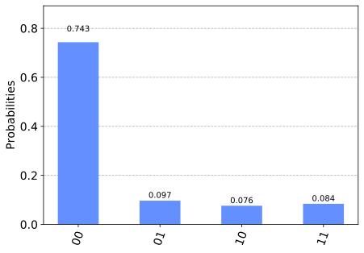

We reasoned that, given properties 1 and 2, it would be impossible to
get the output ``11``. From the results above, we see that our reasoning
was not correct: one in every dozen results will have this ‘impossible’
result.

So where did we go wrong? Our mistake was in the following piece of
reasoning.

   By applying property 2 we can deduce what the result would have been
   if we had made z measurements instead

We used our knowledge of the x outputs to work out what the z outputs
were. Once we’d done that, we assumed that we were certain about the
value of both. More certain than the uncertainty principle allows us to
be. And so we were wrong.

Our logic would be completely valid if we weren’t reasoning about
quantum objects. If it was some non-quantum variable, that we
initialized by some random process, the x and z outputs would indeed
both be well defined. They would just be based on some pre-determined
list of random numbers in our computer, or generated by some
deterministic process. Then there would be no reason why we shouldn’t
use one to deduce the value of the other, and our reasoning would be
perfectly valid. The restriction it predicts would apply, and it would
be impossible for both x measurements to output ``1``.

But our qubits behave differently. The uncertainty of quantum mechanics
allows qubits to dodge restrictions placed on classical variables. It
allows them to do things that would otherwise be impossible. Indeed,
this is the main thing to take away from this section:

   A physical system in a definite state can still behave randomly.

This is the first of the key principles of the quantum world. It needs
to become your new intuition, as it is what makes quantum systems
different to classical systems. It’s what makes quantum computers able
to outperform classical computers. It leads to effects that allow
programs made with quantum variables to solve problems in ways that
those with normal variables cannot. But just because qubits don’t follow
the same logic as normal computers, it doesn’t mean they defy logic
entirely. They obey the definite rules laid out by quantum mechanics.

If you’d like to learn these rules, we’ll use the remainder of this
chapter to guide you through them. We’ll also show you how to express
them using math. This will provide a foundation for later chapters, in
which we’ll explain various quantum algorithms and techniques.

.. code:: ipython3

    import qiskit
    qiskit.__qiskit_version__

.. parsed-literal::

    {'qiskit-terra': '0.11.1',
     'qiskit-aer': '0.3.4',
     'qiskit-ignis': '0.2.0',
     'qiskit-ibmq-provider': '0.4.5',
     'qiskit-aqua': '0.6.2',
     'qiskit': '0.14.1'}

