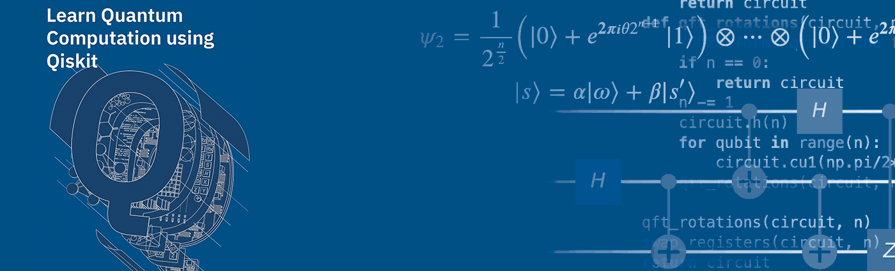
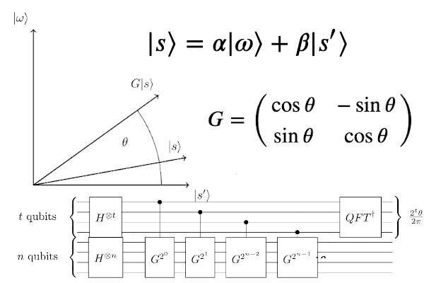
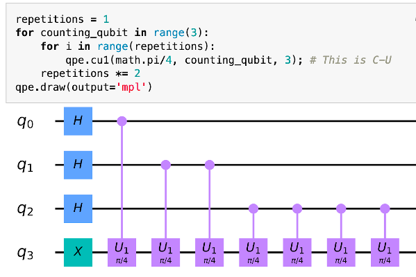
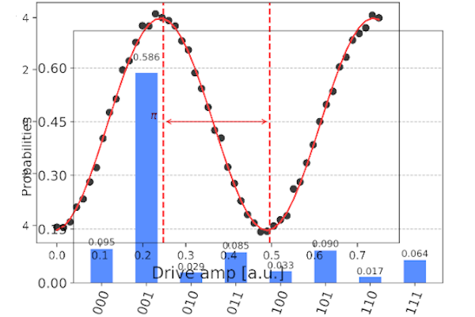

# Aprende Computación Cuántica usando Qiskit




<p>
¡Saludos del equipo de la Comunidad Qiskit! Este libro de texto es un complemento del curso universitario de algoritmos /computación cuántica basado en Qiskit para ayudar a aprender:
</p>

<table style="width:100%; margin: 2em; margin-left: 35px;">
  <tr style="font-size: large; border: None;">
    <th style="text-align: center; border: None;">Aprende la teoría de la computación cuántica</th>
    <th style="text-align: center; border: None;">Aprende a desarrollar programas cuánticos</th>
    <th style="text-align: center; border: None;">Experimentar con dispositivos reales</th>
  </tr>
  <tr style="background-color: White;">
    <td style="border: None;">
        
    </td>
    <td style="border: None;">
        
    </td>
    <td style="border: None;">
        
    </td>
  </tr>
</table>

<div align="center" style="font-size: 250%; margin: 1em;">
    <a href="using-the-textbook.html">
        ¡Empezar!
    </a>
</div>


```python

```
