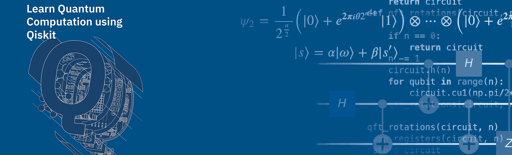
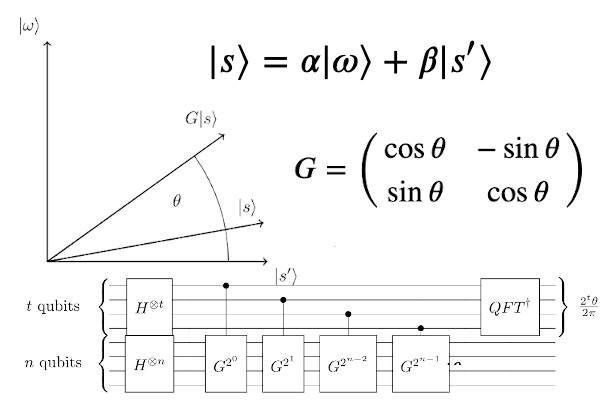
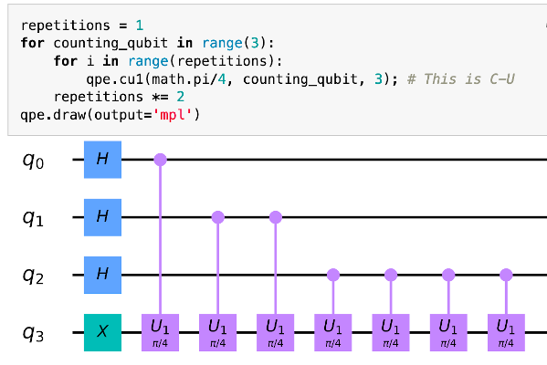
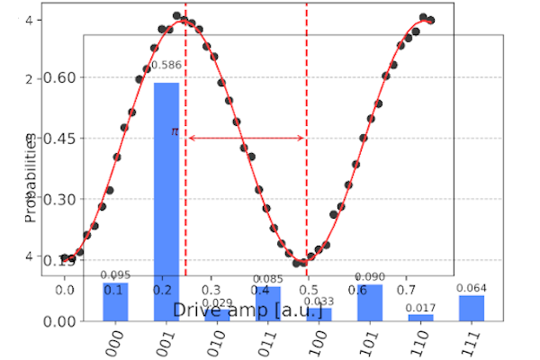

# Learn Quantum Computation using Qiskit




<p>
Greetings from the Qiskit Community team! We initiated this open-source textbook in collaboration with IBM Research as a university quantum algorithms/computation course supplement based on Qiskit. The Qiskit textbook helps you:
</p>

<table style="width:100%; margin: 2em; margin-left: 35px;">
  <tr style="font-size: large; border: None;">
    <th style="text-align: center; border: None;">Learn Quantum Computing Theory</th>
    <th style="text-align: center; border: None;">Learn to Code Quantum Programs</th>
    <th style="text-align: center; border: None;">Experiment with Real Devices</th>
  </tr>
  <tr style="background-color: White;">
    <td style="border: None;">
        
    </td>
    <td style="border: None;">
        
    </td>
    <td style="border: None;">
        
    </td>
  </tr>
</table>

<div align="center" style="font-size: 250%; margin: 1em;">
    <a href="using-the-textbook.html">
        Get Started!
    </a>
</div>


```python

```
