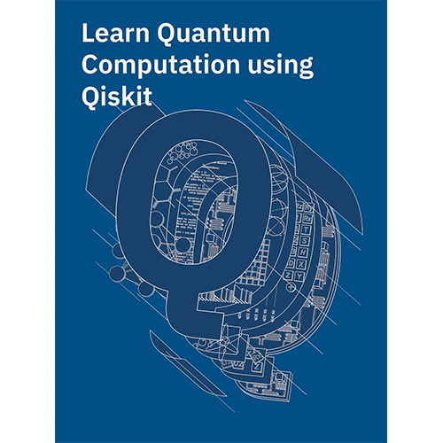
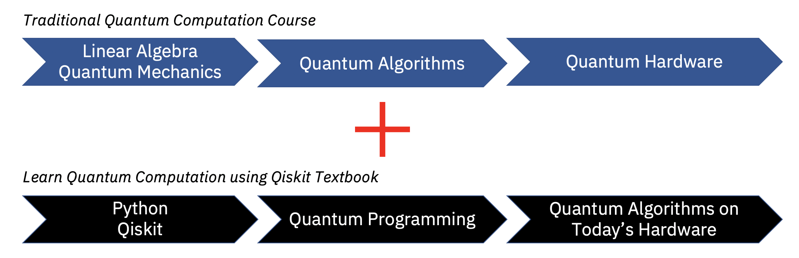

# Qiskit を使った量子計算の学習

Qiskit Communityチームからのご挨拶です！ Qiskitをベースとした大学の量子アルゴリズム/計算コースの補足教材となるよう、IBM Researchと共同でこのオープンソースの教科書を作り始めました。

この教科書の目標は、以下のエリアのスキルを開発することです。
1. 量子アルゴリズムの背後にある数学
2. 今日の非フォールトトレラントな量子デバイスの詳細
3. IBMのクラウド型量子システムに量子アルゴリズムを実装するためのQiskitでのコーディング

この教科書は、この分野の広範な調査を試みるものではありませんが、できる限り自己完結することを目指します。

この教科書に質問・提案がある方、また、あなたの学校のカリキュラムに取り入れたい方は、Abraham Asfaw ([abraham.asfaw@ibm.com](mailto:abraham.asfaw@ibm.com)) にコンタクトしてください。オープンソースの精神に基づき、あらゆる章への貢献を[このGitHubリポジトリー](https://github.com/Qiskit/qiskit-textbook)にてお待ちしています。

## 貢献者（アルファベット順）

**Qiskit を使った量子計算の学習** は複数の著者による合作です。ご自身の業務・研究などで使用する場合は、この[bibファイル](qiskit-textbook.bib)を使用するか、次のように直接引用してください：

> Abraham Asfaw, Luciano Bello, Yael Ben-Haim, Sergey Bravyi, Lauren Capelluto, Almudena Carrera Vazquez, Jack Ceroni, Jay Gambetta, Shelly Garion, Leron Gil, Salvador De La Puente Gonzalez, David McKay, Zlatko Minev, Paul Nation, Anna Phan, Arthur Rattew, Javad Shabani, John Smolin, Kristan Temme, Madeleine Tod, James Wootton.
